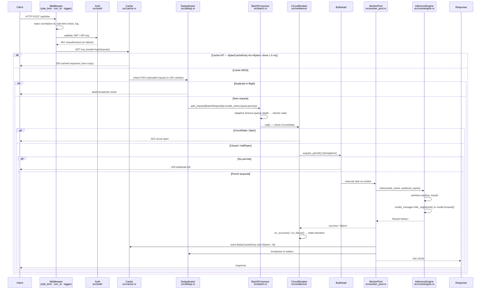
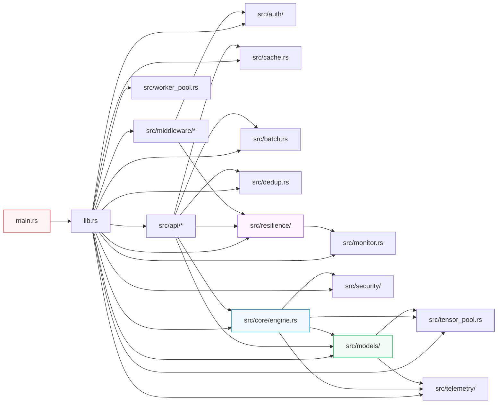
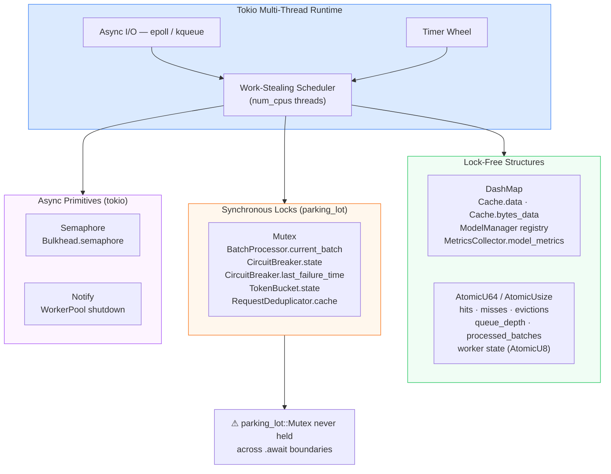
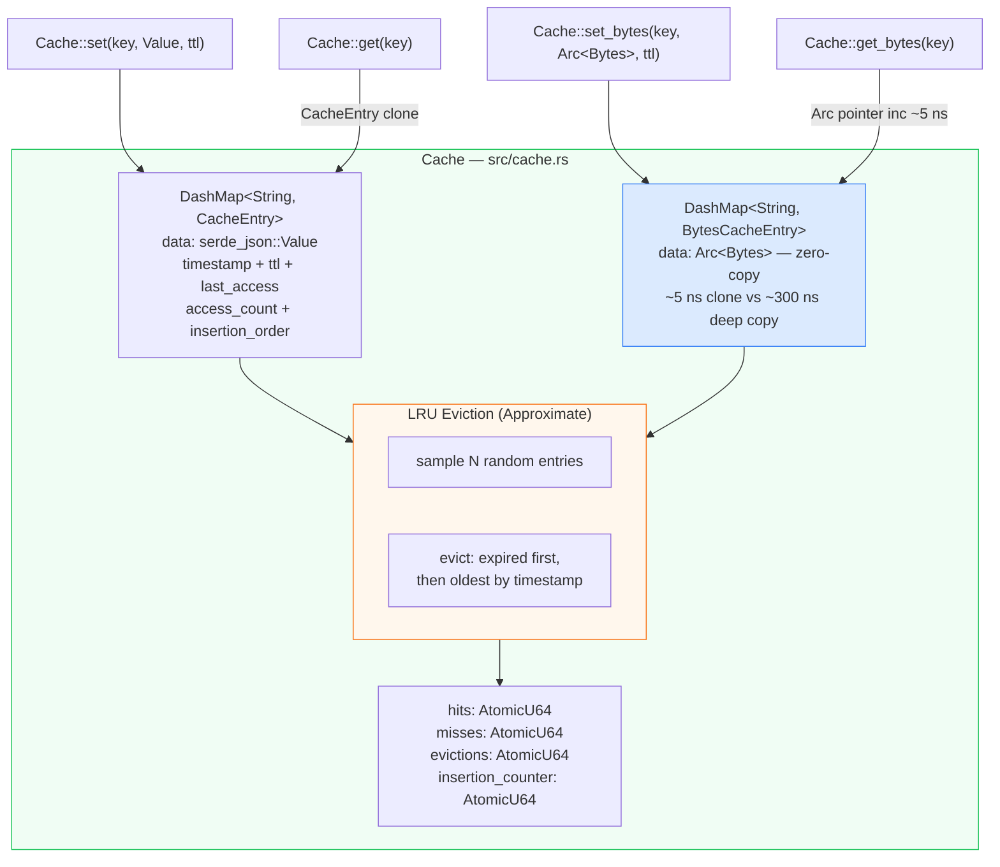
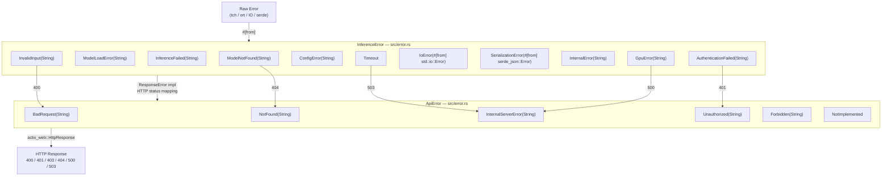
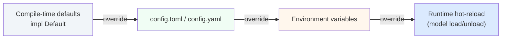

# Architecture

Developer reference for `torch-inference` — a Rust ML inference server built on Actix-Web 4, Tokio 1.40, tch-rs 0.16 (PyTorch), and ort 2.0 (ONNX Runtime).

---

## System Layers

```mermaid
graph TB
    Client["🌐 Client Layer<br/>HTTP • REST • Multipart"]

    subgraph API["API Layer — src/api/"]
        Handlers["handlers.rs · inference.rs · tts.rs · yolo.rs<br/>image.rs · classification.rs · llm.rs · models.rs<br/>health.rs · system.rs · metrics_endpoint.rs · dashboard.rs"]
    end

    subgraph MW["Middleware — src/middleware/"]
        RateLimit["rate_limit.rs<br/>TokenBucket"]
        CorrID["correlation_id.rs"]
        ReqLog["request_logger.rs"]
    end

    subgraph BL["Business Logic"]
        Cache["cache.rs<br/>Cache + BytesCacheEntry"]
        Dedup["dedup.rs<br/>RequestDeduplicator (LRU + FNV-1a)"]
        Batch["batch.rs<br/>BatchProcessor"]
    end

    subgraph Res["Resilience — src/resilience/"]
        CB["circuit_breaker.rs<br/>CircuitBreaker"]
        BH["bulkhead.rs<br/>Bulkhead (Semaphore)"]
        Retry["retry.rs<br/>RetryPolicy (exp backoff + jitter)"]
        TB["token_bucket.rs<br/>TokenBucket / KeyedRateLimiter"]
        PMB["per_model_breaker.rs<br/>CircuitBreakerRegistry"]
    end

    subgraph IE["Inference Engine — src/core/"]
        Engine["engine.rs<br/>InferenceEngine"]
        MM["models/manager.rs<br/>ModelManager"]
        WP["worker_pool.rs<br/>WorkerPool"]
        TP["tensor_pool.rs<br/>TensorPool"]
    end

    subgraph HW["Hardware"]
        CPU["CPU"]
        CUDA["GPU — CUDA / Metal"]
        Mem["System Memory"]
    end

    Client --> API
    API --> MW
    MW --> BL
    BL --> Res
    Res --> IE
    IE --> HW

    style Client fill:#dbeafe,stroke:#3b82f6
    style API fill:#f0fdf4,stroke:#22c55e
    style MW fill:#fef9c3,stroke:#eab308
    style BL fill:#fff7ed,stroke:#f97316
    style Res fill:#fdf4ff,stroke:#a855f7
    style IE fill:#f0f9ff,stroke:#0ea5e9
    style HW fill:#f1f5f9,stroke:#64748b
```

---

## Request Lifecycle

```mermaid
sequenceDiagram
    participant C as Client
    participant MW as Middleware<br/>(rate_limit · corr_id · logger)
    participant Auth as Auth<br/>src/auth/
    participant Cache as Cache<br/>src/cache.rs
    participant Dedup as Deduplicator<br/>src/dedup.rs
    participant Batch as BatchProcessor<br/>src/batch.rs
    participant CB as CircuitBreaker<br/>src/resilience/
    participant BH as Bulkhead
    participant WP as WorkerPool<br/>src/worker_pool.rs
    participant Eng as InferenceEngine<br/>src/core/engine.rs
    participant Resp as Response

    C->>MW: HTTP POST /api/infer
    MW->>MW: inject correlation-id, rate-limit check, log
    MW->>Auth: validate JWT / API key
    Auth-->>MW: 401 Unauthorized (on failure)
    MW->>Cache: GET key (model+hash(inputs))
    alt Cache HIT — BytesCacheEntry Arc<Bytes> clone (~5 ns)
        Cache-->>C: 200 cached response (zero-copy)
    else Cache MISS
        Cache->>Dedup: check FNV-1a(model+inputs) in LRU window
        alt Duplicate in-flight
            Dedup-->>C: await broadcast result
        else New request
            Dedup->>Batch: add_request(BatchRequest{id,model_name,inputs,priority})
            Batch->>Batch: adaptive timeout (queue depth → shorter wait)
            Batch->>CB: call() — check CircuitState
            alt CircuitState::Open
                CB-->>C: 503 circuit open
            else Closed / HalfOpen
                CB->>BH: acquire_permit() (Semaphore)
                alt No permits
                    BH-->>C: 429 bulkhead full
                else Permit acquired
                    BH->>WP: execute task on worker
                    WP->>Eng: infer(model_name, sanitized_inputs)
                    Eng->>Eng: sanitizer.sanitize_input()
                    Eng->>Eng: model_manager.infer_registered() or model.forward()
                    Eng-->>WP: Result<Value>
                    WP-->>CB: success / failure
                    CB->>CB: on_success() / on_failure() → state transition
                    WP->>Cache: store BytesCacheEntry (Arc<Bytes>, ttl)
                    WP->>Dedup: broadcast to waiters
                    WP-->>Resp: 200 JSON
                    Resp-->>C: response
                end
            end
        end
    end
```

---

## Module Dependency Graph

```mermaid
graph LR
    main["main.rs"] --> lib["lib.rs"]
    lib --> api["src/api/*"]
    lib --> mw["src/middleware/*"]
    lib --> auth["src/auth/"]
    lib --> cache["src/cache.rs"]
    lib --> batch["src/batch.rs"]
    lib --> dedup["src/dedup.rs"]
    lib --> resilience["src/resilience/"]
    lib --> worker["src/worker_pool.rs"]
    lib --> tensor["src/tensor_pool.rs"]
    lib --> monitor["src/monitor.rs"]
    lib --> security["src/security/"]
    lib --> telemetry["src/telemetry/"]
    lib --> models["src/models/"]
    lib --> core["src/core/engine.rs"]

    api --> cache
    api --> batch
    api --> dedup
    api --> resilience
    api --> core
    api --> models

    core --> models
    core --> tensor
    core --> security
    core --> telemetry

    models --> tensor
    models --> telemetry

    resilience --> monitor

    mw --> auth
    mw --> resilience

    style main fill:#fef2f2,stroke:#ef4444
    style core fill:#f0f9ff,stroke:#0ea5e9
    style resilience fill:#fdf4ff,stroke:#a855f7
    style models fill:#f0fdf4,stroke:#22c55e
```

---

## Concurrency Model

```mermaid
graph TD
    subgraph Tokio["Tokio Multi-Thread Runtime"]
        direction TB
        Sched["Work-Stealing Scheduler<br/>(num_cpus threads)"]
        IO["Async I/O — epoll / kqueue"]
        Timers["Timer Wheel"]
    end

    subgraph LockFree["Lock-Free Structures"]
        DM["DashMap<br/>Cache.data · Cache.bytes_data<br/>ModelManager registry<br/>MetricsCollector.model_metrics"]
        Atomic["AtomicU64 / AtomicUsize<br/>hits · misses · evictions<br/>queue_depth · processed_batches<br/>worker state (AtomicU8)"]
    end

    subgraph Locks["Synchronous Locks (parking_lot)"]
        Mutex["Mutex<br/>BatchProcessor.current_batch<br/>CircuitBreaker.state<br/>CircuitBreaker.last_failure_time<br/>TokenBucket.state<br/>RequestDeduplicator.cache"]
    end

    subgraph AsyncLocks["Async Primitives (tokio)"]
        Sema["Semaphore<br/>Bulkhead.semaphore"]
        Notify["Notify<br/>WorkerPool shutdown"]
    end

    Sched --> LockFree
    Sched --> Locks
    Sched --> AsyncLocks
    IO --> Sched
    Timers --> Sched

    note1["⚠ parking_lot::Mutex never held<br/>across .await boundaries"]
    Locks --> note1

    style Tokio fill:#dbeafe,stroke:#3b82f6
    style LockFree fill:#f0fdf4,stroke:#22c55e
    style Locks fill:#fff7ed,stroke:#f97316
    style AsyncLocks fill:#fdf4ff,stroke:#a855f7
```

---

## Batch Processing State Machine

```mermaid
stateDiagram-v2
    [*] --> Collecting : BatchProcessor::new()

    Collecting --> Collecting : add_request() — queue < max_batch_size
    Collecting --> Full : add_request() — queue == max_batch_size
    Collecting --> TimedOut : oldest entry age ≥ adaptive_timeout_ms

    Full --> Processing : should_process_batch() → true
    TimedOut --> Processing : should_process_batch() → true

    Processing --> Dispatching : drain current_batch (parking_lot::Mutex)
    Dispatching --> Collecting : results broadcast, stats updated

    note right of Collecting
        adaptive_timeout_enabled:
        queue depth ↑ → timeout ↓
        BatchRequest { id, model_name,
          inputs: Vec<Value>,
          priority: i32,
          timestamp: Instant }
    end note

    note right of Processing
        processed_batches += 1
        total_latency_ms += elapsed
        queue_depth.store(0)
    end note
```

---

## Circuit Breaker State Machine

```mermaid
stateDiagram-v2
    [*] --> Closed : CircuitBreaker::new()

    Closed --> Closed : on_success() — failure_count.store(0)
    Closed --> Open : on_failure() — failure_count ≥ failure_threshold

    Open --> Open : call() → Err("circuit breaker is open")
    Open --> HalfOpen : timeout elapsed since last_failure_time

    HalfOpen --> Closed : on_success() — success_count ≥ success_threshold
    HalfOpen --> Open : on_failure() — reset success_count

    note right of Closed
        CircuitBreakerConfig defaults:
          failure_threshold: 5
          success_threshold: 2
          timeout: 60s
        State stored in parking_lot::Mutex
        Counters: AtomicU32 (Relaxed)
    end note

    note right of Open
        Per-model isolation via
        CircuitBreakerRegistry (DashMap)
        in per_model_breaker.rs
    end note
```

---

## Cache Architecture

```mermaid
graph TB
    subgraph Cache["Cache — src/cache.rs"]
        direction TB
        JSON["DashMap&lt;String, CacheEntry&gt;<br/>data: serde_json::Value<br/>timestamp + ttl + last_access<br/>access_count + insertion_order"]
        Bytes["DashMap&lt;String, BytesCacheEntry&gt;<br/>data: Arc&lt;Bytes&gt; — zero-copy<br/>~5 ns clone vs ~300 ns deep copy"]

        subgraph Eviction["LRU Eviction (Approximate)"]
            Sample["sample N random entries"]
            OldestTTL["evict: expired first,<br/>then oldest by timestamp"]
        end

        Stats["hits: AtomicU64<br/>misses: AtomicU64<br/>evictions: AtomicU64<br/>insertion_counter: AtomicU64"]
    end

    Write["Cache::set(key, Value, ttl)"] --> JSON
    WriteB["Cache::set_bytes(key, Arc&lt;Bytes&gt;, ttl)"] --> Bytes
    ReadJ["Cache::get(key)"] -->|"CacheEntry clone"| JSON
    ReadB["Cache::get_bytes(key)"] -->|"Arc pointer inc ~5 ns"| Bytes

    JSON --> Eviction
    Bytes --> Eviction
    Eviction --> Stats

    style Cache fill:#f0fdf4,stroke:#22c55e
    style Eviction fill:#fff7ed,stroke:#f97316
    style Bytes fill:#dbeafe,stroke:#3b82f6
```

---

## Error Propagation

```mermaid
flowchart TD
    Raw["Raw Error<br/>(tch / ort / IO / serde)"]

    Raw -->|"#[from]"| InfErr

    subgraph InfErr["InferenceError — src/error.rs"]
        MNF["ModelNotFound(String)"]
        MLE["ModelLoadError(String)"]
        IF["InferenceFailed(String)"]
        II["InvalidInput(String)"]
        CE["ConfigError(String)"]
        AF["AuthenticationFailed(String)"]
        IO["IoError(#[from] std::io::Error)"]
        SE["SerializationError(#[from] serde_json::Error)"]
        IE2["InternalError(String)"]
        GPU["GpuError(String)"]
        TO["Timeout"]
    end

    subgraph ApiErr["ApiError — src/error.rs"]
        BR["BadRequest(String)"]
        NF["NotFound(String)"]
        ISE["InternalServerError(String)"]
        UA["Unauthorized(String)"]
        FB["Forbidden(String)"]
        NI["NotImplemented"]
    end

    InfErr -->|"ResponseError impl<br/>HTTP status mapping"| ApiErr
    ApiErr -->|"actix_web::HttpResponse"| HTTP

    HTTP["HTTP Response<br/>400 / 401 / 403 / 404 / 500 / 503"]

    MNF -->|"404"| NF
    II -->|"400"| BR
    AF -->|"401"| UA
    TO -->|"503"| ISE
    GPU -->|"500"| ISE
```

---

## Performance Characteristics

| Concern | Implementation | Measured / Expected |
|---|---|---|
| Cache read (BytesCacheEntry) | `Arc<Bytes>` pointer increment | ~5 ns |
| Cache read (CacheEntry) | DashMap shard lock + Value clone | ~300 ns |
| Dedup key generation | FNV-1a 64-bit (vs SHA-256) | ~20× faster for short strings |
| Batch throughput gain | Dynamic batching + adaptive timeout | 2–4× GPU throughput |
| Tensor allocation (pool hit) | `Vec<f32>` pop from DashMap pool | 50–70% faster vs malloc |
| Tensor pool reuse rate | Zero-fill-on-release strategy | 95%+ typical |
| Circuit breaker state check | `parking_lot::Mutex` (sync, no await) | sub-microsecond |
| Bulkhead permit | `tokio::sync::Semaphore::try_acquire_owned` | non-blocking fast path |
| Cache hit rate | LRU eviction + TTL | 80–85% typical |
| Worker state transitions | `AtomicU8` (Relaxed ordering) | lock-free |

---

## Configuration Hierarchy

```mermaid
graph LR
    D["Compile-time defaults<br/>impl Default"] -->|override| F
    F["config.toml / config.yaml"] -->|override| E
    E["Environment variables"] -->|override| C
    C["Runtime hot-reload<br/>(model load/unload)"]

    style D fill:#f1f5f9
    style F fill:#f0fdf4
    style E fill:#fff7ed
    style C fill:#dbeafe
```

Key config sections: `[server]`, `[performance]` (cache, batching, warmup), `[models]` (auto_load, paths), `[guard]` (circuit breaker, bulkhead), `[sanitizer]`, `[auth]`.

---

**See also**: [Components](COMPONENTS.md) · [Modules](modules/README.md)
