# 🏗️ PyTorch Inference Framework Architecture

This document provides a comprehensive overview of the PyTorch Inference Framework architecture, component interactions, and system design principles.

## 📋 Table of Contents

- [System Overview](#-system-overview)
- [Core Components](#-core-components)
- [Architecture Layers](#-architecture-layers)
- [Component Interactions](#-component-interactions)
- [Data Flow](#-data-flow)
- [Optimization Pipeline](#-optimization-pipeline)
- [Autoscaling System](#-autoscaling-system)
- [Deployment Architecture](#-deployment-architecture)
- [Performance Considerations](#-performance-considerations)

## 🌟 System Overview

The PyTorch Inference Framework follows a modular, layered architecture designed for scalability, performance, and maintainability.

```mermaid
graph TB
    subgraph "🌐 Interface Layer"
        REST[REST API]
        SDK[Python SDK]
        CLI[CLI Interface]
        WebUI[Web Interface]
    end

    subgraph "🔐 Security & Auth Layer"
        JWT[JWT Authentication]
        RBAC[Role-Based Access]
        RateLimit[Rate Limiting]
        Encryption[Data Encryption]
    end

    subgraph "🎛️ Application Layer"
        FastAPI[FastAPI Server]
        Router[API Router]
        Middleware[Custom Middleware]
        Validation[Input Validation]
    end

    subgraph "🧠 Core Framework Layer"
        Framework[Torch Framework]
        Engine[Inference Engine]
        ModelMgr[Model Manager]
        ConfigMgr[Config Manager]
    end

    subgraph "⚡ Optimization Layer"
        TensorRT[TensorRT Optimizer]
        ONNX[ONNX Runtime]
        JIT[JIT Compiler]
        Quantization[Model Quantization]
        NumbaJIT[Numba JIT]
        HLRTF[HLRTF Compression]
    end

    subgraph "📊 Processing Layer"
        BatchProc[Batch Processor]
        AsyncProc[Async Processor]
        AudioProc[Audio Processor]
        ImageProc[Image Processor]
    end

    subgraph "🔄 Autoscaling Layer"
        ZeroScaler[Zero Scaler]
        ModelLoader[Dynamic Model Loader]
        LoadBalancer[Load Balancer]
        HealthMonitor[Health Monitor]
    end

    subgraph "💾 Storage Layer"
        LocalCache[Local Cache]
        ModelStore[Model Storage]
        ConfigStore[Configuration Store]
        MetricsDB[Metrics Database]
    end

    subgraph "📈 Monitoring Layer"
        Metrics[Performance Metrics]
        Logging[Centralized Logging]
        Alerts[Alert System]
        Profiler[Performance Profiler]
    end

    subgraph "🐳 Infrastructure Layer"
        Docker[Docker Containers]
        K8s[Kubernetes]
        GPU[GPU Management]
        Networking[Network Layer]
    end

    %% Interface connections
    REST --> FastAPI
    SDK --> Framework
    CLI --> Framework
    WebUI --> REST

    %% Security flow
    FastAPI --> JWT
    JWT --> RBAC
    RBAC --> RateLimit
    RateLimit --> Encryption

    %% Application flow
    FastAPI --> Router
    Router --> Middleware
    Middleware --> Validation
    Validation --> Framework

    %% Core framework flow
    Framework --> Engine
    Framework --> ModelMgr
    Framework --> ConfigMgr
    Engine --> BatchProc
    Engine --> AsyncProc

    %% Optimization connections
    Engine --> TensorRT
    Engine --> ONNX
    Engine --> JIT
    Engine --> Quantization
    Engine --> NumbaJIT
    Engine --> HLRTF

    %% Processing connections
    BatchProc --> AudioProc
    BatchProc --> ImageProc
    AsyncProc --> AudioProc
    AsyncProc --> ImageProc

    %% Autoscaling connections
    Framework --> ZeroScaler
    ZeroScaler --> ModelLoader
    ModelLoader --> LoadBalancer
    LoadBalancer --> HealthMonitor

    %% Storage connections
    ModelMgr --> LocalCache
    ModelMgr --> ModelStore
    ConfigMgr --> ConfigStore
    Metrics --> MetricsDB

    %% Monitoring connections
    Engine --> Metrics
    Framework --> Logging
    HealthMonitor --> Alerts
    Engine --> Profiler

    %% Infrastructure connections
    FastAPI --> Docker
    Docker --> K8s
    Engine --> GPU
    K8s --> Networking

    classDef interface fill:#e3f2fd
    classDef security fill:#fce4ec
    classDef application fill:#f3e5f5
    classDef core fill:#e8f5e8
    classDef optimization fill:#fff3e0
    classDef processing fill:#e0f2f1
    classDef autoscaling fill:#f1f8e9
    classDef storage fill:#fafafa
    classDef monitoring fill:#fff8e1
    classDef infrastructure fill:#e8eaf6

    class REST,SDK,CLI,WebUI interface
    class JWT,RBAC,RateLimit,Encryption security
    class FastAPI,Router,Middleware,Validation application
    class Framework,Engine,ModelMgr,ConfigMgr core
    class TensorRT,ONNX,JIT,Quantization,NumbaJIT,HLRTF optimization
    class BatchProc,AsyncProc,AudioProc,ImageProc processing
    class ZeroScaler,ModelLoader,LoadBalancer,HealthMonitor autoscaling
    class LocalCache,ModelStore,ConfigStore,MetricsDB storage
    class Metrics,Logging,Alerts,Profiler monitoring
    class Docker,K8s,GPU,Networking infrastructure
```



## 🧩 Core Components

### 1. Torch Framework Core

The main framework orchestrator that manages the entire inference lifecycle.


### 2. Inference Engine

High-performance inference processing with async capabilities.


### 3. Optimization System

Multi-layer optimization with automatic selection and fallbacks.


## 🔄 Data Flow Architecture

### Complete Inference Flow

```mermaid
sequenceDiagram
    participant Client
    participant Gateway as API Gateway
    participant Auth as Authentication
    participant Framework as Torch Framework
    participant Engine as Inference Engine
    participant Optimizer as Optimizer
    participant Model as Model Storage
    participant Monitor as Monitoring

    Note over Client,Monitor: 🚀 Complete Inference Request Flow

    Client->>Gateway: HTTP Request
    Gateway->>Auth: Validate Credentials
    Auth-->>Gateway: ✅ Authentication Result
    
    alt Authentication Success
        Gateway->>Framework: Forward Request
        Framework->>Engine: Create Inference Task
        
        par Model Loading
            Engine->>Model: Load/Cache Model
            Model-->>Engine: Model Ready
        and Optimization
            Engine->>Optimizer: Optimize Model
            Optimizer-->>Engine: Optimized Model
        end
        
        Engine->>Engine: Run Inference
        Engine->>Monitor: Log Performance
        Engine-->>Framework: Inference Result
        Framework-->>Gateway: Formatted Response
        Gateway-->>Client: HTTP Response
        
    else Authentication Failure
        Gateway-->>Client: 401 Unauthorized
    end

    Note over Client,Monitor: 📊 Performance: 2-10x faster with optimizations
```



### Autoscaling Flow


## 🏛️ Architecture Layers

### Layer Responsibilities


## 🔧 Component Interactions

### Model Loading and Optimization Pipeline

```mermaid
graph LR
    subgraph "Model Sources"
        Local[Local Files]
        HF[🤗 HuggingFace]
        Hub[PyTorch Hub]
        URL[Remote URLs]
    end

    subgraph "Loading Pipeline"
        Downloader[Model Downloader]
        Validator[Model Validator]
        Cache[Model Cache]
        Loader[Model Loader]
    end

    subgraph "Optimization Pipeline"
        Detector[Hardware Detector]
        Selector[Optimizer Selector]
        Converter[Model Converter]
        Tester[Performance Tester]
    end

    subgraph "Runtime Components"
        Engine[Inference Engine]
        Monitor[Performance Monitor]
        Scaler[Autoscaler]
        Health[Health Monitor]
    end

    Local --> Downloader
    HF --> Downloader
    Hub --> Downloader
    URL --> Downloader

    Downloader --> Validator
    Validator --> Cache
    Cache --> Loader

    Loader --> Detector
    Detector --> Selector
    Selector --> Converter
    Converter --> Tester

    Tester --> Engine
    Engine --> Monitor
    Monitor --> Scaler
    Scaler --> Health

    classDef sources fill:#e8f5e8
    classDef loading fill:#f3e5f5
    classDef optimization fill:#fff3e0
    classDef runtime fill:#e3f2fd

    class Local,HF,Hub,URL sources
    class Downloader,Validator,Cache,Loader loading
    class Detector,Selector,Converter,Tester optimization
    class Engine,Monitor,Scaler,Health runtime
```



### Audio Processing Pipeline


## 🚀 Performance Optimizations

### Optimization Strategy Matrix


## 📊 Deployment Architectures

### Single Instance Deployment


### Multi-Instance Deployment


### Cloud-Native Architecture

```mermaid
graph TB
    subgraph "CDN Layer"
        CDN[Global CDN]
        EdgeCache[Edge Caching]
    end

    subgraph "API Gateway"
        Gateway[API Gateway]
        RateLimit[Rate Limiting]
        Auth[Authentication]
    end

    subgraph "Microservices"
        InferenceAPI[Inference API]
        ModelAPI[Model Management API]
        AudioAPI[Audio Processing API]
        MetricsAPI[Metrics API]
    end

    subgraph "Container Orchestration"
        K8s[Kubernetes Cluster]
        HPA[Horizontal Pod Autoscaler]
        VPA[Vertical Pod Autoscaler]
    end

    subgraph "Storage Services"
        ObjectStore[Object Storage<br/>(S3/GCS)]
        Database[Managed Database]
        CacheCluster[Redis Cluster]
    end

    subgraph "Monitoring Stack"
        Prometheus[Prometheus]
        Grafana[Grafana]
        Jaeger[Distributed Tracing]
        ELK[ELK Stack]
    end

    subgraph "GPU Infrastructure"
        GPUNodes[GPU Node Pool]
        GPUScheduler[GPU Scheduler]
        GPUMonitor[GPU Monitoring]
    end

    CDN --> Gateway
    EdgeCache --> Gateway
    Gateway --> RateLimit
    RateLimit --> Auth
    Auth --> InferenceAPI
    Auth --> ModelAPI
    Auth --> AudioAPI
    Auth --> MetricsAPI

    InferenceAPI --> K8s
    ModelAPI --> K8s
    AudioAPI --> K8s
    MetricsAPI --> K8s

    K8s --> HPA
    K8s --> VPA
    K8s --> ObjectStore
    K8s --> Database
    K8s --> CacheCluster

    K8s --> Prometheus
    Prometheus --> Grafana
    K8s --> Jaeger
    K8s --> ELK

    K8s --> GPUNodes
    GPUNodes --> GPUScheduler
    GPUScheduler --> GPUMonitor

    classDef cdn fill:#e3f2fd
    classDef gateway fill:#fce4ec
    classDef services fill:#e8f5e8
    classDef orchestration fill:#f3e5f5
    classDef storage fill:#fff3e0
    classDef monitoring fill:#f1f8e9
    classDef gpu fill:#fff8e1

    class CDN,EdgeCache cdn
    class Gateway,RateLimit,Auth gateway
    class InferenceAPI,ModelAPI,AudioAPI,MetricsAPI services
    class K8s,HPA,VPA orchestration
    class ObjectStore,Database,CacheCluster storage
    class Prometheus,Grafana,Jaeger,ELK monitoring
    class GPUNodes,GPUScheduler,GPUMonitor gpu
```

## 🔍 Performance Considerations

### Optimization Decision Tree


## 📈 Monitoring and Observability

### Comprehensive Monitoring Architecture


## 🚀 Getting Started

To understand how these architectural components work together, start with:

1. **[Quick Start Guide](guides/quickstart.md)** - Basic setup and usage
2. **[Configuration Guide](guides/configuration.md)** - System configuration
3. **[API Documentation](api/rest-api.md)** - Complete API reference
4. **[Deployment Guide](deployment/README.md)** - Production deployment

## 📚 Related Documentation

- **[Performance Optimization](optimization/README.md)** - Detailed optimization strategies
- **[Autoscaling Guide](autoscaling/README.md)** - Dynamic scaling configuration
- **[Monitoring Guide](monitoring/README.md)** - Comprehensive monitoring setup
- **[Security Guide](security/README.md)** - Security best practices

---

*This architecture documentation provides a comprehensive overview of the PyTorch Inference Framework design. For specific implementation details, refer to the individual component documentation.*
