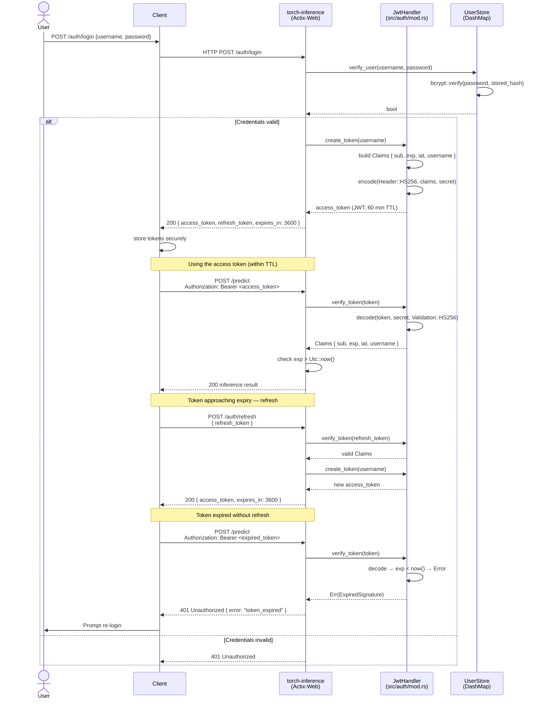
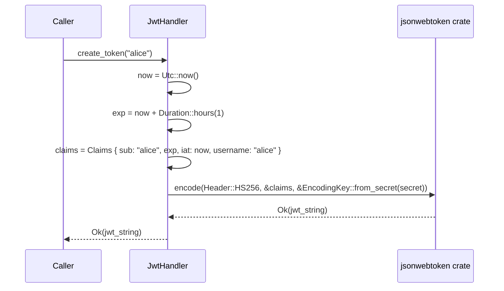
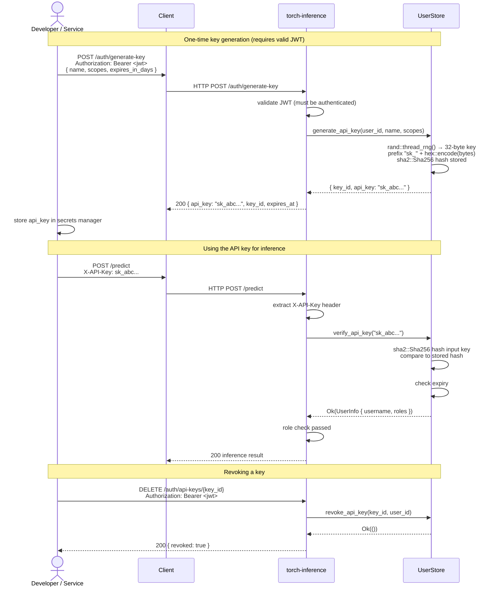

# Authentication — Developer Reference

Developer reference for the JWT + API key authentication system in `torch-inference`.  
Source: `src/auth/mod.rs` · Dependencies: `jsonwebtoken 9.3`, `bcrypt 0.15`

---

## Table of Contents

1. [Architecture Overview](#architecture-overview)
2. [JWT Authentication Flow](#jwt-authentication-flow)
3. [API Key Authentication Flow](#api-key-authentication-flow)
4. [Token Lifecycle](#token-lifecycle)
5. [RBAC Model](#rbac-model)
6. [JWT Claims Structure](#jwt-claims-structure)
7. [Code Examples](#code-examples)
8. [Endpoints Reference](#endpoints-reference)
9. [Configuration](#configuration)
10. [Security Considerations](#security-considerations)

---

## Architecture Overview

The auth system is implemented in `src/auth/mod.rs` and provides two parallel credential paths — JWT for human users and API keys for service-to-service calls. Both converge into the same middleware guard.

```
Client ──► HTTP Request
              │
              ├─ Authorization: Bearer eyJ...  ──► JwtHandler::verify_token()
              │
              └─ X-API-Key: sk_...             ──► UserStore::verify_api_key()
                                                            │
                                             ┌──────────────▼──────────────┐
                                             │  Actix-Web Guard Middleware  │
                                             │  role check → allow/deny     │
                                             └─────────────────────────────┘
```

---

## JWT Authentication Flow

### Login → Access Token → Refresh → Expiry



### Token Generation (Rust internals)



---

## API Key Authentication Flow



---

## Token Lifecycle

```mermaid
stateDiagram-v2
    [*] --> Issued : create_token() called<br/>HS256 signed

    Issued --> Valid : decode succeeds<br/>exp > now()

    Valid --> Valid : each API call<br/>verify_token() passes

    Valid --> Expiring : exp - now() < 5 min<br/>(client-side warning)

    Expiring --> Refreshed : POST /auth/refresh<br/>with valid refresh_token

    Refreshed --> Valid : new access_token issued

    Valid --> Expired : exp <= now()<br/>jsonwebtoken::ExpiredSignature

    Expiring --> Expired : client did not refresh

    Expired --> [*] : 401 returned<br/>must re-login

    Valid --> Revoked : POST /auth/logout<br/>or admin DELETE /auth/users/{id}

    Revoked --> [*] : 401 on next use

    note right of Valid
        TTL: 60 minutes (access)
        TTL: 7 days (refresh)
    end note

    note right of Refreshed
        Old access token is discarded.
        Refresh token reused until
        its own 7-day TTL expires.
    end note
```

---

## RBAC Model

```mermaid
graph TD
    subgraph Roles
        ADMIN[admin]
        USER[user]
        SERVICE[service<br/>API key]
    end

    subgraph Permissions
        P_INFER[inference:run]
        P_BATCH[inference:batch]
        P_MODELS[models:list]
        P_MODELS_LOAD[models:load]
        P_MODELS_DELETE[models:delete]
        P_STATS[stats:read]
        P_USERS[users:manage]
        P_KEYS[api-keys:manage]
        P_CLEANUP[system:cleanup]
    end

    subgraph Endpoints
        E_PREDICT[POST /predict<br/>POST /predict/batch]
        E_MODELS[GET /models]
        E_MODELS_MGT[POST /models/load<br/>DELETE /models/{name}]
        E_STATS[GET /stats]
        E_AUTH_ADMIN[GET /auth/users<br/>DELETE /auth/users/{id}]
        E_KEYS[POST /auth/generate-key<br/>GET /auth/api-keys<br/>DELETE /auth/api-keys/{id}]
        E_HEALTH[GET /health<br/>GET /]
        E_CLEANUP[POST /auth/cleanup]
    end

    ADMIN --> P_INFER
    ADMIN --> P_BATCH
    ADMIN --> P_MODELS
    ADMIN --> P_MODELS_LOAD
    ADMIN --> P_MODELS_DELETE
    ADMIN --> P_STATS
    ADMIN --> P_USERS
    ADMIN --> P_KEYS
    ADMIN --> P_CLEANUP

    USER --> P_INFER
    USER --> P_BATCH
    USER --> P_MODELS
    USER --> P_STATS
    USER --> P_KEYS

    SERVICE --> P_INFER
    SERVICE --> P_BATCH
    SERVICE --> P_MODELS

    P_INFER --> E_PREDICT
    P_BATCH --> E_PREDICT
    P_MODELS --> E_MODELS
    P_MODELS_LOAD --> E_MODELS_MGT
    P_MODELS_DELETE --> E_MODELS_MGT
    P_STATS --> E_STATS
    P_USERS --> E_AUTH_ADMIN
    P_KEYS --> E_KEYS
    P_CLEANUP --> E_CLEANUP

    style ADMIN fill:#e74c3c,color:#fff
    style USER fill:#3498db,color:#fff
    style SERVICE fill:#27ae60,color:#fff
    style E_HEALTH fill:#95a5a6,color:#fff
```

> **Public endpoints** (no auth): `GET /health`, `GET /`, `POST /auth/register`, `POST /auth/login`, `POST /auth/refresh`

---

## JWT Claims Structure

Claims are defined as the `Claims` struct in `src/auth/mod.rs`:

```rust
#[derive(Debug, Serialize, Deserialize)]
pub struct Claims {
    pub sub:      String,  // Subject — username (RFC 7519 "sub")
    pub exp:      i64,     // Expiry — Unix timestamp
    pub iat:      i64,     // Issued-at — Unix timestamp
    pub username: String,  // Redundant convenience field
}
```

| Field      | Type     | RFC 7519 | Description                                  | Example value          |
|------------|----------|----------|----------------------------------------------|------------------------|
| `sub`      | `String` | Standard | Subject identifier — the username            | `"alice"`              |
| `exp`      | `i64`    | Standard | Expiry timestamp (Unix seconds, UTC)         | `1721000000`           |
| `iat`      | `i64`    | Standard | Issued-at timestamp (Unix seconds, UTC)      | `1720996400`           |
| `username` | `String` | Custom   | Convenience duplicate of `sub`               | `"alice"`              |

**Decoded example** (`base64url` header + payload):

```json
{
  "alg": "HS256",
  "typ": "JWT"
}
.
{
  "sub": "alice",
  "exp": 1721000000,
  "iat": 1720996400,
  "username": "alice"
}
```

**Algorithm**: `HS256` (HMAC-SHA256) — symmetric, secret configured via `config.toml [auth] jwt_secret`.

---

## Code Examples

### Generating a token (`src/auth/mod.rs`)

```rust
use crate::auth::JwtHandler;

let handler = JwtHandler::new("your-256-bit-secret");

// Returns Ok(jwt_string) or Err(jsonwebtoken::errors::Error)
let token = handler.create_token("alice")?;
println!("Token: {}", token);
```

### Validating a token

```rust
let handler = JwtHandler::new("your-256-bit-secret");

match handler.verify_token(&token) {
    Ok(claims) => {
        println!("User: {}, Expires: {}", claims.username, claims.exp);
        // claims.exp is already validated by jsonwebtoken (fails if exp < now)
    }
    Err(e) => eprintln!("Invalid token: {}", e),
}
```

### Hashing and verifying passwords

```rust
// On registration — store hash, never plaintext
let hash = bcrypt::hash("MySecurePassword123!", 12)?; // cost 12 for production

// On login
let valid = bcrypt::verify("MySecurePassword123!", &hash)?;
```

> **bcrypt cost factor**: The test suite uses cost `4` for speed; use `12` in production.

### Adding a user to the store

```rust
use crate::auth::UserStore;

let store = UserStore::new();
let hash = bcrypt::hash(password, 12).expect("hash failed");
store.add_user("alice", &hash);
```

### Actix-Web middleware guard (protecting a route)

```rust
use actix_web::{web, HttpRequest, HttpResponse};

async fn protected_handler(req: HttpRequest) -> HttpResponse {
    // Extract Authorization header
    let auth_header = req.headers()
        .get("Authorization")
        .and_then(|v| v.to_str().ok());

    let token = match auth_header.and_then(|h| h.strip_prefix("Bearer ")) {
        Some(t) => t,
        None => return HttpResponse::Unauthorized().finish(),
    };

    let handler = JwtHandler::new(&config.auth.jwt_secret);
    match handler.verify_token(token) {
        Ok(claims) => HttpResponse::Ok().json(claims.username),
        Err(_) => HttpResponse::Unauthorized().finish(),
    }
}
```

### cURL examples

```bash
# Register
curl -X POST http://localhost:8000/auth/register \
  -H "Content-Type: application/json" \
  -d '{"username":"alice","email":"alice@example.com","password":"Secure123!"}'

# Login → save tokens
RESP=$(curl -s -X POST http://localhost:8000/auth/login \
  -H "Content-Type: application/json" \
  -d '{"username":"alice","password":"Secure123!"}')
ACCESS_TOKEN=$(echo $RESP | jq -r '.token.access_token')
REFRESH_TOKEN=$(echo $RESP | jq -r '.token.refresh_token')

# Call protected endpoint
curl -X POST http://localhost:8000/predict \
  -H "Authorization: Bearer $ACCESS_TOKEN" \
  -H "Content-Type: application/json" \
  -d '{"inputs":[1,2,3,4,5]}'

# Refresh
curl -X POST http://localhost:8000/auth/refresh \
  -H "Content-Type: application/json" \
  -d "{\"refresh_token\":\"$REFRESH_TOKEN\"}"

# Generate API key (requires valid JWT)
curl -X POST http://localhost:8000/auth/generate-key \
  -H "Authorization: Bearer $ACCESS_TOKEN" \
  -H "Content-Type: application/json" \
  -d '{"name":"ci-pipeline","scopes":["read","write"],"expires_in_days":30}'

# Use API key
curl -X POST http://localhost:8000/predict \
  -H "X-API-Key: sk_YOUR_KEY_HERE" \
  -H "Content-Type: application/json" \
  -d '{"inputs":[1,2,3,4,5]}'
```

---

## Endpoints Reference

| Method   | Path                          | Auth Required | Role       | Description                   |
|----------|-------------------------------|---------------|------------|-------------------------------|
| `POST`   | `/auth/register`              | No            | —          | Create new account            |
| `POST`   | `/auth/login`                 | No            | —          | Login → JWT tokens            |
| `POST`   | `/auth/refresh`               | No            | —          | Refresh access token          |
| `POST`   | `/auth/logout`                | JWT           | any        | Invalidate refresh token      |
| `GET`    | `/auth/profile`               | JWT/API key   | any        | Get own user profile          |
| `PUT`    | `/auth/password`              | JWT           | any        | Change own password           |
| `POST`   | `/auth/generate-key`          | JWT           | any        | Create new API key            |
| `GET`    | `/auth/api-keys`              | JWT           | any        | List own API keys             |
| `DELETE` | `/auth/api-keys/{key_id}`     | JWT           | any (own)  | Revoke API key                |
| `GET`    | `/auth/users`                 | JWT           | admin      | List all users                |
| `DELETE` | `/auth/users/{username}`      | JWT           | admin      | Delete user                   |
| `GET`    | `/auth/stats`                 | JWT           | admin      | Auth system statistics        |
| `POST`   | `/auth/cleanup`               | JWT           | admin      | Purge expired tokens/keys     |

---

## Configuration

`config.toml` `[auth]` section:

```toml
[auth]
enabled                    = true
jwt_secret                 = "your-secret-key-here-change-in-production"
jwt_algorithm              = "HS256"
access_token_expire_minutes = 60    # 1 hour
refresh_token_expire_days  = 7
```

Environment variable overrides:

| Variable                   | Overrides                           |
|----------------------------|-------------------------------------|
| `JWT_SECRET`               | `auth.jwt_secret`                   |
| `JWT_ALGORITHM`            | `auth.jwt_algorithm`                |
| `AUTH_ENABLED`             | `auth.enabled`                      |
| `ACCESS_TOKEN_EXPIRE_MIN`  | `auth.access_token_expire_minutes`  |
| `REFRESH_TOKEN_EXPIRE_DAYS`| `auth.refresh_token_expire_days`    |

User data is persisted in JSON files:

```
./data/users.json    — user accounts (bcrypt hashed passwords)
./data/sessions.json — API keys (SHA-256 hashed) + refresh tokens
```

---

## Security Considerations

### Secrets management

- **Never** commit `jwt_secret` to source control — use environment variables or a secrets manager (Vault, AWS Secrets Manager).
- Minimum key length: **256 bits** (32 bytes). Generate with `openssl rand -hex 32`.
- Rotate secrets periodically; all existing tokens are immediately invalidated on rotation.

### Password policy

Enforced by `src/security/validation.rs`:
- Minimum 8 characters
- Must contain uppercase, lowercase, digit, and special character (`!@#$%^&*()-_+=`)
- Common patterns (`123`, `abc`, `password`) are rejected

### bcrypt cost factor

| Environment | Cost | Approx. hash time |
|-------------|------|-------------------|
| Tests        | 4    | ~1 ms             |
| Development  | 10   | ~100 ms           |
| Production   | 12   | ~300 ms           |

### XSS / injection prevention

All user inputs pass through `src/security/sanitizer.rs` and `src/security/validation.rs` before reaching auth handlers. See `CONFIGURATION.md` for the security section.

### HTTPS requirement

JWT tokens are bearer credentials — **always use TLS in production**. The Nginx config (`nginx.conf`) in this repo terminates TLS and proxies to the Actix-Web server. Do not expose port `8000` directly.

### API key storage

The server stores only the **SHA-256 hash** of API keys. If a key is lost, it must be revoked and a new one generated — the plaintext is never recoverable.

### Brute-force protection

The `[guard]` section's `max_requests_per_second` and `max_error_rate` settings act as rate limiting. Repeated failed logins trigger the circuit breaker and auto-mitigation. See `src/resilience/circuit_breaker.rs`.

---

**See also**: [`CONFIGURATION.md`](CONFIGURATION.md) · [`DEPLOYMENT.md`](DEPLOYMENT.md) · [`src/security/validation.rs`](../src/security/validation.rs)
