# 🔄 Autoscaling System Architecture

Comprehensive documentation for the PyTorch Inference Framework's enterprise-grade autoscaling system, including zero-scaling, dynamic model loading, and intelligent load balancing.

## 📋 Table of Contents

- [System Overview](#-system-overview)
- [Autoscaling Components](#-autoscaling-components)
- [Zero Scaling Architecture](#-zero-scaling-architecture)
- [Dynamic Model Loading](#-dynamic-model-loading)
- [Load Balancing Strategies](#-load-balancing-strategies)
- [Health Monitoring](#-health-monitoring)
- [Performance Metrics](#-performance-metrics)
- [Configuration & Deployment](#-configuration--deployment)

## 🌟 System Overview

The autoscaling system provides intelligent resource management with zero-scale capabilities, dynamic model loading, and predictive scaling based on usage patterns.


## 🧩 Autoscaling Components

### Core Autoscaling Architecture

```mermaid
graph LR
    subgraph "🎯 Autoscaling Controller"
        MainController[Main Autoscaler]
        DecisionEngine[Decision Engine]
        PolicyEngine[Policy Engine]
        ConfigManager[Config Manager]
    end

    subgraph "📊 Monitoring System"
        MetricsCollector[Metrics Collector]
        HealthChecker[Health Checker]
        PerformanceProfiler[Performance Profiler]
        ResourceMonitor[Resource Monitor]
    end

    subgraph "⚡ Scaling Executors"
        ScaleUpExecutor[Scale Up Executor]
        ScaleDownExecutor[Scale Down Executor]
        ZeroScaleExecutor[Zero Scale Executor]
        ModelScaler[Model Scaler]
    end

    subgraph "🧠 Intelligence Layer"
        PredictiveAnalyzer[Predictive Analyzer]
        PatternRecognizer[Pattern Recognizer]
        AnomalyDetector[Anomaly Detector]
        OptimizationEngine[Optimization Engine]
    end

    MainController --> DecisionEngine
    DecisionEngine --> PolicyEngine
    PolicyEngine --> ConfigManager

    MetricsCollector --> MainController
    HealthChecker --> MainController
    PerformanceProfiler --> DecisionEngine
    ResourceMonitor --> DecisionEngine

    DecisionEngine --> ScaleUpExecutor
    DecisionEngine --> ScaleDownExecutor
    DecisionEngine --> ZeroScaleExecutor
    DecisionEngine --> ModelScaler

    PolicyEngine --> PredictiveAnalyzer
    PredictiveAnalyzer --> PatternRecognizer
    PatternRecognizer --> AnomalyDetector
    AnomalyDetector --> OptimizationEngine

    classDef controller fill:#e8f5e8
    classDef monitoring fill:#f3e5f5
    classDef executor fill:#fff3e0
    classDef intelligence fill:#e3f2fd

    class MainController,DecisionEngine,PolicyEngine,ConfigManager controller
    class MetricsCollector,HealthChecker,PerformanceProfiler,ResourceMonitor monitoring
    class ScaleUpExecutor,ScaleDownExecutor,ZeroScaleExecutor,ModelScaler executor
    class PredictiveAnalyzer,PatternRecognizer,AnomalyDetector,OptimizationEngine intelligence
```



### Autoscaling Decision Flow


## 🔄 Zero Scaling Architecture

### Zero Scale Lifecycle

```mermaid
sequenceDiagram
    participant Client
    participant Gateway as API Gateway
    participant ZeroScaler as Zero Scaler
    participant ModelLoader as Model Loader
    participant Instance as Instance Pool
    participant HealthMonitor as Health Monitor

    Note over Client,HealthMonitor: 🔄 Zero Scaling Lifecycle

    %% Normal Operation
    rect rgb(240, 248, 255)
        Note over Client,HealthMonitor: Active State
        Client->>Gateway: Inference Request
        Gateway->>Instance: Route to Active Instance
        Instance-->>Gateway: Response
        Gateway-->>Client: Result
    end

    %% Idle Detection
    rect rgb(255, 248, 240)
        Note over Client,HealthMonitor: Idle Detection (5min no requests)
        ZeroScaler->>HealthMonitor: Monitor Activity
        HealthMonitor->>ZeroScaler: No Activity Detected
        ZeroScaler->>Instance: Initiate Scale Down
        Instance->>ModelLoader: Unload Non-Popular Models
        Instance->>ZeroScaler: Scaling Down Complete
        ZeroScaler->>ZeroScaler: Enter Zero State
    end

    %% Cold Start
    rect rgb(240, 255, 240)
        Note over Client,HealthMonitor: Cold Start (New request after scale-to-zero)
        Client->>Gateway: New Inference Request
        Gateway->>ZeroScaler: No Active Instances
        ZeroScaler->>ModelLoader: Cold Start Sequence
        ModelLoader->>ModelLoader: Load Popular Models First
        ModelLoader->>Instance: Create New Instance
        Instance->>HealthMonitor: Register Health Check
        Instance-->>ZeroScaler: Instance Ready
        ZeroScaler->>Gateway: Route Request to New Instance
        Gateway-->>Client: Response (with cold start latency)
    end

    %% Warmup Optimization  
    rect rgb(255, 240, 255)
        Note over Client,HealthMonitor: Predictive Warmup
        ZeroScaler->>ZeroScaler: Analyze Usage Patterns
        ZeroScaler->>ModelLoader: Predictive Model Loading
        ModelLoader->>Instance: Pre-warm Popular Models
        Note over Instance: Ready for next request burst
    end
```



### Zero Scale State Machine


## 📦 Dynamic Model Loading

### Model Loading Strategy

```mermaid
graph TB
    subgraph "🎯 Model Request Processing"
        Request[Model Request] --> Analyze[Analyze Request]
        Analyze --> CheckCache{Model in Cache?}
        CheckCache -->|Hit| CacheReturn[Return from Cache]
        CheckCache -->|Miss| LoadStrategy[Determine Load Strategy]
    end

    subgraph "📊 Loading Strategies"
        LoadStrategy --> Popularity{Model Popularity?}
        Popularity -->|High| FastLoad[Fast Load Path]
        Popularity -->|Medium| StandardLoad[Standard Load Path]
        Popularity -->|Low| LazyLoad[Lazy Load Path]
        Popularity -->|New| EvaluateLoad[Evaluate & Load]
    end

    subgraph "⚡ Optimization Paths"
        FastLoad --> PreOptimized[Use Pre-optimized Model]
        StandardLoad --> OptimizeOnLoad[Optimize During Load]
        LazyLoad --> MinimalLoad[Minimal Optimization]
        EvaluateLoad --> SmartOptimize[Smart Optimization Selection]
    end

    subgraph "🧠 Intelligence Layer"
        PreOptimized --> UpdateStats[Update Usage Stats]
        OptimizeOnLoad --> UpdateStats
        MinimalLoad --> UpdateStats
        SmartOptimize --> UpdateStats
        
        UpdateStats --> LearnPatterns[Learn Usage Patterns]
        LearnPatterns --> PredictFuture[Predict Future Needs]
        PredictFuture --> PreloadPopular[Preload Popular Models]
    end

    CacheReturn --> UpdateStats
    
    classDef request fill:#e8f5e8
    classDef strategy fill:#f3e5f5
    classDef optimization fill:#fff3e0
    classDef intelligence fill:#e3f2fd

    class Request,Analyze,CheckCache,CacheReturn request
    class LoadStrategy,Popularity,FastLoad,StandardLoad,LazyLoad,EvaluateLoad strategy
    class PreOptimized,OptimizeOnLoad,MinimalLoad,SmartOptimize optimization
    class UpdateStats,LearnPatterns,PredictFuture,PreloadPopular intelligence
```



### Model Cache Architecture

```mermaid
graph LR
    subgraph "🗂️ Multi-Tier Model Cache"
        
        subgraph "L1 Cache - Memory"
            ActiveModels[Active Models<br/>🔥 Immediate Access<br/>💾 RAM: 2-4GB]
            HotModels[Hot Models<br/>⚡ Sub-second Load<br/>💾 RAM: 4-8GB]
        end
        
        subgraph "L2 Cache - SSD"
            WarmModels[Warm Models<br/>🌡️ Fast Load<br/>💽 SSD: 10-20GB]
            OptimizedCache[Optimized Cache<br/>🚀 Pre-compiled<br/>💽 SSD: 20-50GB]
        end
        
        subgraph "L3 Cache - Network"
            NetworkCache[Network Cache<br/>🌐 Distributed<br/>📡 CDN/S3: 100GB+]
            ModelRegistry[Model Registry<br/>📋 Metadata<br/>🗄️ Database]
        end
        
        subgraph "Analytics & Intelligence"
            UsageTracker[Usage Tracker<br/>📊 Access Patterns]
            PopularityScorer[Popularity Scorer<br/>🎯 Smart Ranking]
            PredictiveLoader[Predictive Loader<br/>🔮 Future Needs]
        end
    end

    ActiveModels --> UsageTracker
    HotModels --> UsageTracker
    WarmModels --> PopularityScorer
    OptimizedCache --> PopularityScorer
    NetworkCache --> PredictiveLoader
    ModelRegistry --> PredictiveLoader

    classDef l1 fill:#e8f5e8
    classDef l2 fill:#f3e5f5
    classDef l3 fill:#fff3e0
    classDef analytics fill:#e3f2fd

    class ActiveModels,HotModels l1
    class WarmModels,OptimizedCache l2
    class NetworkCache,ModelRegistry l3
    class UsageTracker,PopularityScorer,PredictiveLoader analytics
```



## ⚖️ Load Balancing Strategies

### Load Balancing Algorithm Comparison

```mermaid
graph TB
    subgraph "🎯 Load Balancing Strategies"
        
        subgraph "Basic Strategies"
            RoundRobin[Round Robin<br/>🔄 Equal Distribution<br/>⚡ Simple & Fast<br/>📊 Use: Homogeneous instances]
            
            LeastConn[Least Connections<br/>🔗 Connection-based<br/>📈 Dynamic Load Aware<br/>📊 Use: Variable request duration]
            
            Random[Random Selection<br/>🎲 Random Distribution<br/>⚡ Zero State Needed<br/>📊 Use: Stateless applications]
        end
        
        subgraph "Advanced Strategies"
            WeightedRR[Weighted Round Robin<br/>⚖️ Capacity-based Weights<br/>🎯 Resource-aware<br/>📊 Use: Heterogeneous instances]
            
            LeastResponseTime[Least Response Time<br/>⏱️ Performance-based<br/>🚀 Optimizes User Experience<br/>📊 Use: Performance-critical apps]
            
            ResourceBased[Resource-Based<br/>💾 CPU/Memory Aware<br/>🎛️ Real-time Adaptation<br/>📊 Use: Resource-intensive tasks]
        end
        
        subgraph "Intelligent Strategies"
            MLBased[ML-Based Prediction<br/>🤖 AI-Driven Decisions<br/>📈 Pattern Recognition<br/>📊 Use: Complex workloads]
            
            GeographicLB[Geographic Load Balancing<br/>🌍 Location-aware<br/>🚀 Latency Optimization<br/>📊 Use: Global deployments]
            
            ConsistentHash[Consistent Hashing<br/>🔐 Session Affinity<br/>📊 Stateful Applications<br/>📊 Use: Cache optimization]
        end
    end

    classDef basic fill:#e8f5e8
    classDef advanced fill:#f3e5f5
    classDef intelligent fill:#fff3e0

    class RoundRobin,LeastConn,Random basic
    class WeightedRR,LeastResponseTime,ResourceBased advanced
    class MLBased,GeographicLB,ConsistentHash intelligent
```



### Load Balancing Decision Tree

```mermaid
flowchart TD
    Request[Incoming Request] --> CheckStrategy{Load Balancing Strategy?}
    
    CheckStrategy -->|Round Robin| RRLogic[Round Robin Logic]
    CheckStrategy -->|Least Connections| LCLogic[Least Connections Logic]
    CheckStrategy -->|Weighted| WeightedLogic[Weighted Logic]
    CheckStrategy -->|Response Time| RTLogic[Response Time Logic]
    CheckStrategy -->|Resource Based| ResourceLogic[Resource Logic]
    
    RRLogic --> NextInLine{Next in Rotation}
    NextInLine --> CheckHealth1{Instance Healthy?}
    CheckHealth1 -->|Yes| SelectInstance1[Select Instance]
    CheckHealth1 -->|No| SkipToNext1[Skip to Next]
    SkipToNext1 --> NextInLine
    
    LCLogic --> FindLeastConn[Find Least Connected]
    FindLeastConn --> CheckHealth2{Instance Healthy?}
    CheckHealth2 -->|Yes| SelectInstance2[Select Instance]
    CheckHealth2 -->|No| NextLeastConn[Next Least Connected]
    NextLeastConn --> CheckHealth2
    
    WeightedLogic --> CalculateWeights[Calculate Weights]
    CalculateWeights --> WeightedSelection[Weighted Selection]
    WeightedSelection --> CheckHealth3{Instance Healthy?}
    CheckHealth3 -->|Yes| SelectInstance3[Select Instance]
    CheckHealth3 -->|No| RecalculateWeights[Recalculate Without Failed]
    RecalculateWeights --> WeightedSelection
    
    RTLogic --> GetResponseTimes[Get Response Times]
    GetResponseTimes --> FindFastest[Find Fastest Instance]
    FindFastest --> CheckHealth4{Instance Healthy?}
    CheckHealth4 -->|Yes| SelectInstance4[Select Instance]
    CheckHealth4 -->|No| NextFastest[Next Fastest]
    NextFastest --> CheckHealth4
    
    ResourceLogic --> CheckResources[Check CPU/Memory]
    CheckResources --> FindLeastLoaded[Find Least Loaded]
    FindLeastLoaded --> CheckHealth5{Instance Healthy?}
    CheckHealth5 -->|Yes| SelectInstance5[Select Instance]
    CheckHealth5 -->|No| NextLeastLoaded[Next Least Loaded]
    NextLeastLoaded --> CheckHealth5
    
    SelectInstance1 --> RouteRequest[Route Request]
    SelectInstance2 --> RouteRequest
    SelectInstance3 --> RouteRequest
    SelectInstance4 --> RouteRequest
    SelectInstance5 --> RouteRequest
    
    RouteRequest --> UpdateMetrics[Update Metrics]
    UpdateMetrics --> Success[Request Processed]

    classDef start fill:#e8f5e8
    classDef decision fill:#fff3e0
    classDef logic fill:#f3e5f5
    classDef selection fill:#e3f2fd
    classDef end fill:#d4edda

    class Request,UpdateMetrics,Success start
    class CheckStrategy,NextInLine,CheckHealth1,CheckHealth2,CheckHealth3,CheckHealth4,CheckHealth5 decision
    class RRLogic,LCLogic,WeightedLogic,RTLogic,ResourceLogic,CalculateWeights,GetResponseTimes,CheckResources logic
    class SelectInstance1,SelectInstance2,SelectInstance3,SelectInstance4,SelectInstance5,RouteRequest selection
    class Success end
```

## 💚 Health Monitoring

### Comprehensive Health Check System

```mermaid
graph TB
    subgraph "🩺 Health Monitoring Architecture"
        
        subgraph "Health Check Types"
            BasicHealth[Basic Health Check<br/>✅ Instance Alive<br/>🔍 HTTP /health<br/>⏱️ 5s interval]
            
            DetailedHealth[Detailed Health Check<br/>📊 Resource Usage<br/>🧠 Model Status<br/>⏱️ 30s interval]
            
            PerformanceHealth[Performance Health<br/>⚡ Response Times<br/>📈 Throughput Metrics<br/>⏱️ 60s interval]
            
            FunctionalHealth[Functional Health<br/>🧪 Test Predictions<br/>✅ Model Accuracy<br/>⏱️ 300s interval]
        end
        
        subgraph "Health Aggregation"
            InstanceHealth[Instance Health Score<br/>🎯 Weighted Average<br/>📊 0-100 Scale]
            
            ServiceHealth[Service Health Score<br/>🏛️ Aggregate Health<br/>📈 Overall System Status]
            
            ModelHealth[Model Health Score<br/>🧠 Model-specific Health<br/>🎯 Performance & Accuracy]
        end
        
        subgraph "Health Actions"
            HealthyAction[Healthy Instance<br/>✅ Include in Load Balancing<br/>📈 Normal Traffic Routing]
            
            DegradedAction[Degraded Instance<br/>⚠️ Reduced Traffic<br/>🔧 Trigger Optimization]
            
            UnhealthyAction[Unhealthy Instance<br/>❌ Remove from Pool<br/>🔄 Restart/Replace]
            
            CriticalAction[Critical Failure<br/>🚨 Emergency Scaling<br/>📢 Alert Notifications]
        end
    end

    BasicHealth --> InstanceHealth
    DetailedHealth --> InstanceHealth
    PerformanceHealth --> InstanceHealth
    FunctionalHealth --> ModelHealth
    
    InstanceHealth --> ServiceHealth
    ModelHealth --> ServiceHealth
    
    ServiceHealth --> HealthyAction
    ServiceHealth --> DegradedAction
    ServiceHealth --> UnhealthyAction
    ServiceHealth --> CriticalAction

    classDef healthcheck fill:#e8f5e8
    classDef aggregation fill:#f3e5f5
    classDef action fill:#fff3e0

    class BasicHealth,DetailedHealth,PerformanceHealth,FunctionalHealth healthcheck
    class InstanceHealth,ServiceHealth,ModelHealth aggregation
    class HealthyAction,DegradedAction,UnhealthyAction,CriticalAction action
```



### Health Monitoring Flow

```mermaid
sequenceDiagram
    participant Monitor as Health Monitor
    participant Instance as Instance Pool
    participant Metrics as Metrics Collector
    participant Alerter as Alert Manager
    participant Autoscaler as Autoscaler

    loop Every 5 seconds
        Monitor->>Instance: Basic Health Check
        Instance-->>Monitor: Health Status
        
        alt Healthy
            Monitor->>Metrics: Record Healthy Status
        else Degraded
            Monitor->>Metrics: Record Degraded Status
            Monitor->>Alerter: Send Warning Alert
        else Unhealthy
            Monitor->>Metrics: Record Unhealthy Status
            Monitor->>Alerter: Send Critical Alert
            Monitor->>Autoscaler: Request Instance Replacement
        end
    end

    loop Every 30 seconds
        Monitor->>Instance: Detailed Health Check
        Instance-->>Monitor: Resource Metrics
        Monitor->>Metrics: Store Performance Data
        
        alt Performance Issues
            Monitor->>Autoscaler: Suggest Optimization
        end
    end

    loop Every 5 minutes
        Monitor->>Instance: Functional Health Check
        Instance-->>Monitor: Test Prediction Results
        
        alt Model Accuracy Issues
            Monitor->>Alerter: Model Quality Alert
            Monitor->>Autoscaler: Suggest Model Reload
        end
    end

    Note over Monitor,Autoscaler: 🩺 Comprehensive health monitoring ensures system reliability
```



## 📊 Performance Metrics

### Autoscaling Metrics Dashboard

```mermaid
graph TB
    subgraph "📊 Key Performance Indicators"
        
        subgraph "Scaling Metrics"
            ScaleUpLatency[Scale Up Latency<br/>⏱️ Time to Scale Up<br/>🎯 Target: <30s<br/>📊 Current: 18s avg]
            
            ScaleDownLatency[Scale Down Latency<br/>⏱️ Time to Scale Down<br/>🎯 Target: <60s<br/>📊 Current: 45s avg]
            
            ColdStartTime[Cold Start Time<br/>❄️ Zero to Ready<br/>🎯 Target: <45s<br/>📊 Current: 32s avg]
            
            WarmupTime[Model Warmup Time<br/>🔥 Model Loading<br/>🎯 Target: <15s<br/>📊 Current: 8s avg]
        end
        
        subgraph "Efficiency Metrics"
            ResourceUtilization[Resource Utilization<br/>💾 CPU/Memory Usage<br/>🎯 Target: 70-85%<br/>📊 Current: 78% avg]
            
            CostEfficiency[Cost Efficiency<br/>💰 $/Request<br/>📈 30% savings with zero-scale<br/>📊 Current: $0.003/req]
            
            ModelCacheHitRate[Cache Hit Rate<br/>🎯 Model Cache Efficiency<br/>🎯 Target: >90%<br/>📊 Current: 94%]
            
            PredictionAccuracy[Prediction Accuracy<br/>🔮 Scaling Predictions<br/>🎯 Target: >85%<br/>📊 Current: 89%]
        end
        
        subgraph "Quality Metrics"
            ResponseTime[Response Time<br/>⚡ End-to-End Latency<br/>🎯 Target: <100ms<br/>📊 Current: 67ms p95]
            
            Availability[System Availability<br/>✅ Uptime Percentage<br/>🎯 Target: 99.9%<br/>📊 Current: 99.95%]
            
            ErrorRate[Error Rate<br/>❌ Failed Requests<br/>🎯 Target: <0.1%<br/>📊 Current: 0.03%]
            
            ThroughputCapacity[Throughput Capacity<br/>📈 Requests/Second<br/>🎯 Auto-scaling limit<br/>📊 Current: 1,247 req/s]
        end
    end

    classDef scaling fill:#e8f5e8
    classDef efficiency fill:#f3e5f5
    classDef quality fill:#fff3e0

    class ScaleUpLatency,ScaleDownLatency,ColdStartTime,WarmupTime scaling
    class ResourceUtilization,CostEfficiency,ModelCacheHitRate,PredictionAccuracy efficiency
    class ResponseTime,Availability,ErrorRate,ThroughputCapacity quality
```



### Real-time Performance Monitoring

```mermaid
graph LR
    subgraph "📈 Real-time Monitoring Pipeline"
        
        subgraph "Data Collection"
            SystemMetrics[System Metrics<br/>📊 CPU, Memory, GPU<br/>🔄 1s interval]
            
            ApplicationMetrics[Application Metrics<br/>⚡ Request/Response times<br/>🔄 Real-time]
            
            BusinessMetrics[Business Metrics<br/>💼 Usage patterns<br/>🔄 5min aggregation]
        end
        
        subgraph "Processing & Analysis"
            StreamProcessor[Stream Processor<br/>🌊 Real-time Analysis<br/>⚡ Apache Kafka/Redis]
            
            AnomalyDetector[Anomaly Detector<br/>🚨 Pattern Recognition<br/>🤖 ML-based Detection]
            
            TrendAnalyzer[Trend Analyzer<br/>📈 Historical Analysis<br/>🔮 Predictive Insights]
        end
        
        subgraph "Visualization & Alerts"
            Dashboard[Live Dashboard<br/>📊 Real-time Visualizations<br/>🌐 Grafana/Custom UI]
            
            AlertSystem[Alert System<br/>🔔 Smart Notifications<br/>📱 Slack/Email/SMS]
            
            ReportGenerator[Report Generator<br/>📋 Automated Reports<br/>📅 Daily/Weekly/Monthly]
        end
    end

    SystemMetrics --> StreamProcessor
    ApplicationMetrics --> StreamProcessor
    BusinessMetrics --> StreamProcessor
    
    StreamProcessor --> AnomalyDetector
    StreamProcessor --> TrendAnalyzer
    
    AnomalyDetector --> AlertSystem
    TrendAnalyzer --> Dashboard
    StreamProcessor --> ReportGenerator

    classDef collection fill:#e8f5e8
    classDef processing fill:#f3e5f5
    classDef visualization fill:#fff3e0

    class SystemMetrics,ApplicationMetrics,BusinessMetrics collection
    class StreamProcessor,AnomalyDetector,TrendAnalyzer processing
    class Dashboard,AlertSystem,ReportGenerator visualization
```



## ⚙️ Configuration & Deployment

### Autoscaling Configuration

```yaml
autoscaling:
  enabled: true
  
  # Zero Scaling Configuration
  zero_scaling:
    enabled: true
    scale_to_zero_delay: 300.0  # 5 minutes
    max_loaded_models: 5
    preload_popular_models: true
    enable_predictive_scaling: true
    cold_start_optimization: true
    
  # Model Loader Configuration
  model_loader:
    max_instances_per_model: 3
    load_balancing_strategy: "least_connections"  # round_robin, least_connections, weighted, response_time, resource_based
    enable_model_caching: true
    prefetch_popular_models: true
    model_warmup_enabled: true
    
  # Performance Thresholds
  thresholds:
    cpu_scale_up: 70.0      # Scale up at 70% CPU
    cpu_scale_down: 30.0    # Scale down at 30% CPU
    memory_scale_up: 80.0   # Scale up at 80% memory
    response_time_max: 2.0  # Max 2s response time
    queue_length_max: 10    # Max 10 queued requests
    
  # Health Monitoring
  health_monitoring:
    enabled: true
    basic_check_interval: 5     # seconds
    detailed_check_interval: 30 # seconds
    functional_check_interval: 300 # seconds
    failure_threshold: 3        # failures before removal
    recovery_threshold: 2       # successes before inclusion
    
  # Alert Configuration
  alerts:
    enabled: true
    channels:
      - type: "slack"
        webhook_url: "${SLACK_WEBHOOK_URL}"
        severity_levels: ["warning", "critical", "emergency"]
      - type: "email"
        smtp_server: "${SMTP_SERVER}"
        recipients: ["admin@company.com"]
        severity_levels: ["critical", "emergency"]
```

### Deployment Architectures

#### Single Node Deployment


#### Multi-Node Deployment

```mermaid
graph TB
    subgraph "🌐 Multi-Node Deployment"
        
        subgraph "Load Balancer Tier"
            LB[Load Balancer<br/>⚖️ HAProxy/Nginx<br/>🌍 External Access]
            HealthCheck[Health Checker<br/>💚 Instance Monitoring<br/>🔄 Automatic Failover]
        end
        
        subgraph "Application Tier"
            App1[App Instance 1<br/>🖥️ Node 1<br/>⚡ Active]
            App2[App Instance 2<br/>🖥️ Node 2<br/>⚡ Active]
            App3[App Instance N<br/>🖥️ Node N<br/>💤 Standby]
        end
        
        subgraph "Autoscaling Tier"
            MasterAutoscaler[Master Autoscaler<br/>🧠 Central Controller<br/>📊 Global Decisions]
            LocalAutoscaler1[Local Autoscaler 1<br/>🔄 Node-specific<br/>📈 Local Metrics]
            LocalAutoscaler2[Local Autoscaler 2<br/>🔄 Node-specific<br/>📈 Local Metrics]
        end
        
        subgraph "Shared Services"
            SharedCache[Shared Model Cache<br/>🗄️ Redis Cluster<br/>🚀 Fast Access]
            MetricsDB[Metrics Database<br/>📊 InfluxDB/Prometheus<br/>📈 Time Series]
            ConfigStore[Config Store<br/>⚙️ etcd/Consul<br/>🔄 Distributed Config]
        end
    end

    LB --> App1
    LB --> App2
    LB --> App3
    HealthCheck --> LB
    
    MasterAutoscaler --> LocalAutoscaler1
    MasterAutoscaler --> LocalAutoscaler2
    LocalAutoscaler1 --> App1
    LocalAutoscaler2 --> App2
    
    App1 --> SharedCache
    App2 --> SharedCache
    App3 --> SharedCache
    
    LocalAutoscaler1 --> MetricsDB
    LocalAutoscaler2 --> MetricsDB
    MasterAutoscaler --> ConfigStore

    classDef lb fill:#e3f2fd
    classDef app fill:#e8f5e8
    classDef autoscaler fill:#f3e5f5
    classDef shared fill:#fff3e0

    class LB,HealthCheck lb
    class App1,App2,App3 app
    class MasterAutoscaler,LocalAutoscaler1,LocalAutoscaler2 autoscaler
    class SharedCache,MetricsDB,ConfigStore shared
```



## 🚀 Getting Started

### Quick Autoscaling Setup

```python
from framework import TorchInferenceFramework
from framework.autoscaling import AutoscalingConfig, ZeroScalingConfig, ModelLoaderConfig

# Configure zero scaling
zero_config = ZeroScalingConfig(
    enabled=True,
    scale_to_zero_delay=300.0,  # 5 minutes
    preload_popular_models=True,
    enable_predictive_scaling=True
)

# Configure model loading  
loader_config = ModelLoaderConfig(
    max_instances_per_model=3,
    load_balancing_strategy="least_connections",
    enable_model_caching=True
)

# Create autoscaling configuration
autoscaling_config = AutoscalingConfig(
    zero_scaling=zero_config,
    model_loader=loader_config,
    enable_health_monitoring=True
)

# Initialize framework with autoscaling
framework = TorchInferenceFramework(
    autoscaling_config=autoscaling_config
)

# The framework now automatically:
# - Scales to zero when idle (saves costs)
# - Dynamically loads models on demand
# - Balances load across instances
# - Monitors health and performance
# - Provides predictive scaling
```

### Monitoring Autoscaling Performance

```python
# Get autoscaling statistics
stats = framework.get_autoscaling_stats()
print(f"Active instances: {stats['active_instances']}")
print(f"Loaded models: {stats['loaded_models']}")
print(f"Scale operations today: {stats['scale_operations']}")
print(f"Cost savings: {stats['cost_savings_percent']}%")

# Get performance metrics
metrics = framework.get_performance_metrics()
print(f"Average response time: {metrics['avg_response_time_ms']}ms")
print(f"Throughput: {metrics['requests_per_second']:.1f} req/s")
print(f"Cache hit rate: {metrics['cache_hit_rate_percent']}%")

# Health check
health = framework.get_health_status()
print(f"Overall health: {health['status']}")
print(f"Healthy instances: {health['healthy_instances']}/{health['total_instances']}")
```

## 📚 Related Documentation

- **[Quick Start Guide](../guides/quickstart.md)** - Basic autoscaling setup
- **[API Reference](../api/autoscaling-api.md)** - Complete autoscaling API
- **[Performance Tuning](../guides/performance-tuning.md)** - Optimization strategies
- **[Monitoring Guide](../monitoring/autoscaling-monitoring.md)** - Comprehensive monitoring

---

*The PyTorch Inference Framework's autoscaling system provides enterprise-grade resource management with intelligent scaling, cost optimization, and predictive capabilities for production workloads.*
