# Components

Per-module developer reference. Each section covers the public API, internal design, and a Mermaid diagram.

---

## `cache` — `src/cache.rs`

Dual-store in-memory cache: a JSON value store and a zero-copy byte-slice store, both backed by `DashMap` with approximate-LRU eviction.

### Key Structs

```rust
pub struct Cache {
    data: DashMap<String, CacheEntry>,
    bytes_data: DashMap<String, BytesCacheEntry>,
    max_size: usize,
    hits: AtomicU64,
    misses: AtomicU64,
    evictions: AtomicU64,
    insertion_counter: AtomicU64,
}
pub struct BytesCacheEntry { pub data: Arc<Bytes>, pub timestamp: u64, pub ttl: u64 }
pub struct CacheEntry { pub data: Value, pub timestamp: u64, pub ttl: u64,
                        pub last_access: u64, pub access_count: u64, pub insertion_order: u64 }
```

### Diagram

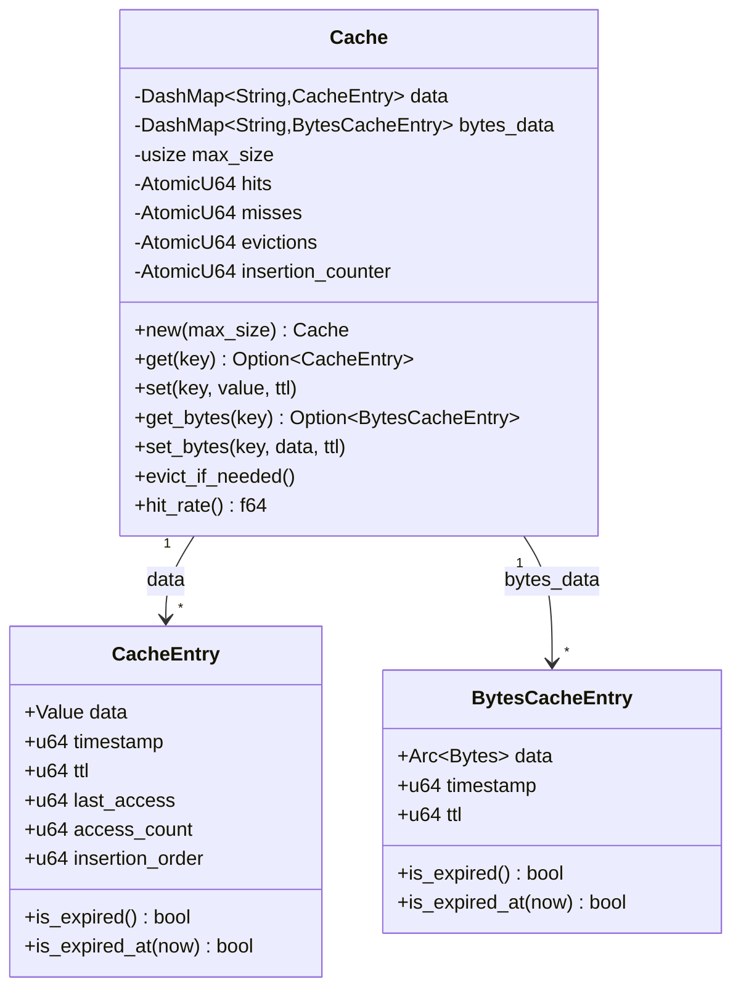

### Usage

```rust
let cache = Cache::new(2048); // max 2048 entries

// Store inference result (zero-copy path)
let bytes = Arc::new(Bytes::from(serde_json::to_vec(&result)?));
cache.set_bytes("model:sha256:abc", bytes, 3600);

// Read — Arc pointer increment only (~5 ns)
if let Some(entry) = cache.get_bytes("model:sha256:abc") {
    return Ok(HttpResponse::Ok().body(entry.data.as_ref().clone()));
}
```

**Eviction**: approximate LRU — random sample → evict expired first, then oldest `insertion_order`. No global lock required.

---

## `batch` — `src/batch.rs`

Adaptive request batcher. Groups concurrent requests into GPU-efficient batches; timeout shrinks as queue depth grows.

### Key Structs

```rust
pub struct BatchProcessor {
    max_batch_size: usize,
    min_batch_size: usize,
    batch_timeout_ms: u64,
    adaptive_timeout_enabled: bool,
    current_batch: Arc<Mutex<Vec<BatchRequest>>>,   // parking_lot
    processed_batches: AtomicU64,
    total_latency_ms: AtomicU64,
    queue_depth: AtomicUsize,
}
pub struct BatchRequest {
    pub id: String,
    pub model_name: String,
    pub inputs: Vec<Value>,
    pub priority: i32,
    pub timestamp: Instant,
}
```

### Diagram

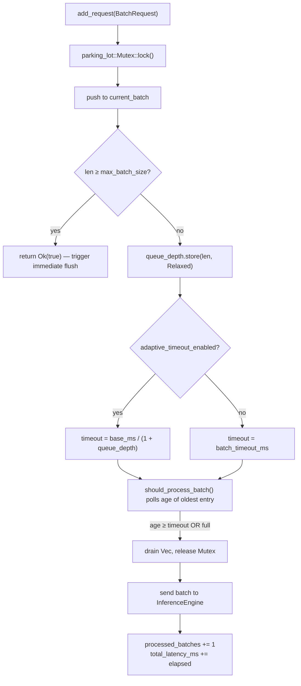

### Usage

```rust
let bp = BatchProcessor::new(32, 50)   // max 32, 50 ms base timeout
    .with_adaptive_batching(true)
    .with_min_batch_size(1);

let req = BatchRequest {
    id: uuid::Uuid::new_v4().to_string(),
    model_name: "resnet50".into(),
    inputs: vec![json!({"image": base64_data})],
    priority: 1,
    timestamp: Instant::now(),
};
let is_full = bp.add_request(req)?;
if is_full || bp.should_process_batch() {
    let batch = bp.take_batch();
    // dispatch batch to InferenceEngine
}
```

---

## `dedup` — `src/dedup.rs`

Deduplicates identical in-flight requests using an LRU cache keyed on FNV-1a hashes. Results stored behind `Arc<Value>` for O(1) clone on cache hit.

### Key Structs

```rust
pub struct RequestDeduplicator {
    cache: Mutex<LruCache<String, DeduplicationEntry>>,  // parking_lot
}
pub struct DeduplicationEntry {
    pub result: Arc<Value>,
    pub timestamp: u64,
    pub ttl: u64,
}
```

### Diagram

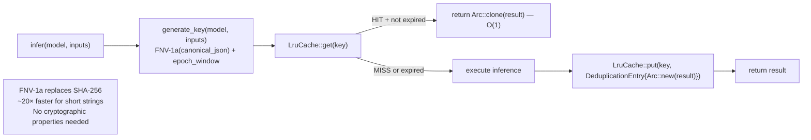

### Usage

```rust
let dedup = RequestDeduplicator::new(1024); // LRU capacity
let key = dedup.generate_key("resnet50", &inputs_json);
if let Some(entry) = dedup.get(&key) {
    return Ok((*entry.result).clone());
}
let result = engine.infer("resnet50", &inputs_json).await?;
dedup.insert(key, Arc::new(result.clone()));
```

---

## `resilience/circuit_breaker` — `src/resilience/circuit_breaker.rs`

Prevents cascading failures. State machine: `Closed → Open → HalfOpen → Closed`. State lock released before calling `f()` so concurrent callers are not serialised.

### Key Structs

```rust
pub struct CircuitBreaker {
    state: parking_lot::Mutex<CircuitState>,
    failure_count: AtomicU32,
    success_count: AtomicU32,
    last_failure_time: parking_lot::Mutex<Option<Instant>>,
    config: CircuitBreakerConfig,
}
pub struct CircuitBreakerConfig {
    pub failure_threshold: u32,   // default 5
    pub success_threshold: u32,   // default 2
    pub timeout: Duration,        // default 60 s
}
pub enum CircuitState { Closed, Open, HalfOpen }
```

### Diagram

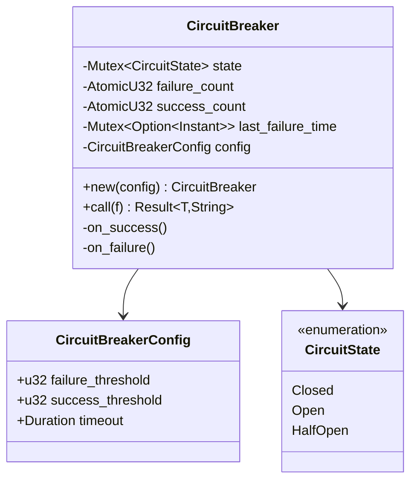

### Usage

```rust
let cb = CircuitBreaker::new(CircuitBreakerConfig {
    failure_threshold: 5,
    success_threshold: 2,
    timeout: Duration::from_secs(30),
});

match cb.call(|| backend.run(input)) {
    Ok(result) => Ok(result),
    Err(e) if e == "Circuit breaker is open" => Err(InferenceError::InternalError(e)),
    Err(e) => Err(InferenceError::InferenceFailed(e)),
}
```

---

## `resilience/bulkhead` — `src/resilience/bulkhead.rs`

Caps concurrent in-flight operations via a Tokio `Semaphore`. Non-blocking: returns `Err` immediately when at capacity (no queue).

### Key Structs

```rust
pub struct Bulkhead {
    semaphore: Arc<Semaphore>,
    config: BulkheadConfig,
}
pub struct BulkheadConfig {
    pub max_concurrent: usize,  // default 100
    pub queue_size: usize,      // default 1000 (informational)
}
```

### Diagram

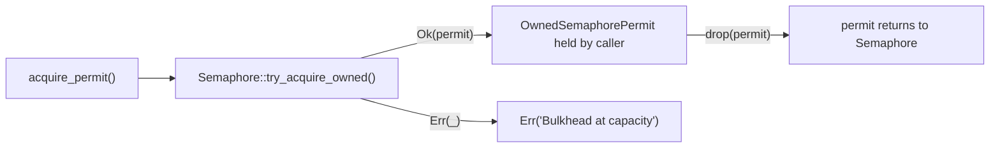

### Usage

```rust
let bulkhead = Bulkhead::new(BulkheadConfig { max_concurrent: 50, queue_size: 500 });

let permit = bulkhead.acquire_permit().await
    .map_err(|_| InferenceError::InternalError("overloaded".into()))?;
let result = engine.infer(model, input).await;
drop(permit); // explicit or via scope
```

---

## `resilience/retry` — `src/resilience/retry.rs`

Exponential backoff with optional jitter. Multiplier doubles base delay each attempt up to `max_delay`.

### Key Struct

```rust
pub struct RetryPolicy {
    pub max_retries: usize,      // default 3
    pub base_delay: Duration,    // default 100 ms
    pub max_delay: Duration,     // default 30 s
    pub multiplier: f64,         // default 2.0
    pub jitter: bool,            // default true
}
```

### Diagram

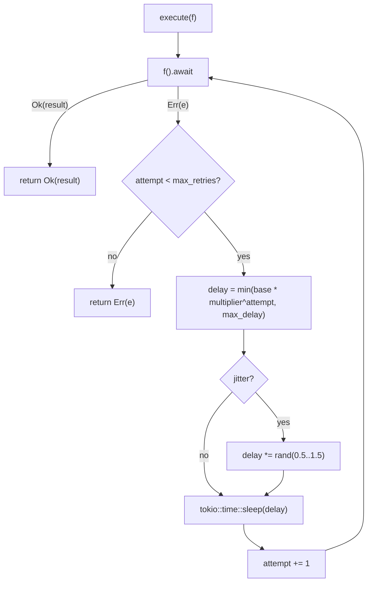

### Usage

```rust
let policy = RetryPolicy::with_delays(3,
    Duration::from_millis(100), Duration::from_secs(5));
let result = policy.execute(|| async { risky_call().await }).await?;
```

---

## `resilience/token_bucket` — `src/resilience/token_bucket.rs`

Leaky-bucket rate limiter. `parking_lot::Mutex` (sync) replaces async mutex — lock is never held across `.await`, eliminating future overhead.

### Key Structs

```rust
pub struct TokenBucket {
    capacity: f64,
    refill_rate: f64,          // tokens per second
    state: Mutex<BucketState>, // parking_lot — sync
}
pub struct KeyedRateLimiter {
    buckets: DashMap<String, Arc<TokenBucket>>,
    capacity: usize,
    refill_rate: f64,
}
```

### Diagram

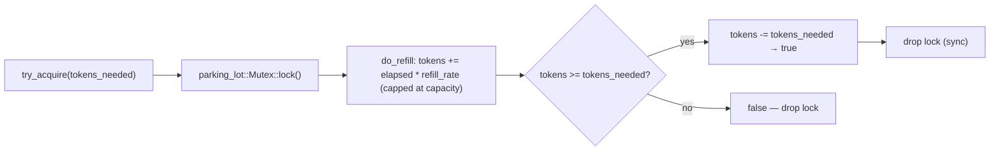

---

## `resilience/per_model_breaker` — `src/resilience/per_model_breaker.rs`

Per-model circuit breaker registry. Each model name gets its own `CircuitBreaker` instance; `DashMap` allows lock-free creation and lookup.

### Key Struct

```rust
pub struct CircuitBreakerRegistry {
    breakers: DashMap<String, Arc<CircuitBreaker>>,
    config: CircuitBreakerConfig,
}
```

### Diagram

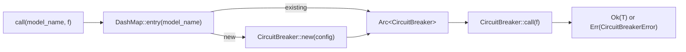

---

## `core/engine` — `src/core/engine.rs`

Central inference coordinator. Sanitizes inputs, dispatches to `ModelManager`, records metrics via `MetricsCollector`.

### Key Struct

```rust
pub struct InferenceEngine {
    pub model_manager: Arc<ModelManager>,
    metrics: MetricsCollector,
    config: Config,
    sanitizer: Sanitizer,
}
```

### Diagram

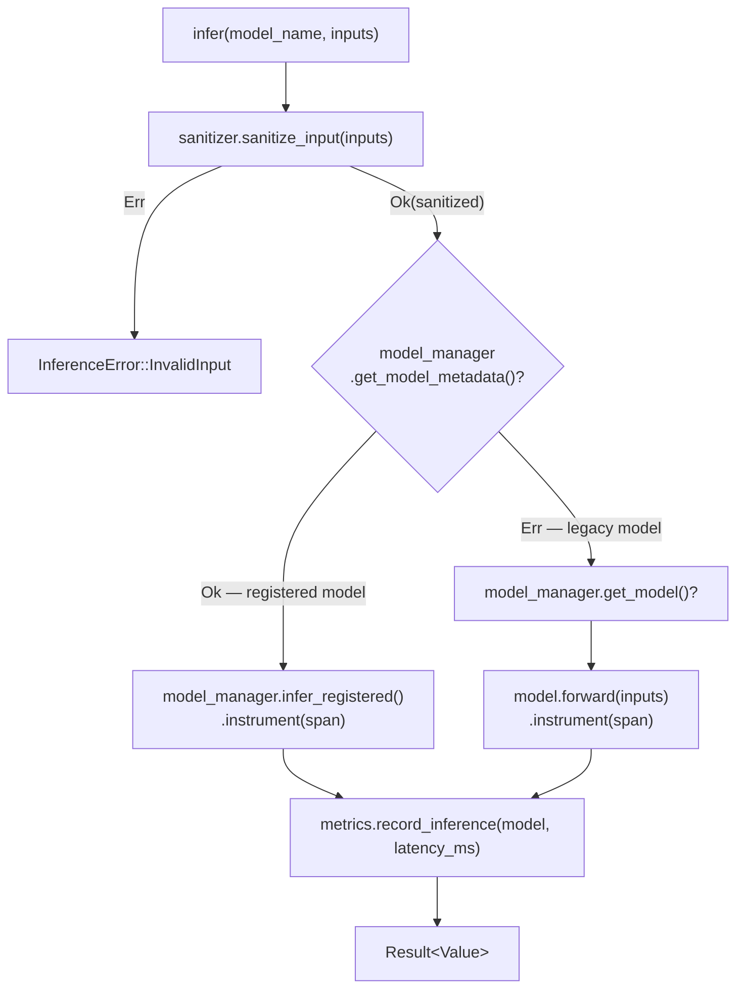

### Usage

```rust
let engine = InferenceEngine::new(Arc::clone(&model_manager), &config);
engine.warmup(&config).await?; // fires dummy inference per auto_load model

let result = engine.infer("yolov8n", &json!({"image": b64})).await?;
```

---

## `models/manager` — `src/models/manager.rs`

Model lifecycle hub: loads PyTorch (`.pt`) or ONNX (`.onnx`) models, maintains a `DashMap` registry, and owns a `TensorPool`.

### Key Struct

```rust
pub struct ModelManager {
    models: DashMap<String, Arc<BaseModel>>,
    registry: Arc<ModelRegistry>,
    onnx_loader: OnnxModelLoader,
    pytorch_loader: PyTorchModelLoader,
    tensor_pool: Arc<TensorPool>,
    config: Config,
}
```

### Diagram

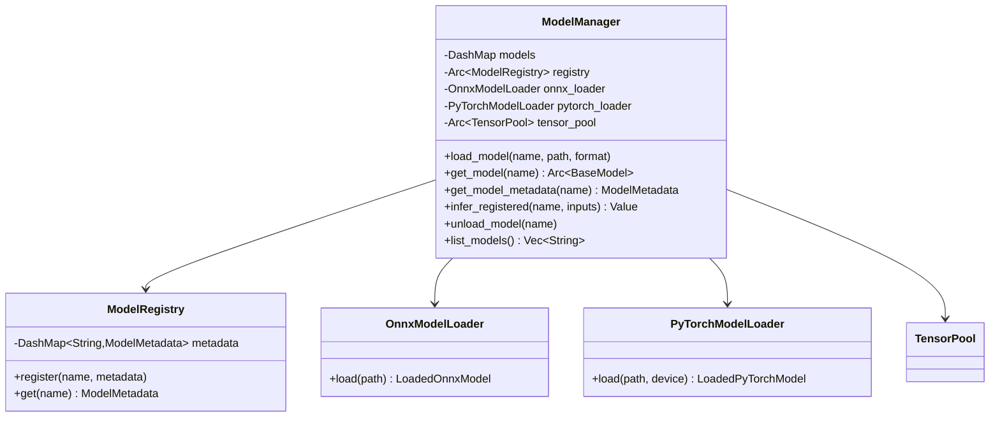

---

## `worker_pool` — `src/worker_pool.rs`

Managed async worker pool. Each `Worker` exposes its state as an `AtomicU8` (0=Idle, 1=Processing, 2=Paused, 3=Stopping, 4=Stopped) — no lock needed for state reads.

### Key Structs

```rust
pub struct Worker {
    pub id: usize,
    state: Arc<AtomicU8>,
    tasks_processed: AtomicU64,
    total_processing_time_ms: AtomicU64,
    start_time: Instant,
}
pub enum WorkerState { Idle, Processing, Paused, Stopping, Stopped }
```

### Diagram

```mermaid
stateDiagram-v2
    [*] --> Idle : Worker::spawn()
    Idle --> Processing : task received via channel
    Processing --> Idle : task complete
    Idle --> Paused : pool.pause()
    Paused --> Idle : pool.resume()
    Processing --> Stopping : pool.shutdown()
    Idle --> Stopping : pool.shutdown()
    Stopping --> Stopped : JoinHandle completes
```

### Usage

```rust
let pool = WorkerPool::new(WorkerPoolConfig {
    min_workers: 2,
    max_workers: num_cpus::get(),
});
let result = pool.execute(|| heavy_inference_task()).await?;
let stats = pool.stats(); // per-worker tasks_processed, avg_ms
```

---

## `tensor_pool` — `src/tensor_pool.rs`

Object pool for `Vec<f32>` tensors keyed by `TensorShape`. Reduces heap allocation churn for repeated same-shape inference.

### Key Structs

```rust
pub struct TensorPool {
    pools: DashMap<TensorShape, Vec<Vec<f32>>>,
    max_pooled_tensors: usize,
    allocations: AtomicUsize,
    reuses: AtomicUsize,
}
pub struct TensorShape { pub dims: Vec<usize>, pub total_size: usize }
```

### Diagram

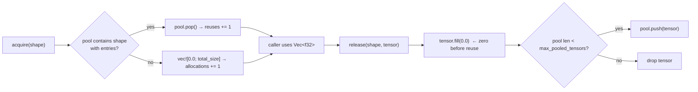

### Usage

```rust
let pool = TensorPool::new(500);
let shape = TensorShape::new(vec![1, 3, 224, 224]);
let mut tensor = pool.acquire(shape.clone());
// fill tensor with input data, run inference ...
pool.release(shape, tensor); // zero-filled and returned to pool

let reuse_rate = pool.reuses() as f64 / (pool.reuses() + pool.allocations()) as f64;
```

---

## `telemetry` — `src/telemetry/`

Metrics collection, Prometheus export, and structured JSON logging.

### Diagram

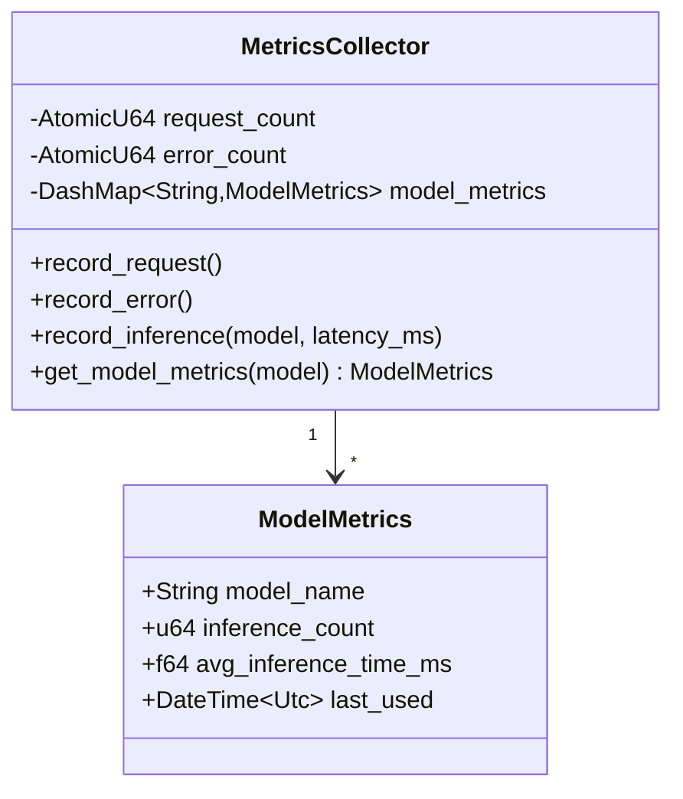

Files: `metrics.rs` · `prometheus.rs` · `logger.rs` · `structured_logging.rs` · `mod.rs`

---

## `security` — `src/security/`

Input sanitization and validation. `Sanitizer` is owned by `InferenceEngine`; called before every inference.

### Diagram

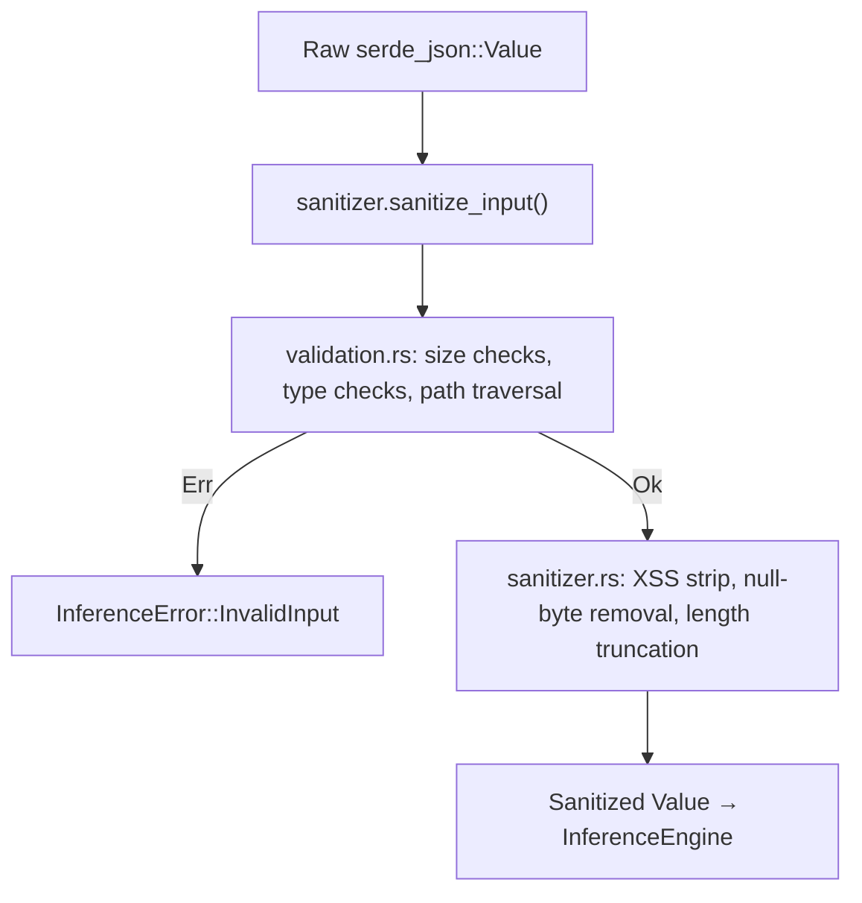

Files: `sanitizer.rs` · `validation.rs` · `mod.rs`

---

## `middleware` — `src/middleware/`

Three Actix-Web middleware components applied in order.

### Diagram

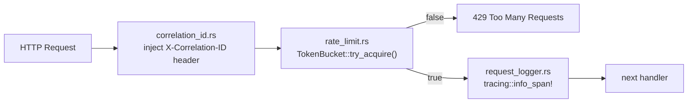

---

## `monitor` — `src/monitor.rs`

Real-time system health aggregator. Polls worker stats, cache hit rates, circuit breaker states, and queue depths. Exposed via `GET /health` and `GET /metrics`.

### Diagram

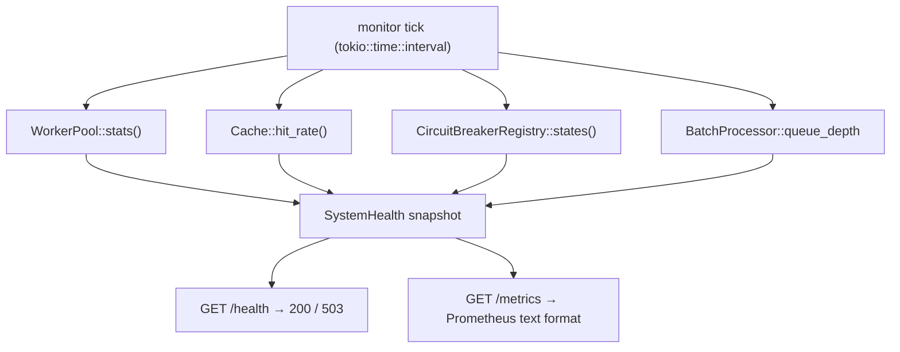

---

**See also**: [Architecture](../ARCHITECTURE.md) · [Modules](modules/README.md)
