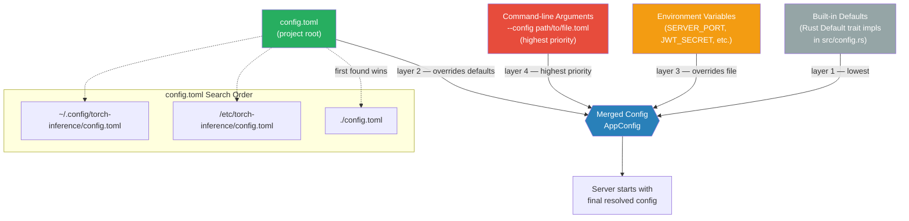
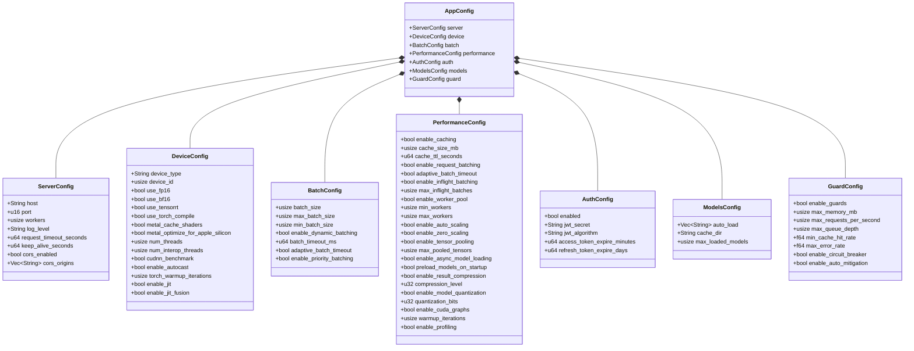

# Configuration — Developer Reference

Complete configuration reference for `torch-inference` (Rust/Actix-Web ML inference server).  
Config format: TOML · Source: `src/config.rs`

---

## Table of Contents

1. [Configuration Loading Hierarchy](#configuration-loading-hierarchy)
2. [Config Struct Diagram](#config-struct-diagram)
3. [Full `config.toml` Reference](#full-configtoml-reference)
4. [Environment Variable Overrides](#environment-variable-overrides)
5. [Feature Flag Decision Tree](#feature-flag-decision-tree)
6. [Runtime Configuration](#runtime-configuration)

---

## Configuration Loading Hierarchy



---

## Config Struct Diagram



---

## Full `config.toml` Reference

```toml
# ============================================================
# torch-inference — Annotated config.toml Reference
# ============================================================

# ── Server ───────────────────────────────────────────────────
[server]
host    = "0.0.0.0"   # Bind address. Use "127.0.0.1" for loopback-only.
port    = 8000        # HTTP port. Nginx should proxy → this port.
workers = 8           # Actix-Web worker threads. Default: num_cpus.
                      # For I/O-heavy workloads increase; for CPU-heavy decrease.
log_level = "info"    # "trace" | "debug" | "info" | "warn" | "error"

# ── Device / ML Backend ──────────────────────────────────────
[device]
device_type = "auto"
# "auto"   — detect CUDA → Metal → CPU (recommended)
# "cuda"   — force NVIDIA GPU (requires torch feature + CUDA toolkit)
# "cpu"    — force CPU (always available)
# "mps"    — Apple Metal Performance Shaders (macOS)
# "metal"  — alias for mps

device_id = 0         # Primary GPU device index (0-based)

use_fp16 = true       # FP16 half-precision. ~2x faster on NVIDIA Ampere+.
                      # Set false on Apple Silicon (can be unstable).
use_bf16 = false      # BFloat16 (A100/H100 only). More stable than fp16.

# JIT compilation (tch/torch feature)
enable_jit          = true
enable_jit_profiling = false   # Performance profiling for JIT (dev only)
enable_jit_executor  = true
enable_jit_fusion    = true    # Kernel fusion for consecutive ops

use_tensorrt      = false  # TensorRT optimization (NVIDIA only, large models)
use_torch_compile = true   # torch.compile() — PyTorch 2.0+ compilation

# Apple Silicon specific
metal_use_mlx                    = false  # Apple MLX framework (experimental)
metal_cache_shaders              = true   # Cache compiled Metal shaders
metal_optimize_for_apple_silicon = true   # Enable Apple Silicon optimizations

# Threading (affects CPU + CUDA host threads)
num_threads         = 8  # Intra-op parallelism. Recommended: num_cpus.
num_interop_threads = 1  # Inter-op parallelism. Keep 1 for serving workloads.

# cuDNN (NVIDIA)
cudnn_benchmark    = true  # Auto-select fastest cuDNN algorithm. 
                            # Only enable with stable input shapes.
cudnn_deterministic = false

enable_autocast         = true  # Automatic Mixed Precision (AMP)
torch_warmup_iterations = 5     # Warmup iterations before benchmarking

# ── Batching ─────────────────────────────────────────────────
[batch]
batch_size          = 1   # Default static batch size
max_batch_size      = 32  # Hard upper limit per batch
min_batch_size      = 1   # Minimum items before processing
enable_dynamic_batching = true  # Collect requests and batch them

# Adaptive timeout: scales down as queue depth grows
# Queue depth:  0-2   → 100ms
#               3-5   → 50ms
#               6-10  → 25ms
#               11+   → 12.5ms
adaptive_batch_timeout  = true
batch_timeout_ms        = 50   # Used when adaptive_batch_timeout = false

enable_priority_batching = true  # Higher-priority requests jump queue

# ── Performance ──────────────────────────────────────────────
[performance]
warmup_iterations = 3       # Warmup on startup (stabilises latency measurements)
enable_profiling  = false   # pprof flamegraph profiling (dev only; feature: profiling)

# LRU cache
enable_caching   = true
cache_size_mb    = 2048     # Memory allocated for response cache
cache_ttl_seconds = 3600    # Cache entry TTL in seconds

# Request batching
enable_request_batching = true
adaptive_batch_timeout  = true
min_batch_size          = 1

# Inflight batching (advanced — batches concurrent requests mid-flight)
enable_inflight_batching = false
max_inflight_batches     = 4

# Worker pool
enable_worker_pool   = true
min_workers          = 2
max_workers          = 16
enable_auto_scaling  = true   # Scale workers 2–16 based on queue depth
enable_zero_scaling  = false  # Allow scale-to-zero (for bursty workloads)

# Tensor pooling (reuse pre-allocated tensors — 50-70% faster allocation)
enable_tensor_pooling  = true
max_pooled_tensors     = 500  # Per-shape pool size

# Model loading
enable_async_model_loading  = true   # Non-blocking model load
preload_models_on_startup   = false  # Load auto_load models before accepting requests

# Response compression
enable_result_compression = true
compression_level         = 6  # 1=fastest, 9=best compression, 6=balanced

# Quantization (experimental)
enable_model_quantization = true
quantization_bits         = 8   # 8-bit INT or 16-bit

# CUDA graphs (NVIDIA) — reduces kernel launch overhead for fixed-size inputs
enable_cuda_graphs = true

# ── Authentication ────────────────────────────────────────────
[auth]
enabled                     = true
jwt_secret                  = "your-secret-key-here-change-in-production"
# IMPORTANT: Use a cryptographically random 256-bit key in production.
# Generate: openssl rand -hex 32
jwt_algorithm               = "HS256"  # Only HS256 currently supported
access_token_expire_minutes = 60       # 1 hour
refresh_token_expire_days   = 7

# ── Models ───────────────────────────────────────────────────
[models]
auto_load       = ["example"]  # Model names to load on startup
cache_dir       = "models"     # Directory for model files (.pt, .onnx, etc.)
max_loaded_models = 5          # Max models kept in memory simultaneously
                               # LRU eviction when exceeded

# ── System Guard ─────────────────────────────────────────────
[guard]
enable_guards             = true
max_memory_mb             = 8192   # OOM protection threshold
max_requests_per_second   = 1000   # Rate limit (per server instance)
max_queue_depth           = 500    # Backpressure threshold
min_cache_hit_rate        = 60.0   # Alert if cache hit rate drops below 60%
max_error_rate            = 5.0    # Auto-mitigation if error rate > 5%
enable_circuit_breaker    = true   # src/resilience/circuit_breaker.rs
enable_auto_mitigation    = true   # Automatic load-shedding on guard trips
```

---

## Environment Variable Overrides

All `config.toml` values can be overridden at runtime. Variables follow the pattern `SECTION_KEY` in SCREAMING_SNAKE_CASE:

| Environment Variable             | Overrides                               | Example value                |
|----------------------------------|-----------------------------------------|------------------------------|
| `SERVER_HOST`                    | `server.host`                           | `0.0.0.0`                    |
| `SERVER_PORT`                    | `server.port`                           | `8000`                       |
| `SERVER_WORKERS`                 | `server.workers`                        | `16`                         |
| `LOG_LEVEL`                      | `server.log_level`                      | `debug`                      |
| `LOG_JSON`                       | Enables JSON structured logging         | `true`                       |
| `LOG_DIR`                        | Log file directory                      | `/var/log/torch-inference`   |
| `DEVICE_TYPE`                    | `device.device_type`                    | `cuda`                       |
| `USE_FP16`                       | `device.use_fp16`                       | `true`                       |
| `NUM_THREADS`                    | `device.num_threads`                    | `8`                          |
| `CUDA_VISIBLE_DEVICES`           | GPU device selection (CUDA)             | `0,1`                        |
| `MAX_BATCH_SIZE`                 | `batch.max_batch_size`                  | `64`                         |
| `CACHE_SIZE_MB`                  | `performance.cache_size_mb`             | `4096`                       |
| `MAX_WORKERS`                    | `performance.max_workers`               | `32`                         |
| `JWT_SECRET`                     | `auth.jwt_secret`                       | `<256-bit-hex>`              |
| `AUTH_ENABLED`                   | `auth.enabled`                          | `true`                       |
| `ACCESS_TOKEN_EXPIRE_MIN`        | `auth.access_token_expire_minutes`      | `60`                         |
| `MODELS_CACHE_DIR`               | `models.cache_dir`                      | `/mnt/models`                |
| `MAX_LOADED_MODELS`              | `models.max_loaded_models`              | `10`                         |
| `MAX_MEMORY_MB`                  | `guard.max_memory_mb`                   | `30720`                      |
| `MAX_REQUESTS_PER_SECOND`        | `guard.max_requests_per_second`         | `500`                        |
| `LIBTORCH`                       | LibTorch root (torch feature)           | `/opt/libtorch`              |
| `LD_LIBRARY_PATH`                | Dynamic library path (Linux)            | `/opt/libtorch/lib`          |
| `RUST_LOG`                       | tracing/log filter (e.g. per-module)    | `torch_inference=debug`      |

---

## Feature Flag Decision Tree

```mermaid
flowchart TD
    Start([cargo build --release]) --> Q1{ML backend?}

    Q1 -->|PyTorch / tch-rs| F_TORCH["--features torch<br/>Requires: LIBTORCH env var<br/>LibTorch 2.3.0+ installed"]
    Q1 -->|ONNX Runtime| F_ONNX["--features onnx<br/>ort 2.0.0-rc.10<br/>load-dynamic + CoreML"]
    Q1 -->|Candle (pure Rust)| F_CANDLE["--features candle<br/>No native deps needed<br/>candle-core 0.8"]
    Q1 -->|All backends| F_ALL["--features all-backends<br/>torch + onnx + candle + cuda"]

    F_TORCH --> Q2{NVIDIA GPU?}
    Q2 -->|Yes| F_CUDA["--features cuda<br/>nvml-wrapper<br/>CUDA Toolkit required"]
    Q2 -->|No| Q3

    F_ONNX --> Q3{Metrics?}
    F_CANDLE --> Q3
    F_CUDA --> Q3

    Q3 -->|Prometheus /metrics| F_METRICS["--features metrics<br/>prometheus 0.13<br/>GET /metrics endpoint"]
    Q3 -->|No metrics| Q4

    F_METRICS --> Q4{Distributed tracing?}

    Q4 -->|OpenTelemetry OTLP| F_OTEL["--features telemetry<br/>tracing-opentelemetry 0.22<br/>opentelemetry-otlp 0.14<br/>Set OTEL_EXPORTER_OTLP_ENDPOINT"]
    Q4 -->|No tracing| Q6

    F_OTEL --> Q6{Performance profiling?}

    Q6 -->|pprof flamegraph| F_PROF["--features profiling<br/>pprof 0.13 (dev only)"]
    Q6 -->|No profiling| Q7

    F_PROF --> Q7{Allocator?}

    Q7 -->|jemalloc default| F_JEM["--features jemalloc (default)<br/>tikv-jemallocator 0.5<br/>Better perf under load"]
    Q7 -->|System allocator| F_SYS["--no-default-features<br/>Use system malloc"]

    F_JEM --> Done([Binary ready])
    F_SYS --> Done

    style Start fill:#27ae60,color:#fff
    style Done fill:#27ae60,color:#fff
    style F_TORCH fill:#2980b9,color:#fff
    style F_ONNX fill:#2980b9,color:#fff
    style F_CANDLE fill:#2980b9,color:#fff
    style F_ALL fill:#e74c3c,color:#fff
    style F_METRICS fill:#f39c12,color:#fff
    style F_OTEL fill:#9b59b6,color:#fff
```

### Common build invocations

```bash
# Minimum build (ONNX default, jemalloc, no metrics)
cargo build --release

# Development (fast incremental)
cargo build

# ONNX + Prometheus metrics
cargo build --release --features "metrics"

# PyTorch + GPU + Prometheus
LIBTORCH=/opt/libtorch \
LD_LIBRARY_PATH=/opt/libtorch/lib \
cargo build --release --features "torch,cuda,metrics"

# Production — all backends + full observability
cargo build --release \
  --features "all-backends,metrics,telemetry,llm"

# Disable jemalloc (e.g., musl target)
cargo build --release --no-default-features \
  --features "metrics"
```

---

## Runtime Configuration

Some settings take effect without restarting the server, accessible via the admin API (auth required):

### Dynamic settings (hot-reload via API)

| Endpoint                                  | Method | Description                               |
|-------------------------------------------|--------|-------------------------------------------|
| `POST /admin/config/log-level`            | POST   | Change log level at runtime               |
| `POST /admin/config/cache`                | POST   | Resize or clear the LRU cache             |
| `POST /admin/config/workers`              | POST   | Adjust worker pool min/max                |
| `POST /admin/config/batch`                | POST   | Change batch size / timeout               |

### Performance profiles (copy-paste into config.toml)

```toml
# ── HIGH THROUGHPUT (batch processing) ───────────────────────
[batch]
max_batch_size = 64
adaptive_batch_timeout = true
min_batch_size = 8

[performance]
cache_size_mb = 4096
max_pooled_tensors = 500
enable_result_compression = true
compression_level = 6

# ── LOW LATENCY (real-time API) ───────────────────────────────
[batch]
max_batch_size = 8
adaptive_batch_timeout = true
min_batch_size = 1

[performance]
cache_size_mb = 1024
max_pooled_tensors = 100
enable_result_compression = false

# ── MEMORY CONSTRAINED (edge / small containers) ─────────────
[performance]
cache_size_mb = 512
max_pooled_tensors = 50
enable_result_compression = true
compression_level = 9
enable_model_quantization = true
quantization_bits = 8

[models]
max_loaded_models = 2
```

---

**See also**: [`AUTHENTICATION.md`](AUTHENTICATION.md) · [`DEPLOYMENT.md`](DEPLOYMENT.md) · [`src/config.rs`](../src/config.rs)
