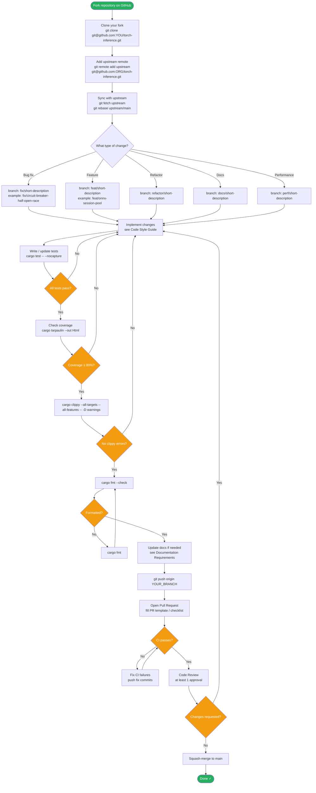

# Contributing — Developer Guide

Developer guide for contributing to `torch-inference` (Rust/Actix-Web ML inference server).

---

## Table of Contents

1. [Contribution Workflow](#contribution-workflow)
2. [Development Environment Setup](#development-environment-setup)
3. [Code Style Guide](#code-style-guide)
4. [Module Addition Workflow](#module-addition-workflow)
5. [PR Checklist](#pr-checklist)
6. [Architecture Decision Records](#architecture-decision-records)
7. [Testing Requirements](#testing-requirements)
8. [Documentation Requirements](#documentation-requirements)

---

## Contribution Workflow



---

## Development Environment Setup

### Prerequisites

| Tool              | Minimum version | Install                                          |
|-------------------|-----------------|--------------------------------------------------|
| Rust              | stable (1.75+)  | `curl --proto '=https' --tlsv1.2 -sSf https://sh.rustup.rs \| sh` |
| cargo-tarpaulin   | latest          | `cargo install cargo-tarpaulin`                  |
| cargo-watch       | latest          | `cargo install cargo-watch` (optional, hot-reload) |
| Docker            | 24+             | https://docs.docker.com/get-docker/              |
| LibTorch          | 2.3.0+          | Only if using `--features torch` (see below)     |

### Clone and build

```bash
git clone https://github.com/ORG/torch-inference.git
cd torch-inference

# Fast dev build (no ML backends — compiles in ~30s)
cargo build

# With ONNX + Prometheus (recommended for most contributions)
cargo build --features "metrics"

# Full build with PyTorch (requires LibTorch)
export LIBTORCH=/opt/libtorch
export LD_LIBRARY_PATH=$LIBTORCH/lib:$LD_LIBRARY_PATH
cargo build --features "torch,metrics"
```

### Configure the dev server

```bash
# Copy default config and edit as needed
cp config.toml config.dev.toml

# Key dev settings to change:
# [server] log_level = "debug"
# [auth] enabled = false   (skip auth during local dev)
# [device] device_type = "cpu"
```

### Run with hot-reload (cargo-watch)

```bash
cargo watch -x 'run -- --config config.dev.toml'
```

### Verify server is running

```bash
curl http://localhost:8000/health
# {"status":"healthy","uptime_seconds":0,"version":"1.0.0"}
```

### Editor setup

**VS Code** (recommended):
1. Install **rust-analyzer** extension
2. Install **Even Better TOML** extension
3. Add to `.vscode/settings.json`:
   ```json
   {
     "rust-analyzer.cargo.features": ["metrics"],
     "rust-analyzer.checkOnSave.command": "clippy"
   }
   ```

**Zed**: Rust support is built-in; configure `cargo check` features in settings.

---

## Code Style Guide

This project follows **Rust 2021 edition** conventions. All code must pass `cargo fmt` and `cargo clippy --all-targets --all-features -- -D warnings`.

### Naming

| Construct        | Convention        | Example                                |
|------------------|-------------------|----------------------------------------|
| Types / Traits   | `UpperCamelCase`  | `CircuitBreaker`, `JwtHandler`         |
| Functions        | `snake_case`      | `create_token`, `verify_user`          |
| Variables        | `snake_case`      | `access_token`, `failure_count`        |
| Constants        | `SCREAMING_SNAKE` | `MAX_RETRY_COUNT`                      |
| Modules / files  | `snake_case`      | `circuit_breaker.rs`, `mod.rs`         |
| Feature flags    | `kebab-case`      | `--features torch,metrics`             |
| Error variants   | `UpperCamelCase`  | `AuthError::InvalidToken`              |

### Error handling

Use `thiserror` for library errors, `anyhow` for application-level error propagation:

```rust
// src/my_module.rs — library error (use thiserror)
#[derive(Debug, thiserror::Error)]
pub enum MyError {
    #[error("token expired at {0}")]
    TokenExpired(i64),
    #[error("invalid input: {0}")]
    InvalidInput(String),
    #[error(transparent)]
    Io(#[from] std::io::Error),
}

// src/api/handler.rs — application error (use anyhow)
async fn my_handler() -> Result<HttpResponse, actix_web::Error> {
    let data = load_data().context("loading model data")?;
    Ok(HttpResponse::Ok().json(data))
}
```

### Async code

- All async code uses **Tokio 1.40** runtime.
- Prefer `tokio::spawn` for CPU-bound work on a dedicated thread pool.
- Use `parking_lot::Mutex` over `std::sync::Mutex` (lower overhead, no poison).
- Use `dashmap::DashMap` for concurrent map access (see `src/auth/mod.rs`).

```rust
// Prefer parking_lot over std::sync
use parking_lot::Mutex;

// Spawn CPU-bound work off the async executor
let result = tokio::task::spawn_blocking(|| {
    heavy_computation()
}).await??;
```

### Logging and tracing

Use the `tracing` crate (not `log` for new code):

```rust
use tracing::{debug, error, info, instrument, warn};

#[instrument(skip(secret))]   // `skip` to avoid logging sensitive fields
pub fn create_token(username: &str, secret: &str) -> Result<String, Error> {
    info!(username = %username, "creating JWT token");
    // ...
    debug!("token created successfully");
    Ok(token)
}
```

### Comments and documentation

- Add doc comments (`///`) on all public items.
- Only add inline comments (`//`) where logic is non-obvious.
- Do **not** comment self-explanatory code.

```rust
/// Creates a signed JWT access token for the given username.
///
/// # Errors
/// Returns [`AuthError::Encoding`] if the signing key is invalid.
pub fn create_token(&self, username: &str) -> Result<String, AuthError> {
    // exp is UTC Unix timestamp — jsonwebtoken validates this on decode
    let exp = (Utc::now() + Duration::hours(1)).timestamp();
    // ...
}
```

### Clippy lints

All code must pass with `-D warnings`. Common patterns to avoid:

```rust
// ✗ Don't clone unnecessarily
let s = my_string.clone();

// ✓ Borrow instead
let s = &my_string;

// ✗ Don't unwrap in library code
let val = result.unwrap();

// ✓ Propagate errors
let val = result?;

// ✗ Don't use expect() in production paths
let val = result.expect("should never fail");

// ✓ Return a proper error
let val = result.map_err(|e| MyError::from(e))?;
```

---

## Module Addition Workflow

```mermaid
graph LR
    subgraph Planning["1 · Planning"]
        P1["Open GitHub issue\ndescribe the module\nlink to ADR if needed"]
        P2["Check for existing\nrelated modules in src/"]
    end

    subgraph Scaffold["2 · Scaffold"]
        S1["Create src/my_module.rs\nor src/my_module/mod.rs"]
        S2["Add pub mod my_module;\nto src/lib.rs"]
        S3["Define public types,\ntraits, error variants"]
    end

    subgraph Implement["3 · Implement"]
        I1["Write core logic\nwith tracing instrumentation"]
        I2["Add #[cfg(test)] mod tests\nunit tests alongside code"]
        I3["Wire into AppState\nor Actix-Web routes\n(src/api/ or src/middleware/)"]
    end

    subgraph Verify["4 · Verify"]
        V1["cargo test my_module::tests"]
        V2["cargo clippy"]
        V3["cargo tarpaulin — coverage check"]
    end

    subgraph Document["5 · Document"]
        D1["/// doc comments on public API"]
        D2["Update docs/ if user-facing\n(CONFIGURATION.md, API_REFERENCE.md)"]
        D3["Add ADR if architectural decision"]
    end

    P1 --> P2 --> S1 --> S2 --> S3
    S3 --> I1 --> I2 --> I3
    I3 --> V1 --> V2 --> V3
    V3 --> D1 --> D2 --> D3

    style P1 fill:#27ae60,color:#fff
    style V3 fill:#2980b9,color:#fff
    style D3 fill:#f39c12,color:#fff
```



### src/lib.rs module registration

```rust
// src/lib.rs — add your module here
pub mod auth;
pub mod batch;
pub mod cache;
pub mod config;
pub mod error;
pub mod my_module;          // ← add this
pub mod resilience;
pub mod security;
```

### AppState wiring (if module needs shared state)

```rust
// src/core/app_state.rs (or equivalent)
pub struct AppState {
    pub config: Arc<AppConfig>,
    pub model_pool: Arc<ModelPool>,
    pub cache: Arc<Cache>,
    pub my_module: Arc<MyModule>,   // ← add here
    // ...
}
```

---

## PR Checklist

Before requesting review, verify all items below:

```markdown
### Code
- [ ] `cargo fmt --check` passes (no formatting changes needed)
- [ ] `cargo clippy --all-targets --all-features -- -D warnings` passes
- [ ] `cargo test` passes (all tests green)
- [ ] No `unwrap()` or `expect()` in production code paths
- [ ] No `println!()` — use `tracing::info!()` / `debug!()` instead
- [ ] No hardcoded secrets or credentials

### Tests
- [ ] New public functions have unit tests
- [ ] Edge cases and error paths are tested
- [ ] Tests follow naming convention: `subject_condition_expected_outcome`
- [ ] `cargo tarpaulin` shows ≥ 80% coverage for changed files
- [ ] No `#[ignore]` without a comment explaining why

### Documentation
- [ ] All public items have `///` doc comments
- [ ] `config.toml` reference updated if new config fields added
- [ ] `AUTHENTICATION.md` updated if auth changes
- [ ] `DEPLOYMENT.md` updated if deployment changes
- [ ] `TESTING.md` updated if test infrastructure changes

### Architecture
- [ ] Breaking API changes are documented
- [ ] ADR created for significant architectural decisions (see below)
- [ ] Feature flags are used for optional backends/integrations
- [ ] Sensitive fields are `skip`-ped in `#[instrument]`

### Operational
- [ ] New config fields have sensible defaults
- [ ] Log output at appropriate level (not all `info!`)
- [ ] Health check still passes after changes
- [ ] No performance regressions (run `cargo bench` if relevant)
```

---

## Architecture Decision Records

### What is an ADR?

An ADR documents a significant architectural decision — the context, the decision made, and the consequences. Create an ADR when:

- Choosing between two non-trivial technical approaches
- Adding or replacing a major dependency
- Changing the auth, security, or deployment model
- Introducing a new ML backend or inference strategy

### ADR location

```
docs/adr/
├── 0001-use-actix-web-over-axum.md
├── 0002-jwt-hs256-for-auth.md
├── 0003-tch-rs-as-pytorch-backend.md
└── NNNN-your-decision.md   ← create here
```

### ADR template

```markdown
# ADR-NNNN: Title of Decision

**Date**: YYYY-MM-DD  
**Status**: Proposed | Accepted | Deprecated | Superseded by ADR-XXXX  
**Deciders**: @your-github-handle

## Context

What situation led to this decision? What problem are we solving?

## Decision

What was decided? Be specific.

## Consequences

### Positive
- What does this decision make easier?

### Negative
- What does this decision make harder?
- What new constraints does it introduce?

## Alternatives Considered

| Alternative | Why rejected |
|-------------|--------------|
| Option A    | reason       |
| Option B    | reason       |
```

### ADR review process

1. Create ADR as `Proposed` in a PR
2. Discussion happens in the PR comments
3. Once consensus is reached, status changes to `Accepted`
4. ADR is merged with (or before) the implementing PR

---

## Testing Requirements

New code **must** include tests. The minimum bar:

| Code type              | Required tests                                    |
|------------------------|---------------------------------------------------|
| Public function        | At least 1 happy-path + 1 error-path unit test    |
| Async function         | `#[tokio::test]` tests                            |
| State machine          | All state transitions tested (see circuit breaker)|
| New API endpoint       | Integration test in `tests/integration_test.rs`   |
| Config field           | Test that field is parsed correctly               |
| Error variant          | Test that error is returned in appropriate cases  |

### Coverage gate

```bash
# Must pass before merging
cargo tarpaulin --features "metrics" \
  --exclude-files "src/bin/*" "src/main.rs" \
  --fail-under 80
```

### Test performance

- Unit tests must complete in **< 1 second** each
- The full `cargo test` suite must complete in **< 60 seconds**
- Use `Duration::from_millis(10)` timeouts in circuit breaker tests (not 30s)
- Avoid `std::thread::sleep()` in tests — use Tokio time mocking where possible

---

## Documentation Requirements

### Code-level docs (mandatory for public API)

```rust
/// Brief one-line description.
///
/// Longer description if needed. Explain non-obvious behaviour.
///
/// # Arguments
/// * `username` - The username to encode in the JWT subject claim.
///
/// # Errors
/// Returns [`AuthError::Encoding`] if `self.secret` is not valid UTF-8.
///
/// # Examples
/// ```
/// let handler = JwtHandler::new("secret");
/// let token = handler.create_token("alice").unwrap();
/// assert!(!token.is_empty());
/// ```
pub fn create_token(&self, username: &str) -> Result<String, AuthError> {
```

### Docs/ directory files to update

| Change type                         | Update this file                    |
|-------------------------------------|-------------------------------------|
| New config field                    | `docs/CONFIGURATION.md`             |
| Auth / token / API key change       | `docs/AUTHENTICATION.md`            |
| Deployment / Docker / K8s change    | `docs/DEPLOYMENT.md`                |
| Test infrastructure change          | `docs/TESTING.md`                   |
| New public API endpoint             | `docs/API_REFERENCE.md`             |
| New ML model support                | `docs/ARCHITECTURE.md`              |
| Architectural decision              | `docs/adr/NNNN-title.md`            |

### README.md

Update `README.md` only for:
- New installation steps
- New required prerequisites
- New top-level features worth advertising

---

**See also**: [`TESTING.md`](TESTING.md) · [`CONFIGURATION.md`](CONFIGURATION.md) · [`ARCHITECTURE.md`](ARCHITECTURE.md)
