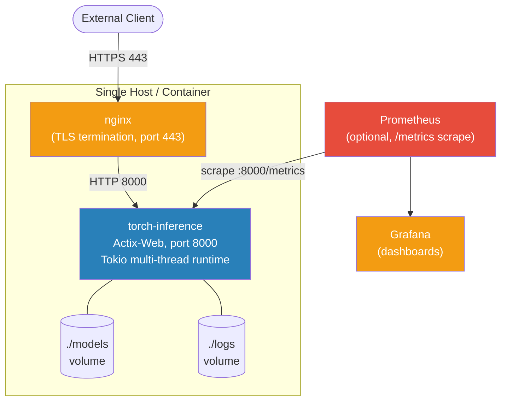
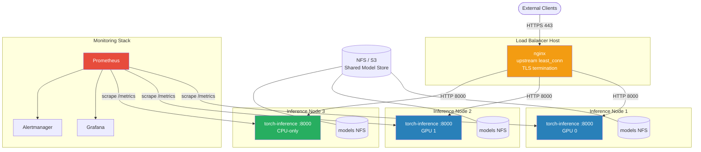
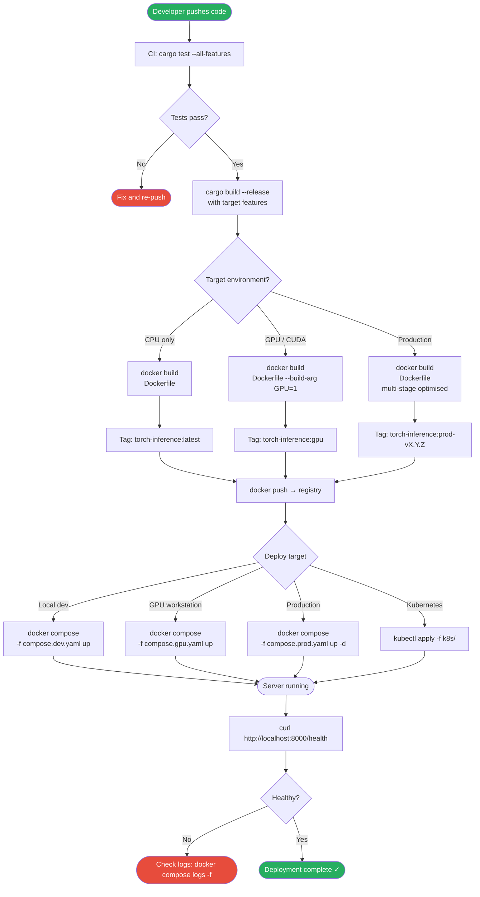
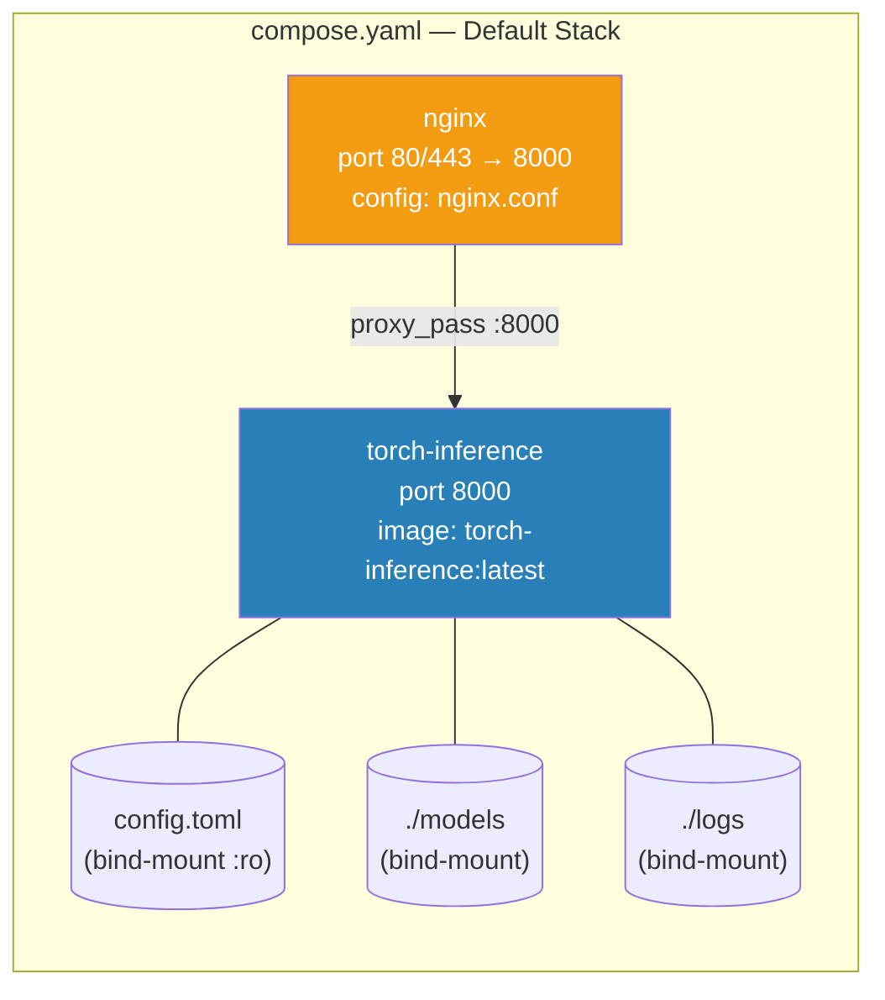
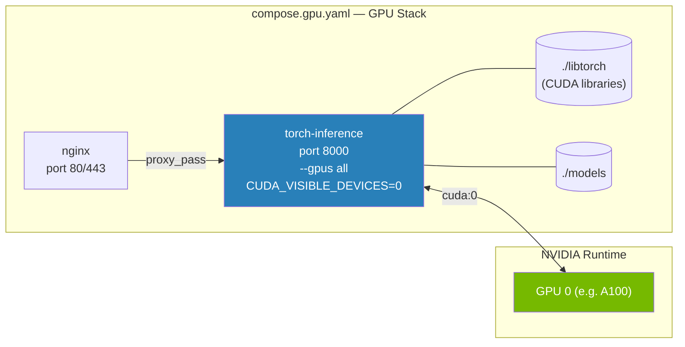
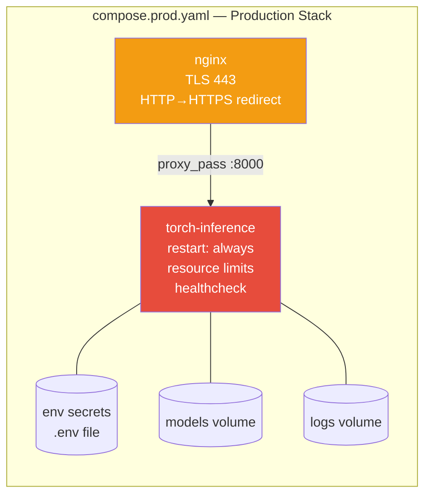
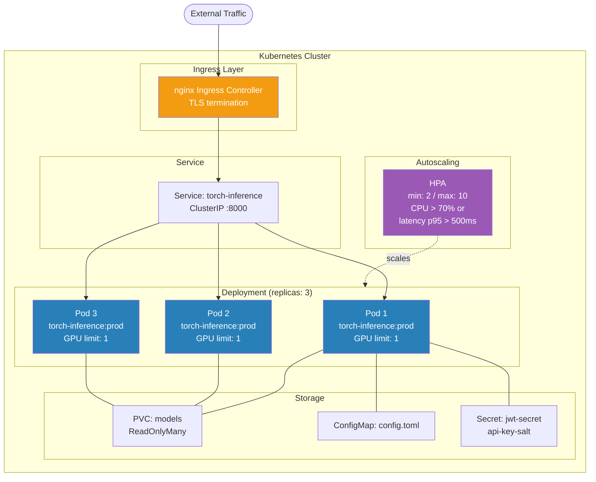
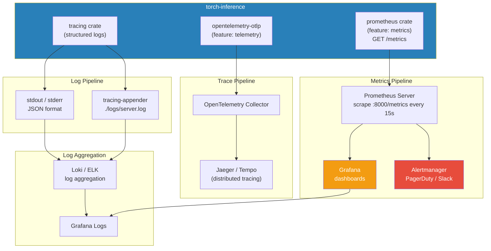

# Deployment — Developer Guide

Production deployment reference for `torch-inference` (Rust/Actix-Web ML inference server).

---

## Table of Contents

1. [Deployment Topology](#deployment-topology)
2. [Docker Deployment Pipeline](#docker-deployment-pipeline)
3. [Docker Compose Service Graph](#docker-compose-service-graph)
4. [Bare-Metal / Binary Deployment](#bare-metal--binary-deployment)
5. [Kubernetes Deployment](#kubernetes-deployment)
6. [Health Check Configuration](#health-check-configuration)
7. [Environment-Specific Configuration](#environment-specific-configuration)
8. [Monitoring Integration](#monitoring-integration)
9. [Security Hardening](#security-hardening)

---

## Deployment Topology

### Single Instance



### Multi-Instance with nginx Load Balancer



---

## Docker Deployment Pipeline



---

## Docker Compose Service Graph

### Default (`compose.yaml`)



### GPU Variant (`compose.gpu.yaml`)



### Production (`compose.prod.yaml`)



### Compose commands

```bash
# Development (hot config reload)
docker compose -f compose.dev.yaml up

# GPU workstation
docker compose -f compose.gpu.yaml up -d

# Production (detached, with restart policy)
docker compose -f compose.prod.yaml up -d

# View logs
docker compose logs -f torch-inference

# Scale inference service (3 replicas behind nginx)
docker compose -f compose.prod.yaml up -d --scale torch-inference=3
```

---

## Bare-Metal / Binary Deployment

### Build

```bash
# Clone
git clone https://github.com/your-org/torch-inference.git
cd torch-inference

# CPU + ONNX (most common)
cargo build --release --features "metrics"

# Full GPU stack (requires libtorch)
export LIBTORCH=/opt/libtorch
export LD_LIBRARY_PATH=$LIBTORCH/lib:$LD_LIBRARY_PATH
cargo build --release --features "torch,metrics,cuda"

# All backends
cargo build --release --features "all-backends,metrics,telemetry"
```

### Directory layout

```
/opt/torch-inference/
├── bin/
│   └── torch-inference-server     # compiled binary
├── config/
│   └── production.toml
├── models/                        # model files (.pt, .onnx)
├── logs/
└── data/
    ├── users.json                 # user store
    └── sessions.json              # API keys / sessions
```

### Systemd service

```ini
# /etc/systemd/system/torch-inference.service
[Unit]
Description=Torch Inference Server
After=network.target
Wants=network-online.target

[Service]
Type=simple
User=torch-inference
Group=torch-inference
WorkingDirectory=/opt/torch-inference

EnvironmentFile=/opt/torch-inference/config/env
ExecStart=/opt/torch-inference/bin/torch-inference-server \
          --config /opt/torch-inference/config/production.toml

Restart=always
RestartSec=10

LimitNOFILE=65535
LimitNPROC=32768

# Hardening
NoNewPrivileges=true
PrivateTmp=true
ProtectSystem=strict
ProtectHome=true
ReadWritePaths=/opt/torch-inference/logs /opt/torch-inference/models /opt/torch-inference/data

[Install]
WantedBy=multi-user.target
```

```bash
sudo systemctl daemon-reload
sudo systemctl enable --now torch-inference
sudo journalctl -u torch-inference -f
```

---

## Kubernetes Deployment



### Kubernetes manifests

```yaml
# deployment.yaml
apiVersion: apps/v1
kind: Deployment
metadata:
  name: torch-inference
spec:
  replicas: 3
  selector:
    matchLabels:
      app: torch-inference
  template:
    metadata:
      labels:
        app: torch-inference
      annotations:
        prometheus.io/scrape: "true"
        prometheus.io/port: "8000"
        prometheus.io/path: "/metrics"
    spec:
      containers:
      - name: torch-inference
        image: torch-inference:prod-v1.0.0
        ports:
        - containerPort: 8000
        env:
        - name: JWT_SECRET
          valueFrom:
            secretKeyRef:
              name: torch-inference-secrets
              key: jwt-secret
        - name: RUST_LOG
          value: "info"
        resources:
          requests:
            memory: "8Gi"
            cpu: "4"
          limits:
            memory: "16Gi"
            cpu: "8"
        volumeMounts:
        - name: models
          mountPath: /models
          readOnly: true
        - name: config
          mountPath: /app/config.toml
          subPath: config.toml
        livenessProbe:
          httpGet:
            path: /health
            port: 8000
          initialDelaySeconds: 60
          periodSeconds: 30
          failureThreshold: 3
        readinessProbe:
          httpGet:
            path: /health
            port: 8000
          initialDelaySeconds: 20
          periodSeconds: 10
          failureThreshold: 3
      volumes:
      - name: models
        persistentVolumeClaim:
          claimName: torch-inference-models
      - name: config
        configMap:
          name: torch-inference-config
```

```bash
kubectl apply -f k8s/
kubectl rollout status deployment/torch-inference
kubectl logs -f deployment/torch-inference
kubectl scale deployment torch-inference --replicas=5
```

---

## Health Check Configuration

The server exposes `/health` (and `/api/health`) returning JSON:

```json
{
  "status": "healthy",
  "uptime_seconds": 3600,
  "version": "1.0.0",
  "models_loaded": 2,
  "device": "cuda:0"
}
```

### Docker health check

```dockerfile
HEALTHCHECK --interval=30s --timeout=5s --start-period=60s --retries=3 \
  CMD curl -f http://localhost:8000/health || exit 1
```

### Docker Compose health check

```yaml
healthcheck:
  test: ["CMD", "curl", "-f", "http://localhost:8000/health"]
  interval: 30s
  timeout: 5s
  retries: 3
  start_period: 60s   # allow model loading time
```

### Kubernetes probes

| Probe       | Path      | Initial Delay | Period | Failure Threshold | Purpose                          |
|-------------|-----------|---------------|--------|-------------------|----------------------------------|
| `liveness`  | `/health` | 60s           | 30s    | 3                 | Restart if server deadlocked     |
| `readiness` | `/health` | 20s           | 10s    | 3                 | Remove from LB until models load |

> **Tip**: Set `start_period` / `initialDelaySeconds` to at least the time needed to load the largest model. Monitor `preload_models_on_startup` in `config.toml`.

---

## Environment-Specific Configuration

| Setting                        | Development            | Staging                  | Production                  |
|--------------------------------|------------------------|--------------------------|-----------------------------|
| `server.log_level`             | `debug`                | `info`                   | `warn`                      |
| `server.workers`               | `2`                    | `8`                      | `num_cpus` (auto)           |
| `device.device_type`           | `cpu`                  | `cuda` or `cpu`          | `auto` (CUDA preferred)     |
| `device.use_fp16`              | `false`                | `true`                   | `true`                      |
| `performance.cache_size_mb`    | `256`                  | `1024`                   | `4096`                      |
| `performance.max_workers`      | `4`                    | `8`                      | `32`                        |
| `auth.enabled`                 | `false` (optional)     | `true`                   | `true`                      |
| `auth.jwt_secret`              | dev-only-secret        | from env/vault           | from env/vault (rotate)     |
| `guard.enable_guards`          | `false`                | `true`                   | `true`                      |
| `guard.max_requests_per_second`| `10000`                | `500`                    | `1000`                      |
| `performance.enable_profiling` | `true`                 | `false`                  | `false`                     |
| `LOG_JSON`                     | `false`                | `true`                   | `true`                      |
| TLS                            | None                   | Self-signed              | Let's Encrypt / ACM         |
| Replicas                       | 1                      | 2                        | 3–10 (HPA)                  |

### Environment variables

```bash
# Required in production
JWT_SECRET=<256-bit-hex>
RUST_LOG=warn

# Optional overrides
SERVER_HOST=0.0.0.0
SERVER_PORT=8000
SERVER_WORKERS=16
LOG_JSON=true
LOG_DIR=/var/log/torch-inference
LIBTORCH=/opt/libtorch            # if using torch feature
LD_LIBRARY_PATH=/opt/libtorch/lib
CUDA_VISIBLE_DEVICES=0,1          # GPU selection
```

---

## Monitoring Integration



### Enable Prometheus metrics

```toml
# Build with: cargo build --release --features "metrics"
# Metrics available at GET /metrics (Prometheus text format)
```

```yaml
# prometheus.yml
scrape_configs:
  - job_name: torch-inference
    static_configs:
      - targets: ['localhost:8000']
    metrics_path: /metrics
    scrape_interval: 15s
```

### Key metrics exposed

| Metric                              | Type      | Description                         |
|-------------------------------------|-----------|-------------------------------------|
| `inference_requests_total`          | Counter   | Total inference requests            |
| `inference_duration_seconds`        | Histogram | Request latency (p50/p95/p99)       |
| `cache_hits_total`                  | Counter   | LRU cache hits                      |
| `cache_misses_total`                | Counter   | LRU cache misses                    |
| `active_workers`                    | Gauge     | Current worker pool size            |
| `batch_size`                        | Histogram | Observed batch sizes                |
| `circuit_breaker_state`             | Gauge     | 0=Closed, 1=Open, 2=HalfOpen        |
| `model_load_duration_seconds`       | Histogram | Model load time                     |

### Enable OpenTelemetry tracing

```bash
cargo build --release --features "telemetry"

# Set OTEL endpoint
export OTEL_EXPORTER_OTLP_ENDPOINT=http://localhost:4317
```

---

## Security Hardening

```bash
# Nginx — enforce HTTPS
server {
    listen 80;
    return 301 https://$host$request_uri;
}

server {
    listen 443 ssl http2;
    ssl_certificate     /etc/letsencrypt/live/your-domain/fullchain.pem;
    ssl_certificate_key /etc/letsencrypt/live/your-domain/privkey.pem;
    ssl_protocols       TLSv1.2 TLSv1.3;
    ssl_ciphers         HIGH:!aNULL:!MD5;

    add_header Strict-Transport-Security "max-age=31536000" always;
    add_header X-Content-Type-Options nosniff;
    add_header X-Frame-Options DENY;
    add_header Content-Security-Policy "default-src 'none'" always;

    location / {
        proxy_pass http://torch_inference;
        proxy_set_header Host              $host;
        proxy_set_header X-Real-IP         $remote_addr;
        proxy_set_header X-Forwarded-For   $proxy_add_x_forwarded_for;
        proxy_set_header X-Forwarded-Proto $scheme;
    }
}
```

```bash
# Firewall — expose only necessary ports
sudo ufw default deny incoming
sudo ufw allow ssh
sudo ufw allow 443/tcp
sudo ufw enable

# Do NOT expose port 8000 directly — all traffic must go through nginx
```

---

**See also**: [`AUTHENTICATION.md`](AUTHENTICATION.md) · [`CONFIGURATION.md`](CONFIGURATION.md) · [`TESTING.md`](TESTING.md)
