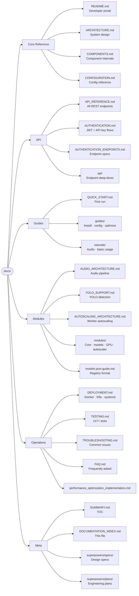

# Documentation Index

→ [README.md](README.md) | [SUMMARY.md](SUMMARY.md)

---

## Doc-Tree Overview

---

## All Documents

### Core Reference

| File | Category | Description | Key Diagrams | Status |
|------|----------|-------------|--------------|--------|
| [README.md](README.md) | Portal | Developer entry point: module graph, request pipeline, module index, build commands | `graph TD` module deps · `flowchart TD` request pipeline | ✅ Current |
| [ARCHITECTURE.md](ARCHITECTURE.md) | Architecture | Layered system design, concurrency model, data flow, performance strategies | Layer diagram · concurrency model | ✅ Current |
| [COMPONENTS.md](COMPONENTS.md) | Components | Per-component internals: cache, batch, dedup, resilience, model pool, tensor pool, monitor | Component interaction · state machines | ✅ Current |
| [CONFIGURATION.md](CONFIGURATION.md) | Config | Every TOML key, env var override, typed struct mapping, config profiles | Config hierarchy | ✅ Current |

### API Documentation

| File | Category | Description | Key Diagrams | Status |
|------|----------|-------------|--------------|--------|
| [API_REFERENCE.md](API_REFERENCE.md) | API | All REST endpoints with request/response schemas, curl examples, error codes | Endpoint table | ✅ Current |
| [AUTHENTICATION.md](AUTHENTICATION.md) | Auth | JWT issuance, refresh, API key auth, `bcrypt` hashing, bearer extraction | Auth flow diagram | ✅ Current |
| [AUTHENTICATION_ENDPOINTS.md](AUTHENTICATION_ENDPOINTS.md) | Auth | HTTP-level endpoint specs for `/auth/login`, `/auth/refresh`, `/auth/validate` | Request/response sequences | ✅ Current |
| [api/README.md](api/README.md) | API | API module overview | — | ✅ Current |
| [api/rest-api.md](api/rest-api.md) | API | REST API conventions and shared patterns | — | ✅ Current |
| [api/endpoints/](api/endpoints/) | API | Per-endpoint detailed specs | — | ✅ Current |

### Getting Started & Guides

| File | Category | Description | Key Diagrams | Status |
|------|----------|-------------|--------------|--------|
| [QUICK_START.md](QUICK_START.md) | Getting Started | Build, configure, and run first inference in < 10 minutes | — | ✅ Current |
| [guides/installation.md](guides/installation.md) | Guide | Full install: deps, LibTorch, ONNX Runtime, feature flags | — | ✅ Current |
| [guides/configuration.md](guides/configuration.md) | Guide | Config walkthrough with annotated examples | — | ✅ Current |
| [guides/optimization.md](guides/optimization.md) | Guide | Batch tuning, tensor pool sizing, worker thread configuration | — | ✅ Current |
| [guides/quickstart.md](guides/quickstart.md) | Guide | Alternative quick-start narrative | — | ✅ Current |
| [tutorials/basic-usage.md](tutorials/basic-usage.md) | Tutorial | End-to-end: load model → call API → parse response | — | ✅ Current |
| [tutorials/audio-processing.md](tutorials/audio-processing.md) | Tutorial | Audio pipeline walkthrough (STT, TTS, transcription) | — | ✅ Current |

### Module Deep-Dives

| File | Category | Description | Key Diagrams | Status |
|------|----------|-------------|--------------|--------|
| [AUDIO_ARCHITECTURE.md](AUDIO_ARCHITECTURE.md) | Module | Audio pipeline: input decode → feature extraction → model → vocoder → output | Audio pipeline flowchart | ✅ Current |
| [YOLO_SUPPORT.md](YOLO_SUPPORT.md) | Module | YOLO model integration, NMS post-processing, `/yolo` endpoint | Detection pipeline | ✅ Current |
| [AUTOSCALING_ARCHITECTURE.md](AUTOSCALING_ARCHITECTURE.md) | Module | `worker_pool` autoscaling algorithm, load metrics, scaling thresholds | Scaling state machine | ✅ Current |
| [modules/README.md](modules/README.md) | Modules | Module directory overview | — | ✅ Current |
| [modules/core/base-model.md](modules/core/base-model.md) | Module | `BaseModel` trait: required methods, lifecycle hooks | Trait hierarchy | ✅ Current |
| [modules/core/config.md](modules/core/config.md) | Module | `CoreConfig` struct fields and defaults | — | ✅ Current |
| [modules/core/inference-engine.md](modules/core/inference-engine.md) | Module | `InferenceEngine` internals: dispatch, backend selection, tensor lifecycle | Engine state flow | ✅ Current |
| [modules/audio.md](modules/audio.md) | Module | Audio model variants (Whisper, Kokoro, VITS, Bark, Piper) | — | ✅ Current |
| [modules/autoscaler.md](modules/autoscaler.md) | Module | `WorkerPool` autoscaler: metrics, spawn/shrink policy | — | ✅ Current |
| [modules/core.md](modules/core.md) | Module | `core` module map | — | ✅ Current |
| [modules/gpu.md](modules/gpu.md) | Module | GPU device selection, CUDA/Metal affinity, `core/gpu.rs` | — | ✅ Current |
| [modules/models.md](modules/models.md) | Module | `ModelManager`, `ModelRegistry`, downloader, hot-reload | Registry flow | ✅ Current |
| [models-json-guide.md](models-json-guide.md) | Reference | `models.json` / `model_registry.json` schema and field semantics | — | ✅ Current |

### Operations

| File | Category | Description | Key Diagrams | Status |
|------|----------|-------------|--------------|--------|
| [DEPLOYMENT.md](DEPLOYMENT.md) | Ops | Docker Compose, Kubernetes manifests, systemd unit, NGINX config, scaling | Deployment topology | ✅ Current |
| [TESTING.md](TESTING.md) | Ops | `cargo test`, integration suite, criterion benchmarks, tarpaulin coverage | Test pyramid | ✅ Current |
| [TROUBLESHOOTING.md](TROUBLESHOOTING.md) | Ops | Symptom → cause → fix for common runtime errors | — | ✅ Current |
| [FAQ.md](FAQ.md) | Ops | Frequently asked questions from contributors | — | ✅ Current |
| [performance_optimization_implementation.md](performance_optimization_implementation.md) | Ops | Implemented optimizations: SIMD JSON, tensor pool, batch tuning, NUMA affinity | Before/after metrics | ✅ Current |
| [testing-improvements.md](testing-improvements.md) | Ops | Test coverage improvements, new test patterns added | — | ✅ Current |

### Engineering Specs & Plans (`superpowers/`)

| Directory | Description |
|-----------|-------------|
| [superpowers/specs/](superpowers/specs/) | Design specifications for features: TTS fix, dashboard, registry expansion, optimization passes, UI wiring |
| [superpowers/plans/](superpowers/plans/) | Engineering plans paired with each spec |

---

## Coverage by Source Module

| `src/` module | Primary doc(s) |
|---------------|---------------|
| `api` | [API_REFERENCE.md](API_REFERENCE.md) · [api/](api/) |
| `auth` | [AUTHENTICATION.md](AUTHENTICATION.md) · [AUTHENTICATION_ENDPOINTS.md](AUTHENTICATION_ENDPOINTS.md) |
| `batch` | [COMPONENTS.md](COMPONENTS.md) |
| `cache` | [COMPONENTS.md](COMPONENTS.md) |
| `compression` | [COMPONENTS.md](COMPONENTS.md) |
| `config` | [CONFIGURATION.md](CONFIGURATION.md) · [guides/configuration.md](guides/configuration.md) |
| `core` | [ARCHITECTURE.md](ARCHITECTURE.md) · [modules/core/](modules/core/) |
| `dedup` | [COMPONENTS.md](COMPONENTS.md) |
| `error` | [API_REFERENCE.md](API_REFERENCE.md) (error codes) |
| `guard` | [COMPONENTS.md](COMPONENTS.md) |
| `inflight_batch` | [COMPONENTS.md](COMPONENTS.md) |
| `middleware` | [ARCHITECTURE.md](ARCHITECTURE.md) |
| `model_pool` | [COMPONENTS.md](COMPONENTS.md) |
| `models` | [modules/models.md](modules/models.md) · [models-json-guide.md](models-json-guide.md) |
| `monitor` | [COMPONENTS.md](COMPONENTS.md) |
| `postprocess` | [COMPONENTS.md](COMPONENTS.md) |
| `resilience` | [COMPONENTS.md](COMPONENTS.md) |
| `security` | [AUTHENTICATION.md](AUTHENTICATION.md) |
| `telemetry` | [DEPLOYMENT.md](DEPLOYMENT.md) (Prometheus/Grafana) |
| `tensor_pool` | [COMPONENTS.md](COMPONENTS.md) · [performance_optimization_implementation.md](performance_optimization_implementation.md) |
| `worker_pool` | [AUTOSCALING_ARCHITECTURE.md](AUTOSCALING_ARCHITECTURE.md) · [modules/autoscaler.md](modules/autoscaler.md) |
