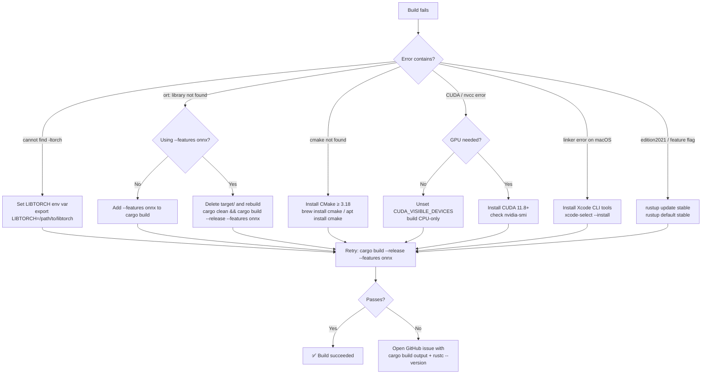
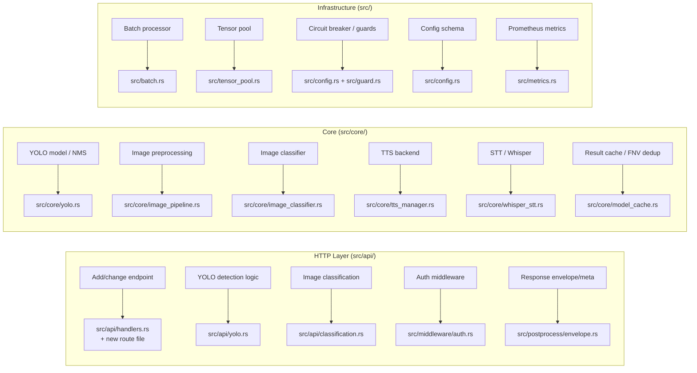

# Developer FAQ

Answers for contributors and integrators modifying or extending `torch-inference`.

---

## Build Troubleshooting



---

## Module Quick-Reference

Which source file to edit for a given concern.



---

## Q&A

### Q1 — How do I enable/disable the `torch` and `onnx` feature flags?

Feature flags gate backend compilation. They are mutually independent and can be combined.

```bash
# ONNX only (recommended; used by YOLO)
cargo build --release --features onnx

# PyTorch (tch-rs 0.16) only
cargo build --release --features torch

# Both backends
cargo build --release --features onnx,torch

# Candle (experimental, no ONNX/torch needed)
cargo build --release --features candle
```

In `Cargo.toml`:

```toml
tch = { version = "0.16", optional = true }
ort = { version = "=2.0.0-rc.10", ... }
candle-core = { version = "0.8", optional = true }
```

Guard code paths with `#[cfg(feature = "torch")]` / `#[cfg(not(feature = "torch"))]` — see `src/core/yolo.rs:4` for the pattern.

---

### Q2 — How do I register a new YOLO model variant?

See the step-by-step guide in [`docs/YOLO_SUPPORT.md — Adding a New YOLO Variant`](YOLO_SUPPORT.md#adding-a-new-yolo-variant). Summary:

1. Add enum arm to `YoloVersion` in `src/core/yolo.rs`
2. Implement `postprocess_vN()` (or delegate to an existing one if output format matches)
3. Add download URL in `src/api/yolo.rs:306`
4. Update `models.json` + `model_registry.json`
5. Add unit tests in `src/core/yolo.rs::tests`

---

### Q3 — How do I add a completely new API endpoint?

1. Create `src/api/my_feature.rs` with handler functions and a `configure()` function:

```rust
pub fn configure(cfg: &mut web::ServiceConfig) {
    cfg.service(
        web::scope("/my-feature")
            .route("/action", web::post().to(my_handler)),
    );
}
```

2. Register in `src/api/handlers.rs` (the main `configure_routes()` function):

```rust
use crate::api::my_feature;
// inside configure_routes():
my_feature::configure(cfg);
```

3. Add integration tests in `tests/integration_test.rs`.

---

### Q4 — How does the batch processor work and how do I tune it?

`BatchProcessor` lives in `src/batch.rs`. It collects incoming requests into a queue and flushes them when either:
- the queue reaches `max_batch_size`, or
- the adaptive timeout fires (shrinks as queue grows: 100 ms → 12.5 ms)

```toml
# config.toml
[performance]
enable_request_batching = true
max_batch_size = 32        # flush at this count
min_batch_size = 1         # don't wait if fewer arrive
adaptive_batch_timeout = true
```

`BatchProcessor::new(max_batch_size, timeout_ms)` — constructor takes those two values. Increasing `max_batch_size` improves GPU utilisation at the cost of per-request latency.

---

### Q5 — How do I tune the LRU cache?

Cache is in `src/core/model_cache.rs`. Key config knobs:

```toml
[performance]
enable_caching = true
cache_size_mb = 2048   # increase for higher hit rate; formula: rate × avg_resp_kb × TTL / 1024
```

Cache key generation uses **FNV-1a 64-bit hashing** (`src/core/model_cache.rs:17`):

```rust
fn fnv1a(data: &[u8]) -> u64 { … }
```

Target hit rate is 80–85%. Monitor via:

```bash
curl http://localhost:8000/api/stats/cache
```

To force eviction, lower `cache_size_mb` or restart the process (cache is in-memory only).

---

### Q6 — How does request deduplication work? Why FNV-1a and not SHA-256?

Dedup is implemented in `src/core/model_cache.rs` and `src/core/tts_manager.rs`. Identical concurrent requests (same input bytes) are collapsed: only one inference runs and all callers share the result via `Arc<Value>` (O(1) clone).

**FNV-1a 64-bit** was chosen over SHA-256 because:
- No cryptographic security requirement — this is a collision-resistance-not-preimage-resistance use case
- FNV-1a is ~10× faster for small-to-medium payloads
- 64-bit collision space is sufficient for a 10-second dedup window

The dedup window is **10 seconds**. Entries older than 10 s are evicted regardless of hit count.

---

### Q7 — How do I configure the circuit breaker?

Circuit breaker is part of the guard system (`src/config.rs:210`):

```toml
[guard]
enable_guards = true
enable_circuit_breaker = true
max_error_rate = 5.0           # open circuit when error rate exceeds 5%
max_memory_mb = 8192           # hard memory limit
max_requests_per_second = 1000
max_queue_depth = 500
min_cache_hit_rate = 60.0
enable_auto_mitigation = true  # auto-shed load when thresholds exceeded
```

To disable in development (bypass circuit breaker):

```toml
[guard]
enable_guards = false
enable_circuit_breaker = false
```

---

### Q8 — How do I use the tensor pool and why does it matter?

`TensorPool` (`src/tensor_pool.rs`) maintains a pool of pre-allocated tensors keyed by shape. Instead of allocating a new tensor for every inference, the pool reuses existing ones.

- **50–70% reduction** in allocation overhead
- **95%+ reuse rate** under steady load
- Configured via `max_pooled_tensors` (default: 500)

```toml
[performance]
enable_tensor_pooling = true
max_pooled_tensors = 500
```

Monitor reuse rate:

```bash
curl http://localhost:8000/api/stats/tensor_pool
```

You do not need to interact with `TensorPool` directly in most handler code — it is injected via `AppData` and used internally by the inference path.

---

### Q9 — How do I bypass authentication during local development?

```toml
# config.toml
[auth]
enabled = false
```

When `enabled = false`, all endpoints accept unauthenticated requests. Do **not** use this in production. The auth middleware is at `src/middleware/auth.rs`.

---

### Q10 — How do I expose Prometheus metrics?

Metrics module: `src/metrics.rs`. Enable via:

```toml
# config.toml — no dedicated [metrics] section yet;
# metrics endpoint is always available at /api/metrics
```

Scrape:

```bash
curl http://localhost:8000/api/metrics
```

Standard labels exposed: `request_count`, `request_latency_ms`, `cache_hit_rate`, `batch_size_histogram`, `tensor_pool_reuse_rate`, `active_workers`.

For Prometheus + Grafana, add a scrape config:

```yaml
scrape_configs:
  - job_name: torch-inference
    static_configs:
      - targets: ["localhost:8000"]
    metrics_path: /api/metrics
```

---

### Q11 — How do I configure structured tracing / logging?

`torch-inference` uses the `tracing` crate (`tracing-subscriber` with JSON + env-filter):

```bash
# Human-readable
RUST_LOG=debug cargo run --features onnx

# JSON (production)
RUST_LOG=info LOG_JSON=true cargo run --release --features onnx

# Module-scoped
RUST_LOG=torch_inference::core::yolo=trace,tower_http=warn cargo run
```

Spans are created around inference, batching, and cache operations. Add spans in new code:

```rust
#[tracing::instrument(skip(image_bytes))]
pub async fn my_handler(image_bytes: &[u8]) -> Result<…> { … }
```

Log files are written to `logs/` via `tracing-appender` (configured in `src/main.rs`).

---

### Q12 — How do I add a new TTS backend?

TTS manager is `src/core/tts_manager.rs`. To add a backend:

1. Implement the synthesis logic (return `Vec<f32>` PCM at a given sample rate).
2. Add a variant to the backend enum (search for existing backends in `tts_manager.rs`).
3. Register the variant in the match arm that dispatches synthesis calls.
4. Dedup key is computed via `fnv1a_u64()` over the text + voice params (`src/core/tts_manager.rs:64`). New backends get dedup for free.
5. Add unit tests — the file has 200+ tests; follow the `fn test_tts_*` naming pattern.

---

### Q13 — How do I run a specific test or test module?

```bash
# All tests
cargo test

# Integration tests only
cargo test --test integration_test

# Single test by name
cargo test test_bbox_iou

# All tests in a module
cargo test core::yolo::tests

# All tests matching a pattern
cargo test yolo

# With stdout
cargo test test_yolo_version_parsing -- --nocapture

# Release mode (faster, but no debug symbols)
cargo test --release
```

---

### Q14 — How is config.toml loaded and where is the schema?

`config.toml` is deserialized at startup via `serde` + `toml` crate into the `Config` struct at `src/config.rs`. The struct is the canonical schema.

```rust
// src/config.rs (simplified)
pub struct Config {
    pub server: ServerConfig,
    pub device: DeviceConfig,
    pub performance: PerformanceConfig,
    pub batch: BatchConfig,
    pub auth: AuthConfig,
    pub models: ModelsConfig,
    pub guard: GuardConfig,
}
```

All fields have `#[serde(default)]` fallbacks — you only need to specify deviations from defaults. To add a new config section:

1. Define a struct deriving `Deserialize` + `Default`.
2. Add it as a field on `Config`.
3. Add the `[section]` block to `config.toml`.

---

### Q15 — How do I understand and change the image preprocessing pipeline?

Image preprocessing is split across two files:

| File | Responsibility |
|------|---------------|
| `src/core/image_pipeline.rs` | Decode bytes → `image::DynamicImage`, resize, normalise, convert to tensor |
| `src/core/image_classifier.rs` | Classifier-specific forward pass; uses the pipeline output |

For YOLO specifically, `YoloDetector::preprocess_image()` in `src/core/yolo.rs:256` handles:

1. Load image from path/bytes via `image` crate
2. Resize to `input_width × input_height` (default 640×640) using `fast_image_resize`
3. Convert to RGB f32 in [0, 1]
4. Reorder from HWC to NCHW (batch dimension = 1)
5. Return as `ndarray::Array4<f32>` for `ort` session input

To change input resolution, call `set_input_size(w, h)` before `detect()`, or set it in `YoloDetector::new()`. Non-square inputs are supported but may require retraining/re-exporting the ONNX model.
