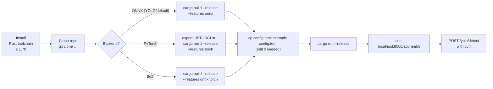
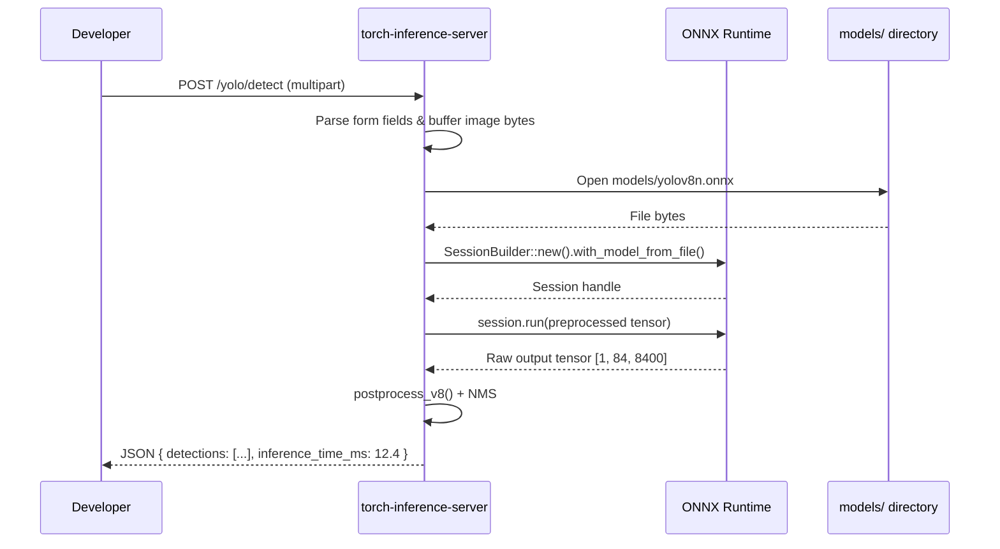

# Developer Quick Start

Build, run, and make your first inference in under 5 minutes.

---

## Setup Flow



---

## Prerequisites

| Requirement | Version | Notes |
|-------------|---------|-------|
| Rust toolchain | ≥ 1.70 (2021 edition) | `rustup update stable` |
| ONNX Runtime libs | bundled via `ort` crate | `--features onnx`; downloads automatically |
| LibTorch | 2.3.0+ | Only for `--features torch`; set `LIBTORCH` env var |
| CUDA toolkit | 11.8+ | Optional; required for GPU with PyTorch backend |
| CMake | ≥ 3.18 | Required when building `tch` feature |

---

## Build Commands

### Default (ONNX — recommended for YOLO)

```bash
cargo build --release --features onnx
```

The `ort` crate fetches ONNX Runtime shared libs at build time via `copy-dylibs`. No manual install needed.

### PyTorch backend

```bash
# Point to an existing LibTorch installation
export LIBTORCH=/usr/local/lib/python3.11/site-packages/torch
export LD_LIBRARY_PATH=$LIBTORCH/lib:$LD_LIBRARY_PATH

cargo build --release --features torch
```

Or let the build script auto-download LibTorch:

```bash
export LIBTORCH_LOCAL=1
cargo build --release --features torch
```

### GPU build (CUDA)

```bash
export CUDA_VISIBLE_DEVICES=0
cargo build --release --features onnx,torch
```

ONNX Runtime automatically uses CUDA EP when a compatible GPU is detected at runtime. No extra feature flag is needed.

### Candle backend (optional)

```bash
cargo build --release --features candle
```

---

## Minimal config.toml

```toml
[server]
host = "0.0.0.0"
port = 8000
log_level = "info"
workers = 4

[device]
device_type = "auto"   # auto | cuda | cpu | mps
use_fp16 = false

[performance]
enable_caching = true
cache_size_mb = 512
enable_request_batching = true
max_batch_size = 8
enable_tensor_pooling = true

[auth]
enabled = false        # set true + jwt_secret for production

[models]
auto_load = []
cache_dir = "models"
max_loaded_models = 3

[guard]
enable_guards = true
enable_circuit_breaker = true
max_memory_mb = 4096
max_requests_per_second = 200
```

---

## Run

```bash
# Development
RUST_LOG=debug cargo run --release --features onnx

# Production binary (after build)
./target/release/torch-inference-server
```

Expected startup output:

```
[INFO] Configuration loaded: config.toml
[INFO] Device: auto → cpu (no CUDA detected)
[INFO] Tensor pool initialised (max 500 tensors)
[INFO] Listening on http://0.0.0.0:8000
```

---

## First Requests

### Health check

```bash
curl http://localhost:8000/api/health
# {"status":"healthy","uptime":"3s","memory_used_mb":180}
```

### Auth token (if auth.enabled = true)

```bash
TOKEN=$(curl -s -X POST http://localhost:8000/api/auth/login \
  -H "Content-Type: application/json" \
  -d '{"username":"admin","password":"admin"}' \
  | jq -r .access_token)
```

### YOLO object detection

```bash
curl -s -X POST http://localhost:8000/yolo/detect \
  -F "model_version=v8" \
  -F "model_size=n" \
  -F "conf_threshold=0.25" \
  -F "iou_threshold=0.45" \
  -F "image=@/path/to/photo.jpg" \
  | jq .
```

> The ONNX model file must exist at `models/yolov8n.onnx`. Use `POST /yolo/download` to fetch it.

### Image classification

```bash
curl -s -X POST http://localhost:8000/api/classify/image \
  -H "Content-Type: application/json" \
  -d '{"image_path": "path/to/img.jpg"}' \
  | jq .
```

---

## First Inference Flow



---

## Run Tests

```bash
# Full test suite (147+ tests)
cargo test

# Integration tests only
cargo test --test integration_test

# Specific module
cargo test --lib core::yolo::tests

# With output
cargo test -- --nocapture

# Benchmarks
cargo bench
```

---

## Dev Utilities

```bash
# Auto-rebuild on file changes (requires cargo-watch)
cargo install cargo-watch
cargo watch -x "run --features onnx"

# Format
cargo fmt

# Lint
cargo clippy --features onnx -- -D warnings

# Check without linking
cargo check --features onnx
```

---

## Where to Go Next

| Topic | File |
|-------|------|
| Internal architecture | [`docs/ARCHITECTURE.md`](ARCHITECTURE.md) |
| All API endpoints | [`docs/API_REFERENCE.md`](API_REFERENCE.md) |
| Performance tuning (tensor pool, batching, cache) | [`docs/PERFORMANCE.md`](PERFORMANCE.md) |
| Auth configuration | [`docs/AUTHENTICATION.md`](AUTHENTICATION.md) |
| Contributing & module layout | [`CONTRIBUTING.md`](../CONTRIBUTING.md) |
| YOLO internals | [`docs/YOLO_SUPPORT.md`](YOLO_SUPPORT.md) |
| Audio (TTS/STT) | [`docs/AUDIO_ARCHITECTURE.md`](AUDIO_ARCHITECTURE.md) |
| Module-by-module breakdown | [`docs/modules/`](modules/) |
