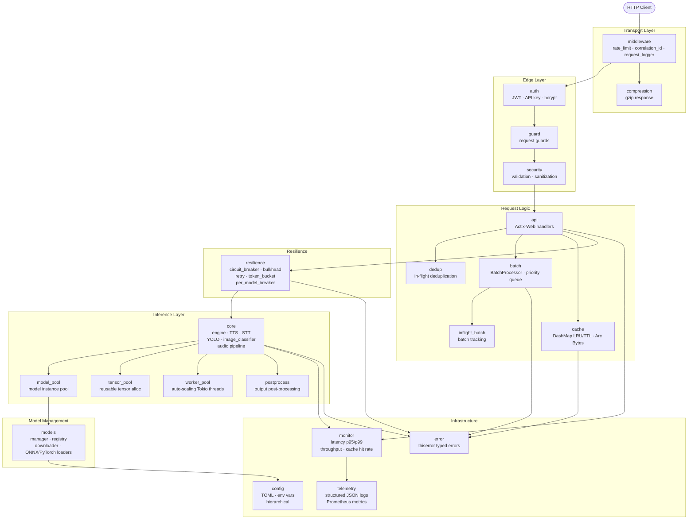
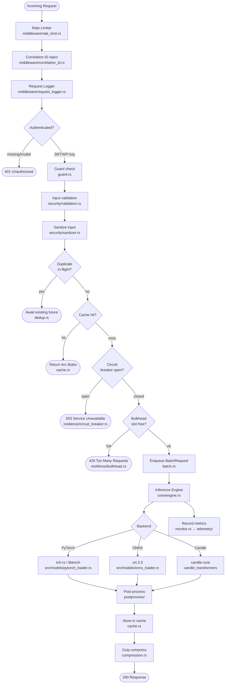

# torch-inference · Developer Reference

> High-performance ML inference server — Rust 2021 · Actix-Web 4.8 · Tokio 1.40 · tch-rs 0.16 (PyTorch) · ort 2.0 (ONNX) · Candle 0.8

→ [SUMMARY.md](SUMMARY.md) | [DOCUMENTATION_INDEX.md](DOCUMENTATION_INDEX.md) | [ARCHITECTURE.md](ARCHITECTURE.md) | [API_REFERENCE.md](API_REFERENCE.md) | [CONFIGURATION.md](CONFIGURATION.md) | [TESTING.md](TESTING.md) | [DEPLOYMENT.md](DEPLOYMENT.md)

---

## Module Dependency Graph



---

## Architecture at a Glance — Request Pipeline



---

## Source Module Index

| Module | Source path(s) | Responsibility |
|--------|----------------|----------------|
| `api` | `src/api/` | Actix-Web route handlers: predict, synthesize, transcribe, health, info, stats, models, image, yolo, classification, tts, llm, dashboard |
| `auth` | `src/auth/` | JWT issuance/validation (`jsonwebtoken`), API key hashing (`bcrypt`, `sha2`), bearer extraction |
| `batch` | `src/batch.rs` | `BatchProcessor` + `BatchRequest`, priority-ordered queue, dynamic batching with configurable window |
| `cache` | `src/cache.rs` | `DashMap`-backed LRU + TTL cache; zero-copy `BytesCacheEntry` wrapping `Arc<Bytes>` |
| `compression` | `src/compression.rs` | Gzip response middleware via `flate2` |
| `config` | `src/config.rs` | Hierarchical config: TOML file → env var overrides → defaults; typed structs with serde |
| `core` | `src/core/` | Inference engine, TTS engine/manager, STT (Whisper), YOLO, image classification, audio pipeline |
| `dedup` | `src/dedup.rs` | In-flight request deduplication using `DashMap<RequestKey, Shared<Future>>` |
| `error` | `src/error.rs` | `InferenceError` hierarchy via `thiserror`; maps to HTTP status codes |
| `guard` | `src/guard.rs` | Actix-Web request guards (model availability, content-type enforcement) |
| `inflight_batch` | `src/inflight_batch.rs` | Tracks active batch slots; used by `batch` and `resilience` for backpressure |
| `middleware` | `src/middleware/` | `rate_limit.rs`, `correlation_id.rs`, `request_logger.rs` — all Actix-Web middleware |
| `model_pool` | `src/model_pool.rs` | Pooled model instances (`parking_lot::Mutex`); round-robin dispatch for concurrent requests |
| `models` | `src/models/` | `ModelManager`, `ModelRegistry`, downloader, `onnx_loader.rs`, `pytorch_loader.rs` |
| `monitor` | `src/monitor.rs` | Rolling metrics: latency histograms (p95/p99), throughput counter, cache hit rate |
| `postprocess` | `src/postprocess/` | Backend-agnostic output post-processing (NMS for YOLO, softmax, token decode) |
| `resilience` | `src/resilience/` | `circuit_breaker.rs`, `bulkhead.rs`, `retry.rs` (exp backoff), `token_bucket.rs`, `per_model_breaker.rs` |
| `security` | `src/security/` | `validation.rs` (schema enforcement), `sanitizer.rs` (XSS/injection stripping) |
| `telemetry` | `src/telemetry/` | `tracing` subscriber (JSON fmt), Prometheus registry, optional OpenTelemetry OTLP export |
| `tensor_pool` | `src/tensor_pool.rs` | Reusable pre-allocated tensor pool; reduces allocator pressure under high concurrency |
| `worker_pool` | `src/worker_pool.rs` | Auto-scaling Tokio blocking thread pool; manages CPU-bound inference tasks |

---

## Quick Links

| Topic | File |
|-------|------|
| System architecture & data flow | [ARCHITECTURE.md](ARCHITECTURE.md) |
| All REST endpoints with curl examples | [API_REFERENCE.md](API_REFERENCE.md) |
| Config keys, env vars, TOML reference | [CONFIGURATION.md](CONFIGURATION.md) |
| Component internals & test coverage | [COMPONENTS.md](COMPONENTS.md) |
| Running tests, benchmarks, coverage | [TESTING.md](TESTING.md) |
| Docker, K8s, systemd deployment | [DEPLOYMENT.md](DEPLOYMENT.md) |
| Auth flows (JWT + API key) | [AUTHENTICATION.md](AUTHENTICATION.md) |
| Audio pipeline architecture | [AUDIO_ARCHITECTURE.md](AUDIO_ARCHITECTURE.md) |
| YOLO integration | [YOLO_SUPPORT.md](YOLO_SUPPORT.md) |
| models.json registry format | [models-json-guide.md](models-json-guide.md) |
| Troubleshooting & FAQ | [TROUBLESHOOTING.md](TROUBLESHOOTING.md) · [FAQ.md](FAQ.md) |
| All docs index | [DOCUMENTATION_INDEX.md](DOCUMENTATION_INDEX.md) |

---

## Build, Test & Lint

```bash
# --- Build ---
cargo build                                    # debug (no ML backends)
cargo build --release --features torch         # release + PyTorch (requires libtorch)
cargo build --release --features ort           # release + ONNX Runtime
cargo build --release --features candle        # release + Candle
cargo build --release --features torch,ort     # multi-backend

# --- Run ---
cargo run -- --config config.toml
RUST_LOG=debug cargo run -- --config config.toml

# --- Test ---
cargo test                                     # all unit tests
cargo test --test integration_tests            # integration suite
cargo test <module>::tests                     # single module, e.g. cache::tests
cargo test -- --nocapture                      # show println! output

# --- Benchmarks ---
cargo bench                                    # all criterion suites (benches/)
cargo bench --bench cache_bench                # single bench

# --- Lint & Format ---
cargo clippy -- -D warnings                    # fail on any lint warning
cargo fmt --check                              # CI-safe format check
cargo fmt                                      # apply formatting

# --- Docs ---
cargo doc --no-deps --open                     # open rustdoc in browser

# --- Coverage ---
cargo tarpaulin --out Html --output-dir target/coverage
```

---

## Tech Stack

| Crate | Version | Role |
|-------|---------|------|
| `actix-web` | 4.8 | HTTP server, routing, middleware |
| `tokio` | 1.40 | Async runtime (`rt-multi-thread`) |
| `tch` | 0.16 | LibTorch bindings (PyTorch 2.3+) |
| `ort` | 2.0.0-rc.10 | ONNX Runtime (dynamic load, CoreML) |
| `candle-core` | 0.8 | Pure-Rust ML tensor backend |
| `dashmap` | — | Lock-free concurrent `HashMap` |
| `parking_lot` | — | Fast `Mutex`/`RwLock` |
| `tracing` | 0.1 | Structured, async-aware logging |
| `tracing-subscriber` | 0.3 | JSON formatter + env-filter |
| `prometheus` | 0.13 | Metrics exposition (optional feature) |
| `jsonwebtoken` | 9.3 | JWT encode/decode (HS256/RS256) |
| `bcrypt` | 0.15 | API key hashing |
| `thiserror` | 1.0 | Typed error derivation |
| `serde` / `serde_json` | 1.0 | Serialization |
| `simd-json` | 0.13 | SIMD-accelerated JSON parsing |
| `ndarray` | 0.15 | N-dimensional array (ONNX tensors) |
| `image` | 0.24 | Image decode/encode/resize |
| `symphonia` | 0.5 | Audio decode (WAV, MP3, FLAC) |
