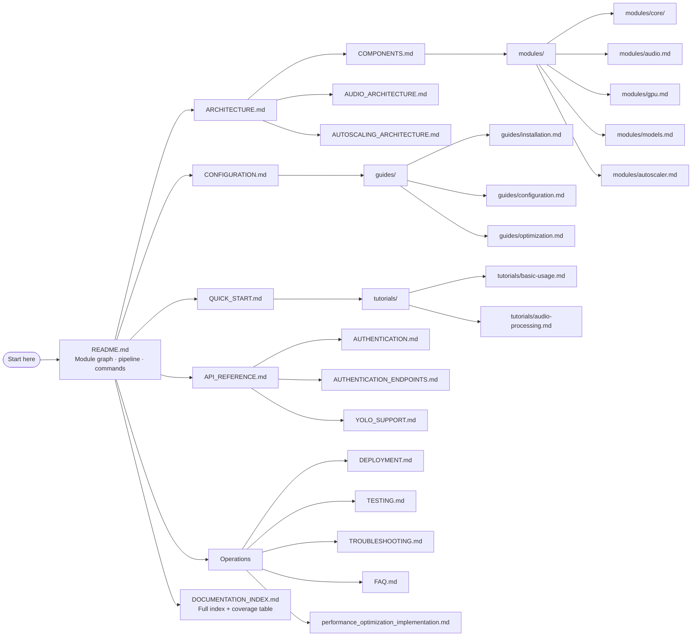

# torch-inference · Documentation Summary

> GitBook-style table of contents for the `torch-inference` Rust ML inference server.
> → [README.md](README.md) (developer portal) | [DOCUMENTATION_INDEX.md](DOCUMENTATION_INDEX.md) (full index)

---

## Navigation Graph

---

## Table of Contents

### Developer Portal

- [README.md](README.md) — Module dependency graph, full request pipeline flowchart, source module index, build/test/lint commands, tech stack table

### Architecture

- [ARCHITECTURE.md](ARCHITECTURE.md) — Layered system design, concurrency model, data flow, performance strategies
- [COMPONENTS.md](COMPONENTS.md) — Per-component internals: cache, batch, dedup, circuit breaker, bulkhead, model pool, tensor pool, monitor, worker pool
- [AUDIO_ARCHITECTURE.md](AUDIO_ARCHITECTURE.md) — End-to-end audio pipeline: decode → feature extraction → model inference → vocoder → output
- [AUTOSCALING_ARCHITECTURE.md](AUTOSCALING_ARCHITECTURE.md) — `worker_pool` autoscaling: load metrics, spawn/shrink policy, scaling thresholds

### API Reference

- [API_REFERENCE.md](API_REFERENCE.md) — All REST endpoints with schemas, curl examples, status codes, and error responses
- [AUTHENTICATION.md](AUTHENTICATION.md) — JWT issuance/refresh/validation, API key auth, `bcrypt` hashing, bearer extraction flow
- [AUTHENTICATION_ENDPOINTS.md](AUTHENTICATION_ENDPOINTS.md) — HTTP-level specs for `/auth/login`, `/auth/refresh`, `/auth/validate`
- [api/README.md](api/README.md) — API module overview
- [api/rest-api.md](api/rest-api.md) — REST conventions, shared patterns, versioning
- [api/endpoints/](api/endpoints/) — Per-endpoint deep-dive specs

### Configuration

- [CONFIGURATION.md](CONFIGURATION.md) — Every TOML key, env var override, typed struct mapping, config profiles (dev / prod / edge)
- [guides/configuration.md](guides/configuration.md) — Annotated config walkthroughs with inline commentary
- [guides/installation.md](guides/installation.md) — Full install: Rust toolchain, LibTorch, ONNX Runtime, feature flags
- [guides/optimization.md](guides/optimization.md) — Batch window tuning, tensor pool sizing, worker thread configuration, NUMA affinity
- [guides/quickstart.md](guides/quickstart.md) — Alternative quick-start narrative with step-by-step flow

### Module Deep-Dives

- [modules/README.md](modules/README.md) — Module directory overview
- [modules/core/base-model.md](modules/core/base-model.md) — `BaseModel` trait: required methods, lifecycle hooks, backend dispatch
- [modules/core/config.md](modules/core/config.md) — `CoreConfig` struct fields and defaults
- [modules/core/inference-engine.md](modules/core/inference-engine.md) — `InferenceEngine` internals: dispatch, backend selection, tensor lifecycle
- [modules/audio.md](modules/audio.md) — Audio model variants: Whisper, Kokoro, VITS, Bark, Piper, StyleTTS2
- [modules/autoscaler.md](modules/autoscaler.md) — `WorkerPool` autoscaler internals: metrics collection, spawn/shrink heuristics
- [modules/core.md](modules/core.md) — `core` module map and sub-module relationships
- [modules/gpu.md](modules/gpu.md) — GPU device selection, CUDA/Metal affinity, `core/gpu.rs` internals
- [modules/models.md](modules/models.md) — `ModelManager`, `ModelRegistry`, downloader, hot-reload protocol
- [YOLO_SUPPORT.md](YOLO_SUPPORT.md) — YOLO model integration, NMS post-processing, `/api/yolo` endpoint usage
- [models-json-guide.md](models-json-guide.md) — `models.json` / `model_registry.json` schema and field semantics

### Getting Started & Tutorials

- [QUICK_START.md](QUICK_START.md) — Build, configure, and call first inference endpoint in under 10 minutes
- [tutorials/basic-usage.md](tutorials/basic-usage.md) — End-to-end: load model → POST to API → parse JSON response
- [tutorials/audio-processing.md](tutorials/audio-processing.md) — Audio pipeline walkthrough: STT transcription, TTS synthesis, format handling

### Operations

- [DEPLOYMENT.md](DEPLOYMENT.md) — Docker Compose, Kubernetes manifests, systemd unit file, NGINX reverse proxy, horizontal scaling
- [TESTING.md](TESTING.md) — `cargo test`, integration suite, criterion benchmarks, tarpaulin coverage, CI/CD integration
- [TROUBLESHOOTING.md](TROUBLESHOOTING.md) — Symptom → cause → fix guide for common runtime errors and misconfigurations
- [FAQ.md](FAQ.md) — Frequently asked questions from contributors and users
- [performance_optimization_implementation.md](performance_optimization_implementation.md) — Implemented optimizations: SIMD JSON, tensor pool, batch tuning, NUMA affinity, measured gains
- [testing-improvements.md](testing-improvements.md) — Test coverage improvements, new test patterns, property-based test additions

### Engineering Specs (`superpowers/`)

- [superpowers/specs/](superpowers/specs/) — Design specifications (TTS fix, dashboard, registry expansion, throughput optimization, UI wiring)
- [superpowers/plans/](superpowers/plans/) — Engineering plans paired 1-to-1 with each spec

### Meta

- [DOCUMENTATION_INDEX.md](DOCUMENTATION_INDEX.md) — Full index with doc-tree graph, per-file table, and source module coverage matrix
- [SUMMARY.md](SUMMARY.md) — This file
