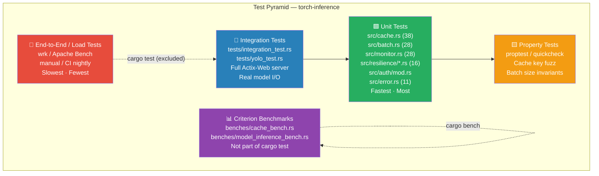
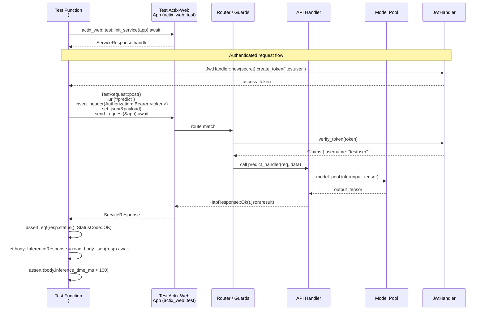

# Testing — Developer Guide

Comprehensive testing reference for `torch-inference` (Rust/Actix-Web ML inference server).  
Test runner: `cargo test` · Coverage: `cargo-tarpaulin` · Benchmarks: `criterion 0.5`

---

## Table of Contents

1. [Test Architecture](#test-architecture)
2. [Test Pyramid](#test-pyramid)
3. [Running Tests](#running-tests)
4. [Test Organization](#test-organization)
5. [Integration Test Request Flow](#integration-test-request-flow)
6. [Coverage Configuration](#coverage-configuration)
7. [Adding New Tests](#adding-new-tests)
8. [Benchmarks](#benchmarks)
9. [CI/CD Integration](#cicd-integration)

---

## Test Architecture

```mermaid
graph TD
    subgraph Sources["Test Sources"]
        Unit["Unit Tests<br/>(#[test] / #[tokio::test]<br/>inside src/ modules)"]
        Integ["Integration Tests<br/>(tests/*.rs<br/>black-box, full server)"]
        Bench["Benchmarks<br/>(benches/*.rs<br/>criterion harness)"]
        Prop["Property Tests<br/>(proptest / quickcheck<br/>fuzz-style)"]
    end

    subgraph Modules["Tested Modules"]
        Cache["src/cache.rs<br/>38 tests"]
        Batch["src/batch.rs<br/>28 tests"]
        Monitor["src/monitor.rs<br/>28 tests"]
        Dedup["src/dedup.rs<br/>9 tests"]
        Error["src/error.rs<br/>11 tests"]
        Config["src/config.rs<br/>7 tests"]
        CB["src/resilience/circuit_breaker.rs<br/>10 tests"]
        BH["src/resilience/bulkhead.rs<br/>6 tests"]
        Auth["src/auth/mod.rs<br/>JWT + UserStore"]
    end

    subgraph IntegTests["Integration Test Files"]
        IT["tests/integration_test.rs<br/>6 tests — end-to-end"]
        YT["tests/yolo_test.rs<br/>YOLO model inference"]
        BT["tests/benchmark_test.rs<br/>throughput benchmarks"]
    end

    Unit --> Cache
    Unit --> Batch
    Unit --> Monitor
    Unit --> Dedup
    Unit --> Error
    Unit --> Config
    Unit --> CB
    Unit --> BH
    Unit --> Auth
    Integ --> IT
    Integ --> YT
    Integ --> BT

    subgraph Coverage["Coverage"]
        Tarpaulin["cargo-tarpaulin<br/>lcov / HTML report"]
    end

    Unit --> Tarpaulin
    Integ --> Tarpaulin
    Bench --> Bench

    style Unit fill:#27ae60,color:#fff
    style Integ fill:#2980b9,color:#fff
    style Bench fill:#8e44ad,color:#fff
    style Prop fill:#f39c12,color:#fff
    style Tarpaulin fill:#e74c3c,color:#fff
```



---

## Test Pyramid



---

## Running Tests

### All tests

```bash
# Run all unit + integration tests
cargo test

# With stdout output (don't suppress println!/eprintln!)
cargo test -- --nocapture

# Single-threaded (useful for debugging flaky tests)
cargo test -- --test-threads=1

# Release mode — faster, but longer compile
cargo test --release

# With specific log level
RUST_LOG=debug cargo test -- --nocapture
```

### By module (unit tests)

```bash
# Cache system (38 tests)
cargo test cache::tests

# Batch processing (28 tests)
cargo test batch::tests

# Monitoring (28 tests)
cargo test monitor::tests

# Circuit breaker (10 tests)
cargo test circuit_breaker::tests

# Bulkhead (6 tests)
cargo test bulkhead::tests

# Deduplication (9 tests)
cargo test dedup::tests

# Error handling (11 tests)
cargo test error::tests

# Config (7 tests)
cargo test config::tests

# Auth (JWT + UserStore)
cargo test auth::tests
```

### Integration tests

```bash
# All integration tests
cargo test --test integration_test

# YOLO model tests (requires model file)
cargo test --test yolo_test

# Run a single integration test by name
cargo test --test integration_test test_end_to_end_inference -- --nocapture

# Run with backtrace on failure
RUST_BACKTRACE=1 cargo test --test integration_test
```

### Specific test by name

```bash
# Exact name match
cargo test jwt_verify_valid_token_returns_correct_username

# Substring match (runs all tests matching "circuit")
cargo test circuit
```

---

## Test Organization

```
torch-inference/
├── src/
│   ├── cache.rs              ← #[cfg(test)] mod tests { ... }
│   │                           38 tests: basic ops, TTL, concurrency, stats
│   ├── batch.rs              ← 28 tests: batching, adaptive timeout, priority
│   ├── monitor.rs            ← 28 tests: latency tracking, percentiles, concurrency
│   ├── dedup.rs              ← 9 tests: deduplication logic
│   ├── error.rs              ← 11 tests: error variants, Display, From impls
│   ├── config.rs             ← 7 tests: config parsing, defaults, validation
│   └── resilience/
│       ├── circuit_breaker.rs ← 10 tests: state machine (Closed/Open/HalfOpen)
│       └── bulkhead.rs        ← 6 tests: concurrency limit, semaphore
│   └── auth/
│       └── mod.rs             ← JwtHandler + UserStore tests
├── tests/
│   ├── integration_test.rs   ← 6 tests: full HTTP server round-trips
│   ├── benchmark_test.rs     ← throughput under load
│   └── yolo_test.rs          ← YOLO model inference (requires test model)
└── benches/
    ├── cache_bench.rs                   ← Criterion: cache set/get/evict
    ├── model_inference_bench.rs         ← Criterion: model inference latency
    └── model_inference_bench_optimized.rs
```

### Test naming conventions

Unit tests follow `snake_case` descriptive names:

```
<subject>_<condition>_<expected_outcome>

Examples:
  jwt_verify_valid_token_returns_correct_username
  jwt_verify_token_with_wrong_secret_returns_err
  user_store_verify_wrong_password_returns_false
  circuit_breaker_closed_to_open_on_threshold
  cache_get_expired_entry_returns_none
```

---

## Integration Test Request Flow



### Integration test helper pattern

```rust
// tests/integration_test.rs

use actix_web::{test, App};
use torch_inference::{create_app, AppState};

async fn build_test_app() -> impl actix_web::dev::Service<...> {
    let config = Config::default_test();
    let state = AppState::new(config).await.unwrap();
    test::init_service(
        App::new()
            .app_data(web::Data::new(state))
            .configure(torch_inference::configure_routes)
    ).await
}

#[tokio::test]
async fn test_health_returns_200() {
    let app = build_test_app().await;
    let req = test::TestRequest::get().uri("/health").to_request();
    let resp = test::call_service(&app, req).await;
    assert_eq!(resp.status(), 200);
}

#[tokio::test]
async fn test_predict_requires_auth() {
    let app = build_test_app().await;
    let req = test::TestRequest::post()
        .uri("/predict")
        .set_json(&serde_json::json!({"inputs": [1.0, 2.0]}))
        .to_request();
    let resp = test::call_service(&app, req).await;
    assert_eq!(resp.status(), 401);
}
```

---

## Coverage Configuration

### Install and run tarpaulin

```bash
# Install (once)
cargo install cargo-tarpaulin

# Run coverage and generate HTML report
cargo tarpaulin --out Html --output-dir ./coverage

# Open report
open ./coverage/tarpaulin-report.html  # macOS
xdg-open ./coverage/tarpaulin-report.html  # Linux

# Generate lcov format (for CI / external tools)
cargo tarpaulin --out Lcov --output-file lcov.info

# Exclude integration tests and benches from coverage (faster)
cargo tarpaulin --exclude-files "tests/*" "benches/*" --out Html

# With features (match your build target)
cargo tarpaulin --features "metrics" --out Html
```

### Coverage targets

| Layer              | Target Coverage | Current approach             |
|--------------------|-----------------|------------------------------|
| Core logic         | ≥ 90%           | Unit tests with edge cases   |
| Error handling     | ≥ 85%           | Explicit error path tests    |
| API handlers       | ≥ 75%           | Integration tests            |
| Resilience         | ≥ 90%           | State machine tests          |
| Auth               | ≥ 85%           | JWT + UserStore unit tests   |
| **Overall**        | **≥ 80%**       |                              |

### Tarpaulin in CI

```yaml
# .github/workflows/coverage.yml
- name: Generate coverage
  run: cargo tarpaulin --features "metrics" --out Lcov --output-file lcov.info

- name: Upload to Coveralls
  uses: coverallsapp/github-action@v2
  with:
    file: lcov.info
```

### Excluding files from coverage

Add the `#[cfg(tarpaulin)]` attribute or use `.tarpaulin.toml`:

```toml
# .tarpaulin.toml
exclude-files = [
  "src/bin/*",
  "src/main.rs",
  "benches/*",
  "tests/*",
]
```

> The `Cargo.toml` already has `[lints.rust] unexpected_cfgs = { level = "warn", check-cfg = ['cfg(tarpaulin)'] }` to suppress tarpaulin cfg warnings.

---

## Adding New Tests

### Unit test pattern (sync)

```rust
// src/my_module.rs

pub fn my_function(input: &str) -> Result<String, MyError> {
    // ...
}

#[cfg(test)]
mod tests {
    use super::*;

    #[test]
    fn my_function_with_valid_input_returns_ok() {
        let result = my_function("hello");
        assert!(result.is_ok());
        assert_eq!(result.unwrap(), "expected_output");
    }

    #[test]
    fn my_function_with_empty_input_returns_err() {
        let result = my_function("");
        assert!(result.is_err());
        // optionally match error variant:
        assert!(matches!(result.unwrap_err(), MyError::EmptyInput));
    }
}
```

### Async unit test pattern

```rust
#[tokio::test]
async fn async_operation_succeeds() {
    let result = some_async_fn().await;
    assert!(result.is_ok());
}

// Multi-thread runtime (for testing Tokio spawn behaviour)
#[tokio::test(flavor = "multi_thread", worker_threads = 4)]
async fn test_concurrent_workers() {
    let handles: Vec<_> = (0..10)
        .map(|_| tokio::spawn(async { some_async_fn().await }))
        .collect();
    let results = futures::future::join_all(handles).await;
    assert!(results.iter().all(|r| r.as_ref().unwrap().is_ok()));
}
```

### Property-based test pattern

```rust
use proptest::prelude::*;

proptest! {
    #[test]
    fn cache_set_get_roundtrip(key in "[a-zA-Z0-9_]{1,64}", value in any::<Vec<u8>>()) {
        let cache = Cache::new(1000);
        cache.set(&key, value.clone(), Duration::from_secs(60));
        let retrieved = cache.get(&key);
        prop_assert!(retrieved.is_some());
        prop_assert_eq!(retrieved.unwrap(), value);
    }
}
```

### Parameterized test pattern (rstest)

```rust
use rstest::rstest;

#[rstest]
#[case(0, Err(MyError::ZeroInput))]
#[case(1, Ok("one"))]
#[case(u32::MAX, Ok("max"))]
fn my_function_parameterized(#[case] input: u32, #[case] expected: Result<&str, MyError>) {
    assert_eq!(my_function(input), expected);
}
```

### Circuit breaker test pattern

```rust
use crate::resilience::circuit_breaker::{CircuitBreaker, CircuitBreakerConfig, CircuitState};

#[test]
fn circuit_breaker_opens_after_threshold_failures() {
    let cb = CircuitBreaker::new(CircuitBreakerConfig {
        failure_threshold: 3,
        success_threshold: 2,
        timeout: Duration::from_secs(30),
    });

    for _ in 0..3 {
        let _ = cb.call(|| Err("simulated failure".to_string()));
    }

    assert_eq!(*cb.state(), CircuitState::Open);
}

#[test]
fn circuit_breaker_transitions_half_open_after_timeout() {
    let cb = CircuitBreaker::new(CircuitBreakerConfig {
        failure_threshold: 1,
        success_threshold: 1,
        timeout: Duration::from_millis(10),  // short timeout for tests
    });
    let _ = cb.call(|| Err("fail".to_string()));
    std::thread::sleep(Duration::from_millis(20));

    // Next call should transition to HalfOpen
    let _ = cb.call(|| Ok(()));
    // Success → back to Closed
    assert_eq!(*cb.state(), CircuitState::Closed);
}
```

### Mock pattern (mockall)

```rust
use mockall::{automock, predicate::*};

#[automock]
trait ModelBackend {
    fn infer(&self, input: &[f32]) -> Result<Vec<f32>, String>;
}

#[test]
fn handler_returns_500_on_backend_error() {
    let mut mock = MockModelBackend::new();
    mock.expect_infer()
        .returning(|_| Err("GPU OOM".to_string()));

    let result = run_inference_handler(Box::new(mock), &[1.0, 2.0]);
    assert_eq!(result.status(), 500);
}
```

---

## Benchmarks

### Run benchmarks

```bash
# All benchmarks
cargo bench

# Specific suite
cargo bench --bench cache_bench
cargo bench --bench model_inference_bench

# Save baseline (for comparison)
cargo bench -- --save-baseline main

# Compare against saved baseline
cargo bench -- --baseline main

# Generate HTML reports (target/criterion/)
cargo bench
open target/criterion/report/index.html
```

### Writing a Criterion benchmark

```rust
// benches/my_bench.rs
use criterion::{black_box, criterion_group, criterion_main, Criterion};
use torch_inference::cache::Cache;
use std::time::Duration;

fn bench_cache_hot_get(c: &mut Criterion) {
    let cache = Cache::new(10_000);
    cache.set("hot_key", vec![0u8; 1024], Duration::from_secs(3600));

    c.bench_function("cache_hot_get", |b| {
        b.iter(|| {
            black_box(cache.get(black_box("hot_key")))
        });
    });
}

criterion_group!(benches, bench_cache_hot_get);
criterion_main!(benches);
```

---

## CI/CD Integration

```yaml
# .github/workflows/test.yml
name: Tests

on: [push, pull_request]

jobs:
  test:
    runs-on: ubuntu-latest
    steps:
      - uses: actions/checkout@v4

      - name: Install Rust stable
        uses: dtolnay/rust-toolchain@stable

      - name: Cache cargo
        uses: Swatinem/rust-cache@v2

      - name: Run unit + integration tests
        run: cargo test --features "metrics" -- --test-threads=4

      - name: Run benchmarks (compile-check only)
        run: cargo bench --no-run

      - name: Coverage
        run: |
          cargo install cargo-tarpaulin
          cargo tarpaulin --features "metrics" --out Lcov --output-file lcov.info

      - name: Upload coverage
        uses: coverallsapp/github-action@v2
        with:
          file: lcov.info
```

### Debug failing tests

```bash
# Verbose output for a single test
RUST_BACKTRACE=full RUST_LOG=debug cargo test test_name -- --nocapture

# Run a test multiple times to detect flakiness
for i in {1..20}; do cargo test test_name -- --test-threads=1 || break; done

# Check for data races (requires nightly)
RUSTFLAGS="-Z sanitizer=thread" cargo +nightly test --target x86_64-unknown-linux-gnu
```

---

**See also**: [`CONTRIBUTING.md`](CONTRIBUTING.md) · [`CONFIGURATION.md`](CONFIGURATION.md) · `src/resilience/circuit_breaker.rs`
