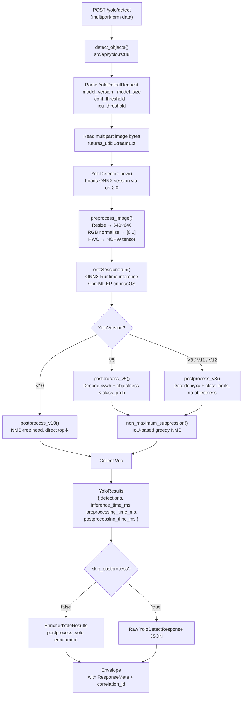
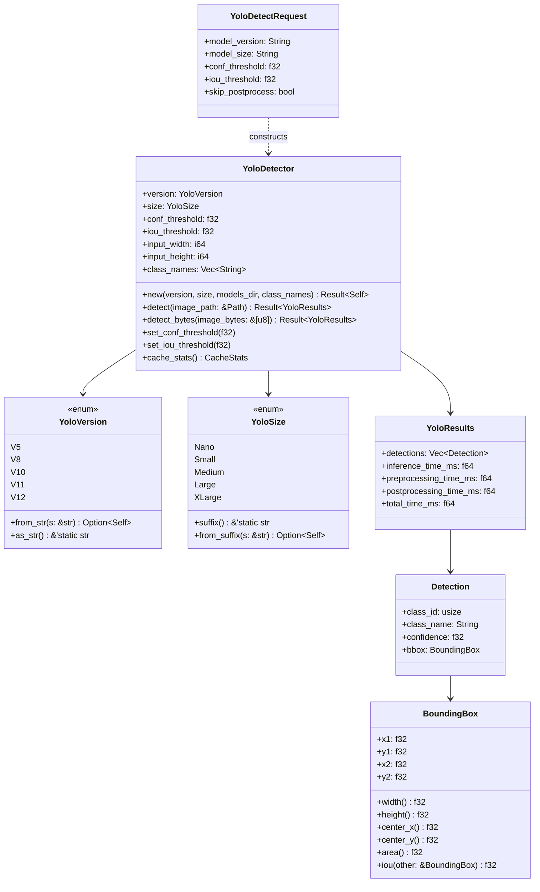
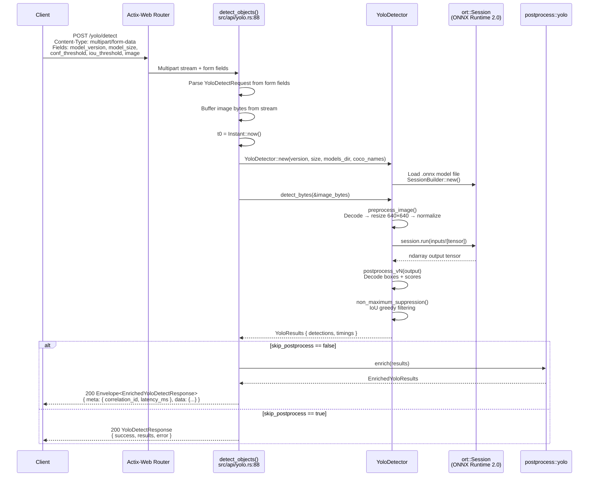
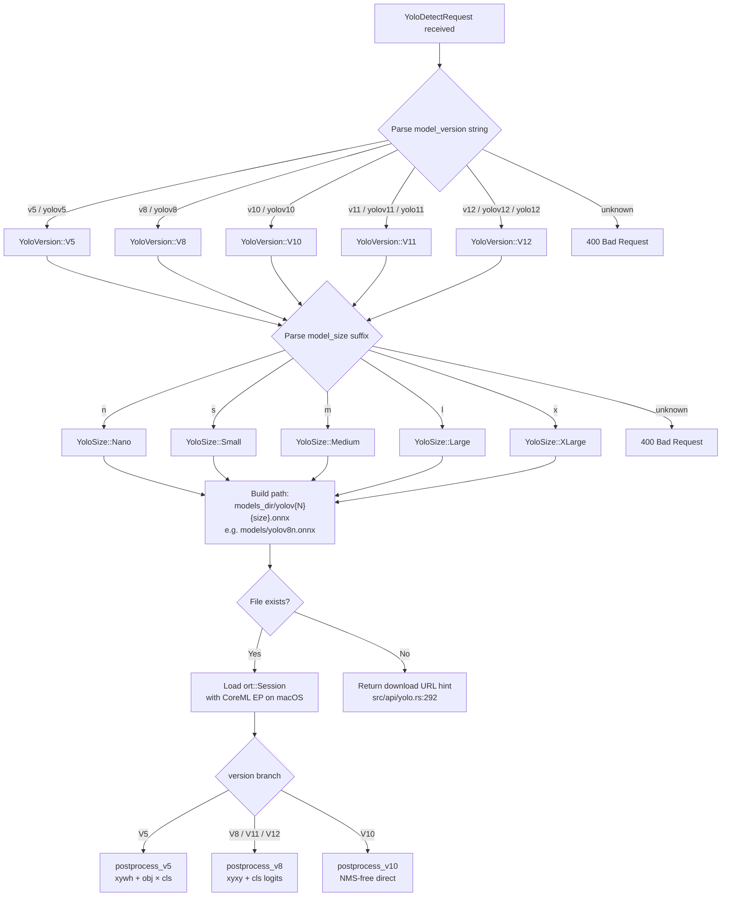

# YOLO Subsystem — Developer Reference

Internal architecture reference for `torch-inference`'s YOLO object detection subsystem.  
Source: [`src/core/yolo.rs`](../src/core/yolo.rs) · [`src/api/yolo.rs`](../src/api/yolo.rs)

---

## Table of Contents

1. [Pipeline Architecture](#pipeline-architecture)
2. [Type System](#type-system)
3. [Request Flow](#request-flow)
4. [Model Selection Logic](#model-selection-logic)
5. [Supported Models](#supported-models)
6. [NMS Configuration](#nms-configuration)
7. [Adding a New YOLO Variant](#adding-a-new-yolo-variant)
8. [Source File Reference](#source-file-reference)

---

## Pipeline Architecture

Full inference pipeline from HTTP boundary to structured result.



---

## Type System

Core structs shared between `src/core/yolo.rs` and `src/api/yolo.rs`.



---

## Request Flow

Sequence from client to response, including multipart parsing and timing instrumentation.



---

## Model Selection Logic

How `YoloDetector::new()` resolves the ONNX file path from version + size inputs.



---

## Supported Models

Models pre-configured in `models.json`. ONNX exports from Ultralytics.

| Model      | Version  | Size   | File (ONNX)       | mAP@0.5 (COCO) | Params  |
|------------|----------|--------|-------------------|----------------|---------|
| `yolov5n`  | YOLOv5   | Nano   | `yolov5n.onnx`    | 28.0%          | 1.9 M   |
| `yolov5s`  | YOLOv5   | Small  | `yolov5s.onnx`    | 36.7%          | 7.2 M   |
| `yolov8n`  | YOLOv8   | Nano   | `yolov8n.onnx`    | 37.5%          | 3.2 M   |
| `yolov8s`  | YOLOv8   | Small  | `yolov8s.onnx`    | 44.5%          | 11.2 M  |
| `yolov8m`  | YOLOv8   | Medium | `yolov8m.onnx`    | 50.2%          | 25.9 M  |
| `yolov8l`  | YOLOv8   | Large  | `yolov8l.onnx`    | 52.9%          | 43.7 M  |
| `yolov10n` | YOLOv10  | Nano   | `yolov10n.onnx`   | 38.5%          | 2.3 M   |
| `yolov10s` | YOLOv10  | Small  | `yolov10s.onnx`   | 46.3%          | 7.2 M   |
| `yolo11n`  | YOLO11   | Nano   | `yolo11n.onnx`    | 39.5%          | 2.6 M   |
| `yolo11s`  | YOLO11   | Small  | `yolo11s.onnx`    | 47.0%          | 9.4 M   |

**Download URLs** (resolved at runtime in `src/api/yolo.rs:306`):

```
YOLOv5 : https://github.com/ultralytics/yolov5/releases/download/v7.0/yolov5{size}.pt
YOLOv8 : https://github.com/ultralytics/assets/releases/download/v8.3.0/yolov8{size}.pt
YOLOv10: https://github.com/THU-MIG/yolov10/releases/download/v1.1/yolov10{size}.pt
YOLO11 : https://github.com/ultralytics/assets/releases/download/v8.3.0/yolo11{size}.pt
YOLO12 : https://github.com/ultralytics/assets/releases/download/v8.3.0/yolo12{size}.pt
```

> **Note:** Convert to ONNX with `yolo export model=yolov8n.pt format=onnx imgsz=640` before deploying.

---

## NMS Configuration

`non_maximum_suppression()` is implemented in `src/core/yolo.rs:496`. It uses IoU-based greedy filtering (not soft-NMS).

| Parameter         | Field in request     | Default | Range    | Effect                                             |
|-------------------|----------------------|---------|----------|----------------------------------------------------|
| `conf_threshold`  | `conf_threshold`     | `0.25`  | 0.0–1.0  | Boxes below this confidence are discarded pre-NMS  |
| `iou_threshold`   | `iou_threshold`      | `0.45`  | 0.0–1.0  | Overlap threshold; higher = more boxes kept        |
| Input size        | (internal)           | 640×640 | —        | Set via `set_input_size(w, h)` before `detect()`   |

**NMS algorithm** (greedy, class-agnostic):

```
1. Filter detections by conf_threshold
2. Sort remaining by confidence descending
3. For each surviving box:
   - Suppress all lower-confidence boxes where IoU > iou_threshold
4. Return survivors as Vec<Detection>
```

`BoundingBox::iou()` at `src/core/yolo.rs:130` computes intersection-over-union; touching edges return `0.0`.

---

## Adding a New YOLO Variant

### Step 1 — Add the enum variant (`src/core/yolo.rs`)

```rust
pub enum YoloVersion {
    V5, V8, V10, V11, V12,
    V13, // ← new variant
}

impl YoloVersion {
    pub fn from_str(s: &str) -> Option<Self> {
        match s.to_lowercase().as_str() {
            // existing arms …
            "v13" | "yolov13" | "yolo13" => Some(Self::V13),
            _ => None,
        }
    }
    pub fn as_str(&self) -> &'static str {
        match self {
            // existing arms …
            Self::V13 => "YOLOv13",
        }
    }
}
```

### Step 2 — Implement a postprocessor (`src/core/yolo.rs`)

Add a method on `YoloDetector`:

```rust
fn postprocess_v13(&self, output: Tensor, detections: &mut Vec<Detection>) -> Result<()> {
    // Inspect the ONNX output shape with: output.size()
    // Typical v8-compatible head: [batch, num_classes+4, num_anchors]
    // Reuse postprocess_v8 if the output format matches.
    self.postprocess_v8(output, detections)
}
```

Wire it into `postprocess()`:

```rust
fn postprocess(&self, output: Tensor) -> Result<Vec<Detection>> {
    let mut detections = Vec::new();
    match self.version {
        // existing arms …
        YoloVersion::V13 => self.postprocess_v13(output, &mut detections)?,
    }
    Ok(self.non_maximum_suppression(detections))
}
```

### Step 3 — Add download URL (`src/api/yolo.rs:306`)

```rust
YoloVersion::V13 => format!(
    "https://github.com/ultralytics/assets/releases/download/v9.0.0/yolov13{}.pt",
    size.suffix()
),
```

### Step 4 — Update `models.json` and `model_registry.json`

Add entries with `"type": "object-detection"` and the ONNX file path.

### Step 5 — Tests

Add unit tests in `src/core/yolo.rs` (see `test_yolo_version_parsing` at line 654 as a template) and integration tests in `tests/integration_test.rs`.

---

## Source File Reference

| File | Purpose |
|------|---------|
| `src/core/yolo.rs` | `YoloDetector`, `YoloVersion`, `YoloSize`, `Detection`, `BoundingBox`, `YoloResults`, NMS, preprocessing |
| `src/api/yolo.rs` | HTTP handlers: `detect_objects`, `get_model_info`, `list_models`, `download_model`; route config via `configure()` |
| `src/postprocess/yolo.rs` | `EnrichedYoloResults` — downstream enrichment applied when `skip_postprocess = false` |
| `src/postprocess/envelope.rs` | `Envelope<T>` + `ResponseMeta` wrapper applied to all enriched responses |
| `src/middleware/correlation_id.rs` | `get_correlation_id()` injected into response metadata |
| `models.json` | Static model registry with download URLs and metadata |
| `model_registry.json` | Runtime registry; loaded by the model management API |

**Routes** (registered by `src/api/yolo.rs:configure()`):

```
POST /yolo/detect    → detect_objects()
GET  /yolo/info      → get_model_info()
GET  /yolo/models    → list_models()
POST /yolo/download  → download_model()
```
