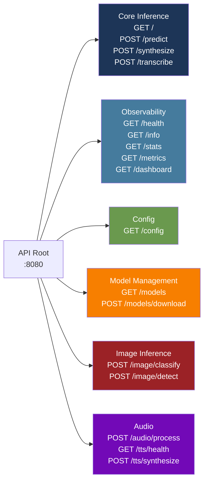
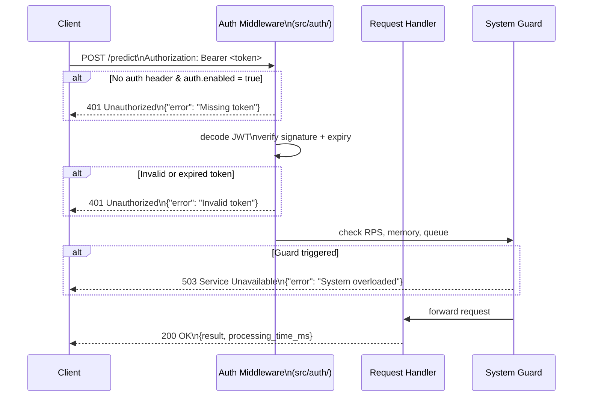
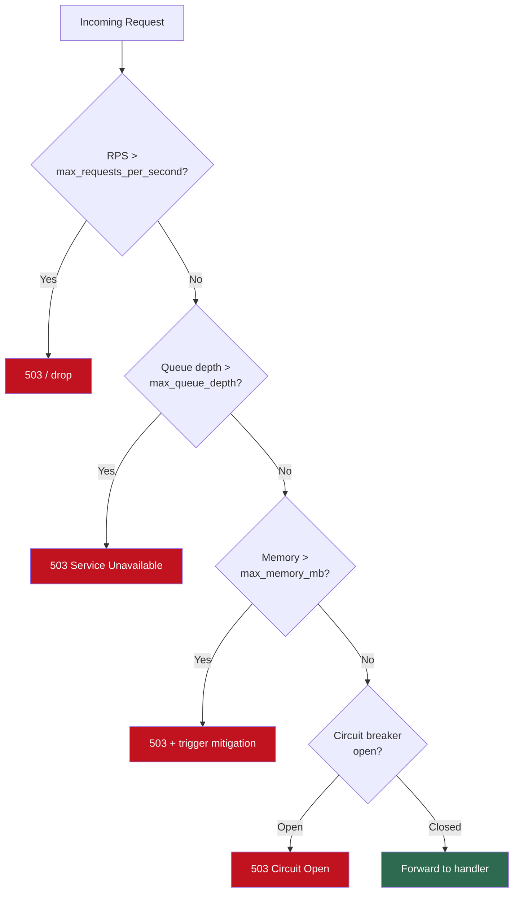

# API Developer Reference

`torch-inference` exposes a REST API via Actix-Web 4 on port **8080** (default). This document covers endpoint categories, authentication patterns, request/response format, and error handling.

## Endpoint Categories



## Base URL

```
http://localhost:8080
```

All endpoints return `Content-Type: application/json` unless noted otherwise (audio endpoints return binary or base64-encoded data).

## Authentication

Authentication is opt-in via `auth.enabled = true` in `config.toml`. When enabled, the server uses **JWT (HS256)** signed with `auth.jwt_secret`.

### Authenticated Request Flow



### JWT Authentication

Obtain a token via your auth integration (token creation is in `src/auth/mod.rs`):

```bash
# With a running server and auth enabled, obtain a token
# (your auth endpoint may vary; check src/api/handlers.rs)
TOKEN=$(curl -s -X POST http://localhost:8080/auth/login \
  -H "Content-Type: application/json" \
  -d '{"username":"admin","password":"secret"}' | jq -r '.access_token')

# Use in subsequent requests
curl -s http://localhost:8080/predict \
  -H "Authorization: Bearer $TOKEN" \
  -H "Content-Type: application/json" \
  -d '{"model_name":"example","inputs":[1,2,3]}'
```

JWT payload structure (`src/auth/mod.rs`):

```json
{
  "sub": "admin",
  "username": "admin",
  "iat": 1718000000,
  "exp": 1718003600
}
```

Token expiry defaults: `access_token_expire_minutes = 60`, `refresh_token_expire_days = 7`.

### API Key (Alternative)

If you prefer a static key, pass it as a header:

```bash
curl -s http://localhost:8080/predict \
  -H "X-API-Key: your-api-key" \
  -H "Content-Type: application/json" \
  -d '{"model_name":"example","inputs":[1,2,3]}'
```

## Request / Response Format

### Standard Request Shape

```json
{
  "model_name": "string",      // required for inference endpoints
  "inputs": "any",             // model-specific: array, string, or base64
  "options": {}                // optional: per-request overrides
}
```

### Standard Success Response

```json
{
  "success": true,
  "result": "any",
  "model_name": "string",
  "processing_time_ms": 12.4,
  "cached": false
}
```

### Standard Error Response

```json
{
  "error": "human-readable description",
  "code": "MACHINE_READABLE_CODE",
  "status": 400
}
```

## Error Code Reference

| HTTP Status | Code | Meaning |
|------------|------|---------|
| 400 | `BAD_REQUEST` | Malformed JSON, missing required field |
| 401 | `UNAUTHORIZED` | Missing or invalid JWT / API key |
| 404 | `MODEL_NOT_FOUND` | Named model not loaded |
| 422 | `VALIDATION_ERROR` | Input passes JSON parse but fails domain validation |
| 429 | `RATE_LIMITED` | Guard `max_requests_per_second` exceeded |
| 500 | `INFERENCE_ERROR` | Backend forward pass failed |
| 503 | `SERVICE_UNAVAILABLE` | Circuit breaker open, OOM guard triggered, or queue full |

## Rate Limiting

Rate limiting is enforced by the **System Guard** (`src/guard.rs`), not at the HTTP layer. It operates at three levels:



Configure limits in `config.toml`:

```toml
[guard]
max_requests_per_second = 1000
max_queue_depth         = 500
max_memory_mb           = 8192
max_error_rate          = 5.0   # % — opens circuit breaker
```

## Content Types

| Endpoint | Request type | Response type |
|----------|-------------|--------------|
| `/predict`, `/info`, `/health`, … | `application/json` | `application/json` |
| `/image/classify`, `/image/detect` | `multipart/form-data` or `application/json` (base64) | `application/json` |
| `/audio/process`, `/transcribe` | `multipart/form-data` | `application/json` |
| `/tts/synthesize`, `/synthesize` | `application/json` | `application/json` (base64 audio) |
| `/metrics` | — | `text/plain` (Prometheus format) |
| `/dashboard` | — | `text/html` |

## Versioning

The API is currently unversioned (`/predict` not `/v1/predict`). Breaking changes will be introduced with a major version bump and a versioned path prefix.

## See Also

- [REST API Reference](rest-api.md) — full endpoint docs with schemas and cURL examples
- [Configuration Reference](../guides/configuration.md) — auth and guard config
- [Quickstart](../guides/quickstart.md) — first request in 10 minutes
