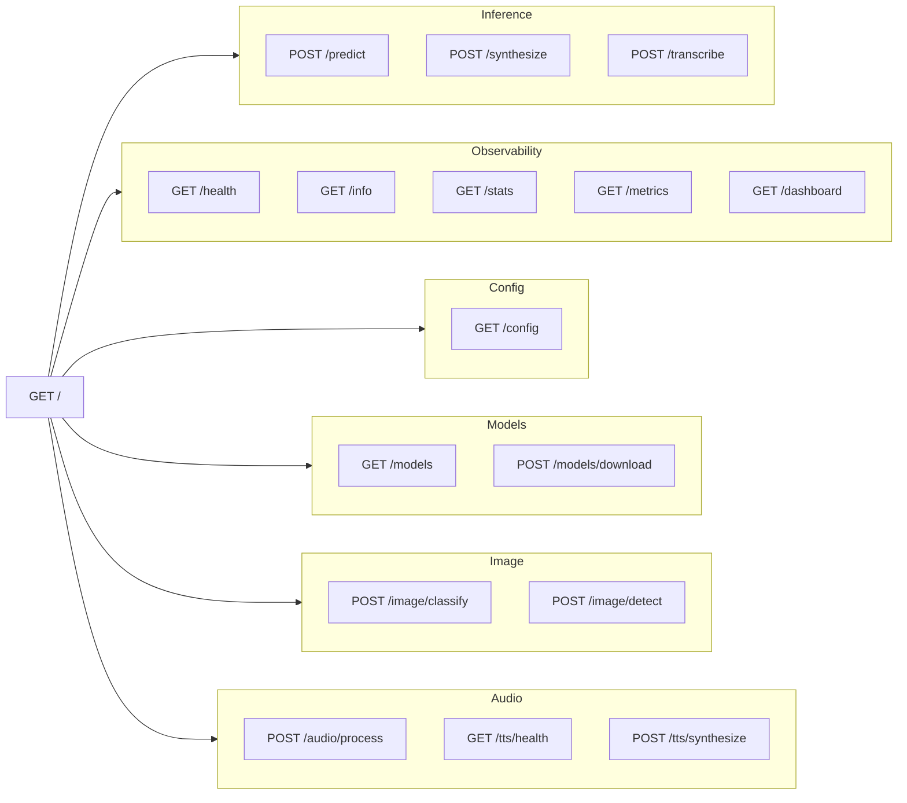
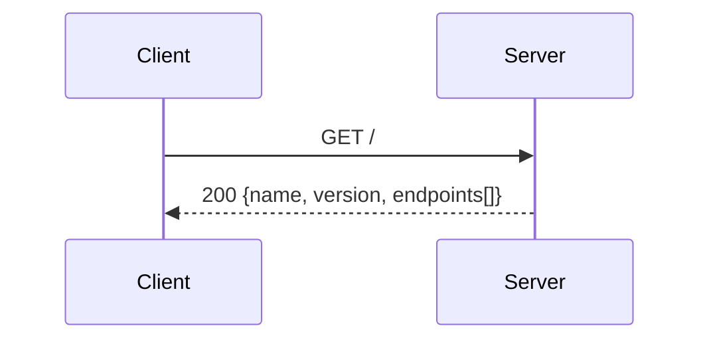
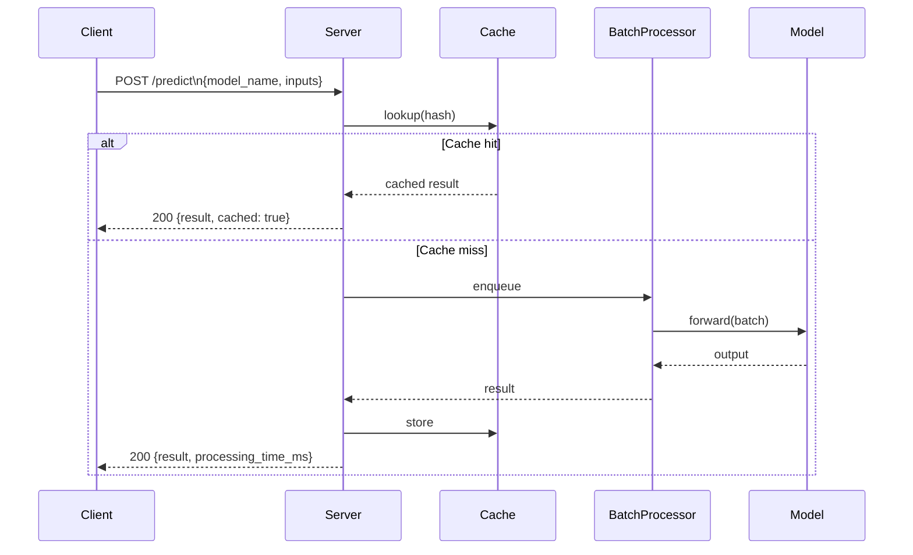
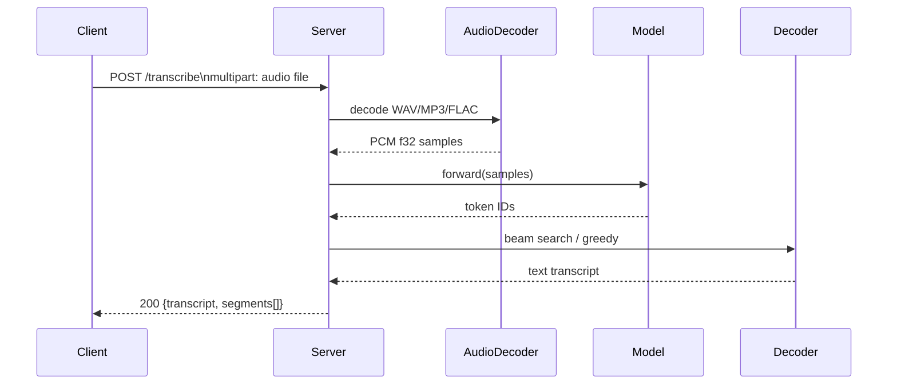
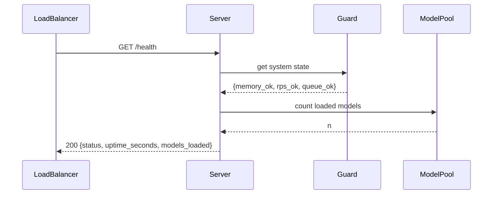
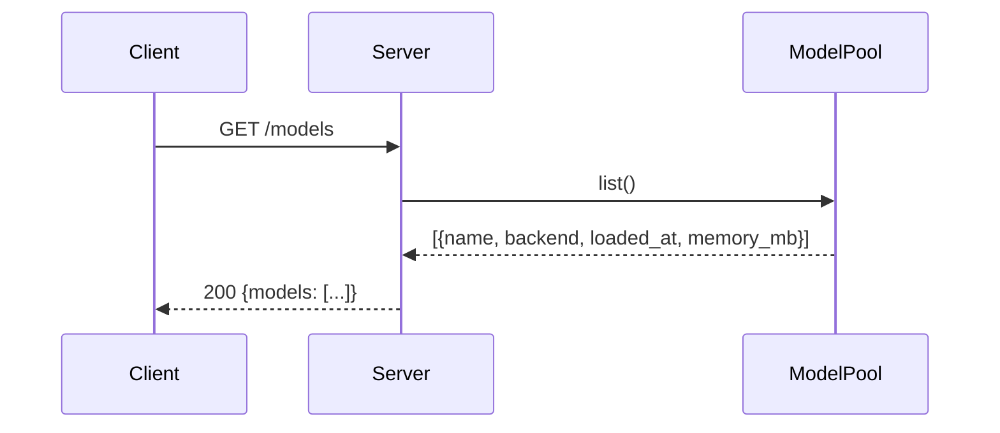
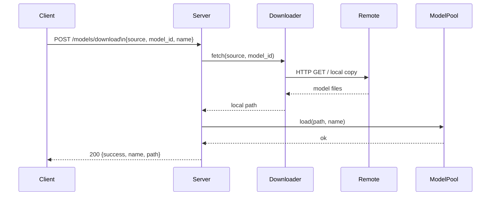
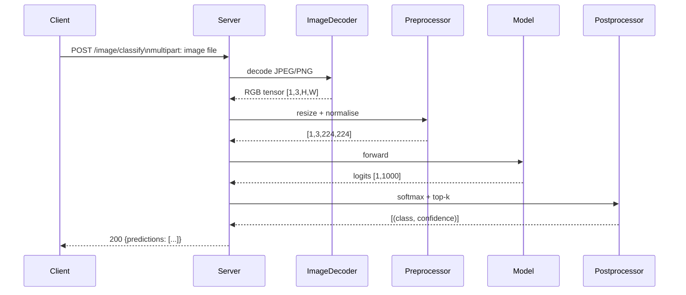
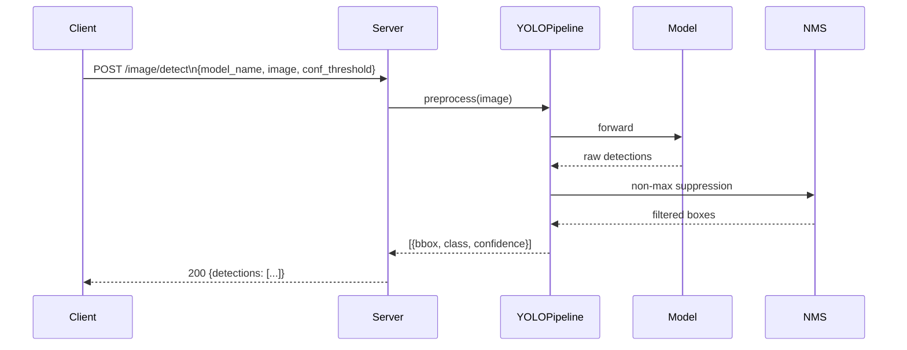
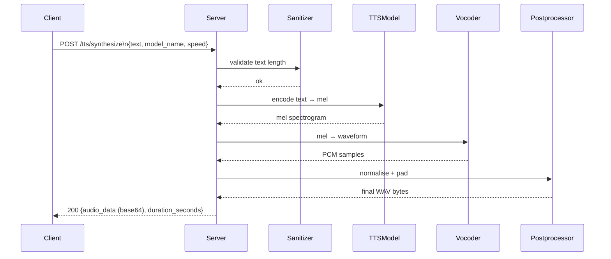

# REST API Reference

Complete endpoint documentation for `torch-inference`. Every endpoint includes request/response schema and a cURL example.

## Endpoint Map



**Base URL:** `http://localhost:8080`

---

## Core Endpoints

### `GET /`

Returns API metadata.



**Response:**

```json
{
  "name": "torch-inference",
  "version": "1.0.0",
  "status": "running",
  "endpoints": ["/predict", "/health", "/info", "/stats", "/models", "..."]
}
```

```bash
curl -s http://localhost:8080/ | jq .
```

---

### `POST /predict`

Unified inference endpoint. Routes to the appropriate backend based on `model_name`.



**Request:**

```json
{
  "model_name": "string",
  "inputs": "<any>",
  "options": {
    "batch_size": 1,
    "use_fp16": false
  }
}
```

| Field | Type | Required | Description |
|-------|------|----------|-------------|
| `model_name` | string | ✅ | Name of a loaded model |
| `inputs` | any | ✅ | Flat array, nested array, or string — model-specific |
| `options` | object | ❌ | Per-request overrides |

**Response:**

```json
{
  "success": true,
  "model_name": "resnet18",
  "result": {
    "class_id": 207,
    "class_name": "golden retriever",
    "confidence": 0.9412
  },
  "processing_time_ms": 8.3,
  "cached": false
}
```

**cURL:**

```bash
curl -s -X POST http://localhost:8080/predict \
  -H "Content-Type: application/json" \
  -d '{
    "model_name": "resnet18",
    "inputs": [[[0.1, 0.2, 0.3]]]
  }' | jq .
```

**Errors:**

| Status | Condition |
|--------|-----------|
| 404 | `model_name` not loaded |
| 422 | `inputs` shape mismatch for model |
| 503 | Guard triggered (memory / RPS) |

---

### `POST /synthesize`

Text-to-Speech synthesis. Equivalent to `/tts/synthesize` but at the root path.

**Request:**

```json
{
  "model_name": "speecht5_tts",
  "inputs": "Hello from torch-inference.",
  "options": {
    "speed": 1.0,
    "language": "en"
  }
}
```

**Response:**

```json
{
  "success": true,
  "audio_data": "<base64-encoded WAV>",
  "sample_rate": 16000,
  "duration_seconds": 1.4,
  "processing_time_ms": 120.5
}
```

```bash
curl -s -X POST http://localhost:8080/synthesize \
  -H "Content-Type: application/json" \
  -d '{"model_name":"speecht5_tts","inputs":"Hello world"}' \
  | jq -r '.audio_data' | base64 -d > output.wav
```

---

### `POST /transcribe`

Speech-to-Text (STT). Accepts a multipart upload or base64-encoded audio.



**Request (multipart):**

```bash
curl -s -X POST http://localhost:8080/transcribe \
  -F "audio=@speech.wav" \
  -F "model_name=whisper-base" \
  -F "language=en" | jq .
```

**Response:**

```json
{
  "success": true,
  "transcript": "Hello from torch-inference.",
  "language": "en",
  "segments": [
    {"start": 0.0, "end": 1.6, "text": "Hello from torch-inference."}
  ],
  "processing_time_ms": 340.2
}
```

---

## Observability Endpoints

### `GET /health`

Liveness + readiness check. Use this for load-balancer health probes.



**Response (healthy):**

```json
{
  "status": "healthy",
  "version": "1.0.0",
  "uptime_seconds": 3600,
  "device": "cuda:0",
  "models_loaded": 2,
  "memory_used_mb": 1024,
  "guard": {
    "circuit_breaker": "closed",
    "queue_depth": 3
  }
}
```

**Response (degraded / 503):**

```json
{
  "status": "degraded",
  "reason": "circuit_breaker_open",
  "error_rate_percent": 8.3
}
```

```bash
curl -sf http://localhost:8080/health && echo "OK" || echo "FAIL"
```

---

### `GET /info`

Detailed system information: hardware, runtime, build features.

**Response:**

```json
{
  "server": {
    "version": "1.0.0",
    "edition": "2021",
    "features": ["onnx", "prometheus"]
  },
  "hardware": {
    "device": "cpu",
    "num_cpus": 8,
    "total_memory_mb": 16384,
    "available_memory_mb": 12000
  },
  "runtime": {
    "workers": 4,
    "uptime_seconds": 1200,
    "requests_total": 45023
  }
}
```

```bash
curl -s http://localhost:8080/info | jq .hardware
```

---

### `GET /stats`

Performance statistics: cache, batch processor, tensor pool, worker pool.

**Response:**

```json
{
  "cache": {
    "hit_rate_percent": 84.2,
    "entries": 12450,
    "size_mb": 1024,
    "evictions_total": 340
  },
  "batch": {
    "avg_batch_size": 6.2,
    "batches_processed": 7830,
    "avg_wait_ms": 18.4
  },
  "tensor_pool": {
    "pool_size": 500,
    "reuse_rate_percent": 96.1,
    "allocations_saved": 42000
  },
  "workers": {
    "active": 3,
    "idle": 5,
    "max": 16
  }
}
```

```bash
curl -s http://localhost:8080/stats | jq .cache
```

---

### `GET /metrics`

Prometheus-format metrics. Requires `--features prometheus` at build time.

```bash
curl -s http://localhost:8080/metrics | grep torch_inference
# torch_inference_requests_total{endpoint="/predict",status="200"} 45023
# torch_inference_latency_ms_bucket{le="10"} 38000
# torch_inference_cache_hit_rate 0.842
```

---

### `GET /dashboard`

Serves the built-in HTML performance dashboard (`src/api/playground.html`).

```bash
open http://localhost:8080/dashboard
```

---

## Config Endpoint

### `GET /config`

Returns the active (sanitised) configuration. Secrets such as `jwt_secret` are redacted.

**Response:**

```json
{
  "server": {"host": "0.0.0.0", "port": 8080, "workers": 4},
  "device": {"device_type": "auto", "use_fp16": false},
  "batch": {"max_batch_size": 32, "enable_dynamic_batching": true},
  "performance": {"cache_size_mb": 2048, "enable_tensor_pooling": true},
  "auth": {"enabled": false, "jwt_algorithm": "HS256"},
  "models": {"max_loaded_models": 5, "cache_dir": "models"}
}
```

```bash
curl -s http://localhost:8080/config | jq .device
```

---

## Model Management

### `GET /models`

List all currently loaded models.



**Response:**

```json
{
  "models": [
    {
      "name": "resnet18",
      "backend": "onnx",
      "task": "classification",
      "loaded_at": "2024-01-15T10:00:00Z",
      "memory_mb": 46,
      "inference_count": 1234
    }
  ],
  "count": 1,
  "max_loaded": 5
}
```

```bash
curl -s http://localhost:8080/models | jq '.models[].name'
```

---

### `POST /models/download`

Download and register a model from a remote or local source.



**Request:**

```json
{
  "source": "huggingface",
  "model_id": "microsoft/resnet-18",
  "name": "resnet18",
  "task": "image-classification",
  "format": "onnx"
}
```

| Field | Type | Required | Values |
|-------|------|----------|--------|
| `source` | string | ✅ | `huggingface`, `local`, `url` |
| `model_id` | string | ✅ | HF repo ID, local path, or URL |
| `name` | string | ✅ | Alias used in `/predict` calls |
| `task` | string | ❌ | `classification`, `detection`, `tts`, `stt`, … |
| `format` | string | ❌ | `onnx`, `torchscript`, `safetensors` |

**Response:**

```json
{
  "success": true,
  "name": "resnet18",
  "path": "models/resnet18",
  "size_mb": 46,
  "download_time_ms": 4200
}
```

```bash
curl -s -X POST http://localhost:8080/models/download \
  -H "Content-Type: application/json" \
  -d '{
    "source": "huggingface",
    "model_id": "microsoft/resnet-18",
    "name": "resnet18",
    "task": "image-classification"
  }' | jq .
```

---

## Image Endpoints

### `POST /image/classify`

Image classification. Accepts multipart upload or base64 JSON.



**Request (multipart):**

```bash
curl -s -X POST http://localhost:8080/image/classify \
  -F "image=@cat.jpg" \
  -F "model_name=resnet18" \
  -F "top_k=5" | jq .
```

**Request (JSON / base64):**

```bash
IMAGE_B64=$(base64 -i cat.jpg)
curl -s -X POST http://localhost:8080/image/classify \
  -H "Content-Type: application/json" \
  -d "{\"model_name\":\"resnet18\",\"image\":\"${IMAGE_B64}\",\"top_k\":5}" | jq .
```

**Response:**

```json
{
  "success": true,
  "model_name": "resnet18",
  "predictions": [
    {"class_id": 281, "class_name": "tabby cat", "confidence": 0.9231},
    {"class_id": 282, "class_name": "tiger cat", "confidence": 0.0524}
  ],
  "processing_time_ms": 9.1
}
```

---

### `POST /image/detect`

Object detection — YOLO backend. Returns bounding boxes.



**Request:**

```bash
curl -s -X POST http://localhost:8080/image/detect \
  -F "image=@street.jpg" \
  -F "model_name=yolov8n" \
  -F "conf_threshold=0.5" \
  -F "iou_threshold=0.45" | jq .
```

**Response:**

```json
{
  "success": true,
  "model_name": "yolov8n",
  "detections": [
    {
      "class_id": 0,
      "class_name": "person",
      "confidence": 0.912,
      "bbox": {"x1": 120, "y1": 80, "x2": 300, "y2": 480}
    },
    {
      "class_id": 2,
      "class_name": "car",
      "confidence": 0.876,
      "bbox": {"x1": 400, "y1": 200, "x2": 700, "y2": 400}
    }
  ],
  "processing_time_ms": 14.2
}
```

---

## Audio Endpoints

### `POST /audio/process`

General-purpose audio processing (normalisation, resampling, format conversion).

**Request:**

```bash
curl -s -X POST http://localhost:8080/audio/process \
  -F "audio=@input.wav" \
  -F "target_sample_rate=16000" \
  -F "normalize=true" | jq .
```

**Response:**

```json
{
  "success": true,
  "audio_data": "<base64-encoded WAV>",
  "sample_rate": 16000,
  "channels": 1,
  "duration_seconds": 5.2,
  "processing_time_ms": 45.6
}
```

---

### `GET /tts/health`

TTS subsystem health — confirms the TTS model is loaded and ready.

```bash
curl -s http://localhost:8080/tts/health | jq .
```

**Response:**

```json
{
  "status": "ready",
  "model": "speecht5_tts",
  "sample_rate": 16000,
  "supported_languages": ["en"]
}
```

---

### `POST /tts/synthesize`

Full TTS synthesis with voice and speed control.



**Request:**

```json
{
  "text": "The quick brown fox jumps over the lazy dog.",
  "model_name": "speecht5_tts",
  "speed": 1.0,
  "language": "en",
  "format": "wav"
}
```

| Field | Type | Default | Description |
|-------|------|---------|-------------|
| `text` | string | — | Input text (max `sanitizer.max_text_length`) |
| `model_name` | string | — | Loaded TTS model name |
| `speed` | f32 | `1.0` | Playback speed multiplier |
| `language` | string | `"en"` | BCP-47 language tag |
| `format` | string | `"wav"` | `wav` \| `mp3` \| `flac` |

**Response:**

```json
{
  "success": true,
  "audio_data": "<base64-encoded audio>",
  "format": "wav",
  "sample_rate": 16000,
  "duration_seconds": 2.4,
  "processing_time_ms": 310.8
}
```

```bash
curl -s -X POST http://localhost:8080/tts/synthesize \
  -H "Content-Type: application/json" \
  -d '{"text":"Hello world","model_name":"speecht5_tts","speed":1.0}' \
  | jq -r '.audio_data' | base64 -d > hello.wav
```

---

## Error Response Reference

All errors follow the same envelope:

```json
{
  "error": "Model 'resnet18' not found",
  "code": "MODEL_NOT_FOUND",
  "status": 404
}
```

| HTTP | `code` | Typical trigger |
|------|--------|----------------|
| 400 | `BAD_REQUEST` | Malformed JSON body |
| 400 | `INVALID_INPUT` | Wrong tensor shape or type |
| 401 | `UNAUTHORIZED` | Missing / expired JWT |
| 404 | `MODEL_NOT_FOUND` | `model_name` not in model pool |
| 404 | `ENDPOINT_NOT_FOUND` | Unknown path |
| 422 | `VALIDATION_ERROR` | Input violates `[sanitizer]` rules |
| 429 | `RATE_LIMITED` | Guard `max_requests_per_second` exceeded |
| 500 | `INFERENCE_ERROR` | Backend returned an error |
| 500 | `SERIALIZATION_ERROR` | Failed to encode response |
| 503 | `CIRCUIT_OPEN` | Circuit breaker tripped |
| 503 | `QUEUE_FULL` | Guard `max_queue_depth` exceeded |
| 503 | `OOM` | Guard `max_memory_mb` exceeded |

---

## Filtering and Pagination

The `/models` endpoint supports query parameters for filtering:

```
GET /models?task=classification&backend=onnx&limit=10&offset=0
```

| Parameter | Type | Default | Description |
|-----------|------|---------|-------------|
| `task` | string | — | Filter by task: `classification`, `detection`, `tts`, `stt` |
| `backend` | string | — | Filter by backend: `onnx`, `torch`, `candle` |
| `limit` | usize | `100` | Max models returned |
| `offset` | usize | `0` | Pagination offset |

---

## See Also

- [API README](README.md) — categories, auth, rate limiting overview
- [Configuration Reference](../guides/configuration.md)
- [Quickstart](../guides/quickstart.md)
