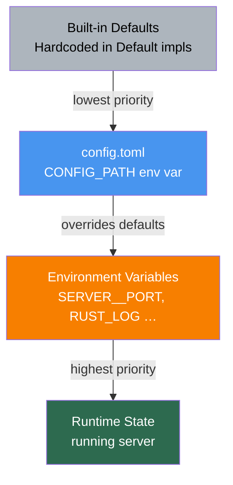
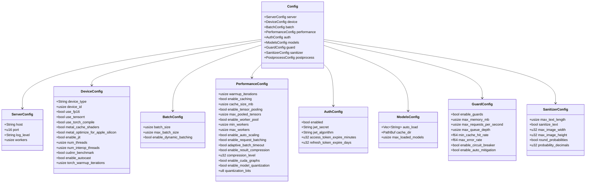
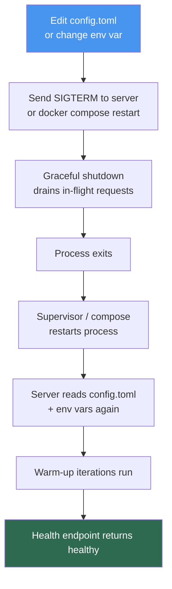

# Configuration Reference

`torch-inference` is configured via `config.toml` (TOML format) with environment variable overrides. This document covers every key, the override hierarchy, and the runtime structure.

## Config Hierarchy



Load order at startup:

1. Built-in `Default` impls for every config struct
2. Parse `$CONFIG_PATH` (or `./config.toml` if not set) — TOML format
3. Overlay any `SECTION__KEY=value` environment variables (double-underscore separator)
4. Validate resulting config; fatal error on invalid values

## Config Struct Tree



---

## Complete `config.toml` Reference

```toml
# ─────────────────────────────────────────────────────
# [server]
# ─────────────────────────────────────────────────────
[server]
host    = "0.0.0.0"   # Bind address
port    = 8080        # Listening port (override: SERVER__PORT)
log_level = "info"    # trace | debug | info | warn | error
workers = 4           # Actix-Web worker threads (0 = num_cpus)

# ─────────────────────────────────────────────────────
# [device]
# ─────────────────────────────────────────────────────
[device]
device_type   = "auto"   # auto | cpu | cuda | metal | mps
device_id     = 0        # GPU index for multi-GPU hosts
use_fp16      = false    # Half-precision (2x speedup on CUDA/Metal)
use_tensorrt  = false    # TensorRT optimisation (NVIDIA only)
use_torch_compile = false  # torch.compile() — requires --features torch

# Metal / Apple Silicon (macOS only)
metal_use_mlx                    = false  # Apple MLX (experimental)
metal_cache_shaders              = true   # Cache compiled Metal shaders
metal_optimize_for_apple_silicon = true   # E/P core-aware threading

# JIT (--features torch)
enable_jit          = true
enable_jit_profiling = false
enable_jit_executor  = true
enable_jit_fusion    = true

# Thread counts for LibTorch intra/inter-op parallelism
num_threads        = 4   # Intra-op; 0 = auto
num_interop_threads = 1  # Inter-op; keep 1 for serving
cudnn_benchmark    = true   # Auto-select fastest cuDNN algorithm
enable_autocast    = false  # AMP (automatic mixed precision)
torch_warmup_iterations = 3 # Forward passes before timing is recorded

# ─────────────────────────────────────────────────────
# [batch]
# ─────────────────────────────────────────────────────
[batch]
batch_size             = 1     # Default batch size per request
max_batch_size         = 32    # Hard ceiling for dynamic batching
enable_dynamic_batching = true  # Accumulate requests before dispatch

# ─────────────────────────────────────────────────────
# [performance]
# ─────────────────────────────────────────────────────
[performance]
warmup_iterations = 3       # Warm-up forward passes at startup
enable_profiling  = false   # Detailed timing (dev only — overhead)

# LRU cache
enable_caching  = true
cache_size_mb   = 2048      # Memory budget for the LRU cache

# Tensor pool (pre-allocates tensors by shape)
enable_tensor_pooling = true
max_pooled_tensors    = 500  # Per-shape pool depth

# Worker pool
enable_worker_pool  = true
min_workers         = 2
max_workers         = 16
enable_auto_scaling = true  # Scale workers based on queue depth
enable_zero_scaling = false # Allow scale-down to 0 workers

# Request batching within the batch processor
enable_request_batching = true
adaptive_batch_timeout  = true  # Shorter timeout under heavy load
min_batch_size          = 1

# Inflight batching (overlap compute + IO)
enable_inflight_batching = false
max_inflight_batches     = 4

# Async model loading
enable_async_model_loading  = true
preload_models_on_startup   = false  # Load auto_load models at boot

# Response compression (gzip, responses > 1 KB)
enable_result_compression = true
compression_level         = 6    # 1 (fast) – 9 (smallest)

# Advanced
enable_model_quantization = false
quantization_bits         = 8    # 8 or 16
enable_cuda_graphs        = false # CUDA graph capture (NVIDIA)

# ─────────────────────────────────────────────────────
# [auth]
# ─────────────────────────────────────────────────────
[auth]
enabled                    = false
jwt_secret                 = "change-me-in-production"
jwt_algorithm              = "HS256"
access_token_expire_minutes = 60
refresh_token_expire_days   = 7

# ─────────────────────────────────────────────────────
# [models]
# ─────────────────────────────────────────────────────
[models]
auto_load         = []        # Model names to load at startup
cache_dir         = "models"  # Filesystem path for downloaded models
max_loaded_models = 5         # Evict LRU model when exceeded

# ─────────────────────────────────────────────────────
# [guard]  — system protection
# ─────────────────────────────────────────────────────
[guard]
enable_guards            = true
max_memory_mb            = 8192    # OOM protection threshold
max_requests_per_second  = 1000    # Rate limit (guard-level, not HTTP)
max_queue_depth          = 500     # Reject requests when queue > this
min_cache_hit_rate       = 60.0    # % — alert / mitigate below this
max_error_rate           = 5.0     # % — circuit-breaker threshold
enable_circuit_breaker   = true
enable_auto_mitigation   = true    # Reduce batch size / evict models

# ─────────────────────────────────────────────────────
# [sanitizer]  — I/O validation
# ─────────────────────────────────────────────────────
[sanitizer]
max_text_length            = 10000
sanitize_text              = true
sanitize_image_dimensions  = true
max_image_width            = 4096
max_image_height           = 4096
round_probabilities        = true
probability_decimals       = 4
remove_null_values         = true
```

---

## Environment Variable Reference

Variables use `SECTION__KEY` (double-underscore) notation and override the corresponding `config.toml` key.

| Variable | Type | Example | Description |
|----------|------|---------|-------------|
| `CONFIG_PATH` | path | `/etc/torch-inference/config.toml` | Config file location |
| `RUST_LOG` | log filter | `debug`, `info,torch_inference=debug` | `tracing` log filter |
| `SERVER__HOST` | string | `127.0.0.1` | Overrides `server.host` |
| `SERVER__PORT` | u16 | `9090` | Overrides `server.port` |
| `SERVER__WORKERS` | usize | `8` | Overrides `server.workers` |
| `DEVICE__DEVICE_TYPE` | string | `cuda` | Overrides `device.device_type` |
| `DEVICE__USE_FP16` | bool | `true` | Overrides `device.use_fp16` |
| `DEVICE__NUM_THREADS` | usize | `8` | Intra-op thread count |
| `BATCH__MAX_BATCH_SIZE` | usize | `64` | Overrides `batch.max_batch_size` |
| `PERFORMANCE__CACHE_SIZE_MB` | usize | `4096` | LRU cache budget |
| `PERFORMANCE__MAX_WORKERS` | usize | `16` | Worker pool upper bound |
| `AUTH__ENABLED` | bool | `true` | Enable JWT auth |
| `AUTH__JWT_SECRET` | string | `s3cr3t` | JWT signing secret (keep in env, not file) |
| `MODELS__CACHE_DIR` | path | `/mnt/models` | Model storage directory |
| `GUARD__MAX_MEMORY_MB` | usize | `16384` | Memory guard ceiling |

> **Security note:** Never put `AUTH__JWT_SECRET` in `config.toml` committed to source control. Always inject it via environment variable in production.

---

## Runtime Config Reload

The server does not yet support live TOML reload (planned). The current reload cycle is:



For zero-downtime restarts in production, place a reverse proxy (nginx, Caddy) in front and perform a rolling restart.

---

## Configuration Profiles

Three ready-made profiles from `config.toml` comments:

### High Throughput (batch processing)

```toml
[batch]
max_batch_size = 64

[performance]
cache_size_mb          = 4096
max_pooled_tensors     = 500
adaptive_batch_timeout = true
min_batch_size         = 8
enable_result_compression = true
compression_level      = 6
```

### Low Latency (real-time APIs)

```toml
[batch]
max_batch_size = 8

[performance]
cache_size_mb          = 1024
max_pooled_tensors     = 100
adaptive_batch_timeout = true
min_batch_size         = 1
enable_result_compression = false
```

### Memory-Constrained (edge / containers)

```toml
[performance]
cache_size_mb             = 512
max_pooled_tensors        = 50
enable_result_compression = true
compression_level         = 9
enable_model_quantization = true
quantization_bits         = 8

[models]
max_loaded_models = 2
```

## See Also

- [Quickstart](quickstart.md) — run the server in 10 minutes
- [Optimization Guide](optimization.md) — tune batch, cache, and worker pool
- [Installation Guide](installation.md) — build dependencies per platform
