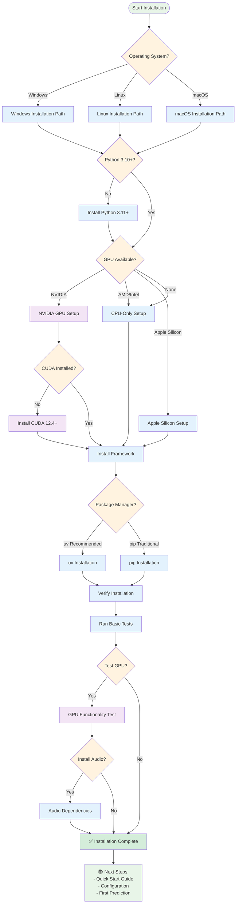

# Installation Guide

Complete installation instructions for the PyTorch Inference Framework across different environments and use cases.

## �️ Installation Flow Diagram



## �🎯 Prerequisites

### System Requirements

| Component | Minimum | Recommended |
|-----------|---------|-------------|
| **Python** | 3.10+ | 3.11+ |
| **RAM** | 8GB | 16GB+ |
| **Storage** | 5GB free | 20GB+ (for models) |
| **OS** | Windows 10+, Linux, macOS | Ubuntu 20.04+, Windows 11 |

### GPU Requirements (Optional)

| Component | Minimum | Recommended |
|-----------|---------|-------------|
| **CUDA** | 11.8+ | 12.4+ |
| **GPU Memory** | 4GB | 8GB+ |
| **Compute Capability** | 6.1+ | 7.5+ (Tensor Cores) |
| **Drivers** | 515+ | Latest |

## 📦 Package Manager Installation

### Option 1: uv (Recommended - 10-100x Faster)

[uv](https://github.com/astral-sh/uv) is a modern Python package manager that's significantly faster than pip.

```bash
# Install uv
pip install uv

# Clone repository
git clone https://github.com/Evintkoo/torch-inference.git
cd torch-inference

# Fast dependency installation
uv sync

# Verify installation
uv run python -c "import framework; print('✅ Installation successful!')"
```

### Option 2: Traditional pip

```bash
# Clone repository
git clone https://github.com/Evintkoo/torch-inference.git
cd torch-inference

# Install dependencies
pip install -r requirements.txt

# Verify installation
python -c "import framework; print('✅ Installation successful!')"
```

### Option 3: Development Installation

For contributors and advanced users:

```bash
# Clone repository
git clone https://github.com/Evintkoo/torch-inference.git
cd torch-inference

# Install in development mode with all dependencies
uv sync --dev
# or: pip install -e ".[dev]"

# Install pre-commit hooks
pre-commit install

# Run tests to verify
uv run pytest tests/
```

## 🐳 Docker Installation

### Pre-built Images

```bash
# Pull the latest image
docker pull torchframework/inference:latest

# Run with default settings
docker run -p 8000:8000 torchframework/inference:latest

# Run with GPU support
docker run --gpus all -p 8000:8000 torchframework/inference:latest
```

### Build from Source

```bash
# Clone repository
git clone https://github.com/Evintkoo/torch-inference.git
cd torch-inference

# Build development image
docker build --target development -t torch-inference:dev .

# Build production image
docker build --target production -t torch-inference:prod .

# Run development container
docker run --rm -p 8001:8000 -v ${PWD}:/app torch-inference:dev

# Run production container
docker run --rm -p 8000:8000 torch-inference:prod
```

### Docker Compose

For a complete stack with all services:

```bash
# Development environment
docker compose -f compose.yaml -f compose.dev.yaml up

# Production environment
docker compose -f compose.prod.yaml up -d

# Simple setup
docker compose up
```

Available services:
- **Main API**: http://localhost:8000
- **Jupyter Lab**: http://localhost:8888 (dev only)
- **MLflow**: http://localhost:5000 (dev only)
- **TensorBoard**: http://localhost:6006 (dev only)

## 🔧 Environment-Specific Installation

### Windows

#### Windows 10/11 with WSL2 (Recommended)

```bash
# Install WSL2 and Ubuntu
wsl --install -d Ubuntu-22.04

# Inside WSL2
sudo apt update && sudo apt upgrade -y
sudo apt install python3.11 python3.11-pip git -y

# Install CUDA (for GPU support)
wget https://developer.download.nvidia.com/compute/cuda/repos/ubuntu2204/x86_64/cuda-keyring_1.0-1_all.deb
sudo dpkg -i cuda-keyring_1.0-1_all.deb
sudo apt update
sudo apt install cuda-toolkit-12-4 -y

# Continue with standard installation
git clone https://github.com/Evintkoo/torch-inference.git
cd torch-inference
pip install uv && uv sync
```

#### Native Windows

```powershell
# Install Python 3.11+ from python.org
# Install Git from git-scm.com

# Clone and install
git clone https://github.com/Evintkoo/torch-inference.git
cd torch-inference

# Install with uv
pip install uv
uv sync

# For GPU support, install CUDA Toolkit 12.4+
# Download from: https://developer.nvidia.com/cuda-downloads
```

### Linux (Ubuntu/Debian)

```bash
# Update system
sudo apt update && sudo apt upgrade -y

# Install Python 3.11+
sudo apt install python3.11 python3.11-pip python3.11-venv git -y

# Install CUDA (for GPU support)
wget https://developer.download.nvidia.com/compute/cuda/repos/ubuntu2204/x86_64/cuda-keyring_1.0-1_all.deb
sudo dpkg -i cuda-keyring_1.0-1_all.deb
sudo apt update
sudo apt install cuda-toolkit-12-4 -y

# Clone and install framework
git clone https://github.com/Evintkoo/torch-inference.git
cd torch-inference

# Install dependencies
pip3.11 install uv
uv sync

# Set Python alias (optional)
echo "alias python=python3.11" >> ~/.bashrc
source ~/.bashrc
```

### Linux (CentOS/RHEL/Fedora)

```bash
# CentOS/RHEL 8+
sudo dnf install python3.11 python3.11-pip git -y

# Fedora
sudo dnf install python3.11 python3-pip git -y

# Install CUDA
sudo dnf config-manager --add-repo https://developer.download.nvidia.com/compute/cuda/repos/rhel8/x86_64/cuda-rhel8.repo
sudo dnf install cuda-toolkit-12-4 -y

# Continue with standard installation
git clone https://github.com/Evintkoo/torch-inference.git
cd torch-inference
pip3.11 install uv && uv sync
```

### macOS

```bash
# Install Homebrew (if not installed)
/bin/bash -c "$(curl -fsSL https://raw.githubusercontent.com/Homebrew/install/HEAD/install.sh)"

# Install Python 3.11+
brew install python@3.11 git

# Clone and install
git clone https://github.com/Evintkoo/torch-inference.git
cd torch-inference

# Install dependencies
pip3.11 install uv
uv sync

# For Apple Silicon GPU support (Metal Performance Shaders)
# PyTorch MPS is automatically detected and used
```

## 🚀 GPU Acceleration Setup

### NVIDIA GPU (CUDA)

#### Install CUDA Toolkit

**Linux:**
```bash
# Ubuntu/Debian
wget https://developer.download.nvidia.com/compute/cuda/repos/ubuntu2204/x86_64/cuda-keyring_1.0-1_all.deb
sudo dpkg -i cuda-keyring_1.0-1_all.deb
sudo apt update
sudo apt install cuda-toolkit-12-4 -y

# Add to PATH
echo 'export PATH=/usr/local/cuda/bin:$PATH' >> ~/.bashrc
echo 'export LD_LIBRARY_PATH=/usr/local/cuda/lib64:$LD_LIBRARY_PATH' >> ~/.bashrc
source ~/.bashrc
```

**Windows:**
1. Download CUDA Toolkit 12.4+ from [NVIDIA Developer](https://developer.nvidia.com/cuda-downloads)
2. Run installer and follow instructions
3. Restart system

#### Verify CUDA Installation

```bash
# Check CUDA version
nvcc --version

# Check GPU status
nvidia-smi

# Test PyTorch CUDA
python -c "import torch; print(f'CUDA available: {torch.cuda.is_available()}')"
```

### AMD GPU (ROCm) - Linux Only

```bash
# Ubuntu 20.04/22.04
wget https://repo.radeon.com/amdgpu-install/latest/ubuntu/jammy/amdgpu-install_5.4.50400-1_all.deb
sudo dpkg -i amdgpu-install_5.4.50400-1_all.deb
sudo apt update
sudo amdgpu-install --usecase=rocm

# Install ROCm-compatible PyTorch
pip install torch torchvision torchaudio --index-url https://download.pytorch.org/whl/rocm5.4.2
```

### Apple Silicon (MPS)

MPS support is automatic with PyTorch 1.12+:

```python
# Verify MPS availability
import torch
print(f"MPS available: {torch.backends.mps.is_available()}")
print(f"MPS built: {torch.backends.mps.is_built()}")
```

## 🎵 Audio Processing Dependencies

For TTS and STT functionality:

### Core Audio Dependencies

```bash
# Install audio processing libraries
pip install librosa soundfile torchaudio

# Ubuntu/Debian additional dependencies
sudo apt install libsndfile1 ffmpeg -y

# CentOS/RHEL/Fedora
sudo dnf install libsndfile ffmpeg -y

# macOS
brew install libsndfile ffmpeg

# Windows
# FFmpeg: Download from https://ffmpeg.org/download.html
# Add to PATH
```

### Optional Audio Dependencies

```bash
# Advanced audio processing
pip install phonemizer espeak-ng

# Ubuntu/Debian
sudo apt install espeak espeak-data libespeak1 libespeak-dev -y

# macOS
brew install espeak

# Windows
# Download eSpeak from: http://espeak.sourceforge.net/download.html
```

## 🔍 Verification and Testing

### Basic Verification

```bash
# Test core framework import
uv run python -c "
import framework
print('✅ Framework imported successfully')

# Test GPU availability
import torch
print(f'✅ CUDA available: {torch.cuda.is_available()}')
if torch.cuda.is_available():
    print(f'✅ GPU: {torch.cuda.get_device_name()}')

# Test MPS (Apple Silicon)
if hasattr(torch.backends, 'mps') and torch.backends.mps.is_available():
    print('✅ Apple MPS available')
"
```

### Comprehensive Test

```bash
# Run installation test script
uv run python tools/test_installation.py

# Expected output:
# ✅ Python version: 3.11.x
# ✅ PyTorch version: 2.x.x
# ✅ Framework modules: OK
# ✅ GPU acceleration: Available/Not Available
# ✅ Audio processing: OK
# ✅ All systems ready!
```

### Audio Testing

```bash
# Test TTS functionality
uv run python -c "
try:
    import librosa
    import soundfile
    import torchaudio
    print('✅ Audio dependencies: OK')
except ImportError as e:
    print(f'❌ Audio dependencies missing: {e}')
"
```

### Performance Benchmark

```bash
# Run quick performance test
uv run python -c "
from framework import TorchInferenceFramework
import time

framework = TorchInferenceFramework()
framework.load_model('dummy_path')  # Uses example model

start_time = time.time()
result = framework.predict([1, 2, 3, 4, 5])
elapsed = time.time() - start_time

print(f'✅ Inference test: {elapsed*1000:.2f}ms')
print(f'✅ Result: {result}')
"
```

## 🛠️ Troubleshooting

### Common Installation Issues

#### 1. Python Version Issues

```bash
# Check Python version
python --version

# If using wrong version, specify Python 3.11+
python3.11 -m pip install uv
python3.11 -m uv sync
```

#### 2. CUDA Issues

```bash
# Check CUDA installation
nvcc --version
nvidia-smi

# If CUDA not found, add to PATH
export PATH=/usr/local/cuda/bin:$PATH
export LD_LIBRARY_PATH=/usr/local/cuda/lib64:$LD_LIBRARY_PATH

# Reinstall PyTorch with correct CUDA version
pip uninstall torch torchvision torchaudio
pip install torch torchvision torchaudio --index-url https://download.pytorch.org/whl/cu124
```

#### 3. Memory Issues

```bash
# If installation fails due to memory
# Use --no-cache-dir flag
pip install --no-cache-dir -r requirements.txt

# Or increase swap space (Linux)
sudo fallocate -l 4G /swapfile
sudo chmod 600 /swapfile
sudo mkswap /swapfile
sudo swapon /swapfile
```

#### 4. Permission Issues

```bash
# Linux/macOS - use user installation
pip install --user uv
python -m uv sync

# Or use virtual environment
python -m venv venv
source venv/bin/activate  # Linux/macOS
# venv\Scripts\activate   # Windows
pip install uv && uv sync
```

#### 5. Network/Firewall Issues

```bash
# Use different PyPI mirror
pip install -i https://pypi.douban.com/simple/ uv

# Or configure proxy
pip install --proxy http://proxy.server:port uv
```

### Platform-Specific Issues

#### Windows

```powershell
# Long path support
git config --system core.longpaths true

# PowerShell execution policy
Set-ExecutionPolicy -ExecutionPolicy RemoteSigned -Scope CurrentUser

# Visual C++ Build Tools (if needed)
# Download from: https://visualstudio.microsoft.com/visual-cpp-build-tools/
```

#### macOS

```bash
# Xcode Command Line Tools
xcode-select --install

# Homebrew permissions
sudo chown -R $(whoami) $(brew --prefix)/*

# Certificate issues
/Applications/Python\ 3.11/Install\ Certificates.command
```

#### Linux

```bash
# Missing build dependencies
sudo apt install build-essential python3.11-dev -y

# SSL certificate issues
pip install --trusted-host pypi.org --trusted-host pypi.python.org certifi
```

## 🔄 Environment Management

### Virtual Environments

```bash
# Create virtual environment
python -m venv torch-inference-env

# Activate
source torch-inference-env/bin/activate  # Linux/macOS
torch-inference-env\Scripts\activate     # Windows

# Install in virtual environment
pip install uv
uv sync

# Deactivate
deactivate
```

### Conda Environments

```bash
# Create conda environment
conda create -n torch-inference python=3.11 -y
conda activate torch-inference

# Install PyTorch with CUDA
conda install pytorch torchvision torchaudio pytorch-cuda=12.4 -c pytorch -c nvidia

# Install framework
pip install uv
uv sync
```

### Poetry (Alternative)

```bash
# Install poetry
curl -sSL https://install.python-poetry.org | python3 -

# Install dependencies
poetry install

# Activate environment
poetry shell
```

## 📦 Optional Components

### TensorRT (NVIDIA GPUs)

```bash
# Download TensorRT from NVIDIA Developer
# https://developer.nvidia.com/tensorrt

# Install TensorRT Python package
pip install nvidia-tensorrt

# Verify installation
python -c "import tensorrt; print(f'TensorRT version: {tensorrt.__version__}')"
```

### ONNXRuntime GPU

```bash
# Install ONNX Runtime with GPU support
pip uninstall onnxruntime onnxruntime-gpu
pip install onnxruntime-gpu

# Verify
python -c "import onnxruntime; print(onnxruntime.get_available_providers())"
```

### Monitoring Tools

```bash
# System monitoring
pip install psutil gpustat

# MLflow for experiment tracking
pip install mlflow

# TensorBoard for visualization
pip install tensorboard
```

## ✅ Installation Verification Checklist

After installation, verify these components work:

- [ ] ✅ Framework imports successfully
- [ ] ✅ Basic prediction works
- [ ] ✅ GPU acceleration (if available)
- [ ] ✅ Audio processing (if needed)
- [ ] ✅ REST API starts
- [ ] ✅ Model download works
- [ ] ✅ Performance is acceptable

### Final Verification Script

Save as `verify_installation.py`:

```python
#!/usr/bin/env python3
"""Complete installation verification script."""

import sys
import time
import traceback

def check_python_version():
    """Check Python version."""
    version = sys.version_info
    if version.major == 3 and version.minor >= 10:
        print(f"✅ Python {version.major}.{version.minor}.{version.micro}")
        return True
    else:
        print(f"❌ Python {version.major}.{version.minor}.{version.micro} (need 3.10+)")
        return False

def check_pytorch():
    """Check PyTorch installation."""
    try:
        import torch
        print(f"✅ PyTorch {torch.__version__}")
        
        # Check CUDA
        if torch.cuda.is_available():
            print(f"✅ CUDA {torch.version.cuda} - {torch.cuda.get_device_name()}")
        else:
            print("ℹ️  CUDA not available (CPU only)")
        
        # Check MPS (Apple Silicon)
        if hasattr(torch.backends, 'mps') and torch.backends.mps.is_available():
            print("✅ Apple MPS available")
        
        return True
    except ImportError:
        print("❌ PyTorch not installed")
        return False

def check_framework():
    """Check framework installation."""
    try:
        import framework
        print("✅ Framework imported successfully")
        
        # Test basic functionality
        from framework import TorchInferenceFramework
        fw = TorchInferenceFramework()
        fw.load_model("dummy_path")
        
        start_time = time.time()
        result = fw.predict([1, 2, 3, 4, 5])
        elapsed = time.time() - start_time
        
        print(f"✅ Basic prediction: {elapsed*1000:.2f}ms")
        return True
    except Exception as e:
        print(f"❌ Framework test failed: {e}")
        traceback.print_exc()
        return False

def check_audio():
    """Check audio dependencies."""
    try:
        import librosa
        import soundfile
        import torchaudio
        print("✅ Audio processing libraries")
        return True
    except ImportError as e:
        print(f"⚠️  Audio libraries missing: {e}")
        return False

def check_optional():
    """Check optional dependencies."""
    optional_deps = {
        'tensorrt': 'TensorRT',
        'onnxruntime': 'ONNX Runtime',
        'psutil': 'System monitoring',
    }
    
    for module, name in optional_deps.items():
        try:
            __import__(module)
            print(f"✅ {name}")
        except ImportError:
            print(f"ℹ️  {name} not installed (optional)")

def main():
    """Run all verification checks."""
    print("🔍 PyTorch Inference Framework Installation Verification")
    print("=" * 60)
    
    checks = [
        check_python_version(),
        check_pytorch(),
        check_framework(),
        check_audio(),
    ]
    
    print("\n📦 Optional Components:")
    check_optional()
    
    print("\n" + "=" * 60)
    
    if all(checks[:3]):  # Core components must pass
        print("🎉 Installation verification PASSED!")
        print("🚀 Ready to use PyTorch Inference Framework!")
        
        print("\n📚 Next steps:")
        print("   • Read the documentation: docs/README.md")
        print("   • Try the quick start: docs/guides/quickstart.md")
        print("   • Start the API server: python main.py")
        
        return 0
    else:
        print("❌ Installation verification FAILED!")
        print("📖 Check the installation guide: docs/guides/installation.md")
        return 1

if __name__ == "__main__":
    sys.exit(main())
```

Run the verification:
```bash
uv run python verify_installation.py
```

## 🎉 Success!

If all checks pass, you're ready to use the PyTorch Inference Framework! 

**Next Steps:**
- 📚 **[Quick Start Guide](quickstart.md)** - Get running in 5 minutes
- 🎓 **[Basic Tutorial](../tutorials/basic-usage.md)** - Learn the fundamentals
- 🚀 **[API Documentation](../api/rest-api.md)** - Explore all endpoints
- 💡 **[Examples](../examples/)** - See real-world usage

---

*For additional help, see [Troubleshooting](../reference/troubleshooting.md) or open an [issue](https://github.com/Evintkoo/torch-inference/issues).*
