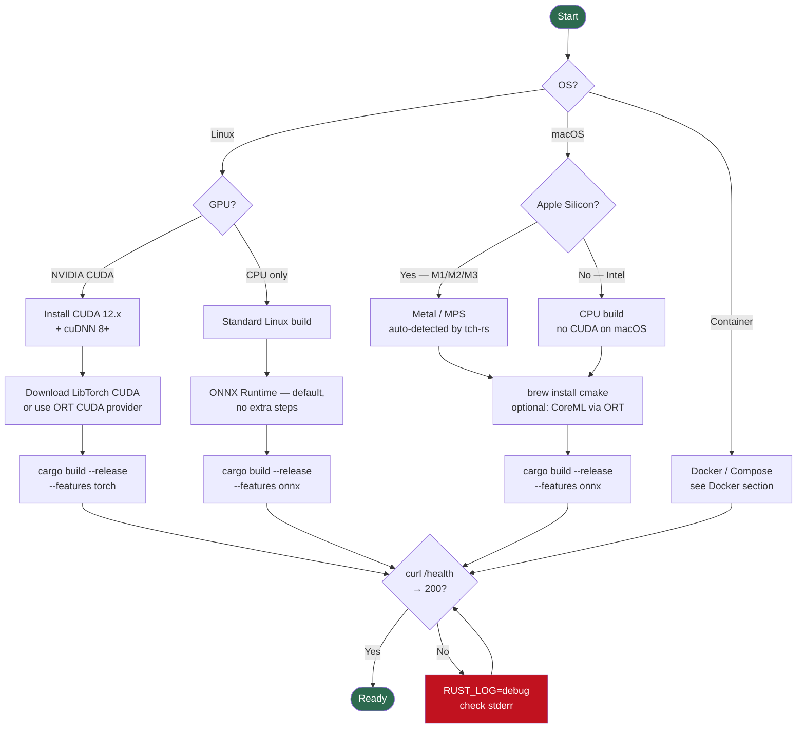
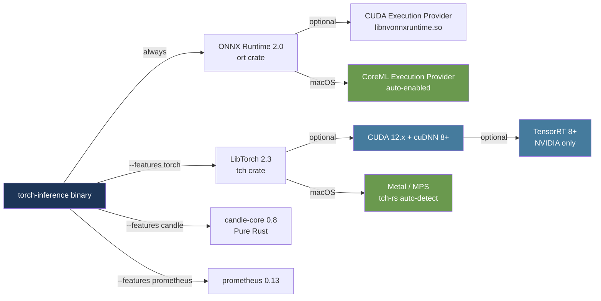

# Installation Guide

Platform-specific build instructions for `torch-inference` on Linux, macOS, and Docker. All paths assume the project root.

## Installation Decision Tree


```mermaid
flowchart TD
    Start([Start]) --> OS{OS?}

    OS -->|Linux| L_GPU{GPU?}
    OS -->|macOS| M_CHIP{Apple Silicon?}
    OS -->|Container| Docker[Docker / Compose\nsee Docker section]

    L_GPU -->|NVIDIA CUDA| L_CUDA[Install CUDA 12.x\n+ cuDNN 8+]
    L_GPU -->|CPU only| L_CPU[Standard Linux build]
    L_CUDA --> L_LT[Download LibTorch CUDA\nor use ORT CUDA provider]
    L_CPU --> L_ORT[ONNX Runtime — default,\nno extra steps]

    M_CHIP -->|Yes — M1/M2/M3| M_METAL[Metal / MPS\nauto-detected by tch-rs]
    M_CHIP -->|No — Intel| M_INTEL[CPU build\nno CUDA on macOS]
    M_METAL --> M_BREW[brew install cmake\noptional: CoreML via ORT]
    M_INTEL --> M_BREW

    L_LT --> Feature_torch[cargo build --release\n--features torch]
    L_ORT --> Feature_onnx[cargo build --release\n--features onnx]
    M_BREW --> Mac_build[cargo build --release\n--features onnx]

    Feature_torch --> Validate
    Feature_onnx --> Validate
    Mac_build --> Validate
    Docker --> Validate

    Validate{curl /health\n→ 200?}
    Validate -->|Yes| Done([Ready])
    Validate -->|No| Logs[RUST_LOG=debug\ncheck stderr]
    Logs --> Validate

    style Start fill:#2d6a4f,color:#fff
    style Done fill:#2d6a4f,color:#fff
    style Logs fill:#c1121f,color:#fff
```

## Prerequisites

| Requirement | Minimum | Notes |
|-------------|---------|-------|
| Rust stable | 1.75 | `rustup update stable` |
| cmake | 3.20+ | Required by tch-rs build.rs |
| C++ compiler | gcc 11 / clang 14 | System default |
| LibTorch | 2.3.0 | `--features torch` only |
| ONNX Runtime | 2.0.0-rc.10 | Bundled via `copy-dylibs` |
| CUDA toolkit | 12.x | NVIDIA GPU inference |
| Xcode CLT | latest | macOS only |

## Optional Dependency Graph


```mermaid
graph LR
    Core[torch-inference binary]

    Core -->|always| ORT[ONNX Runtime 2.0\nort crate]
    Core -->|--features torch| LibTorch[LibTorch 2.3\ntch crate]
    Core -->|--features candle| Candle[candle-core 0.8\nPure Rust]
    Core -->|--features prometheus| Prom[prometheus 0.13]

    ORT -->|optional| CUDA_ORT[CUDA Execution Provider\nlibnvonnxruntime.so]
    ORT -->|macOS| CoreML[CoreML Execution Provider\nauto-enabled]
    LibTorch -->|optional| CUDA_LT[CUDA 12.x + cuDNN 8+]
    LibTorch -->|macOS| Metal[Metal / MPS\ntch-rs auto-detect]
    CUDA_LT -->|optional| TensorRT[TensorRT 8+\nNVIDIA only]

    style Core fill:#1d3557,color:#fff
    style CUDA_LT fill:#457b9d,color:#fff
    style TensorRT fill:#457b9d,color:#fff
    style Metal fill:#6a994e,color:#fff
    style CoreML fill:#6a994e,color:#fff
```

## Feature Flag Reference

| Flag | Default | Crate | Description |
|------|---------|-------|-------------|
| `onnx` | ✅ on | `ort 2.0.0-rc.10` | ONNX Runtime inference, CoreML on macOS |
| `torch` | ❌ off | `tch 0.16` | LibTorch / PyTorch inference via tch-rs |
| `candle` | ❌ off | `candle-core 0.8` | Pure-Rust inference (experimental) |
| `prometheus` | ❌ off | `prometheus 0.13` | Expose `/metrics` in Prometheus format |
| `tracing-opentelemetry` | ❌ off | `tracing-opentelemetry 0.22` | OpenTelemetry traces |

Combine flags freely:

```bash
cargo build --release --features torch,prometheus
```

---

## Linux

### Install Rust

```bash
curl --proto '=https' --tlsv1.2 -sSf https://sh.rustup.rs | sh
source ~/.cargo/env
rustup update stable
rustc --version   # ≥ 1.75
```

### System dependencies

```bash
# Ubuntu 22.04 / Debian 12
sudo apt-get update && sudo apt-get install -y \
  build-essential cmake pkg-config \
  libssl-dev libffi-dev

# Fedora / RHEL 9
sudo dnf install -y cmake gcc-c++ openssl-devel
```

### CPU-only (ONNX — default)

```bash
git clone https://github.com/Evintkoo/torch-inference.git
cd torch-inference
cargo build --release
# Binary: target/release/torch-inference-server
```

### NVIDIA GPU — ONNX Runtime CUDA provider

```bash
# Install CUDA 12.x
# https://developer.nvidia.com/cuda-downloads

# Build — ORT auto-picks CUDAExecutionProvider at runtime
cargo build --release --features onnx

# Verify GPU is used
RUST_LOG=info ./target/release/torch-inference-server
# Look for: "Using CUDAExecutionProvider"
```

### NVIDIA GPU — LibTorch + tch-rs

```bash
# Download LibTorch with CUDA 12.1
LIBTORCH_VER=2.3.0
CUDA_VER=cu121
wget "https://download.pytorch.org/libtorch/${CUDA_VER}/libtorch-cxx11-abi-shared-with-deps-${LIBTORCH_VER}%2B${CUDA_VER}.zip"
unzip "libtorch-cxx11-abi-shared-with-deps-${LIBTORCH_VER}+${CUDA_VER}.zip"

export LIBTORCH="$(pwd)/libtorch"
export LD_LIBRARY_PATH="${LIBTORCH}/lib:${LD_LIBRARY_PATH}"

cargo build --release --features torch
```

Persist the env vars in `~/.bashrc` or `~/.profile`.

---

## macOS

### Install Rust + Xcode CLT

```bash
xcode-select --install
curl --proto '=https' --tlsv1.2 -sSf https://sh.rustup.rs | sh
source ~/.cargo/env
```

### Install cmake (required by build.rs)

```bash
brew install cmake
```

### Build (Apple Silicon — Metal auto-detected)

```bash
git clone https://github.com/Evintkoo/torch-inference.git
cd torch-inference
cargo build --release   # ORT with CoreML fused by default
```

tch-rs detects MPS automatically when `device_type = "auto"` in config.toml. No extra env vars are needed.

### macOS with LibTorch (CPU)

```bash
# macOS arm64 LibTorch
wget https://download.pytorch.org/libtorch/cpu/libtorch-macos-arm64-2.3.0.zip
unzip libtorch-macos-arm64-2.3.0.zip
export LIBTORCH="$(pwd)/libtorch"
export DYLD_LIBRARY_PATH="${LIBTORCH}/lib:${DYLD_LIBRARY_PATH}"

cargo build --release --features torch
```

---

## Docker

### Pre-built targets

```bash
# CPU (ONNX)
docker build -t torch-inference:cpu .

# GPU (requires NVIDIA Container Toolkit)
docker build -f Dockerfile --build-arg FEATURES=torch -t torch-inference:gpu .
```

### docker compose variants

```bash
# Development — hot-reload, debug logging
docker compose -f compose.yaml -f compose.dev.yaml up

# Production — optimised, resource-limited
docker compose -f compose.prod.yaml up -d

# GPU profile
docker compose -f compose.gpu.yaml up -d
```

Default exposed port: **8080** (configurable via `SERVER__PORT`).

### Minimal Dockerfile override

```dockerfile
FROM torch-inference:cpu
COPY config.toml /app/config.toml
ENV CONFIG_PATH=/app/config.toml
ENV RUST_LOG=info
EXPOSE 8080
```

---

## Validation Steps

After any installation method, verify the server is healthy:

```bash
# 1. Health endpoint
curl -sf http://localhost:8080/health && echo "OK"

# 2. System info (shows detected device)
curl -s http://localhost:8080/info | jq '.device'

# 3. Metrics (requires --features prometheus)
curl -s http://localhost:8080/metrics | head -20

# 4. List models
curl -s http://localhost:8080/models | jq .
```

Expected health response:

```json
{
  "status": "healthy",
  "version": "1.0.0",
  "uptime_seconds": 12,
  "device": "cpu",
  "models_loaded": 0
}
```

## Troubleshooting

| Symptom | Likely Cause | Fix |
|---------|-------------|-----|
| `cannot find -ltorch` | `LIBTORCH` not set | Export `LIBTORCH` before `cargo build` |
| `dylib load failed` on macOS | `DYLD_LIBRARY_PATH` missing | `export DYLD_LIBRARY_PATH=$LIBTORCH/lib` |
| `ORT load error` at startup | Stale ORT dylib | `cargo clean && cargo build --release` |
| Port 8080 in use | Another process | Change `server.port` in config.toml |
| `CUDA out of memory` | Batch too large | Reduce `max_batch_size` in config.toml |
| Slow first request | Model warm-up | Increase `performance.warmup_iterations` |

## See Also

- [Quickstart](quickstart.md) — first request in 10 minutes
- [Configuration Reference](configuration.md) — all config keys
- [Docker Troubleshooting](../../DOCKER_TROUBLESHOOTING.md)
