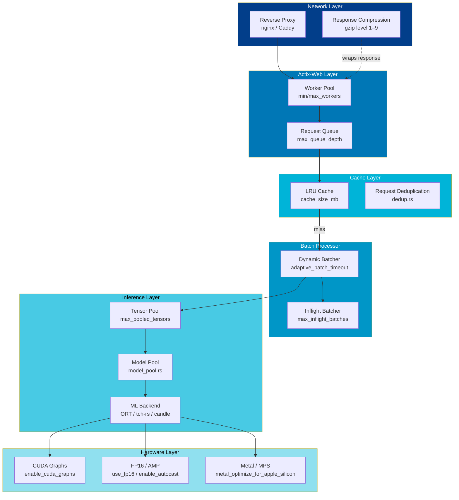
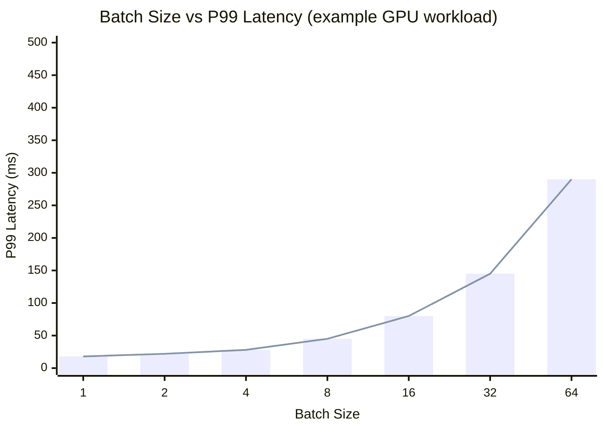
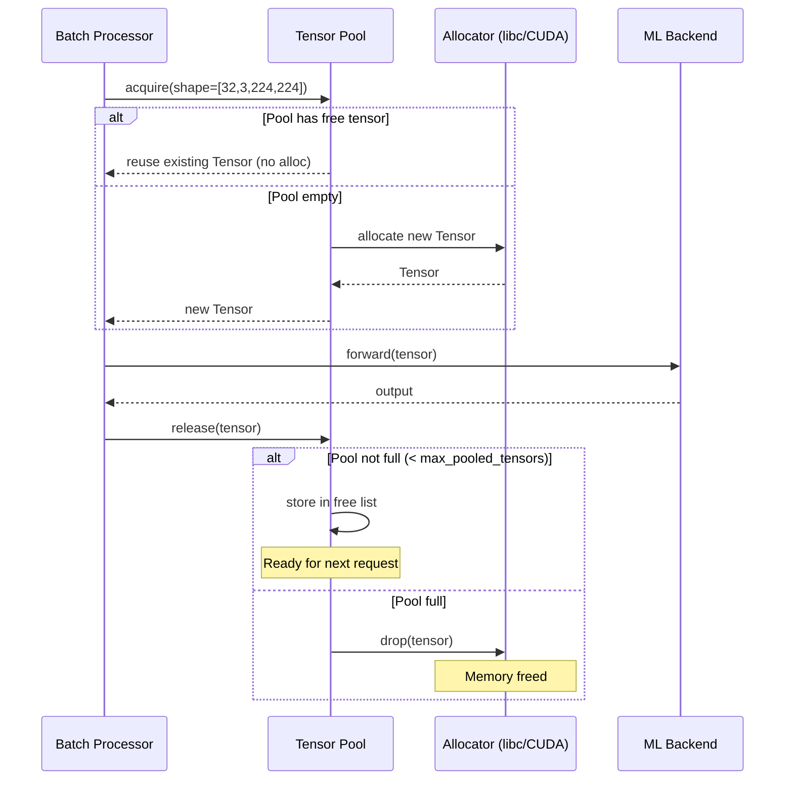

# Performance Tuning Guide

Practical reference for squeezing maximum throughput and minimum latency out of `torch-inference`. Each section maps directly to a runtime component.

## Optimization Layers



---

## 1. Worker Pool

The worker pool controls how many Tokio tasks can execute concurrently. It auto-scales between `min_workers` and `max_workers` based on queue depth.

```toml
[performance]
enable_worker_pool  = true
min_workers         = 2      # Always-ready workers
max_workers         = 16     # Hard ceiling
enable_auto_scaling = true   # Scale up when queue grows
enable_zero_scaling = false  # Keep ≥ min_workers alive
```

### Sizing Guidelines

| Workload | `min_workers` | `max_workers` | Notes |
|----------|--------------|--------------|-------|
| Real-time API | 4 | `num_cpus` | Low latency, steady load |
| Batch jobs | 1 | `num_cpus × 2` | Burst capacity |
| GPU-bound | 1 | 4 | GPU serialises anyway; avoid contention |
| Edge / container | 1 | 4 | Limit by container CPU quota |

> Rule of thumb: for GPU inference, `max_workers = 2 × num_GPUs` saturates the GPU without excessive queuing.

---

## 2. Dynamic Batching

The batch processor accumulates requests within a timeout window, then dispatches them as a single batch to the ML backend.

```toml
[batch]
batch_size              = 1    # Default single-item size
max_batch_size          = 32   # Never exceed this
enable_dynamic_batching = true

[performance]
enable_request_batching = true
adaptive_batch_timeout  = true  # Shrink timeout as queue grows
min_batch_size          = 1
```

### Adaptive Timeout Schedule

When `adaptive_batch_timeout = true`, the batch processor uses the following schedule:

| Queue depth | Timeout |
|------------|---------|
| 0–2 items | 100 ms |
| 3–5 items | 50 ms |
| 6–10 items | 25 ms |
| 11+ items | 12.5 ms |

This gives 2–4× throughput improvement under sustained load while keeping tail latency bounded.

### Batch Size vs Latency Trade-off



*Larger batches increase individual request latency but reduce per-sample cost. Choose based on SLA:*

- **Latency SLA < 50 ms** → `max_batch_size = 4–8`
- **Latency SLA < 200 ms** → `max_batch_size = 16–32`
- **Throughput maximisation** → `max_batch_size = 64`, adaptive timeout ON

---

## 3. LRU Cache

The cache stores completed inference results keyed by a hash of the request. Identical inputs skip inference entirely.

```toml
[performance]
enable_caching  = true
cache_size_mb   = 2048   # 2 GB budget
```

### Cache Sizing Formula

```
cache_size_mb ≈ (requests_per_second × avg_response_kb × expected_ttl_seconds) / 1024
```

Example: 500 req/s, 10 KB responses, 60 s TTL → **~293 MB minimum**. Double it for headroom.

### Monitoring Cache Health

```bash
curl -s http://localhost:8080/stats | jq '.cache'
# {
#   "hit_rate_percent": 84.2,
#   "entries": 12450,
#   "size_mb": 1024,
#   "evictions_total": 340
# }
```

Target `hit_rate_percent > 80`. If consistently below, either increase `cache_size_mb` or your workload has too many unique inputs.

---

## 4. Tensor Pool

The tensor pool pre-allocates a set of tensors for each unique shape and reuses them across requests, eliminating allocator pressure.

```toml
[performance]
enable_tensor_pooling = true
max_pooled_tensors    = 500   # Pool depth per unique shape
```

### Tensor Pool Reuse Lifecycle



**Expected impact:** 50–70% reduction in allocation latency, ≥95% reuse rate at steady state.

---

## 5. Inflight Batching

Inflight batching overlaps the IO phase of one batch with the compute phase of another.

```toml
[performance]
enable_inflight_batching = true
max_inflight_batches     = 4    # Concurrent batches in flight
```

> Enable only when `max_batch_size` is large (≥ 16) and IO (serialisation / network) is measurably slower than compute. Adds memory pressure equal to `max_inflight_batches × max_batch_size` tensors simultaneously.

---

## 6. Response Compression

gzip compression for responses larger than 1 KB. Useful when clients are on slow links or you're paying for egress.

```toml
[performance]
enable_result_compression = true
compression_level         = 6   # 1 = fast, 9 = smallest
```

| Level | CPU cost | Size reduction |
|-------|----------|---------------|
| 1 | ~0.2 ms | 55–65% |
| 6 | ~0.8 ms | 65–75% |
| 9 | ~3 ms | 70–80% |

Disable (`false`) when the inference backend already produces compact output (e.g., YOLO bounding boxes) or when p50 latency is below 5 ms.

---

## 7. Hardware Acceleration

### CUDA Graphs

Captures the GPU kernel graph once and replays it, reducing driver overhead per call.

```toml
[performance]
enable_cuda_graphs = true
```

Requirements: fixed batch size, fixed input shape. Not compatible with `enable_dynamic_batching = true` unless you capture one graph per batch size.

### FP16 / AMP

```toml
[device]
use_fp16       = true   # tch-rs: cast model weights to f16
enable_autocast = true  # PyTorch AMP (automatic mixed precision)
```

Gives 1.5–2× throughput on NVIDIA Tensor Core GPUs (Volta+) and Apple Silicon with virtually no accuracy loss for most models.

### Metal / Apple Silicon

```toml
[device]
metal_cache_shaders              = true  # Warm-up: cache compiled shaders
metal_optimize_for_apple_silicon = true  # Use E+P core hints
```

Optimal thread count for M-series chips: set `num_threads` to ~75% of total cores (performance + efficiency combined).

---

## 8. Model Quantisation

```toml
[performance]
enable_model_quantization = true
quantization_bits         = 8   # INT8
```

INT8 quantisation reduces model size ~4× and accelerates inference 2–3× on CPUs with VNNI, with typical accuracy impact < 1% on classification models. Requires a calibration step for static quantisation.

---

## Quick Reference: Key Parameters

| Parameter | Default | Impact | Tune when |
|-----------|---------|--------|-----------|
| `max_batch_size` | 32 | Throughput vs latency | Load test shows GPU < 70% utilised |
| `adaptive_batch_timeout` | true | Tail latency | Latency spikes under bursty traffic |
| `cache_size_mb` | 2048 | Hit rate | Hit rate < 80% |
| `max_pooled_tensors` | 500 | Alloc overhead | Profiler shows high malloc time |
| `max_workers` | 16 | Concurrency | Requests queuing at low GPU utilisation |
| `compression_level` | 6 | CPU vs bandwidth | CPU > 80% or bandwidth-constrained |
| `enable_cuda_graphs` | false | GPU overhead | Fixed shapes, CUDA GPU |
| `use_fp16` | false | Throughput | NVIDIA Volta+ or Apple Silicon |

## See Also

- [Configuration Reference](configuration.md) — full key listing
- [Quickstart](quickstart.md) — running the server
- `src/batch.rs`, `src/cache.rs`, `src/tensor_pool.rs`, `src/worker_pool.rs`
