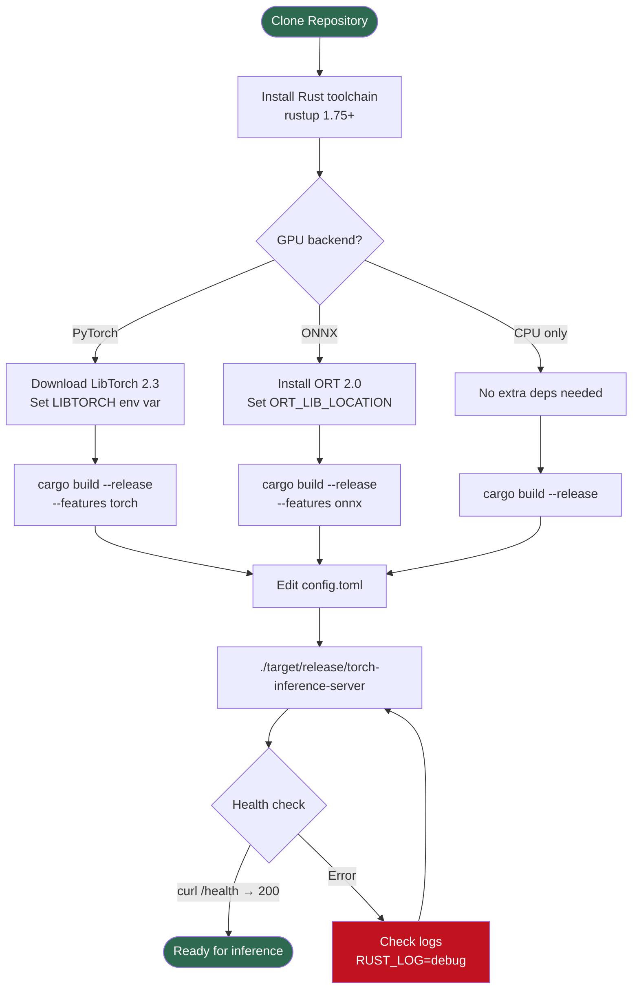
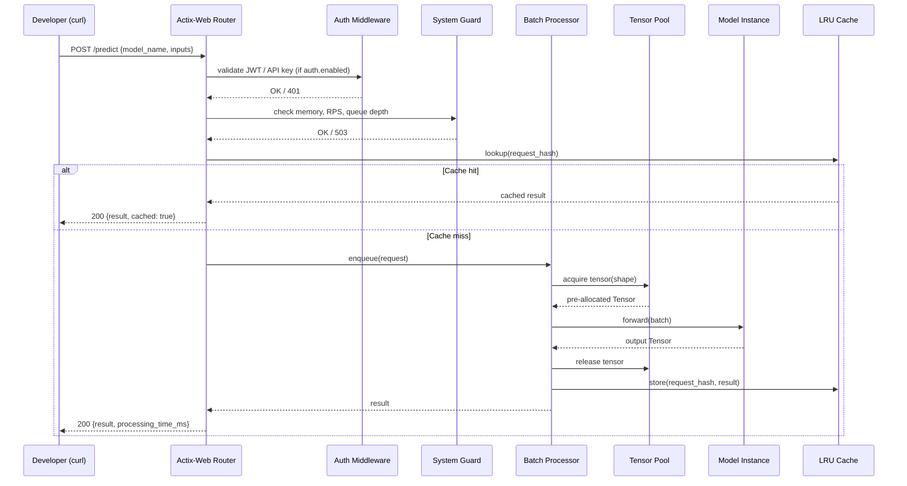

# Developer Quickstart

Get `torch-inference` compiling and serving inference requests in under 10 minutes. This guide targets developers building on or contributing to the server.

## Setup Flow



## Prerequisites

| Tool | Version | Notes |
|------|---------|-------|
| Rust toolchain | 1.75+ (2021 edition) | `rustup update stable` |
| LibTorch | 2.3.0 | Required for `--features torch` |
| ONNX Runtime | 2.0.0-rc.10 | Required for `--features onnx` (default) |
| CUDA toolkit | 12.x | Optional — GPU acceleration |
| Xcode CLT / gcc | any recent | macOS / Linux native toolchain |

Check your Rust version:

```bash
rustc --version   # should be >= 1.75
cargo --version
```

## 1. Clone

```bash
git clone https://github.com/Evintkoo/torch-inference.git
cd torch-inference
```

## 2. Install ML Backend Dependencies

### ONNX Runtime (default, no extra setup needed)

The crate `ort = "2.0.0-rc.10"` uses `load-dynamic` and bundles its own libraries via `copy-dylibs`. Nothing extra is required for a CPU-only ONNX build.

For a custom ORT install, set:

```bash
export ORT_LIB_LOCATION=/path/to/onnxruntime/lib
```

### LibTorch (for `--features torch`)

```bash
# Download LibTorch 2.3.0 (CPU)
wget https://download.pytorch.org/libtorch/cpu/libtorch-cxx11-abi-shared-with-deps-2.3.0%2Bcpu.zip
unzip libtorch-cxx11-abi-shared-with-deps-2.3.0+cpu.zip

# CUDA variant (replace cpu with cu121)
# wget https://download.pytorch.org/libtorch/cu121/libtorch-cxx11-abi-shared-with-deps-2.3.0%2Bcu121.zip

export LIBTORCH=$(pwd)/libtorch
export LD_LIBRARY_PATH=${LIBTORCH}/lib:$LD_LIBRARY_PATH
```

## 3. Build

```bash
# Default — ONNX backend (CoreML fused on macOS)
cargo build --release

# PyTorch / tch-rs backend
cargo build --release --features torch

# Both backends simultaneously
cargo build --release --features torch,onnx

# Include Prometheus metrics endpoint
cargo build --release --features prometheus

# candle (experimental)
cargo build --release --features candle
```

Feature flag reference:

| Flag | Crate | Use case |
|------|-------|----------|
| `torch` | `tch 0.16` | tch-rs / LibTorch inference |
| `onnx` | `ort 2.0` | ONNX Runtime inference (default) |
| `candle` | `candle-core 0.8` | Pure-Rust inference (experimental) |
| `prometheus` | `prometheus 0.13` | Prometheus `/metrics` endpoint |

## 4. Minimal `config.toml`

```toml
[server]
host = "0.0.0.0"
port = 8080
log_level = "info"
workers = 4

[device]
device_type = "auto"   # auto | cpu | cuda | metal | mps
use_fp16 = false

[batch]
max_batch_size = 8
enable_dynamic_batching = true

[performance]
enable_caching = true
cache_size_mb = 512
enable_tensor_pooling = true
enable_worker_pool = true
min_workers = 2
max_workers = 8

[auth]
enabled = false           # set true + jwt_secret for production

[models]
cache_dir = "models"
max_loaded_models = 3

[guard]
enable_guards = true
max_memory_mb = 4096
max_requests_per_second = 500
```

Point the server at a custom path with `CONFIG_PATH`:

```bash
CONFIG_PATH=./config.toml ./target/release/torch-inference-server
```

## 5. Run

```bash
# Default (reads config.toml in CWD)
RUST_LOG=info ./target/release/torch-inference-server

# Debug mode
RUST_LOG=debug ./target/release/torch-inference-server

# Override port via env
SERVER__PORT=9090 ./target/release/torch-inference-server
```

## 6. Verify with cURL

```bash
# Health check
curl -s http://localhost:8080/health | jq .

# System info
curl -s http://localhost:8080/info | jq .

# List loaded models
curl -s http://localhost:8080/models | jq .

# Download a model
curl -s -X POST http://localhost:8080/models/download \
  -H "Content-Type: application/json" \
  -d '{
    "source": "local",
    "model_id": "example",
    "name": "example"
  }' | jq .

# Run inference
curl -s -X POST http://localhost:8080/predict \
  -H "Content-Type: application/json" \
  -d '{
    "model_name": "example",
    "inputs": [1.0, 2.0, 3.0, 4.0, 5.0]
  }' | jq .
```

## First Inference — Request Flow



## Common First-Run Issues

### `LIBTORCH not found` (torch feature)

```
error: could not find native library `torch`
```

**Fix:** Export `LIBTORCH` before building:

```bash
export LIBTORCH=/path/to/libtorch
export LD_LIBRARY_PATH=$LIBTORCH/lib:$LD_LIBRARY_PATH
cargo build --release --features torch
```

### `ORT dylib not found` at runtime

```
thread 'main' panicked at 'Failed to load onnxruntime'
```

**Fix:** The `copy-dylibs` feature copies the ORT shared library next to the binary. Ensure you run from `target/release/` or set `LD_LIBRARY_PATH` to include it.

### Port already in use

```
ERROR actix_server::builder - Cannot bind 0.0.0.0:8080
```

**Fix:**

```bash
# Find the occupying process
lsof -i :8080
# Then change port in config.toml or:
SERVER__PORT=8090 ./target/release/torch-inference-server
```

### `config.toml` not found

The server starts with built-in defaults if no config file is found, but it logs a warning. To silence it:

```bash
CONFIG_PATH=/absolute/path/to/config.toml ./target/release/torch-inference-server
```

### Compile errors after `git pull`

```bash
cargo clean && cargo build --release
```

## Run Tests

```bash
# Unit + integration tests
cargo test

# Run with output visible
cargo test -- --nocapture

# Specific test module
cargo test model_pool

# Lints
cargo clippy -- -D warnings
```

## Next Steps

- **[Installation Guide](installation.md)** — platform-specific builds, Docker, CUDA
- **[Configuration Reference](configuration.md)** — every config.toml key explained
- **[Optimization Guide](optimization.md)** — batch tuning, tensor pool, worker pool
- **[API Reference](../api/rest-api.md)** — all endpoints with full schemas
