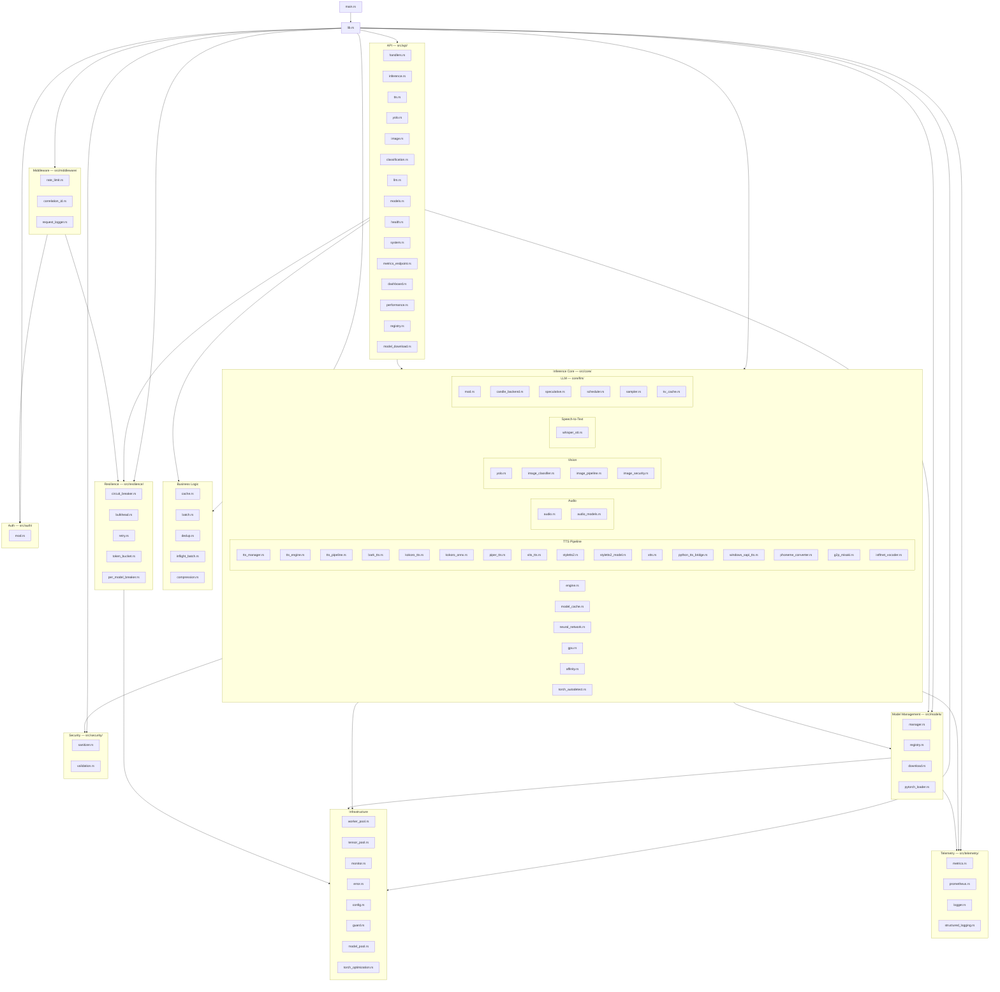

# Module Map

Complete module inventory for `torch-inference`. All paths are relative to `src/`.

---

## Dependency Graph

```mermaid
graph TD
    main["main.rs"] --> lib["lib.rs"]

    subgraph API["API — src/api/"]
        handlers["handlers.rs"]
        inference_h["inference.rs"]
        tts_h["tts.rs"]
        yolo_h["yolo.rs"]
        image_h["image.rs"]
        class_h["classification.rs"]
        llm_h["llm.rs"]
        models_h["models.rs"]
        health_h["health.rs"]
        sys_h["system.rs"]
        metrics_h["metrics_endpoint.rs"]
        dash_h["dashboard.rs"]
        perf_h["performance.rs"]
        reg_h["registry.rs"]
        dl_h["model_download.rs"]
    end

    subgraph MW["Middleware — src/middleware/"]
        rl["rate_limit.rs"]
        cid["correlation_id.rs"]
        rlog["request_logger.rs"]
    end

    subgraph BL["Business Logic"]
        cache["cache.rs"]
        batch["batch.rs"]
        dedup["dedup.rs"]
        infl["inflight_batch.rs"]
        comp["compression.rs"]
    end

    subgraph Res["Resilience — src/resilience/"]
        cb["circuit_breaker.rs"]
        bh["bulkhead.rs"]
        retry["retry.rs"]
        tb["token_bucket.rs"]
        pmb["per_model_breaker.rs"]
    end

    subgraph Core["Inference Core — src/core/"]
        engine["engine.rs"]
        mc["model_cache.rs"]
        nn["neural_network.rs"]
        gpu["gpu.rs"]
        aff["affinity.rs"]
        tad["torch_autodetect.rs"]

        subgraph TTS["TTS Pipeline"]
            tts_mgr["tts_manager.rs"]
            tts_eng["tts_engine.rs"]
            tts_pipe["tts_pipeline.rs"]
            bark["bark_tts.rs"]
            kokoro["kokoro_tts.rs"]
            kokoro_o["kokoro_onnx.rs"]
            piper["piper_tts.rs"]
            vits["vits_tts.rs"]
            style2["styletts2.rs"]
            style2m["styletts2_model.rs"]
            xtts["xtts.rs"]
            pyb["python_tts_bridge.rs"]
            wsapi["windows_sapi_tts.rs"]
            phoneme["phoneme_converter.rs"]
            g2p["g2p_misaki.rs"]
            vocoder["istftnet_vocoder.rs"]
        end

        subgraph Audio["Audio"]
            audio["audio.rs"]
            audio_m["audio_models.rs"]
        end

        subgraph Vision["Vision"]
            yolo["yolo.rs"]
            imgcls["image_classifier.rs"]
            imgpipe["image_pipeline.rs"]
            imgsec["image_security.rs"]
        end

        subgraph STT["Speech-to-Text"]
            whisper["whisper_stt.rs"]
        end

        subgraph LLM["LLM — core/llm/"]
            llm_mod["mod.rs"]
            candle["candle_backend.rs"]
            spec["speculative.rs"]
            sched["scheduler.rs"]
            sampler["sampler.rs"]
            kvc["kv_cache.rs"]
        end
    end

    subgraph Models["Model Management — src/models/"]
        mgr["manager.rs"]
        regm["registry.rs"]
        dl["download.rs"]
        ptl["pytorch_loader.rs"]
    end

    subgraph Infra["Infrastructure"]
        wp["worker_pool.rs"]
        tp["tensor_pool.rs"]
        mon["monitor.rs"]
        err["error.rs"]
        cfg["config.rs"]
        guard["guard.rs"]
        mp["model_pool.rs"]
        topt["torch_optimization.rs"]
    end

    subgraph Tel["Telemetry — src/telemetry/"]
        metrics["metrics.rs"]
        prom["prometheus.rs"]
        logger["logger.rs"]
        slog["structured_logging.rs"]
    end

    subgraph Sec["Security — src/security/"]
        san["sanitizer.rs"]
        val["validation.rs"]
    end

    subgraph Auth["Auth — src/auth/"]
        auth["mod.rs"]
    end

    lib --> API & MW & BL & Res & Core & Models & Infra & Tel & Sec & Auth
    API --> BL & Res & Core & Models
    Core --> Models & Infra & Tel & Sec
    Models --> Infra & Tel
    MW --> Auth & Res
    Res --> Infra
```

---

## Module Table

| Module | Source File | Key Struct | Purpose | Dependencies |
|---|---|---|---|---|
| **cache** | `src/cache.rs` | `Cache`, `BytesCacheEntry` | Dual-store LRU + TTL in-memory cache, zero-copy `Arc<Bytes>` path | `dashmap`, `bytes`, `serde_json` |
| **batch** | `src/batch.rs` | `BatchProcessor`, `BatchRequest` | Adaptive request batching; queue-depth-aware timeout | `parking_lot`, `serde_json` |
| **dedup** | `src/dedup.rs` | `RequestDeduplicator`, `DeduplicationEntry` | LRU request deduplication with FNV-1a key hashing | `lru`, `parking_lot`, `serde_json` |
| **inflight_batch** | `src/inflight_batch.rs` | `InflightBatch` | In-flight request coalescing | `dashmap`, `tokio` |
| **compression** | `src/compression.rs` | — | Gzip response compression | `flate2` |
| **circuit_breaker** | `src/resilience/circuit_breaker.rs` | `CircuitBreaker`, `CircuitBreakerConfig` | Closed/Open/HalfOpen failure protection | `parking_lot` |
| **bulkhead** | `src/resilience/bulkhead.rs` | `Bulkhead`, `BulkheadConfig` | Semaphore-based concurrency cap | `tokio::sync::Semaphore` |
| **retry** | `src/resilience/retry.rs` | `RetryPolicy` | Exponential backoff + jitter | `tokio::time`, `rand` |
| **token_bucket** | `src/resilience/token_bucket.rs` | `TokenBucket`, `KeyedRateLimiter` | Per-key token-bucket rate limiting | `parking_lot`, `dashmap` |
| **per_model_breaker** | `src/resilience/per_model_breaker.rs` | `CircuitBreakerRegistry` | Per-model circuit breaker map | `dashmap`, `circuit_breaker` |
| **engine** | `src/core/engine.rs` | `InferenceEngine` | Inference dispatch: sanitize → route → metrics | `models/manager`, `security`, `telemetry` |
| **model_cache** | `src/core/model_cache.rs` | `ModelCache` | Loaded-model LRU cache | `dashmap` |
| **neural_network** | `src/core/neural_network.rs` | `NeuralNetwork` | Generic NN wrapper (tch-rs) | `tch` |
| **gpu** | `src/core/gpu.rs` | `GpuManager` | CUDA/Metal device detection + selection | `tch` |
| **affinity** | `src/core/affinity.rs` | — | CPU/GPU thread affinity hints | OS APIs |
| **torch_autodetect** | `src/core/torch_autodetect.rs` | — | Runtime PyTorch backend detection | `tch` |
| **tts_manager** | `src/core/tts_manager.rs` | `TtsManager` | TTS engine registry + dispatch | `tts_engine`, `tts_pipeline` |
| **tts_engine** | `src/core/tts_engine.rs` | `TtsEngine` | Backend-agnostic TTS trait | all TTS backends |
| **tts_pipeline** | `src/core/tts_pipeline.rs` | `TtsPipeline` | Text → phonemes → audio pipeline | `phoneme_converter`, `vocoder` |
| **bark_tts** | `src/core/bark_tts.rs` | `BarkTts` | Bark TTS backend (PyTorch) | `tch` |
| **kokoro_tts** | `src/core/kokoro_tts.rs` | `KokoroTts` | Kokoro TTS backend | `tch` |
| **kokoro_onnx** | `src/core/kokoro_onnx.rs` | `KokoroOnnx` | Kokoro via ONNX Runtime | `ort` |
| **piper_tts** | `src/core/piper_tts.rs` | `PiperTts` | Piper TTS backend | subprocess / lib |
| **vits_tts** | `src/core/vits_tts.rs` | `VitsTts` | VITS TTS backend (PyTorch) | `tch` |
| **styletts2** | `src/core/styletts2.rs` | `StyleTts2` | StyleTTS2 inference | `tch` |
| **styletts2_model** | `src/core/styletts2_model.rs` | `StyleTts2Model` | StyleTTS2 model definition | `tch` |
| **xtts** | `src/core/xtts.rs` | `XTts` | Coqui XTTS backend | `python_tts_bridge` |
| **python_tts_bridge** | `src/core/python_tts_bridge.rs` | `PythonTtsBridge` | Python subprocess bridge for TTS | `std::process` |
| **windows_sapi_tts** | `src/core/windows_sapi_tts.rs` | `WindowsSapiTts` | Windows SAPI TTS (win32 only) | Windows COM |
| **phoneme_converter** | `src/core/phoneme_converter.rs` | `PhonemeConverter` | Text → phoneme sequence | `g2p_misaki` |
| **g2p_misaki** | `src/core/g2p_misaki.rs` | `G2pMisaki` | Grapheme-to-phoneme (Misaki) | ONNX / rules |
| **istftnet_vocoder** | `src/core/istftnet_vocoder.rs` | `IstftNetVocoder` | iSTFT-Net neural vocoder | `tch` / `ort` |
| **audio** | `src/core/audio.rs` | `AudioProcessor` | Audio encoding/decoding (WAV/MP3) | `hound`, `symphonia` |
| **audio_models** | `src/core/audio_models.rs` | `AudioModel` | Audio model data types | `serde` |
| **yolo** | `src/core/yolo.rs` | `YoloDetector` | YOLOv8/v11 object detection | `tch` / `ort` |
| **image_classifier** | `src/core/image_classifier.rs` | `ImageClassifier` | Top-k classification | `tch` / `ort` |
| **image_pipeline** | `src/core/image_pipeline.rs` | `ImagePipeline` | Resize → normalize → tensor | `image` crate |
| **image_security** | `src/core/image_security.rs` | `ImageSecurity` | Image format validation, size caps | `image` crate |
| **whisper_stt** | `src/core/whisper_stt.rs` | `WhisperStt` | Whisper speech-to-text | `tch` / `ort` |
| **llm/mod** | `src/core/llm/mod.rs` | `LlmEngine` | LLM inference orchestrator | `candle`, `kv_cache` |
| **llm/candle_backend** | `src/core/llm/candle_backend.rs` | `CandleBackend` | Candle tensor ops for LLM | `candle-core` |
| **llm/speculative** | `src/core/llm/speculative.rs` | `SpeculativeDecoder` | Draft-model speculative decoding | `candle`, `sampler` |
| **llm/scheduler** | `src/core/llm/scheduler.rs` | `LlmScheduler` | Continuous batching scheduler | `tokio` |
| **llm/sampler** | `src/core/llm/sampler.rs` | `TokenSampler` | Top-p / top-k / temperature | — |
| **llm/kv_cache** | `src/core/llm/kv_cache.rs` | `KvCache` | Key-value cache for transformer attention | `candle-core` |
| **models/manager** | `src/models/manager.rs` | `ModelManager` | Model load/unload/infer dispatcher | `registry`, `onnx_loader`, `pytorch_loader`, `tensor_pool` |
| **models/registry** | `src/models/registry.rs` | `ModelRegistry`, `ModelMetadata` | Model metadata catalog | `dashmap` |
| **models/download** | `src/models/download.rs` | `ModelDownloader` | HTTP model download + verify | `reqwest` |
| **models/pytorch_loader** | `src/models/pytorch_loader.rs` | `PyTorchModelLoader` | Load `.pt`/`.pth` via tch-rs | `tch` |
| **worker_pool** | `src/worker_pool.rs` | `WorkerPool`, `Worker` | Async worker pool, `AtomicU8` state | `tokio`, `parking_lot` |
| **tensor_pool** | `src/tensor_pool.rs` | `TensorPool`, `TensorShape` | `Vec<f32>` object pool by shape | `dashmap` |
| **monitor** | `src/monitor.rs` | `Monitor` | System health aggregator | all subsystems |
| **error** | `src/error.rs` | `InferenceError`, `ApiError` | Typed errors with `thiserror`; `ResponseError` impl | `actix-web`, `thiserror` |
| **config** | `src/config.rs` | `Config` | Deserialised config (TOML/YAML + env) | `serde`, `config` crate |
| **security/sanitizer** | `src/security/sanitizer.rs` | `Sanitizer` | XSS/injection strip, length limits | `serde_json` |
| **security/validation** | `src/security/validation.rs` | — | Size, type, path traversal checks | `serde_json` |
| **auth** | `src/auth/mod.rs` | `AuthMiddleware` | JWT validation, API-key check | `jsonwebtoken` |
| **middleware/rate_limit** | `src/middleware/rate_limit.rs` | `RateLimitMiddleware` | Per-IP/key token bucket | `token_bucket` |
| **middleware/correlation_id** | `src/middleware/correlation_id.rs` | `CorrelationIdMiddleware` | Inject `X-Correlation-ID` | `uuid` |
| **middleware/request_logger** | `src/middleware/request_logger.rs` | `RequestLoggerMiddleware` | Structured access log | `tracing` |
| **telemetry/metrics** | `src/telemetry/metrics.rs` | `MetricsCollector` | Per-model inference metrics | `dashmap`, `chrono` |
| **telemetry/prometheus** | `src/telemetry/prometheus.rs` | — | Prometheus text format export | `prometheus` crate |
| **telemetry/logger** | `src/telemetry/logger.rs` | — | `tracing` subscriber init | `tracing-subscriber` |
| **telemetry/structured_logging** | `src/telemetry/structured_logging.rs` | — | JSON log format | `tracing-subscriber` |
| **model_pool** | `src/model_pool.rs` | `ModelPool` | Multi-instance model pool | `dashmap` |
| **guard** | `src/guard.rs` | `Guard` | Request guard (auth + rate-limit combined) | `auth`, `resilience` |
| **torch_optimization** | `src/torch_optimization.rs` | — | PyTorch JIT / TorchScript compile hints | `tch` |

---

## Detailed Module Docs

- [`modules/core/`](core/) — per-subsystem deep-dives (TTS, Vision, LLM, Audio)

---

**See also**: [Architecture](../ARCHITECTURE.md) · [Components](../COMPONENTS.md)
