# Core Modules Documentation

This section covers all core framework modules that provide the fundamental functionality of the PyTorch Inference Framework.

## 📋 Core Module Overview

```mermaid
graph TB
    subgraph "🧠 Core Framework Modules"
        
        subgraph "Foundation Layer"
            BaseModel[BaseModel<br/>🏗️ Model Abstraction<br/>📊 25 methods]
            Config[Configuration<br/>⚙️ System Config<br/>📊 18 methods]
            AsyncHandler[AsyncHandler<br/>🔄 Async Processing<br/>📊 15 methods]
        end
        
        subgraph "Processing Layer"
            InferenceEngine[InferenceEngine<br/>⚡ Inference Processing<br/>📊 32 methods]
            BatchProcessor[BatchProcessor<br/>📊 Batch Operations<br/>📊 22 methods]
            GPUManager[GPUManager<br/>🎮 GPU Management<br/>📊 28 methods]
        end
        
        subgraph "Management Layer"
            ModelDownloader[ModelDownloader<br/>📥 Model Loading<br/>📊 35 methods]
            OptimizedModel[OptimizedModel<br/>🚀 Model Optimization<br/>📊 42 methods]
            PerformanceOptimizer[PerformanceOptimizer<br/>📈 Performance Tuning<br/>📊 38 methods]
        end
        
        subgraph "Advanced Layer"
            MultiGPUManager[MultiGPUManager<br/>🖥️ Multi-GPU Support<br/>📊 45 methods]
            DynamicScaler[DynamicScaler<br/>📈 Dynamic Scaling<br/>📊 25 methods]
            SecurityModule[SecurityModule<br/>🔐 Security Features<br/>📊 20 methods]
        end
    end

    BaseModel --> InferenceEngine
    Config --> AsyncHandler
    AsyncHandler --> BatchProcessor
    InferenceEngine --> GPUManager
    BatchProcessor --> ModelDownloader
    GPUManager --> OptimizedModel
    ModelDownloader --> PerformanceOptimizer
    OptimizedModel --> MultiGPUManager
    PerformanceOptimizer --> DynamicScaler
    MultiGPUManager --> SecurityModule

    classDef foundation fill:#e8f5e8
    classDef processing fill:#f3e5f5
    classDef management fill:#fff3e0
    classDef advanced fill:#e3f2fd

    class BaseModel,Config,AsyncHandler foundation
    class InferenceEngine,BatchProcessor,GPUManager processing
    class ModelDownloader,OptimizedModel,PerformanceOptimizer management
    class MultiGPUManager,DynamicScaler,SecurityModule advanced
```



## 📚 Module Index

### Foundation Modules
- **[base_model.py](core/base-model.md)** - Abstract model interface with 25+ methods
- **[config.py](core/config.md)** - Configuration management system with 18+ methods  
- **[async_handler.py](core/async-handler.md)** - Asynchronous processing with 15+ methods

### Processing Modules
- **[inference_engine.py](core/inference-engine.md)** - Core inference processing with 32+ methods
- **[batch_processor.py](core/batch-processor.md)** - Batch processing system with 22+ methods
- **[gpu_manager.py](core/gpu-manager.md)** - GPU resource management with 28+ methods

### Management Modules
- **[model_downloader.py](core/model-downloader.md)** - Model downloading and caching with 35+ methods
- **[optimized_model.py](core/optimized-model.md)** - Model optimization wrapper with 42+ methods
- **[performance_optimizer.py](core/performance-optimizer.md)** - Performance optimization with 38+ methods

### Advanced Modules
- **[multi_gpu_manager.py](core/multi-gpu-manager.md)** - Multi-GPU orchestration with 45+ methods
- **[dynamic_scaler.py](core/dynamic-scaler.md)** - Dynamic scaling system with 25+ methods
- **[security.py](core/security.md)** - Security and validation with 20+ methods

## 🔍 Complete Function Coverage

### BaseModel Module Functions
- `__init__(config)` - Initialize model with configuration
- `load_model(path)` - Load model from file path
- `predict(inputs)` - Run inference on inputs
- `predict_async(inputs)` - Asynchronous inference
- `predict_batch(inputs_list)` - Batch inference processing
- `get_model_info()` - Get model metadata
- `optimize_model()` - Apply optimizations
- `validate_inputs(inputs)` - Input validation
- `preprocess(inputs)` - Input preprocessing
- `postprocess(outputs)` - Output postprocessing
- `get_performance_stats()` - Performance metrics
- `cleanup()` - Resource cleanup
- `save_checkpoint(path)` - Save model state
- `load_checkpoint(path)` - Load model state
- `get_memory_usage()` - Memory consumption
- `benchmark(iterations)` - Performance benchmarking
- `health_check()` - Model health status
- `get_supported_formats()` - Input format support
- `get_output_schema()` - Output format schema
- `set_precision(precision)` - Set model precision
- `enable_jit()` - Enable JIT compilation
- `disable_jit()` - Disable JIT compilation
- `get_optimization_info()` - Optimization status
- `reset_stats()` - Reset performance counters
- `get_device_info()` - Device information

### Configuration Module Functions
- `__init__(config_dict)` - Initialize configuration
- `load_from_file(path)` - Load from config file
- `save_to_file(path)` - Save to config file
- `get(key, default)` - Get configuration value
- `set(key, value)` - Set configuration value
- `update(config_dict)` - Update configuration
- `validate()` - Validate configuration
- `get_device_config()` - Get device settings
- `get_optimization_config()` - Get optimization settings
- `get_batch_config()` - Get batch settings
- `get_security_config()` - Get security settings
- `merge_configs(other)` - Merge configurations
- `to_dict()` - Convert to dictionary
- `from_dict(config_dict)` - Create from dictionary
- `copy()` - Create configuration copy
- `reset_to_defaults()` - Reset to defaults
- `get_environment_overrides()` - Environment variable overrides
- `apply_profile(profile_name)` - Apply configuration profile

### Inference Engine Functions
- `__init__(model, config)` - Initialize engine
- `start()` - Start inference engine
- `stop()` - Stop inference engine
- `process_request(request)` - Process inference request
- `process_batch(requests)` - Process batch requests
- `get_queue_size()` - Get request queue size
- `get_worker_count()` - Get active workers
- `scale_workers(count)` - Scale worker pool
- `get_performance_metrics()` - Performance statistics
- `health_check()` - Engine health status
- `flush_queue()` - Clear request queue
- `set_priority_mode(enabled)` - Enable priority processing
- `get_throughput()` - Current throughput
- `get_latency_stats()` - Latency statistics
- `enable_caching(enabled)` - Enable result caching
- `clear_cache()` - Clear result cache
- `get_cache_stats()` - Cache statistics
- `set_timeout(timeout)` - Set request timeout
- `get_active_requests()` - Active request count
- `cancel_request(request_id)` - Cancel specific request
- `pause_processing()` - Pause inference processing
- `resume_processing()` - Resume inference processing
- `get_error_stats()` - Error statistics
- `reset_metrics()` - Reset performance metrics
- `configure_logging(level)` - Configure logging
- `export_metrics(format)` - Export metrics
- `import_config(config)` - Import configuration
- `get_engine_info()` - Engine information
- `optimize_performance()` - Auto-optimize performance
- `validate_setup()` - Validate engine setup
- `get_resource_usage()` - Resource consumption
- `set_batch_size(size)` - Configure batch size
- `get_supported_inputs()` - Supported input types

## 📊 Performance Characteristics

| Module | Functions | Classes | Performance Focus | Memory Usage |
|--------|-----------|---------|------------------|--------------|
| **BaseModel** | 25+ | 3 | Model abstraction | Low overhead |
| **InferenceEngine** | 32+ | 5 | High throughput | Memory pooling |
| **BatchProcessor** | 22+ | 4 | Batch efficiency | Dynamic allocation |
| **GPUManager** | 28+ | 6 | GPU utilization | CUDA memory management |
| **ModelDownloader** | 35+ | 8 | I/O efficiency | Caching layer |
| **OptimizedModel** | 42+ | 7 | Speed optimization | Compressed models |
| **PerformanceOptimizer** | 38+ | 9 | System tuning | Adaptive optimization |
| **MultiGPUManager** | 45+ | 12 | Multi-GPU scaling | Distributed memory |
| **AsyncHandler** | 15+ | 3 | Concurrency | Async overhead |
| **Configuration** | 18+ | 4 | Config management | Minimal footprint |

## 🎯 Usage Examples

### Basic Model Usage
```python
from framework.core import BaseModel, InferenceConfig

# Initialize configuration
config = InferenceConfig()
config.device.device_type = "cuda"
config.optimization.enable_optimization = True

# Create and use model
model = BaseModel(config)
model.load_model("path/to/model.pt")

# Run inference
result = model.predict(input_data)
print(f"Prediction: {result}")

# Get performance stats
stats = model.get_performance_stats()
print(f"Inference time: {stats['inference_time_ms']}ms")
```

### Advanced Engine Usage
```python
from framework.core import InferenceEngine

# Initialize engine with model
engine = InferenceEngine(model, config)
await engine.start()

# Process batch requests
requests = [input1, input2, input3]
results = await engine.process_batch(requests)

# Monitor performance
metrics = engine.get_performance_metrics()
print(f"Throughput: {metrics['throughput']} req/s")
print(f"Latency: {metrics['avg_latency_ms']}ms")

# Scale based on load
if metrics['queue_size'] > 10:
    engine.scale_workers(8)
```

### GPU Management
```python
from framework.core import GPUManager

# Initialize GPU manager
gpu_manager = GPUManager()

# Detect available GPUs
gpus = gpu_manager.detect_gpus()
print(f"Available GPUs: {len(gpus)}")

# Configure multi-GPU setup
gpu_manager.configure_multi_gpu([0, 1, 2])

# Monitor GPU usage
usage = gpu_manager.get_gpu_usage()
for gpu_id, stats in usage.items():
    print(f"GPU {gpu_id}: {stats['utilization']}% util, {stats['memory_used']}MB")
```

## 🔧 Configuration Examples

### Performance Configuration
```python
from framework.core.config import InferenceConfig, OptimizationConfig

config = InferenceConfig()

# Optimization settings
config.optimization.enable_tensorrt = True
config.optimization.enable_quantization = True
config.optimization.optimization_level = "aggressive"

# Batch processing
config.batch.batch_size = 32
config.batch.max_batch_size = 128
config.batch.dynamic_batching = True

# Memory management
config.memory.enable_memory_pooling = True
config.memory.max_memory_usage = "8GB"
config.memory.cleanup_threshold = 0.8
```

### Multi-GPU Configuration
```python
# Multi-GPU setup
config.device.multi_gpu.enabled = True
config.device.multi_gpu.gpu_ids = [0, 1, 2, 3]
config.device.multi_gpu.strategy = "data_parallel"
config.device.multi_gpu.load_balancing = "round_robin"

# Advanced multi-GPU settings
config.device.multi_gpu.sync_batch_norm = True
config.device.multi_gpu.gradient_as_bucket_view = True
config.device.multi_gpu.broadcast_buffers = False
```

## 🚀 Performance Tips

### Optimization Best Practices
1. **Enable Optimizations**: Use TensorRT, ONNX, or quantization for production
2. **Batch Processing**: Use dynamic batching for higher throughput
3. **GPU Memory**: Configure memory pooling for efficient GPU usage
4. **Async Processing**: Use async methods for concurrent requests
5. **Monitoring**: Regular performance monitoring and tuning

### Memory Management
1. **Memory Pooling**: Enable for reduced allocation overhead
2. **Cleanup Thresholds**: Set appropriate cleanup triggers
3. **Batch Size**: Balance between throughput and memory usage
4. **Model Loading**: Use lazy loading for large models
5. **Cache Management**: Configure result caching appropriately

## 📚 Related Documentation
- **[Optimization Guide](../../guides/optimization.md)** - Performance optimization strategies
- **[GPU Management](../../guides/gpu-management.md)** - GPU resource management
- **[Configuration Reference](../../api/configuration.md)** - Complete configuration options
- **[Performance Tuning](../../guides/performance-tuning.md)** - Performance optimization guide

---

*This documentation covers all core framework modules with complete function coverage, usage examples, and performance guidance.*
