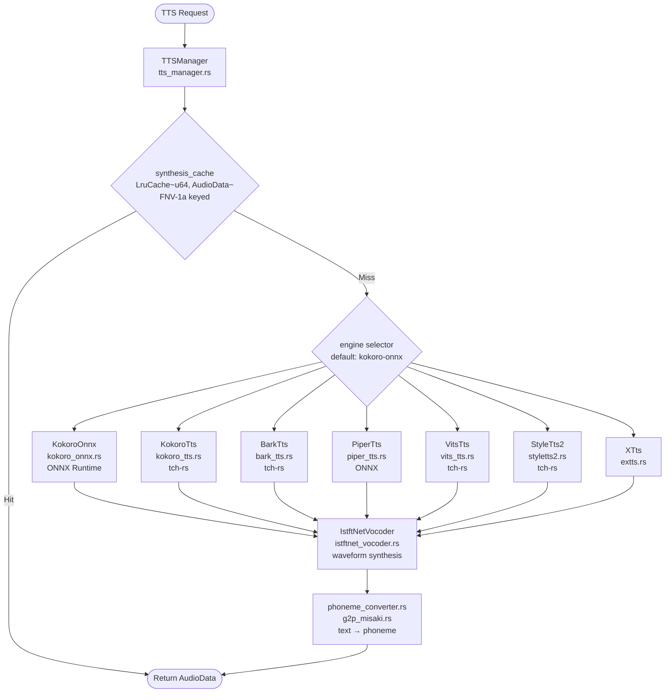
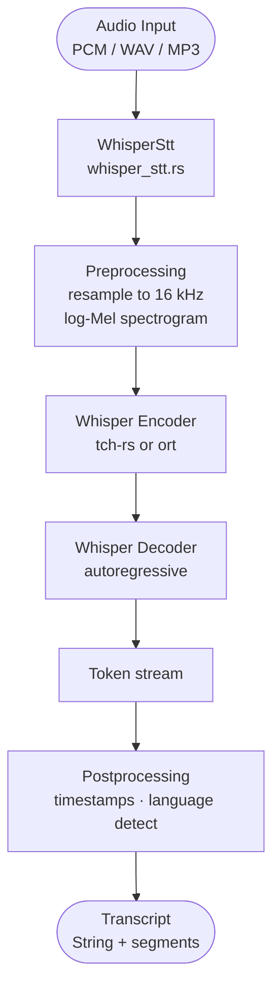
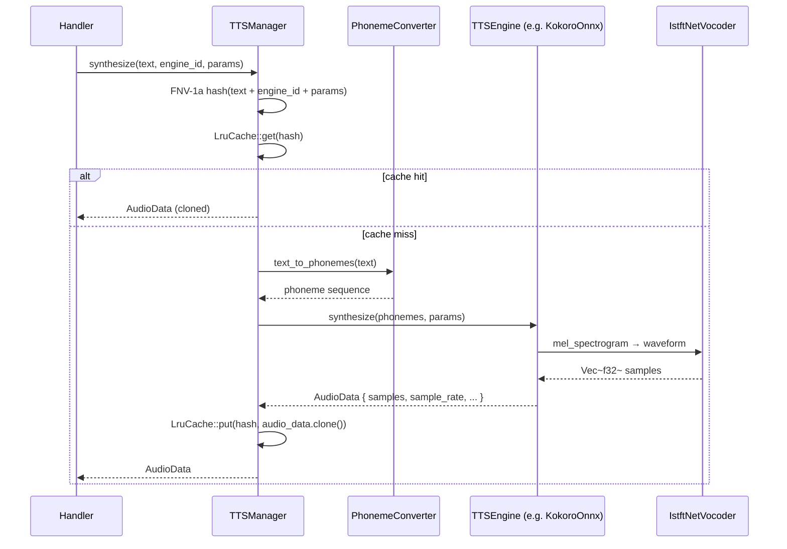
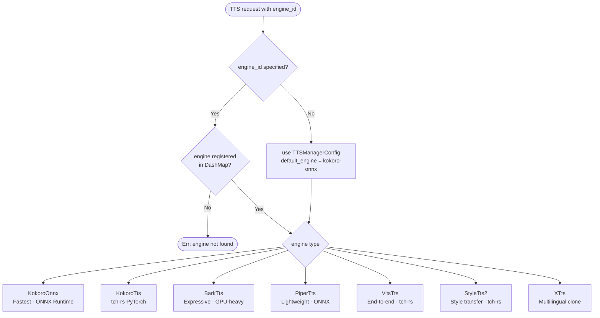

# `core::audio` — Audio Systems (TTS & STT)

`src/core/tts_manager.rs` · `src/core/tts_engine.rs` · `src/core/tts_pipeline.rs` · `src/core/bark_tts.rs` · `src/core/kokoro_tts.rs` · `src/core/kokoro_onnx.rs` · `src/core/piper_tts.rs` · `src/core/vits_tts.rs` · `src/core/styletts2.rs` · `src/core/whisper_stt.rs` · `src/core/istftnet_vocoder.rs` · `src/core/phoneme_converter.rs` · `src/core/g2p_misaki.rs`

The audio subsystem provides text-to-speech (TTS) via a multi-engine manager and speech-to-text (STT) via a Whisper pipeline. All engines implement the `TTSEngine` async trait.

---

## TTS Subsystem Architecture



---

## STT Pipeline



---

## TTS Synthesis Request Sequence



---

## TTS Backend Selection Flowchart



---

## Key Modules

### `tts_manager.rs` — `TTSManager`

| Item | Description |
|---|---|
| `TTSManagerConfig` | `default_engine: String`, `cache_dir: PathBuf`, `max_concurrent_requests: usize` (default 10), `synthesis_cache_capacity: usize` (default 128). |
| `TTSManager` | Owns `engines: DashMap<String, Arc<dyn TTSEngine>>` and `synthesis_cache: Mutex<LruCache<u64, AudioData>>`. |
| Cache key | FNV-1a hash of `(text + engine_id + serialized params)` — same algorithm as `src/dedup.rs`. |
| `synthesize` | Main entry: cache lookup → phoneme conversion → engine dispatch → cache store. |

### `tts_engine.rs` — `TTSEngine` trait

```rust
#[async_trait]
pub trait TTSEngine: Send + Sync {
    async fn synthesize(&self, text: &str, params: &SynthesisParams) -> Result<AudioData>;
    fn capabilities(&self) -> EngineCapabilities;
    fn engine_id(&self) -> &str;
}
```

`SynthesisParams`: `speed: f32`, `pitch: f32`, `voice: Option<String>`, `language: Option<String>`.

`EngineCapabilities`: `name`, `version`, `supported_languages`, `supported_voices: Vec<VoiceInfo>`, `max_text_length: usize`, `sample_rate: u32`, `supports_ssml: bool`, `supports_streaming: bool`.

### `phoneme_converter.rs` & `g2p_misaki.rs`

Text normalisation and grapheme-to-phoneme (G2P) conversion. `g2p_misaki.rs` wraps the Misaki G2P model for high-quality English phoneme sequences. Used by KokoroTts and StyleTts2.

### `istftnet_vocoder.rs`

iSTFTNet vocoder: converts mel-spectrogram outputs from acoustic models into time-domain PCM waveforms. Used as a shared vocoder component by several backends.

### `whisper_stt.rs`

Whisper ASR: resamples input audio to 16 kHz, computes log-Mel spectrogram, and runs the encoder-decoder Transformer via tch-rs or ort. Returns timestamped transcript segments.

---

## `AudioData` Struct

```rust
pub struct AudioData {
    pub samples: Vec<f32>,   // PCM samples, normalised to [-1.0, 1.0]
    pub sample_rate: u32,    // typically 22050 or 24000 Hz
    pub channels: u32,       // 1 = mono
    pub duration_secs: f32,
}
```

Cache hits return `AudioData` by clone (the `Vec<f32>` is heap-allocated and clones in O(n) — use `synthesis_cache_capacity` to balance memory vs. clone cost).

---

## Usage Example

```rust
use crate::core::tts_manager::{TTSManager, TTSManagerConfig};
use crate::core::tts_engine::SynthesisParams;

#[tokio::main]
async fn main() -> anyhow::Result<()> {
    let config = TTSManagerConfig::default(); // default_engine = "kokoro-onnx"
    let manager = TTSManager::new(config);

    // Register an engine (done at startup via TTSEngineFactory)
    // manager.register_engine("kokoro-onnx", Arc::new(KokoroOnnx::new(...)?));

    let params = SynthesisParams {
        speed: 1.0,
        pitch: 1.0,
        voice: Some("af_heart".to_string()),
        language: Some("en-us".to_string()),
    };

    let audio = manager.synthesize("Hello, world!", "kokoro-onnx", &params).await?;
    println!("Generated {:.2}s of audio at {}Hz", audio.duration_secs, audio.sample_rate);
    Ok(())
}
```
