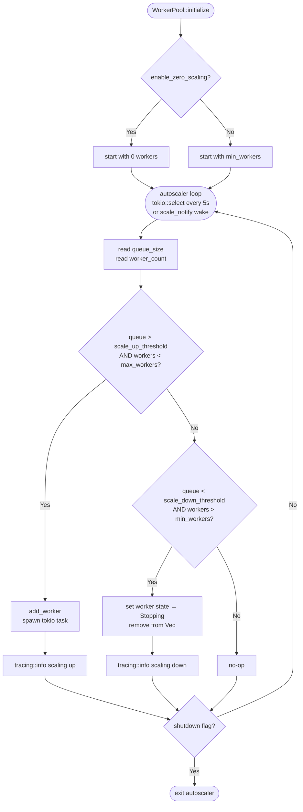

# `worker_pool` — Autoscaling Worker Pool

`src/worker_pool.rs`

The worker pool implements an async autoscaler that manages a dynamic set of `Worker` tasks backed by Tokio. Each `Worker` tracks its state via a lock-free `AtomicU8`, and the pool's autoscaler loop adjusts worker count based on queue depth every 5 seconds (or on explicit `scale_notify` wake).

---

## Autoscaling Control Loop



---

## Worker State Transitions

```mermaid
stateDiagram-v2
    [*] --> Idle : Worker::new()\nAtomicU8 = 0

    Idle --> Processing : task acquired\nset_state(Processing)
    Processing --> Idle : task complete\nrecord_task(elapsed_ms)\nset_state(Idle)

    Idle --> Paused : pause signal\nset_state(Paused)
    Processing --> Paused : pause signal\nset_state(Paused)
    Paused --> Idle : resume signal\nset_state(Idle)

    Idle --> Stopping : autoscaler scale-down\nor shutdown\nset_state(Stopping)
    Processing --> Stopping : shutdown signal
    Paused --> Stopping : shutdown signal

    Stopping --> Stopped : JoinHandle completes\nset_state(Stopped)
    Stopped --> [*]
```

---

## WorkerPool Scaling Algorithm

```mermaid
flowchart TD
    T([ticker: every 5s or scale_notify]) --> Q[queue_size = AtomicUsize::load]
    Q --> W[worker_count = workers.read\(\).len\(\)]

    W --> CHK_UP{queue_size\n> scale_up_threshold?}
    CHK_UP -- No --> CHK_DN
    CHK_UP -- Yes --> MAXCHK{worker_count\n< max_workers?}
    MAXCHK -- No --> CHK_DN[check scale-down]
    MAXCHK -- Yes --> ADD[add_worker\nnew Worker\ntokio::spawn]
    ADD --> CHK_DN

    CHK_DN --> CHK_DN2{queue_size\n< scale_down_threshold?}
    CHK_DN2 -- No --> DONE([next tick])
    CHK_DN2 -- Yes --> MINCHK{worker_count\n> min_workers?}
    MINCHK -- No --> DONE
    MINCHK -- Yes --> REM[find Idle worker\nset state → Stopping\nremove from pool]
    REM --> DONE
```

**Config knobs** (`WorkerPoolConfig`):

| Field | Effect |
|---|---|
| `min_workers` | Floor — never scale below this count. |
| `max_workers` | Ceiling — never spawn beyond this count. |
| `scale_up_threshold` | `queue_size > N` triggers scale-up. |
| `scale_down_threshold` | `queue_size < N` triggers scale-down. |
| `enable_auto_scaling` | Master switch for the autoscaler loop. |
| `enable_zero_scaling` | Start at 0; first request wakes the scaler. |

---

## `WorkerState` Enum Reference

| Variant | `AtomicU8` value | Meaning |
|---|---|---|
| `Idle` | `0` | Worker is waiting for a task. Eligible for scale-down. |
| `Processing` | `1` | Worker is executing an inference task. |
| `Paused` | `2` | Worker has been administratively paused (no tasks accepted). |
| `Stopping` | `3` | Drain signal sent; worker will complete current task then stop. |
| `Stopped` | `4` | Worker has exited its loop; `JoinHandle` has resolved. |

State is stored as `Arc<AtomicU8>` with `Ordering::Release` on write and `Ordering::Acquire` on read, ensuring visibility across threads without a mutex.

---

## `WorkerStats` Fields

Returned by `Worker::get_stats()` and exposed via the metrics API.

| Field | Type | Description |
|---|---|---|
| `worker_id` | `usize` | Unique ID assigned at `Worker::new(id)`. |
| `state` | `WorkerState` | Current state decoded from `AtomicU8`. |
| `tasks_processed` | `u64` | Total tasks completed (`AtomicU64`). |
| `total_processing_time_ms` | `u64` | Cumulative wall-clock time in processing state. |
| `avg_processing_time_ms` | `u64` | `total_processing_time_ms / tasks_processed` (0 if no tasks). |
| `last_active` | `Option<Instant>` | Wall-clock time of last `record_task` call. Used by scaler to identify stale workers. |
| `uptime_secs` | `u64` | Seconds since `Worker::new()` was called. |

**Scaling decisions** derived from `WorkerStats`:

- `avg_processing_time_ms` rising → increase `scale_up_threshold` dynamically or add workers.
- `last_active` stale + `state == Idle` → prime candidate for scale-down removal.
- `tasks_processed == 0` + old `uptime_secs` → worker never used; safe to retire under zero-scaling.

---

## `WorkerPool` Struct

```rust
pub struct WorkerPool {
    config: WorkerPoolConfig,
    workers: Arc<RwLock<Vec<Arc<Worker>>>>,   // parking_lot RwLock
    total_tasks: AtomicU64,
    failed_tasks: AtomicU64,
    queue_size: AtomicUsize,
    shutdown: Arc<AtomicBool>,
    scale_notify: Arc<Notify>,                // tokio::sync::Notify
    semaphore: Arc<Semaphore>,                // tokio::sync::Semaphore (max_workers permits)
    idle_workers: Arc<Mutex<Vec<usize>>>,     // parking_lot Mutex
}
```

`WorkerPool::new` returns `Arc<Self>` — the pool is always reference-counted so it can be shared between the HTTP handler layer and the autoscaler tokio task.

---

## Usage Example

```rust
use crate::worker_pool::{WorkerPool, WorkerPoolConfig};

#[tokio::main]
async fn main() -> anyhow::Result<()> {
    let config = WorkerPoolConfig {
        min_workers: 2,
        max_workers: 16,
        scale_up_threshold: 10,
        scale_down_threshold: 2,
        enable_auto_scaling: true,
        enable_zero_scaling: false,
    };

    let pool = WorkerPool::new(config);
    pool.initialize().await.map_err(|e| anyhow::anyhow!(e))?;

    // Pool is now running; submit tasks via pool.submit(...)
    // The autoscaler loop runs in its own tokio task.
    Ok(())
}
```
