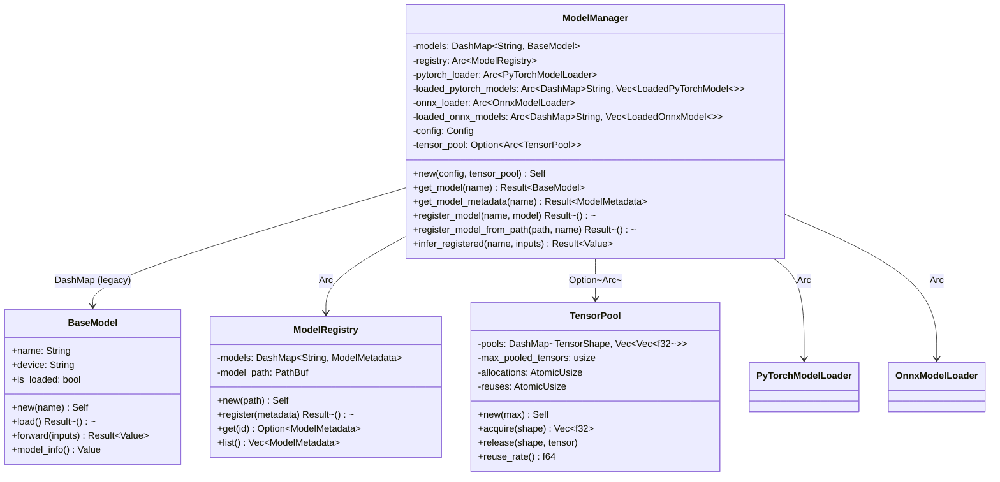
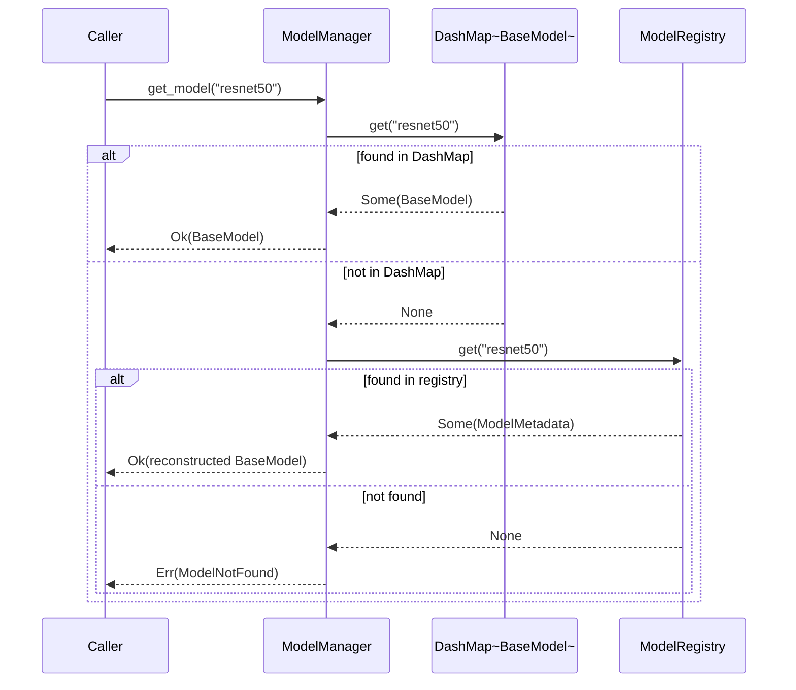

# `models::manager` — BaseModel & ModelManager

`src/models/manager.rs`

`BaseModel` is the concrete model wrapper stored in `ModelManager`'s `DashMap`. `ModelManager` owns both the legacy `DashMap<String, BaseModel>` for runtime-registered models and an `Arc<ModelRegistry>` for file-backed models discovered via path registration.

---

## Class Diagram


```mermaid
classDiagram
    class BaseModel {
        +name: String
        +device: String
        +is_loaded: bool
        +new(name) Self
        +load() Result~()~
        +forward(inputs) Result~Value~
        +model_info() Value
    }

    class ModelManager {
        -models: DashMap~String, BaseModel~
        -registry: Arc~ModelRegistry~
        -pytorch_loader: Arc~PyTorchModelLoader~
        -loaded_pytorch_models: Arc~DashMap~String, Vec~LoadedPyTorchModel~~~
        -onnx_loader: Arc~OnnxModelLoader~
        -loaded_onnx_models: Arc~DashMap~String, Vec~LoadedOnnxModel~~~
        -config: Config
        -tensor_pool: Option~Arc~TensorPool~~
        +new(config, tensor_pool) Self
        +get_model(name) Result~BaseModel~
        +get_model_metadata(name) Result~ModelMetadata~
        +register_model(name, model) Result~()~
        +register_model_from_path(path, name) Result~()~
        +infer_registered(name, inputs) Result~Value~
    }

    class ModelRegistry {
        -models: DashMap~String, ModelMetadata~
        -model_path: PathBuf
        +new(path) Self
        +register(metadata) Result~()~
        +get(id) Option~ModelMetadata~
        +list() Vec~ModelMetadata~
    }

    class TensorPool {
        -pools: DashMap~TensorShape, Vec~Vec~f32~~~
        -max_pooled_tensors: usize
        -allocations: AtomicUsize
        -reuses: AtomicUsize
        +new(max) Self
        +acquire(shape) Vec~f32~
        +release(shape, tensor)
        +reuse_rate() f64
    }

    ModelManager --> BaseModel : DashMap (legacy)
    ModelManager --> ModelRegistry : Arc
    ModelManager --> TensorPool : Option~Arc~
    ModelManager --> PyTorchModelLoader : Arc
    ModelManager --> OnnxModelLoader : Arc
```

---

## Model Lifecycle State Diagram

```mermaid
stateDiagram-v2
    [*] --> Unloaded : BaseModel::new()

    Unloaded --> Loading : load() called
    Loading --> Loaded : is_loaded = true\ntracing::info elapsed_ms
    Loading --> Unloaded : Err returned

    Loaded --> Inferring : forward() called
    Inferring --> Loaded : Ok(result) returned
    Inferring --> Loaded : Err(InferenceFailed)

    Unloaded --> Inferring : forward() while !is_loaded
    Inferring --> [*] : Err(ModelLoadError\n"Model not loaded")
```

---

## `ModelManager.get_model` Sequence Diagram


```mermaid
sequenceDiagram
    participant C as Caller
    participant MM as ModelManager
    participant DM as DashMap~BaseModel~
    participant REG as ModelRegistry

    C->>MM: get_model("resnet50")

    MM->>DM: get("resnet50")
    alt found in DashMap
        DM-->>MM: Some(BaseModel)
        MM-->>C: Ok(BaseModel)
    else not in DashMap
        DM-->>MM: None
        MM->>REG: get("resnet50")
        alt found in registry
            REG-->>MM: Some(ModelMetadata)
            MM-->>C: Ok(reconstructed BaseModel)
        else not found
            REG-->>MM: None
            MM-->>C: Err(ModelNotFound)
        end
    end
```

---

## Public API

| Method | Signature | Purpose |
|---|---|---|
| `BaseModel::new` | `(name: String) -> Self` | Create unloaded model; device defaults to `"cpu"`. |
| `BaseModel::load` | `async (&mut self) -> Result<()>` | Sets `is_loaded = true`; logs elapsed ms via `tracing`. |
| `BaseModel::forward` | `async (&self, inputs: &Value) -> Result<Value>` | Returns `Err(ModelLoadError)` if `!is_loaded`; otherwise echoes inputs (override for real inference). |
| `BaseModel::model_info` | `(&self) -> Value` | Returns `{"name", "device", "loaded"}` JSON. |
| `ModelManager::new` | `(config: &Config, tensor_pool: Option<Arc<TensorPool>>) -> Self` | Constructs manager; creates `PyTorchModelLoader` and `OnnxModelLoader` from config device type. |
| `ModelManager::get_model` | `(&self, name: &str) -> Result<BaseModel>` | Lookup by name in legacy DashMap; returns cloned `BaseModel`. |
| `ModelManager::register_model` | `async (&self, name: String, model: BaseModel) -> Result<()>` | Insert into legacy DashMap. |
| `ModelManager::register_model_from_path` | `async (&self, path: &Path, name: Option<String>) -> Result<()>` | Detect format from extension, insert into `ModelRegistry`. |
| `ModelManager::infer_registered` | `async (&self, name: &str, inputs: &Value) -> Result<Value>` | Dispatch to ONNX or PyTorch loader based on `ModelMetadata.format`. |

---

## DashMap Concurrent Access Patterns

`DashMap` uses per-shard `RwLock`s, making all reads and writes lock-free at the map level. Key rules in this codebase:

- **Never hold a `DashMap` reference (`.get()`) across an `.await` point.** The shard lock is held for the lifetime of the reference; holding it across an await risks deadlock with another task on the same thread.
- **Clone before await.** `BaseModel` derives `Clone`, so callers should `.clone()` the value and immediately drop the guard:

```rust
// Correct: clone and drop guard before await
let model = manager.get_model("my-model")?.clone();
let result = model.forward(&inputs).await?;

// Wrong: guard held across await
let guard = manager.models.get("my-model").unwrap();
let result = guard.forward(&inputs).await?; // shard lock held!
```

- **`infer_registered` uses separate `DashMap` pools** (`loaded_pytorch_models`, `loaded_onnx_models`) keyed by model name, each holding a `Vec` of pre-loaded sessions. Callers acquire a session by index and release it after inference.

---

## Usage Example

```rust
use std::sync::Arc;
use crate::config::Config;
use crate::models::manager::{BaseModel, ModelManager};

#[tokio::main]
async fn main() -> anyhow::Result<()> {
    let config = Config::load()?;
    let manager = Arc::new(ModelManager::new(&config, None));

    // Register and load a model manually
    let mut model = BaseModel::new("my-classifier".to_string());
    model.load().await?;
    manager.register_model("my-classifier".to_string(), model).await?;

    // Later: retrieve and run inference
    let model = manager.get_model("my-classifier")?;
    let output = model.forward(&serde_json::json!({"image": "..."})).await?;
    println!("{}", output);
    Ok(())
}
```
