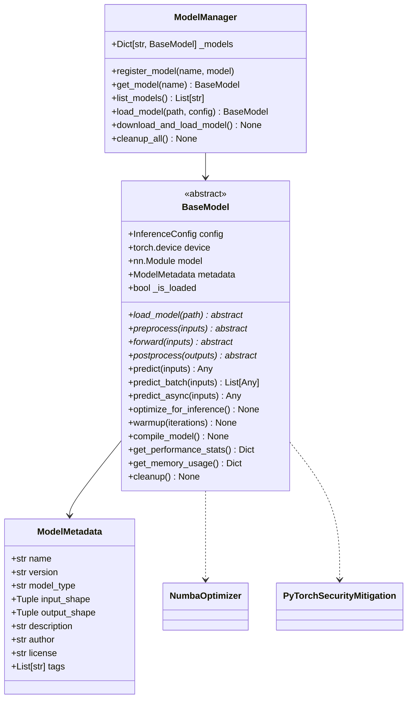

# BaseModel Module Documentation

## Overview

The `BaseModel` class is the core abstract base class for all model implementations in the PyTorch Inference Framework. It provides a standardized interface, comprehensive optimization capabilities, and advanced performance monitoring features.

## 📊 Module Architecture



## 🔧 Core Classes

### BaseModel (Abstract Base Class)

The main abstract base class that all model implementations must inherit from.

#### Key Features
- **Abstract Interface**: Standardized methods for all models
- **Performance Optimization**: Automatic optimization for inference
- **Memory Management**: Efficient tensor caching and memory pooling
- **Async Support**: Asynchronous inference capabilities
- **Batch Processing**: Intelligent batching with dynamic sizing
- **Monitoring**: Comprehensive performance statistics
- **Security**: Integration with security mitigations
- **JIT Acceleration**: Numba optimizer support

#### Constructor
```python
def __init__(self, config: InferenceConfig)
```

**Parameters:**
- `config`: InferenceConfig - Configuration object containing device, optimization, and batch settings

**Initialization Features:**
- Device configuration and setup
- Performance monitoring initialization
- Caching systems setup (tensor cache, preprocessing cache, postprocessing cache)
- Async processing executor creation
- Numba optimizer initialization (if available)
- Security mitigation setup (if available)

### ModelMetadata

Data class containing model information and metadata.

```python
@dataclass
class ModelMetadata:
    name: str
    version: str
    model_type: str
    input_shape: Tuple[int, ...]
    output_shape: Tuple[int, ...]
    description: Optional[str] = None
    author: Optional[str] = None
    license: Optional[str] = None
    tags: List[str] = None
```

### ModelManager

Centralized manager for handling multiple model instances and their lifecycle.

## 📋 Complete Method Reference

### Abstract Methods (Must be Implemented)

#### `load_model(model_path: Union[str, Path]) -> None`
Load the model from the given path.

**Parameters:**
- `model_path`: Path to the model file

**Raises:**
- `ModelLoadError`: If model loading fails

**Implementation Requirements:**
- Load the PyTorch model from the specified path
- Set `self.model` to the loaded model
- Set `self._is_loaded = True` on success
- Handle various model formats (`.pth`, `.pt`, `.pkl`, etc.)

#### `preprocess(inputs: Any) -> torch.Tensor`
Preprocess inputs before inference.

**Parameters:**
- `inputs`: Raw inputs (images, text, audio, etc.)

**Returns:**
- `torch.Tensor`: Preprocessed tensor ready for model inference

**Implementation Requirements:**
- Convert inputs to appropriate tensor format
- Apply normalization, resizing, or other preprocessing
- Ensure output is on correct device
- Handle batch dimensions correctly

#### `forward(inputs: torch.Tensor) -> torch.Tensor`
Run forward pass through the model.

**Parameters:**
- `inputs`: Preprocessed input tensor

**Returns:**
- `torch.Tensor`: Raw model outputs

**Implementation Requirements:**
- Execute model inference
- Handle compiled vs non-compiled models
- Apply proper precision (FP16/FP32/BF16)
- Use appropriate inference context

#### `postprocess(outputs: torch.Tensor) -> Any`
Postprocess model outputs.

**Parameters:**
- `outputs`: Raw model outputs

**Returns:**
- `Any`: Processed outputs in desired format

**Implementation Requirements:**
- Convert tensors to appropriate output format
- Apply activation functions (softmax, sigmoid, etc.)
- Format results for end-user consumption
- Handle classification labels, bounding boxes, etc.

### Core Inference Methods

#### `predict(inputs: Any) -> Any`
Complete prediction pipeline with caching and monitoring.

**Features:**
- **Input Caching**: Caches preprocessing results for identical inputs
- **Performance Monitoring**: Tracks timing for all pipeline stages
- **Error Handling**: Comprehensive error handling with fallback strategies
- **Optimization Context**: Uses optimal inference context (autocast, channels_last)
- **Output Caching**: Caches postprocessing results when beneficial

**Pipeline Flow:**
1. Input validation and hash computation
2. Preprocessing with caching
3. Forward pass with optimization context
4. Postprocessing with caching
5. Performance statistics update

```python
# Usage example
model = MyModel(config)
model.load_model("path/to/model.pt")
result = model.predict(input_data)
```

#### `predict_batch(inputs: List[Any]) -> List[Any]`
Batch prediction with automatic batching.

**Features:**
- **Dynamic Batching**: Automatically splits large batches
- **Memory Management**: Calculates optimal batch sizes
- **Fallback Processing**: Handles batch processing failures gracefully

**Parameters:**
- `inputs`: List of raw inputs

**Returns:**
- `List[Any]`: List of predictions in same order

#### `predict_batch_optimized(inputs: List[Any]) -> List[Any]`
Advanced batch prediction with complexity sorting.

**Features:**
- **Complexity Sorting**: Sorts inputs by processing complexity
- **Optimal Batching**: Calculates memory-optimal batch sizes
- **Order Preservation**: Maintains original input order in results

#### `predict_async(inputs: Any) -> Any`
Asynchronous prediction using thread executor.

**Returns:**
- `Awaitable[Any]`: Async prediction result

```python
# Usage example
result = await model.predict_async(input_data)
```

### Optimization Methods

#### `optimize_for_inference() -> None`
Apply comprehensive optimizations for maximum inference performance.

**Optimization Categories:**

1. **Model State Optimization**
   - Set model to evaluation mode
   - Move to target device
   - Disable gradient computation

2. **GPU Compute Optimization** (`_optimize_gpu_compute`)
   - Enable TF32 for Ampere+ GPUs
   - Configure Tensor Core utilization
   - Enable Flash Attention (if available)
   - Set optimal matmul precision

3. **CUDNN Optimization**
   - Enable benchmark mode for consistent input sizes
   - Configure deterministic behavior
   - Enable TF32 for CUDNN operations

4. **Memory Format Optimization**
   - Convert to channels_last for conv-heavy models
   - Optimize memory access patterns

5. **CPU Threading Optimization** (`_optimize_cpu_threads`)
   - Dynamic thread allocation based on model size
   - Optimal intra-op and inter-op thread configuration

6. **CUDA Memory Optimization** (`_optimize_cuda_memory`)
   - Configure memory fraction usage
   - Set memory allocator parameters
   - Pre-allocate stability buffer

7. **Model Fusion** (`_apply_model_fusion`)
   - Detect fusible Conv-BN-ReLU patterns
   - Apply layer-specific optimizations
   - Optimize dropout and batch norm layers

8. **Compilation** (`compile_model`)
   - Apply torch.compile with optimal settings
   - Handle compilation errors gracefully
   - Choose appropriate backend and mode

9. **Quantization** (`_apply_quantization`)
   - Apply dynamic quantization for CPU inference
   - Support for various quantization schemes

#### `compile_model() -> None`
Compile the model using torch.compile for optimization.

**Features:**
- **Mode Selection**: Chooses optimal compile mode (`max-autotune`, `reduce-overhead`, `default`)
- **Error Handling**: Graceful fallback when compilation fails
- **Backend Selection**: Automatic backend selection based on device
- **Dependency Detection**: Handles missing Triton/Inductor dependencies

**Compile Options:**
```python
compile_options = {
    'mode': 'reduce-overhead',  # or 'max-autotune', 'default'
    'fullgraph': False,         # More compatible
    'dynamic': False,           # Static shapes for optimization
    'backend': 'inductor'       # For CUDA devices
}
```

#### `warmup(num_iterations: int = None) -> None`
Warm up the model with dummy inputs.

**Features:**
- **Automatic Input Generation**: Creates appropriate dummy inputs
- **Compilation Warmup**: Triggers compilation during warmup
- **Error Recovery**: Handles compilation errors during warmup
- **Device-Aware**: Creates inputs with correct dtype and device

**Process:**
1. Generate dummy input based on model architecture
2. Run multiple inference iterations
3. Handle compilation errors and fallback
4. Log warmup completion and any issues

### Performance Monitoring

#### `get_performance_stats() -> Dict[str, Any]`
Get detailed performance statistics for all operations.

**Returns:**
```python
{
    'predict_time': {
        'count': 100,
        'mean': 0.025,
        'min': 0.020,
        'max': 0.035,
        'p95': 0.030
    },
    'preprocess_time': {...},
    'forward_time': {...},
    'postprocess_time': {...},
    'predict_memory': {...},  # CUDA only
    'error_counts': {
        'ModelInferenceError': 2,
        'RuntimeError': 1
    }
}
```

#### `reset_stats() -> None`
Reset all performance statistics and error counts.

#### `get_memory_usage() -> Dict[str, float]`
Get comprehensive memory usage information.

**Returns:**
```python
{
    'gpu_allocated_mb': 1024.5,     # CUDA memory allocated
    'gpu_reserved_mb': 2048.0,      # CUDA memory reserved
    'gpu_max_allocated_mb': 1536.2, # Peak CUDA memory
    'cpu_memory_mb': 512.3,         # CPU memory (if psutil available)
    'total_params': 25000000,       # Total model parameters
    'trainable_params': 25000000,   # Trainable parameters
    'model_size_mb': 95.4          # Estimated model size
}
```

### Model State Management

#### `save_optimized_state(path: Union[str, Path]) -> None`
Save optimized model state for faster loading.

**Saves:**
- Model state dictionary
- Configuration settings
- Optimization flags and cache statistics
- Human-readable optimization info (JSON)

#### `load_optimized_state(path: Union[str, Path]) -> bool`
Load previously saved optimized model state.

**Returns:**
- `bool`: True if successfully loaded, False otherwise

#### `cleanup() -> None`
Cleanup resources and clear CUDA cache.

**Operations:**
- Clear CUDA memory cache
- Handle active CUDA graph captures
- Reset internal caches

### Utility Methods

#### `_create_dummy_input() -> torch.Tensor`
Create appropriate dummy input for warmup based on model architecture.

**Input Detection Strategy:**
1. **Architecture Analysis**: Examines first layer type (Conv2d, Conv1d, Linear)
2. **Shape Inference**: Determines appropriate input dimensions
3. **Dtype Selection**: Uses model parameter dtype or config settings
4. **Device Placement**: Ensures input is on correct device

**Supported Architectures:**
- **CNN (Conv2d)**: Creates `(1, channels, 64, 64)` image-like input
- **1D CNN (Conv1d)**: Creates `(1, channels, 64)` sequence-like input
- **MLP (Linear)**: Creates `(1, features)` flat input
- **Generic**: Falls back to `(1, 3, 64, 64)` for unknown architectures

#### `_calculate_optimal_batch_size(sample_input: Any) -> int`
Calculate optimal batch size based on available memory and input complexity.

**Calculation Method:**
1. Estimate memory per sample
2. Calculate available GPU memory (30% of total)
3. Apply safety factor (4x)
4. Return memory-constrained batch size

#### `_get_inference_context()`
Get optimal inference context based on configuration.

**Context Selection:**
- **CUDA + FP16**: Uses `torch.amp.autocast('cuda', dtype=torch.float16)`
- **Other**: Uses `torch.inference_mode()`

### Caching System

#### `_get_cached_tensor(shape: Tuple[int, ...], dtype: torch.dtype) -> torch.Tensor`
Get or create cached tensor for common shapes.

**Features:**
- **Shape-based Caching**: Caches tensors by shape, dtype, and device
- **Weak References**: Uses WeakValueDictionary to prevent memory leaks
- **Automatic Cleanup**: Tensors are garbage collected when not in use

#### `_compute_input_hash(inputs: Any) -> str`
Compute hash for input caching with fallback strategies.

#### `_compute_tensor_hash(tensor: torch.Tensor) -> str`
Compute hash for tensor caching using tensor properties.

### Properties

#### `is_loaded: bool`
Property to check and set model loaded status.

```python
# Check if model is loaded
if model.is_loaded:
    result = model.predict(input_data)

# Set loaded status (typically done in load_model)
model.is_loaded = True
```

#### `model_info: Dict[str, Any]`
Comprehensive model information including metadata, memory usage, and parameters.

**Returns:**
```python
{
    "loaded": True,
    "device": "cuda:0",
    "config": InferenceConfig(...),
    "metadata": {
        "model_type": "pytorch",
        "input_shape": (3, 224, 224),
        "output_shape": (1000,),
        "num_parameters": 25000000
    },
    "memory_usage": {...},
    "total_parameters": 25000000,
    "trainable_parameters": 25000000
}
```

## 🎯 ModelManager Class

### Overview
Centralized manager for handling multiple model instances, lifecycle management, and model downloading.

### Key Methods

#### `register_model(name: str, model: BaseModel) -> None`
Register a model instance with a given name.

#### `get_model(name: str) -> BaseModel`
Retrieve a registered model by name.

#### `list_models() -> List[str]`
Get list of all registered model names.

#### `load_model(model_path: Union[str, Path], config: InferenceConfig) -> BaseModel`
Load a model with automatic adapter selection and security mitigations.

**Process:**
1. Create appropriate model adapter using ModelAdapterFactory
2. Apply security context if available
3. Load, optimize, and warmup model
4. Register model in manager
5. Return loaded model instance

#### `download_and_load_model(source, model_id, name, config, **kwargs) -> None`
Download and load models from various sources.

**Supported Sources:**
- **pytorch_hub**: PyTorch Hub models (`repo/model` format)
- **torchvision**: Torchvision pretrained models
- **huggingface**: Hugging Face Hub models
- **url**: Direct URL downloads

**Features:**
- **Post-download Optimization**: Automatic optimization after download
- **Progress Tracking**: Download progress monitoring
- **Metadata Preservation**: Maintains model metadata and optimization reports

#### `cleanup_all() -> None`
Cleanup all registered models and free resources.

### Global Manager Access

```python
from framework.core.base_model import get_model_manager

# Get global manager instance
manager = get_model_manager()

# Register and use models
manager.register_model("my_model", model)
loaded_model = manager.get_model("my_model")
```

## 🚀 Usage Examples

### Basic Model Implementation

```python
from framework.core.base_model import BaseModel
from framework.core.config import InferenceConfig
import torch
import torch.nn as nn

class MyImageModel(BaseModel):
    def load_model(self, model_path):
        """Load PyTorch model from path."""
        self.model = torch.load(model_path, map_location=self.device)
        self.model.eval()
        self._is_loaded = True
        
    def preprocess(self, inputs):
        """Preprocess image inputs."""
        # Convert PIL/numpy to tensor
        if hasattr(inputs, 'convert'):  # PIL Image
            inputs = transforms.ToTensor()(inputs)
        
        # Normalize
        inputs = transforms.Normalize(
            mean=[0.485, 0.456, 0.406],
            std=[0.229, 0.224, 0.225]
        )(inputs)
        
        # Add batch dimension and move to device
        return inputs.unsqueeze(0).to(self.device)
        
    def forward(self, inputs):
        """Run model inference."""
        model = self.get_model_for_inference()
        with torch.no_grad():
            return model(inputs)
            
    def postprocess(self, outputs):
        """Process model outputs."""
        probabilities = torch.softmax(outputs, dim=1)
        predicted_class = torch.argmax(probabilities, dim=1)
        return {
            'class': predicted_class.item(),
            'confidence': probabilities.max().item(),
            'probabilities': probabilities.squeeze().tolist()
        }

# Usage
config = InferenceConfig()
config.device.device_type = "cuda"
config.device.use_torch_compile = True

model = MyImageModel(config)
model.load_model("path/to/model.pth")

# Single prediction
result = model.predict(image)
print(f"Predicted class: {result['class']}")

# Batch prediction
results = model.predict_batch([image1, image2, image3])

# Async prediction
result = await model.predict_async(image)

# Performance monitoring
stats = model.get_performance_stats()
print(f"Average inference time: {stats['predict_time']['mean']:.3f}s")

# Memory usage
memory = model.get_memory_usage()
print(f"GPU memory: {memory['gpu_allocated_mb']:.1f}MB")
```

### Advanced Optimization Example

```python
# Create model with advanced configuration
config = InferenceConfig()
config.device.device_type = "cuda"
config.device.use_torch_compile = True
config.device.compile_mode = "max-autotune"
config.device.use_fp16 = True
config.batch.batch_size = 32
config.batch.dynamic_batching = True

model = MyImageModel(config)
model.load_model("path/to/model.pth")

# Apply comprehensive optimizations
model.optimize_for_inference()

# Warmup for optimal performance
model.warmup(num_iterations=10)

# Save optimized state for faster loading
model.save_optimized_state("path/to/optimized/")

# Later: load optimized state
if model.load_optimized_state("path/to/optimized/"):
    print("Loaded optimized model state")
```

### Model Manager Usage

```python
from framework.core.base_model import get_model_manager

manager = get_model_manager()

# Download and load from PyTorch Hub
manager.download_and_load_model(
    source="pytorch_hub",
    model_id="pytorch/vision:v0.10.0/resnet18",
    name="resnet18",
    config=config,
    pretrained=True
)

# Download from Hugging Face
manager.download_and_load_model(
    source="huggingface",
    model_id="microsoft/resnet-50",
    name="resnet50_hf",
    config=config
)

# Use loaded models
resnet18 = manager.get_model("resnet18")
result = resnet18.predict(image)

# List all models
models = manager.list_models()
print(f"Available models: {models}")

# Cleanup
manager.cleanup_all()
```

## 🔧 Configuration Integration

### Device Configuration
```python
config.device.device_type = "cuda"           # Device type
config.device.device_index = 0               # GPU index
config.device.use_fp16 = True                # Half precision
config.device.use_torch_compile = True       # Enable compilation
config.device.compile_mode = "reduce-overhead" # Compile mode
config.device.memory_fraction = 0.8          # GPU memory limit
```

### Optimization Configuration
```python
config.optimization.enable_optimization = True    # Enable optimizations
config.optimization.enable_tensorrt = False       # TensorRT optimization
config.optimization.enable_quantization = False   # Dynamic quantization
config.optimization.optimization_level = "aggressive" # Optimization level
```

### Batch Configuration
```python
config.batch.batch_size = 16                 # Default batch size
config.batch.max_batch_size = 64            # Maximum batch size
config.batch.dynamic_batching = True        # Enable dynamic batching
config.batch.timeout_ms = 50               # Batch timeout
```

### Performance Configuration
```python
config.performance.warmup_iterations = 5     # Warmup iterations
config.performance.enable_profiling = False  # Performance profiling
config.performance.log_memory_usage = True  # Memory usage logging
```

## ⚡ Performance Tips

### Memory Optimization
1. **Enable Memory Pooling**: Use `config.device.memory_fraction` to limit GPU memory
2. **Batch Size Tuning**: Use dynamic batching for variable memory usage
3. **Clear Caches**: Regular cleanup with `model.cleanup()`
4. **Channels Last**: Automatically applied for CNN models

### Inference Speed
1. **Model Compilation**: Enable `torch.compile` for 20-50% speedup
2. **Mixed Precision**: Use FP16 on compatible GPUs
3. **Warmup**: Always warmup models before benchmarking
4. **Optimal Batch Size**: Use memory-optimized batch sizing

### Error Handling
1. **Graceful Degradation**: Framework handles compilation failures automatically
2. **Fallback Strategies**: Multiple fallback paths for robustness
3. **Comprehensive Logging**: Detailed error reporting and debugging info

## 🔒 Security Features

### Security Mitigations
- **Secure Loading**: Protected model loading with security contexts
- **Input Validation**: Comprehensive input validation and sanitization
- **Resource Limits**: Memory and compute resource limiting
- **Error Isolation**: Isolated error handling to prevent information leakage

### Best Practices
1. **Use Security Context**: Always load models through ModelManager for security
2. **Validate Inputs**: Implement thorough input validation in preprocessing
3. **Monitor Resources**: Regular monitoring of memory and compute usage
4. **Error Handling**: Proper error handling without information disclosure

## 📚 Related Documentation

- **[Configuration Guide](../config.md)** - Complete configuration options
- **[Model Adapters](../adapters/model-adapters.md)** - Model adapter implementations
- **[Optimization Guide](../../guides/optimization.md)** - Performance optimization strategies
- **[Security Guide](../../guides/security.md)** - Security best practices
- **[Performance Tuning](../../guides/performance-tuning.md)** - Advanced performance tuning

---

*This documentation provides complete coverage of the BaseModel module with detailed method descriptions, usage examples, and best practices for optimal performance and security.*
