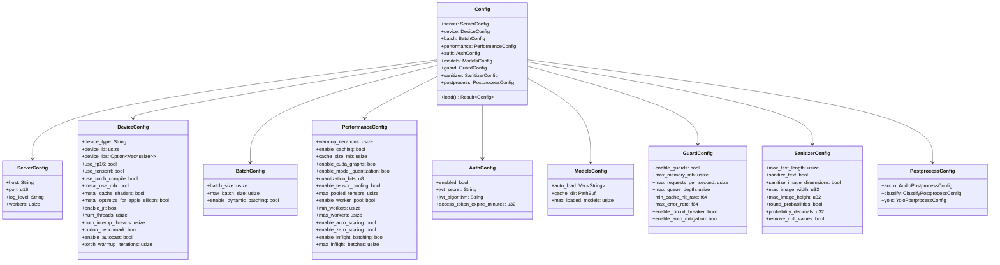

# `config` — Configuration System

`src/config.rs`

`Config` is a fully serde-deserializable struct tree loaded from `config.toml` at startup. Every sub-struct implements `Default`, so missing keys fall back to safe defaults without errors.

---

## Config Struct Tree


```mermaid
classDiagram
    class Config {
        +server: ServerConfig
        +device: DeviceConfig
        +batch: BatchConfig
        +performance: PerformanceConfig
        +auth: AuthConfig
        +models: ModelsConfig
        +guard: GuardConfig
        +sanitizer: SanitizerConfig
        +postprocess: PostprocessConfig
        +load() Result~Config~
    }

    class ServerConfig {
        +host: String
        +port: u16
        +log_level: String
        +workers: usize
    }

    class DeviceConfig {
        +device_type: String
        +device_id: usize
        +device_ids: Option~Vec~usize~~
        +use_fp16: bool
        +use_tensorrt: bool
        +use_torch_compile: bool
        +metal_use_mlx: bool
        +metal_cache_shaders: bool
        +metal_optimize_for_apple_silicon: bool
        +enable_jit: bool
        +num_threads: usize
        +num_interop_threads: usize
        +cudnn_benchmark: bool
        +enable_autocast: bool
        +torch_warmup_iterations: usize
    }

    class BatchConfig {
        +batch_size: usize
        +max_batch_size: usize
        +enable_dynamic_batching: bool
    }

    class PerformanceConfig {
        +warmup_iterations: usize
        +enable_caching: bool
        +cache_size_mb: usize
        +enable_cuda_graphs: bool
        +enable_model_quantization: bool
        +quantization_bits: u8
        +enable_tensor_pooling: bool
        +max_pooled_tensors: usize
        +enable_worker_pool: bool
        +min_workers: usize
        +max_workers: usize
        +enable_auto_scaling: bool
        +enable_zero_scaling: bool
        +enable_inflight_batching: bool
        +max_inflight_batches: usize
    }

    class AuthConfig {
        +enabled: bool
        +jwt_secret: String
        +jwt_algorithm: String
        +access_token_expire_minutes: u32
    }

    class ModelsConfig {
        +auto_load: Vec~String~
        +cache_dir: PathBuf
        +max_loaded_models: usize
    }

    class GuardConfig {
        +enable_guards: bool
        +max_memory_mb: usize
        +max_requests_per_second: usize
        +max_queue_depth: usize
        +min_cache_hit_rate: f64
        +max_error_rate: f64
        +enable_circuit_breaker: bool
        +enable_auto_mitigation: bool
    }

    class SanitizerConfig {
        +max_text_length: usize
        +sanitize_text: bool
        +sanitize_image_dimensions: bool
        +max_image_width: u32
        +max_image_height: u32
        +round_probabilities: bool
        +probability_decimals: u32
        +remove_null_values: bool
    }

    class PostprocessConfig {
        +audio: AudioPostprocessConfig
        +classify: ClassifyPostprocessConfig
        +yolo: YoloPostprocessConfig
    }

    Config --> ServerConfig
    Config --> DeviceConfig
    Config --> BatchConfig
    Config --> PerformanceConfig
    Config --> AuthConfig
    Config --> ModelsConfig
    Config --> GuardConfig
    Config --> SanitizerConfig
    Config --> PostprocessConfig
```

---

## Config Loading Flow

```mermaid
graph TD
    A([Config::load\(\)]) --> B{config.toml\nexists?}
    B -- Yes --> C[fs::read_to_string\n"config.toml"]
    B -- No --> D[Config::default\(\)]
    C --> E[toml::from_str\(&content\)]
    E -- Ok --> F[Config struct\nfully populated]
    E -- Err --> G([propagate anyhow::Error])
    D --> F
    F --> H{missing fields?}
    H -- Yes --> I[serde Default impls\nfill gaps per sub-struct]
    H -- No --> J([return Ok\(Config\)])
    I --> J
```

> `Config::load()` is called once at server startup in `main.rs`. After that the config is cloned into `InferenceEngine`, `ModelManager`, and each handler that needs it.

---

## Field Reference

### `ServerConfig`

| Field | Type | Purpose |
|---|---|---|
| `host` | `String` | Bind address (e.g. `"0.0.0.0"`). |
| `port` | `u16` | Listen port. |
| `log_level` | `String` | tracing log level filter (`"info"`, `"debug"`, …). |
| `workers` | `usize` | Actix-Web worker thread count. |

### `DeviceConfig`

| Field | Type | Notes |
|---|---|---|
| `device_type` | `String` | `"cuda"`, `"metal"`, or `"cpu"`. |
| `device_id` | `usize` | Primary GPU index. |
| `device_ids` | `Option<Vec<usize>>` | Multi-GPU device list. |
| `use_fp16` | `bool` | Enable half-precision inference. |
| `use_tensorrt` | `bool` | Enable TensorRT optimisation (CUDA only). |
| `metal_use_mlx` | `bool` | Use Apple MLX backend (macOS). |
| `metal_cache_shaders` | `bool` | Cache compiled Metal shaders. |
| `metal_optimize_for_apple_silicon` | `bool` | Apply M-series specific tuning. |
| `enable_jit` | `bool` | Enable TorchScript JIT compilation. |
| `num_threads` | `usize` | `tch::set_num_threads()` value. |
| `cudnn_benchmark` | `bool` | Enable cuDNN auto-tuner. |
| `enable_autocast` | `bool` | Enable AMP autocast. |

### `BatchConfig`

| Field | Type | Notes |
|---|---|---|
| `batch_size` | `usize` | Default static batch size. |
| `max_batch_size` | `usize` | Upper bound for dynamic batching. |
| `enable_dynamic_batching` | `bool` | Enable in-flight request batching. |

### `PerformanceConfig`

| Field | Type | Notes |
|---|---|---|
| `warmup_iterations` | `usize` | Number of dummy passes during `InferenceEngine::warmup`. |
| `enable_caching` | `bool` | Enable result caching layer. |
| `cache_size_mb` | `usize` | Memory budget for result cache. |
| `enable_tensor_pooling` | `bool` | Enable `TensorPool` reuse. |
| `max_pooled_tensors` | `usize` | Max tensors per shape in the pool. |
| `enable_worker_pool` | `bool` | Enable `WorkerPool` async dispatch. |
| `min_workers` / `max_workers` | `usize` | Autoscaler bounds. |
| `enable_auto_scaling` | `bool` | Enable autoscaler control loop. |
| `enable_zero_scaling` | `bool` | Start with 0 workers; scale up on demand. |
| `enable_inflight_batching` | `bool` | Enable in-flight batch coalescing. |

### `SanitizerConfig` (defaults shown)

| Field | Type | Default | Purpose |
|---|---|---|---|
| `max_text_length` | `usize` | `10000` | Reject text inputs longer than this. |
| `sanitize_text` | `bool` | `true` | Enable text sanitization pass. |
| `sanitize_image_dimensions` | `bool` | `true` | Clamp image dimensions. |
| `max_image_width` | `u32` | `4096` | Max allowed image width (px). |
| `max_image_height` | `u32` | `4096` | Max allowed image height (px). |
| `round_probabilities` | `bool` | `true` | Round probability outputs. |
| `probability_decimals` | `u32` | `4` | Decimal places when rounding. |
| `remove_null_values` | `bool` | `true` | Strip `null` fields from output JSON. |

### `GuardConfig`

| Field | Type | Purpose |
|---|---|---|
| `enable_guards` | `bool` | Master switch for all guard checks. |
| `max_memory_mb` | `usize` | OOM guard threshold. |
| `max_requests_per_second` | `usize` | Rate-limit threshold. |
| `max_queue_depth` | `usize` | Back-pressure queue limit. |
| `min_cache_hit_rate` | `f64` | Alert when cache efficiency drops below. |
| `max_error_rate` | `f64` | Alert threshold for error rate. |
| `enable_circuit_breaker` | `bool` | Open circuit on sustained errors. |
| `enable_auto_mitigation` | `bool` | Auto-shed load when guards trip. |

---

## Usage Example

```rust
use crate::config::Config;

fn main() -> anyhow::Result<()> {
    // Reads config.toml from the working directory; falls back to defaults.
    let config = Config::load()?;

    println!("Listening on {}:{}", config.server.host, config.server.port);
    println!("Device: {}", config.device.device_type);
    println!("Max text length: {}", config.sanitizer.max_text_length);

    // Pass by reference to constructors; they clone internally.
    let engine = InferenceEngine::new(model_manager, &config);
    Ok(())
}
```

Minimal `config.toml` (all other fields get defaults):

```toml
[server]
host = "0.0.0.0"
port = 8080
workers = 4

[device]
device_type = "cuda"
device_id = 0
use_fp16 = true

[models]
auto_load = ["resnet50", "bert-base"]
cache_dir = "./models"

[sanitizer]
max_text_length = 4096
```
