# Configuration Module Documentation

## Overview

The configuration module provides a comprehensive, type-safe configuration system for the PyTorch Inference Framework. It supports environment variables, validation, and model-specific configurations with hierarchical structure and factory patterns.

## 📊 Configuration Architecture

```mermaid
classDiagram
    class InferenceConfig {
        +ModelType model_type
        +DeviceConfig device
        +BatchConfig batch
        +PreprocessingConfig preprocessing
        +PostprocessingConfig postprocessing
        +PerformanceConfig performance
        +CacheConfig cache
        +SecurityConfig security
        +PostDownloadOptimizationConfig post_download_optimization
        +Dict custom_params
        
        +from_env() InferenceConfig
        +from_dict(dict) InferenceConfig
        +validate() bool
    }
    
    class DeviceConfig {
        +DeviceType device_type
        +int device_id
        +bool use_fp16
        +bool use_torch_compile
        +MultiGPUConfig multi_gpu
        +get_torch_device() torch.device
    }
    
    class MultiGPUConfig {
        +bool enabled
        +str strategy
        +List[int] device_ids
        +str load_balancing
        +bool memory_balancing
        +bool enable_dynamic_scaling
        +str scheduling_strategy
    }
    
    class BatchConfig {
        +int batch_size
        +int max_batch_size
        +bool adaptive_batching
        +float timeout_seconds
    }
    
    class PerformanceConfig {
        +bool enable_profiling
        +int warmup_iterations
        +bool enable_async
        +int max_workers
        +bool enable_cuda_graphs
        +bool enable_numba_jit
    }
    
    class ConfigFactory {
        +create_classification_config() InferenceConfig
        +create_segmentation_config() InferenceConfig
        +create_detection_config() InferenceConfig
        +create_optimized_config() InferenceConfig
    }
    
    InferenceConfig --> DeviceConfig
    InferenceConfig --> BatchConfig
    InferenceConfig --> PerformanceConfig
    DeviceConfig --> MultiGPUConfig
    ConfigFactory ..> InferenceConfig
```



## 🔧 Core Configuration Classes

### InferenceConfig

Main configuration class that orchestrates all subsystem configurations.

#### Constructor
```python
@dataclass
class InferenceConfig:
    model_type: ModelType = ModelType.CUSTOM
    device: DeviceConfig = field(default_factory=DeviceConfig)
    batch: BatchConfig = field(default_factory=BatchConfig)
    preprocessing: PreprocessingConfig = field(default_factory=PreprocessingConfig)
    postprocessing: PostprocessingConfig = field(default_factory=PostprocessingConfig)
    performance: PerformanceConfig = field(default_factory=PerformanceConfig)
    cache: CacheConfig = field(default_factory=CacheConfig)
    security: SecurityConfig = field(default_factory=SecurityConfig)
    post_download_optimization: PostDownloadOptimizationConfig = field(default_factory=PostDownloadOptimizationConfig)
    custom_params: Dict[str, Any] = field(default_factory=dict)
```

#### Key Methods

##### `from_env() -> InferenceConfig` (classmethod)
Create configuration from environment variables.

**Environment Variables:**
```bash
# Device configuration
DEVICE=cuda                    # Device type (cpu, cuda, mps, auto)
DEVICE_ID=0                   # GPU device ID
USE_FP16=true                 # Enable half precision

# Batch configuration
BATCH_SIZE=16                 # Default batch size
MAX_BATCH_SIZE=64            # Maximum batch size

# Performance configuration
MAX_WORKERS=8                 # Maximum worker threads
LOG_LEVEL=INFO               # Logging level
```

**Usage:**
```python
# Set environment variables
os.environ['DEVICE'] = 'cuda'
os.environ['BATCH_SIZE'] = '32'
os.environ['USE_FP16'] = 'true'

# Create config from environment
config = InferenceConfig.from_env()
```

##### `from_dict(config_dict: Dict[str, Any]) -> InferenceConfig` (classmethod)
Create configuration from dictionary.

**Usage:**
```python
config_dict = {
    "device": {
        "device_type": "cuda",
        "use_fp16": True,
        "use_torch_compile": True
    },
    "batch": {
        "batch_size": 32,
        "adaptive_batching": True
    },
    "performance": {
        "enable_profiling": True,
        "warmup_iterations": 10
    }
}

config = InferenceConfig.from_dict(config_dict)
```

##### `validate() -> bool`
Comprehensive validation of all configuration parameters.

**Validation Checks:**
- Device availability (CUDA, MPS)
- Batch size constraints
- Threshold ranges (0-1)
- Preprocessing parameter counts
- Multi-GPU configuration validity

**Usage:**
```python
config = InferenceConfig()
config.device.device_type = "cuda"
config.batch.batch_size = 64

try:
    config.validate()
    print("Configuration is valid")
except ValueError as e:
    print(f"Configuration error: {e}")
```

#### Properties

##### `num_classes -> Optional[int]`
Get number of classes from custom parameters.

```python
config.custom_params = {"num_classes": 1000}
print(config.num_classes)  # 1000
```

##### `input_size -> Optional[Tuple[int, int]]`
Get input size from preprocessing configuration.

```python
print(config.input_size)  # (224, 224)
```

##### `threshold -> float`
Get threshold from postprocessing configuration.

```python
print(config.threshold)  # 0.5
```

##### `optimizations -> Dict[str, Any]`
Get optimization settings as dictionary.

```python
optimizations = config.optimizations
# Returns: {
#     "tensorrt": False,
#     "fp16": True,
#     "torch_compile": True,
#     "adaptive_batching": True,
#     "profiling": False
# }
```

### DeviceConfig

Device and hardware configuration with advanced optimization options.

```python
@dataclass
class DeviceConfig:
    device_type: DeviceType = DeviceType.AUTO
    device_id: Optional[int] = None
    use_fp16: bool = False
    use_int8: bool = False
    use_tensorrt: bool = False
    use_torch_compile: bool = False
    compile_mode: str = "reduce-overhead"
    memory_fraction: float = 0.9
    
    # Enhanced JIT optimization options
    use_vulkan: bool = False
    use_numba: bool = False
    jit_strategy: str = "auto"
    numba_target: str = "cpu"
    vulkan_device_id: Optional[int] = None
    
    # Multi-GPU configuration
    multi_gpu: MultiGPUConfig = field(default_factory=MultiGPUConfig)
```

#### Key Methods

##### `get_torch_device() -> torch.device`
Get the actual PyTorch device object.

**Features:**
- **Auto-detection**: Automatically selects best available device
- **GPU Manager Integration**: Uses GPU manager for optimal device selection
- **Fallback Strategy**: Graceful fallback when preferred device unavailable
- **Multi-GPU Support**: Handles device indexing for multi-GPU setups

**Device Selection Logic:**
1. **AUTO mode**: Auto-detect using GPU manager or manual fallback
2. **CUDA**: Use specified GPU or default CUDA device
3. **MPS**: Apple Silicon GPU acceleration
4. **CPU**: CPU-only inference
5. **VULKAN**: Vulkan compute acceleration (maps to CPU in PyTorch)

**Usage:**
```python
# Auto-detection
config = DeviceConfig(device_type=DeviceType.AUTO)
device = config.get_torch_device()  # cuda:0, mps, or cpu

# Specific GPU
config = DeviceConfig(device_type=DeviceType.CUDA, device_id=1)
device = config.get_torch_device()  # cuda:1

# Apple Silicon
config = DeviceConfig(device_type=DeviceType.MPS)
device = config.get_torch_device()  # mps
```

### MultiGPUConfig

Advanced multi-GPU configuration for distributed inference.

```python
@dataclass
class MultiGPUConfig:
    enabled: bool = False
    strategy: str = "data_parallel"
    device_ids: Optional[List[int]] = None
    load_balancing: str = "round_robin"
    synchronization: str = "barrier"
    memory_balancing: bool = True
    fault_tolerance: bool = True
    
    # Performance optimization
    memory_pool_size_mb: int = 512
    enable_memory_monitoring: bool = True
    memory_gc_threshold: float = 0.8
    
    # Communication optimization
    enable_nccl: bool = True
    comm_chunk_size_mb: int = 4
    comm_bandwidth_limit: float = 0.8
    
    # Dynamic scaling
    enable_dynamic_scaling: bool = False
    scale_up_cooldown: float = 30.0
    scale_down_cooldown: float = 60.0
    
    # Advanced scheduling
    enable_advanced_scheduling: bool = False
    scheduling_strategy: str = "balanced"
    max_tasks_per_device: int = 4
```

#### Multi-GPU Strategies

##### Data Parallel (`data_parallel`)
Replicate model across GPUs, split data batches.

**Configuration:**
```python
config.device.multi_gpu.enabled = True
config.device.multi_gpu.strategy = "data_parallel"
config.device.multi_gpu.device_ids = [0, 1, 2, 3]
config.device.multi_gpu.load_balancing = "round_robin"
```

**Features:**
- Model replication across all GPUs
- Automatic batch splitting
- Gradient synchronization
- Load balancing strategies

##### Model Parallel (`model_parallel`)
Split model layers across GPUs.

**Configuration:**
```python
config.device.multi_gpu.strategy = "model_parallel"
config.device.multi_gpu.device_ids = [0, 1]
config.device.multi_gpu.synchronization = "pipeline"
```

**Features:**
- Layer-wise model distribution
- Memory optimization for large models
- Pipeline parallelism support

##### Pipeline Parallel (`pipeline_parallel`)
Pipeline model execution across GPUs.

**Configuration:**
```python
config.device.multi_gpu.strategy = "pipeline_parallel"
config.device.multi_gpu.device_ids = [0, 1, 2, 3]
config.device.multi_gpu.max_tasks_per_device = 2
```

**Features:**
- Overlapped execution
- Reduced memory footprint
- High throughput for sequential models

### BatchConfig

Batch processing configuration with adaptive capabilities.

```python
@dataclass
class BatchConfig:
    batch_size: int = 1
    min_batch_size: int = 1
    max_batch_size: int = 16
    adaptive_batching: bool = True
    timeout_seconds: float = 30.0
    queue_size: int = 100
```

#### Features

##### Adaptive Batching
Automatically adjusts batch size based on:
- Memory availability
- Input complexity
- System load
- Processing time targets

**Configuration:**
```python
config.batch.adaptive_batching = True
config.batch.min_batch_size = 1
config.batch.max_batch_size = 64
config.batch.timeout_seconds = 10.0
```

##### Queue Management
Manages request queuing and batching:
- Maximum queue size limits
- Timeout-based batch formation
- Priority queue support

### PerformanceConfig

Performance and monitoring configuration.

```python
@dataclass
class PerformanceConfig:
    enable_profiling: bool = False
    enable_metrics: bool = True
    warmup_iterations: int = 5
    benchmark_iterations: int = 10
    log_level: str = "INFO"
    enable_async: bool = True
    max_workers: int = 8
    max_concurrent_requests: int = 10
    enable_cuda_graphs: bool = True
    enable_numba_jit: bool = True
    optimize_memory_layout: bool = True
    enable_tensor_cores: bool = True
```

#### Performance Features

##### Profiling and Metrics
- **PyTorch Profiler**: Detailed performance analysis
- **Custom Metrics**: Framework-specific metrics
- **Memory Tracking**: GPU and CPU memory monitoring
- **Latency Analysis**: Request processing time breakdown

##### Optimization Flags
- **CUDA Graphs**: Reduce kernel launch overhead
- **Numba JIT**: JIT compilation for CPU operations
- **Memory Layout**: Optimize tensor memory formats
- **Tensor Cores**: Utilize specialized GPU cores

### PreprocessingConfig

Input preprocessing configuration.

```python
@dataclass
class PreprocessingConfig:
    input_size: Tuple[int, int] = (224, 224)
    mean: List[float] = field(default_factory=lambda: [0.485, 0.456, 0.406])
    std: List[float] = field(default_factory=lambda: [0.229, 0.224, 0.225])
    interpolation: str = "bilinear"
    center_crop: bool = True
    normalize: bool = True
    to_rgb: bool = True
```

#### Common Presets

##### ImageNet Preprocessing
```python
config.preprocessing.input_size = (224, 224)
config.preprocessing.mean = [0.485, 0.456, 0.406]  # ImageNet mean
config.preprocessing.std = [0.229, 0.224, 0.225]   # ImageNet std
config.preprocessing.interpolation = "bilinear"
config.preprocessing.center_crop = True
```

##### Object Detection Preprocessing
```python
config.preprocessing.input_size = (640, 640)
config.preprocessing.normalize = True
config.preprocessing.to_rgb = True
config.preprocessing.center_crop = False  # Preserve aspect ratio
```

### PostprocessingConfig

Output postprocessing configuration.

```python
@dataclass
class PostprocessingConfig:
    threshold: float = 0.5
    nms_threshold: float = 0.5
    max_detections: int = 100
    apply_sigmoid: bool = False
    apply_softmax: bool = False
```

### CacheConfig

Caching system configuration.

```python
@dataclass
class CacheConfig:
    enable_caching: bool = True
    cache_size: int = 100
    cache_ttl_seconds: int = 3600
    disk_cache_path: Optional[Path] = None
```

### PostDownloadOptimizationConfig

Post-download model optimization configuration.

```python
@dataclass
class PostDownloadOptimizationConfig:
    enable_optimization: bool = True
    enable_quantization: bool = True
    quantization_method: str = "dynamic"
    enable_low_rank_optimization: bool = True
    low_rank_method: str = "svd"
    target_compression_ratio: float = 0.7
    preserve_accuracy_threshold: float = 0.02
    auto_select_best_method: bool = True
```

### SecurityConfig

Security and safety configuration.

```python
@dataclass
class SecurityConfig:
    max_file_size_mb: int = 100
    allowed_extensions: List[str] = field(default_factory=lambda: [".jpg", ".jpeg", ".png", ".bmp"])
    validate_inputs: bool = True
    sanitize_outputs: bool = True
```

## 🏭 ConfigFactory Class

Factory for creating model-specific configurations with optimized defaults.

### Classification Configuration

```python
@staticmethod
def create_classification_config(
    num_classes: int,
    input_size: Tuple[int, int] = (224, 224),
    use_softmax: bool = True
) -> InferenceConfig
```

**Usage:**
```python
# ImageNet classification
config = ConfigFactory.create_classification_config(
    num_classes=1000,
    input_size=(224, 224),
    use_softmax=True
)

# Custom classification
config = ConfigFactory.create_classification_config(
    num_classes=10,
    input_size=(32, 32),
    use_softmax=True
)
```

### Segmentation Configuration

```python
@staticmethod
def create_segmentation_config(
    input_size: Tuple[int, int] = (640, 640),
    threshold: float = 0.5,
    min_contour_area: int = 100
) -> InferenceConfig
```

**Usage:**
```python
# Semantic segmentation
config = ConfigFactory.create_segmentation_config(
    input_size=(512, 512),
    threshold=0.6,
    min_contour_area=50
)
```

### Detection Configuration

```python
@staticmethod
def create_detection_config(
    input_size: Tuple[int, int] = (640, 640),
    confidence_threshold: float = 0.5,
    nms_threshold: float = 0.5,
    max_detections: int = 100
) -> InferenceConfig
```

**Usage:**
```python
# YOLO-style detection
config = ConfigFactory.create_detection_config(
    input_size=(640, 640),
    confidence_threshold=0.25,
    nms_threshold=0.45,
    max_detections=1000
)
```

### Optimized Configuration

```python
@staticmethod
def create_optimized_config(
    enable_tensorrt: bool = False,
    enable_fp16: bool = False,
    enable_torch_compile: bool = False,
    enable_cuda: bool = None
) -> InferenceConfig
```

**Usage:**
```python
# High-performance configuration
config = ConfigFactory.create_optimized_config(
    enable_tensorrt=True,
    enable_fp16=True,
    enable_torch_compile=True,
    enable_cuda=True
)
```

## 🔗 Enumerations

### ModelType

```python
class ModelType(Enum):
    CLASSIFICATION = "classification"
    SEGMENTATION = "segmentation"
    DETECTION = "detection"
    REGRESSION = "regression"
    TTS = "text_to_speech"
    STT = "speech_to_text"
    CUSTOM = "custom"
```

### DeviceType

```python
class DeviceType(Enum):
    CPU = "cpu"
    CUDA = "cuda"
    MPS = "mps"
    VULKAN = "vulkan"
    AUTO = "auto"
    
    @classmethod
    def from_string(cls, value: str) -> "DeviceType"
```

### OptimizationLevel

```python
class OptimizationLevel(Enum):
    NONE = "none"
    BASIC = "basic"
    AGGRESSIVE = "aggressive"
```

## 🌍 Global Configuration Management

### Global Configuration Functions

#### `get_global_config() -> InferenceConfig`
Get the global configuration instance.

**Features:**
- **Singleton Pattern**: Single global configuration instance
- **Lazy Initialization**: Created on first access
- **Environment Integration**: Automatically loads from environment
- **Validation**: Automatic validation on creation

**Usage:**
```python
from framework.core.config import get_global_config

# Get global config (created from environment if first time)
config = get_global_config()
print(f"Device: {config.device.device_type}")
print(f"Batch size: {config.batch.batch_size}")
```

#### `set_global_config(config: InferenceConfig) -> None`
Set the global configuration instance.

**Usage:**
```python
from framework.core.config import set_global_config

# Create custom configuration
config = ConfigFactory.create_optimized_config(
    enable_fp16=True,
    enable_torch_compile=True
)

# Set as global configuration
set_global_config(config)
```

## 🎯 Usage Examples

### Basic Configuration Setup

```python
from framework.core.config import InferenceConfig, DeviceConfig, BatchConfig

# Create basic configuration
config = InferenceConfig()

# Configure device
config.device.device_type = "cuda"
config.device.device_id = 0
config.device.use_fp16 = True
config.device.use_torch_compile = True

# Configure batching
config.batch.batch_size = 16
config.batch.adaptive_batching = True
config.batch.max_batch_size = 64

# Configure performance
config.performance.enable_profiling = True
config.performance.warmup_iterations = 10

# Validate configuration
config.validate()
```

### Multi-GPU Configuration

```python
# Configure multi-GPU setup
config = InferenceConfig()

# Enable multi-GPU with data parallelism
config.device.multi_gpu.enabled = True
config.device.multi_gpu.strategy = "data_parallel"
config.device.multi_gpu.device_ids = [0, 1, 2, 3]
config.device.multi_gpu.load_balancing = "dynamic"

# Enable advanced features
config.device.multi_gpu.enable_dynamic_scaling = True
config.device.multi_gpu.enable_advanced_scheduling = True
config.device.multi_gpu.scheduling_strategy = "memory_aware"

# Configure memory management
config.device.multi_gpu.memory_pool_size_mb = 1024
config.device.multi_gpu.memory_gc_threshold = 0.7
config.device.multi_gpu.enable_memory_monitoring = True

# Configure communication
config.device.multi_gpu.enable_nccl = True
config.device.multi_gpu.comm_chunk_size_mb = 8
config.device.multi_gpu.comm_bandwidth_limit = 0.9
```

### Environment-Based Configuration

```bash
# Set environment variables
export DEVICE=cuda
export DEVICE_ID=0
export BATCH_SIZE=32
export MAX_BATCH_SIZE=128
export USE_FP16=true
export MAX_WORKERS=16
export LOG_LEVEL=DEBUG
```

```python
# Load configuration from environment
config = InferenceConfig.from_env()

# Override specific settings
config.device.use_torch_compile = True
config.performance.enable_profiling = True

# Validate and use
config.validate()
```

### Model-Specific Configuration

```python
# Classification model
classification_config = ConfigFactory.create_classification_config(
    num_classes=1000,
    input_size=(224, 224),
    use_softmax=True
)

# Enable optimizations
classification_config.device.use_fp16 = True
classification_config.device.use_torch_compile = True
classification_config.batch.adaptive_batching = True

# Detection model
detection_config = ConfigFactory.create_detection_config(
    input_size=(640, 640),
    confidence_threshold=0.25,
    nms_threshold=0.45,
    max_detections=1000
)

# Enable TensorRT for detection
detection_config.device.use_tensorrt = True
detection_config.device.use_fp16 = True
```

### Performance-Optimized Configuration

```python
# Create high-performance configuration
config = ConfigFactory.create_optimized_config(
    enable_tensorrt=True,
    enable_fp16=True,
    enable_torch_compile=True,
    enable_cuda=True
)

# Enable additional optimizations
config.performance.enable_cuda_graphs = True
config.performance.enable_numba_jit = True
config.performance.optimize_memory_layout = True
config.performance.enable_tensor_cores = True

# Configure aggressive batching
config.batch.batch_size = 32
config.batch.max_batch_size = 128
config.batch.adaptive_batching = True
config.batch.timeout_seconds = 5.0

# Enable comprehensive monitoring
config.performance.enable_profiling = True
config.performance.enable_metrics = True
config.cache.enable_caching = True
```

### Post-Download Optimization Configuration

```python
# Configure post-download optimizations
config.post_download_optimization.enable_optimization = True
config.post_download_optimization.enable_quantization = True
config.post_download_optimization.quantization_method = "dynamic"

# Enable low-rank optimizations
config.post_download_optimization.enable_low_rank_optimization = True
config.post_download_optimization.low_rank_method = "svd"
config.post_download_optimization.target_compression_ratio = 0.6

# Configure accuracy preservation
config.post_download_optimization.preserve_accuracy_threshold = 0.01
config.post_download_optimization.auto_select_best_method = True
config.post_download_optimization.benchmark_optimizations = True
```

## ⚡ Configuration Best Practices

### Device Configuration
1. **Auto-Detection**: Use `DeviceType.AUTO` for automatic device selection
2. **Memory Management**: Set appropriate `memory_fraction` for CUDA devices
3. **Precision**: Use FP16 on compatible GPUs for 2x speedup
4. **Compilation**: Enable `torch.compile` for production workloads

### Batch Configuration
1. **Adaptive Batching**: Enable for variable workloads
2. **Memory Constraints**: Set `max_batch_size` based on available memory
3. **Timeout Management**: Use appropriate timeouts for real-time applications
4. **Queue Sizing**: Balance memory usage with responsiveness

### Performance Optimization
1. **Warmup**: Always use sufficient warmup iterations
2. **Profiling**: Enable profiling for optimization insights
3. **Async Processing**: Use async for high-throughput scenarios
4. **Worker Scaling**: Scale workers based on CPU cores and workload

### Multi-GPU Best Practices
1. **Strategy Selection**: Choose strategy based on model architecture
2. **Load Balancing**: Use dynamic load balancing for variable workloads
3. **Memory Monitoring**: Enable memory monitoring for large models
4. **Communication**: Optimize NCCL settings for network topology

## 🔒 Validation and Error Handling

### Configuration Validation
The framework performs comprehensive validation:
- Device availability checks
- Parameter range validation
- Compatibility verification
- Resource constraint validation

### Error Handling Strategies
1. **Graceful Degradation**: Fallback to CPU when GPU unavailable
2. **Parameter Correction**: Automatic adjustment of invalid parameters
3. **Detailed Messages**: Clear error messages for troubleshooting
4. **Validation Logging**: Comprehensive logging of validation results

## 📚 Related Documentation

- **[Device Management](gpu-manager.md)** - GPU and device management
- **[Performance Optimization](../../guides/optimization.md)** - Performance tuning guide
- **[Multi-GPU Setup](../../guides/multi-gpu.md)** - Multi-GPU configuration guide
- **[Environment Setup](../../guides/environment.md)** - Environment configuration

---

*This documentation covers the complete configuration system with detailed examples, best practices, and comprehensive API reference for optimal framework usage.*
