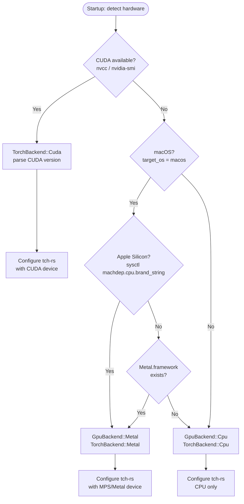
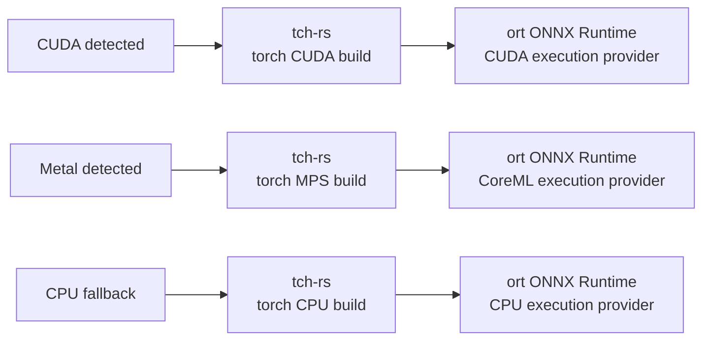
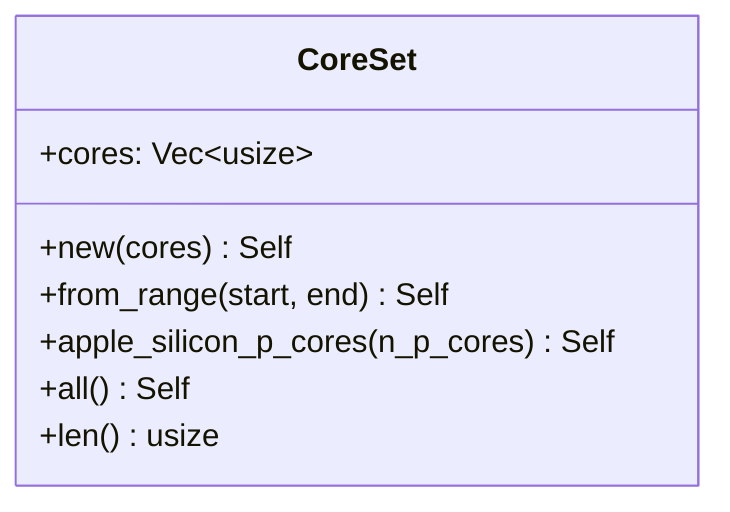

# `core::gpu` — GPU & Hardware Detection

`src/core/gpu.rs` · `src/core/affinity.rs` · `src/core/torch_autodetect.rs`

This module provides hardware detection, GPU information querying, CPU-affinity management, and automatic libtorch selection. It is consumed at startup by `main.rs` to configure `DeviceConfig` and to pin inference threads to P-cores.

---

## Hardware Detection Decision Tree



---

## Backend Selection



> The ONNX Runtime execution provider is selected to match the detected hardware backend.

---

## Key Structs and Functions

### `gpu.rs` — `GpuManager`, `GpuInfo`, `GpuDevice`, `GpuStats`

| Item | Kind | Description |
|---|---|---|
| `GpuBackend` | `enum` | `Cuda`, `Metal`, `Cpu` — selected backend. |
| `GpuInfo` | `struct` | `available: bool`, `count: usize`, `devices: Vec<GpuDevice>`, `backend: GpuBackend`. |
| `GpuDevice` | `struct` | Per-device: `id`, `name`, `total_memory`, `free_memory`, `used_memory`, `temperature?`, `utilization?`, `power_usage?`. |
| `GpuStats` | `struct` | Timestamped snapshot: `memory_used`, `memory_free`, `utilization`, `temperature`. |
| `GpuManager` | `struct` | Holds `stats_history: Arc<DashMap<usize, Vec<GpuStats>>>` (ring buffer, `max_history = 100`). |
| `GpuManager::new` | `fn` | Create manager with empty history. |
| `GpuManager::is_metal_available` | `fn` | `#[cfg(target_os = "macos")]` — queries `sysctl` and checks `Metal.framework`. |
| `GpuManager::get_metal_info` | `fn` | `#[cfg(target_os = "macos")]` — runs `system_profiler SPDisplaysDataType` to populate `GpuInfo`. |

### `affinity.rs` — `CoreSet`, `AffinityConfig`



| Function | Platform | Description |
|---|---|---|
| `CoreSet::new(cores)` | all | Explicit core ID list. |
| `CoreSet::from_range(start, end)` | all | Contiguous range `[start, end)`. |
| `CoreSet::apple_silicon_p_cores(n)` | macOS | First `n` core IDs (0-based P-cores on M-series). |
| `CoreSet::all()` | all | All logical cores via `num_cpus::get()`. |

**Motivation**: Modern CPUs expose P-cores (performance) and E-cores (efficiency). Pinning inference threads to P-cores avoids scheduler migration and ensures consistent SIMD latency. On M3 Max (16-core), P-cores are indices 0–7.

### `torch_autodetect.rs` — `TorchLibAutoDetect`, `TorchConfig`

| Item | Description |
|---|---|
| `TorchBackend` | `enum Cuda(String) \| Metal \| Cpu` — carries CUDA version string. |
| `TorchConfig` | `backend: TorchBackend`, `libtorch_path: PathBuf`, `version: String`. |
| `TorchLibAutoDetect::new()` | Reads `LIBTORCH_DIR` / `LIBTORCH` env vars; defaults to `./libtorch`. |
| `detect_metal()` | `#[cfg(target_os = "macos")]` — sysctl + Metal.framework check. |
| `detect_cuda()` | Shells out to `nvcc --version`; parses CUDA version string. |
| `detect()` | Runs all detectors; returns `TorchConfig` with the best available backend. |

**Supported libtorch version**: `2.3.0` (constant `TORCH_VERSION`).

---

## Device Affinity Configuration

Configure CPU affinity in `config.toml` under `[device]`:

```toml
[device]
device_type = "cuda"
device_id = 0
num_threads = 8           # tch::set_num_threads(8)
num_interop_threads = 2   # tch::set_num_interop_threads(2)
```

For Apple Silicon, the auto-detection path automatically selects `TorchBackend::Metal` and configures Metal-specific options if `metal_optimize_for_apple_silicon = true`:

```toml
[device]
device_type = "metal"
metal_use_mlx = true
metal_cache_shaders = true
metal_optimize_for_apple_silicon = true
```

---

## Usage Example

```rust
use crate::core::gpu::GpuManager;
use crate::core::torch_autodetect::TorchLibAutoDetect;

fn setup_device() -> anyhow::Result<()> {
    // Auto-detect backend
    let mut detector = TorchLibAutoDetect::new();
    let torch_config = detector.detect()?;
    println!("Backend: {:?}", torch_config.backend);

    // Query GPU info (CUDA path)
    let gpu_manager = GpuManager::new();
    if GpuManager::is_metal_available() {
        let info = gpu_manager.get_metal_info()?;
        println!("Metal GPUs: {}", info.count);
    }
    Ok(())
}
```
