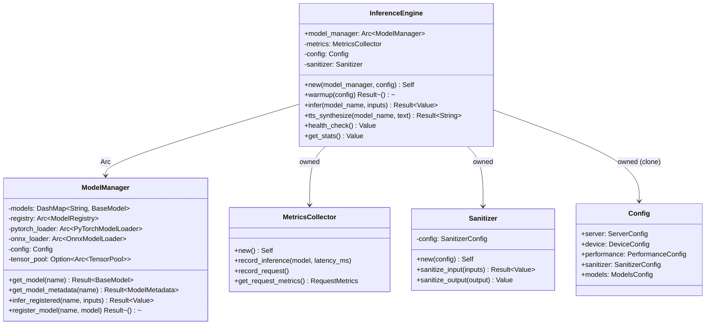
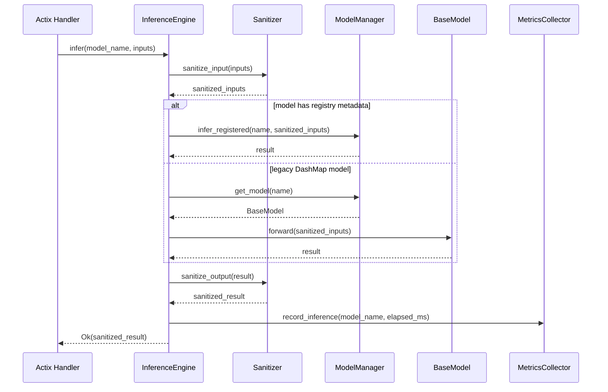

# `core::engine` — Inference Engine

`src/core/engine.rs`

The `InferenceEngine` is the root orchestrator for all model inference. It wires together `ModelManager`, `MetricsCollector`, `Config`, and `Sanitizer`, then exposes a single async `infer()` entry-point consumed by Actix-Web handlers.

---

## Class Diagram


```mermaid
classDiagram
    class InferenceEngine {
        +model_manager: Arc~ModelManager~
        -metrics: MetricsCollector
        -config: Config
        -sanitizer: Sanitizer
        +new(model_manager, config) Self
        +warmup(config) Result~()~
        +infer(model_name, inputs) Result~Value~
        +tts_synthesize(model_name, text) Result~String~
        +health_check() Value
        +get_stats() Value
    }

    class ModelManager {
        -models: DashMap~String, BaseModel~
        -registry: Arc~ModelRegistry~
        -pytorch_loader: Arc~PyTorchModelLoader~
        -onnx_loader: Arc~OnnxModelLoader~
        -config: Config
        -tensor_pool: Option~Arc~TensorPool~~
        +get_model(name) Result~BaseModel~
        +get_model_metadata(name) Result~ModelMetadata~
        +infer_registered(name, inputs) Result~Value~
        +register_model(name, model) Result~()~
    }

    class MetricsCollector {
        +new() Self
        +record_inference(model, latency_ms)
        +record_request()
        +get_request_metrics() RequestMetrics
    }

    class Sanitizer {
        -config: SanitizerConfig
        +new(config) Self
        +sanitize_input(inputs) Result~Value~
        +sanitize_output(output) Value
    }

    class Config {
        +server: ServerConfig
        +device: DeviceConfig
        +performance: PerformanceConfig
        +sanitizer: SanitizerConfig
        +models: ModelsConfig
    }

    InferenceEngine --> ModelManager : Arc
    InferenceEngine --> MetricsCollector : owned
    InferenceEngine --> Sanitizer : owned
    InferenceEngine --> Config : owned (clone)
```

---

## `infer()` Sequence Diagram


```mermaid
sequenceDiagram
    participant H as Actix Handler
    participant IE as InferenceEngine
    participant S as Sanitizer
    participant MM as ModelManager
    participant BM as BaseModel
    participant MC as MetricsCollector

    H->>IE: infer(model_name, inputs)
    IE->>S: sanitize_input(inputs)
    S-->>IE: sanitized_inputs

    alt model has registry metadata
        IE->>MM: infer_registered(name, sanitized_inputs)
        MM-->>IE: result
    else legacy DashMap model
        IE->>MM: get_model(name)
        MM-->>IE: BaseModel
        IE->>BM: forward(sanitized_inputs)
        BM-->>IE: result
    end

    IE->>S: sanitize_output(result)
    S-->>IE: sanitized_result
    IE->>MC: record_inference(model_name, elapsed_ms)
    IE-->>H: Ok(sanitized_result)
```

> **Slow-inference warning**: if `elapsed_ms >= 500` a `tracing::warn!` is emitted with `threshold_ms = 500`.

---

## Warmup Flowchart

```mermaid
flowchart TD
    A([warmup called]) --> B[log warmup start\niterations · model_count]
    B --> C{for each model\nin config.models.auto_load}
    C --> D{get_model succeeds?}
    D -- No --> E[tracing::warn skip]
    D -- Yes --> F[dummy_input = json!\nlbrace test: true rbrace]
    F --> G[self.infer]
    G -- Ok --> H[tracing::info elapsed_ms ok]
    G -- Err --> I[tracing::warn failed]
    H & I & E --> C
    C -- done --> J[tracing::info warmup complete]
    J --> K([return Ok\()\)])
```

---

## Public API

| Method | Signature | Purpose |
|---|---|---|
| `new` | `(model_manager: Arc<ModelManager>, config: &Config) -> Self` | Construct engine; initialises `MetricsCollector` and `Sanitizer` from config. |
| `warmup` | `async (&self, config: &Config) -> Result<()>` | Run a dummy inference pass for each model in `config.models.auto_load`. |
| `infer` | `async (&self, model_name: &str, inputs: &Value) -> Result<Value>` | Sanitize → infer → sanitize output → record metrics. |
| `tts_synthesize` | `async (&self, model_name: &str, text: &str) -> Result<String>` | Sanitize text input, call legacy TTS model, return base64 audio. |
| `health_check` | `(&self) -> Value` | Returns `{"healthy": true, "checks": {...}, "stats": {...}}`. |
| `get_stats` | `(&self) -> Value` | Returns aggregated latency and request counters from `MetricsCollector`. |

---

## Handler Integration Example

```rust
use actix_web::{post, web, HttpResponse};
use serde_json::Value;
use std::sync::Arc;

use crate::core::engine::InferenceEngine;

#[post("/infer/{model}")]
async fn infer_handler(
    path: web::Path<String>,
    body: web::Json<Value>,
    engine: web::Data<Arc<InferenceEngine>>,
) -> HttpResponse {
    let model_name = path.into_inner();
    match engine.infer(&model_name, &body.into_inner()).await {
        Ok(result) => HttpResponse::Ok().json(result),
        Err(e) => HttpResponse::InternalServerError().json(
            serde_json::json!({"error": e.to_string()})
        ),
    }
}
```

Register the engine as Actix app data:

```rust
let engine = Arc::new(InferenceEngine::new(
    Arc::clone(&model_manager),
    &config,
));
App::new().app_data(web::Data::new(engine))
```

---

## Error Types

All errors are `crate::error::InferenceError` (via `thiserror`):

| Variant | Cause |
|---|---|
| `ModelNotFound(String)` | `model_manager.get_model()` returned `Err` — model not in DashMap or registry. |
| `ModelLoadError(String)` | `BaseModel::load()` failed or model file is invalid. |
| `InferenceFailed(String)` | `BaseModel::forward()` or ONNX session returned an error. |
| `InvalidInput(String)` | `Sanitizer::sanitize_input()` rejected the payload (e.g., text too long, image too large). |
| `Timeout` | Future exceeded the configured timeout. |
| `GpuError(String)` | tch-rs / CUDA error during tensor computation. |
| `InternalError(String)` | Catch-all for unexpected failures. |
