# Inference Engine Module Documentation

## Overview

The `InferenceEngine` is the core processing engine that orchestrates model inference with advanced features including dynamic batching, asynchronous processing, performance monitoring, memory management, and multi-GPU support.

## 📊 Engine Architecture

```mermaid
flowchart TB
    subgraph "🚀 Inference Engine Core"
        IE[InferenceEngine]
        RM[RequestManager]
        BP[BatchProcessor]
        MM[MemoryManager]
        PM[PerformanceMonitor]
    end
    
    subgraph "🔄 Request Processing Flow"
        RQ[Request Queue]
        BB[Batch Builder]
        EP[Execution Pipeline]
        RP[Response Pipeline]
    end
    
    subgraph "⚡ Optimization Components"
        TP[TensorPool]
        CC[Compute Cache]
        JC[JIT Compiler]
        GPU[GPU Manager]
    end
    
    subgraph "📊 Monitoring & Management"
        MC[MetricsCollector]
        LB[LoadBalancer]
        FT[FaultTolerance]
        SEC[Security]
    end
    
    IE --> RM
    IE --> BP
    IE --> MM
    IE --> PM
    
    RM --> RQ
    RQ --> BB
    BB --> EP
    EP --> RP
    
    EP --> TP
    EP --> CC
    EP --> JC
    EP --> GPU
    
    PM --> MC
    GPU --> LB
    GPU --> FT
    IE --> SEC
    
    classDef engine fill:#e1f5fe
    classDef processing fill:#f3e5f5
    classDef optimization fill:#fff3e0
    classDef monitoring fill:#e8f5e8
    
    class IE,RM,BP,MM,PM engine
    class RQ,BB,EP,RP processing
    class TP,CC,JC,GPU optimization
    class MC,LB,FT,SEC monitoring
```



## 🔧 Core Classes

### InferenceEngine

The main engine class that orchestrates all inference operations.

#### Constructor
```python
class InferenceEngine:
    def __init__(
        self,
        model: BaseModel,
        config: InferenceConfig,
        engine_config: Optional[EngineConfig] = None,
        enable_multi_gpu: bool = False
    )
```

**Parameters:**
- `model`: BaseModel instance to run inference with
- `config`: InferenceConfig for device and optimization settings
- `engine_config`: EngineConfig for advanced engine features
- `enable_multi_gpu`: Enable multi-GPU support

**Features:**
- **Dynamic Batching**: PID-controlled batch size optimization
- **Async Processing**: Full asynchronous request handling
- **Memory Management**: Advanced tensor pooling and memory optimization
- **Performance Monitoring**: Comprehensive metrics and profiling
- **Security**: Integrated security mitigations
- **Multi-GPU**: Distributed processing across multiple GPUs

### EngineConfig

Configuration class for advanced engine features.

```python
@dataclass
class EngineConfig:
    # Caching
    cache_enabled: bool = True
    max_cache_size: int = 1000
    tensor_cache_enabled: bool = True
    
    # Compilation and optimization
    model_compilation_enabled: bool = True
    use_channels_last: bool = True
    use_mixed_precision: bool = True
    use_memory_pool: bool = True
    
    # Advanced batching
    continuous_batching: bool = True
    adaptive_timeout: bool = True
    request_coalescing: bool = True
    
    # Hardware optimizations
    use_cuda_graphs: bool = False
    enable_tensorrt: bool = False
    use_pinned_memory: bool = True
    
    # Threading
    parallel_workers: int = 8
    use_lock_free_queue: bool = True
    thread_affinity: bool = True
```

### InferenceRequest

Data class representing an individual inference request.

```python
@dataclass
class InferenceRequest:
    id: str
    inputs: Any
    future: asyncio.Future
    timestamp: float
    priority: int = 0
    timeout: Optional[float] = None
    similarity_hash: Optional[str] = None
    input_shape: Optional[Tuple] = None
```

## 📋 Complete Method Reference

### Engine Lifecycle Methods

#### `async start() -> None`
Start the inference engine and initialize all components.

**Features:**
- Model optimization and warmup
- Worker thread pool initialization
- Memory pool setup
- Multi-GPU manager initialization (if enabled)
- Performance monitoring setup
- Security context establishment

**Process:**
1. Initialize model and apply optimizations
2. Start worker threads for batch processing
3. Setup memory pools and caching
4. Initialize multi-GPU manager if configured
5. Start performance monitoring
6. Establish security context

**Usage:**
```python
engine = InferenceEngine(model, config)
await engine.start()
```

#### `async stop() -> None`
Stop the inference engine and cleanup resources.

**Features:**
- Graceful shutdown of worker threads
- Memory cleanup and cache clearing
- Multi-GPU resource cleanup
- Performance report generation
- Security context cleanup

**Usage:**
```python
await engine.stop()
```

#### `async restart() -> None`
Restart the engine with current configuration.

### Request Processing Methods

#### `async process_request(inputs: Any, **kwargs) -> Any`
Process a single inference request asynchronously.

**Parameters:**
- `inputs`: Raw input data for inference
- `**kwargs`: Additional parameters (priority, timeout, etc.)

**Returns:**
- `Any`: Processed inference result

**Features:**
- **Request Validation**: Input validation and sanitization
- **Priority Handling**: Priority-based request queuing
- **Timeout Management**: Request-level timeout handling
- **Error Recovery**: Automatic retry and fallback strategies
- **Result Caching**: Intelligent result caching based on input similarity

**Usage:**
```python
# Basic request
result = await engine.process_request(image_data)

# Priority request with timeout
result = await engine.process_request(
    image_data,
    priority=5,
    timeout=10.0
)
```

#### `async process_batch(requests: List[InferenceRequest]) -> List[Any]`
Process multiple requests as a batch.

**Parameters:**
- `requests`: List of InferenceRequest objects

**Returns:**
- `List[Any]`: List of inference results

**Features:**
- **Batch Optimization**: Optimal batch size calculation
- **Memory Management**: Dynamic memory allocation for batches
- **Load Balancing**: Multi-GPU load distribution
- **Error Isolation**: Individual request error handling

#### `process_request_sync(inputs: Any, **kwargs) -> Any`
Synchronous version of request processing.

**Usage:**
```python
# Synchronous processing
result = engine.process_request_sync(image_data)
```

### Performance and Monitoring Methods

#### `get_performance_metrics() -> Dict[str, Any]`
Get comprehensive performance metrics.

**Returns:**
```python
{
    'throughput': {
        'requests_per_second': 125.5,
        'batches_per_second': 8.2,
        'average_batch_size': 15.3
    },
    'latency': {
        'mean_ms': 24.5,
        'p50_ms': 22.1,
        'p95_ms': 45.2,
        'p99_ms': 67.8
    },
    'resource_usage': {
        'gpu_utilization': 0.85,
        'gpu_memory_mb': 2048.5,
        'cpu_utilization': 0.45,
        'memory_mb': 1024.2
    },
    'batch_stats': {
        'total_batches': 1000,
        'successful_batches': 998,
        'failed_batches': 2,
        'average_processing_time_ms': 18.5
    },
    'cache_stats': {
        'hit_rate': 0.75,
        'total_hits': 750,
        'total_misses': 250,
        'cache_size': 100
    }
}
```

#### `get_queue_size() -> int`
Get current request queue size.

#### `get_worker_count() -> int`
Get number of active worker threads.

#### `get_resource_usage() -> Dict[str, float]`
Get current resource usage statistics.

### Configuration and Management Methods

#### `scale_workers(count: int) -> None`
Scale the number of worker threads.

**Parameters:**
- `count`: Target number of worker threads

**Features:**
- **Dynamic Scaling**: Add or remove workers without stopping engine
- **Load Balancing**: Redistribute workload across workers
- **Resource Management**: Automatic resource allocation adjustment

#### `set_batch_size(size: int) -> None`
Set target batch size for processing.

#### `enable_caching(enabled: bool) -> None`
Enable or disable result caching.

#### `clear_cache() -> None`
Clear all cached results.

#### `set_priority_mode(enabled: bool) -> None`
Enable priority-based request processing.

### Health and Status Methods

#### `health_check() -> Dict[str, Any]`
Comprehensive engine health check.

**Returns:**
```python
{
    'status': 'healthy',  # healthy, degraded, unhealthy
    'engine_running': True,
    'model_loaded': True,
    'workers_active': 8,
    'queue_size': 5,
    'memory_usage': 0.65,
    'gpu_available': True,
    'last_error': None,
    'uptime_seconds': 3600.5
}
```

#### `is_ready() -> bool`
Check if engine is ready to process requests.

#### `get_status() -> Dict[str, Any]`
Get current engine status and configuration.

### Multi-GPU Methods (when enabled)

#### `get_gpu_utilization() -> Dict[int, float]`
Get utilization for each GPU.

#### `rebalance_gpus() -> None`
Trigger manual GPU load rebalancing.

#### `get_gpu_memory_usage() -> Dict[int, Dict[str, float]]`
Get memory usage for each GPU.

## ⚙️ Advanced Features

### Dynamic Batching

The engine implements intelligent dynamic batching with PID control.

#### Features
- **Adaptive Batch Size**: Automatically adjusts batch size based on:
  - Memory availability
  - Processing latency targets
  - Queue depth
  - GPU utilization

- **PID Controller**: Mathematical control system for optimal batch sizing:
  - **Proportional**: Responds to current error
  - **Integral**: Corrects persistent bias
  - **Derivative**: Predicts future trends

- **Continuous Batching**: Overlapped batch processing for maximum throughput

#### Configuration
```python
engine_config = EngineConfig()
engine_config.continuous_batching = True
engine_config.adaptive_timeout = True
engine_config.request_coalescing = True

engine = InferenceEngine(model, config, engine_config)
```

### Memory Management

Advanced memory management with tensor pooling and optimization.

#### Features
- **Tensor Pooling**: Reuse tensors to reduce allocation overhead
- **Memory Pools**: Pre-allocated memory pools for different tensor sizes
- **Garbage Collection**: Intelligent memory cleanup and defragmentation
- **NUMA Awareness**: Optimize memory allocation for NUMA systems

#### Memory Pool Configuration
```python
engine_config = EngineConfig()
engine_config.use_memory_pool = True
engine_config.tensor_cache_enabled = True
engine_config.use_pinned_memory = True
engine_config.numa_aware = True
```

### Request Coalescing

Intelligent request coalescing for similar inputs.

#### Features
- **Similarity Detection**: Hash-based similarity detection for inputs
- **Automatic Coalescing**: Merge similar requests into single batch
- **Result Sharing**: Share results across coalesced requests
- **Cache Integration**: Leverage caching for coalesced results

### Performance Optimization

#### Compilation Optimizations
- **JIT Compilation**: Automatic model compilation with torch.compile
- **CUDA Graphs**: Static graph optimization for repetitive workloads
- **TensorRT Integration**: NVIDIA TensorRT acceleration
- **ONNX Runtime**: ONNX runtime optimization

#### Hardware Optimizations
- **Mixed Precision**: Automatic FP16/BF16 optimization
- **Tensor Cores**: Utilize specialized GPU tensor cores
- **Memory Layout**: Channels-last memory format optimization
- **Threading**: CPU threading and affinity optimization

## 🎯 Usage Examples

### Basic Engine Setup

```python
from framework.core import InferenceEngine, EngineConfig
from framework.core.config import InferenceConfig

# Create configuration
config = InferenceConfig()
config.device.device_type = "cuda"
config.batch.batch_size = 16
config.batch.adaptive_batching = True

# Create engine configuration
engine_config = EngineConfig()
engine_config.cache_enabled = True
engine_config.continuous_batching = True
engine_config.use_mixed_precision = True

# Initialize and start engine
engine = InferenceEngine(model, config, engine_config)
await engine.start()

# Process requests
result = await engine.process_request(input_data)
print(f"Result: {result}")

# Get performance metrics
metrics = engine.get_performance_metrics()
print(f"Throughput: {metrics['throughput']['requests_per_second']:.1f} req/s")
```

### High-Performance Configuration

```python
# High-performance engine configuration
engine_config = EngineConfig()

# Enable all optimizations
engine_config.model_compilation_enabled = True
engine_config.use_channels_last = True
engine_config.use_mixed_precision = True
engine_config.enable_tensorrt = True

# Advanced batching
engine_config.continuous_batching = True
engine_config.adaptive_timeout = True
engine_config.request_coalescing = True

# Memory optimizations
engine_config.use_memory_pool = True
engine_config.tensor_cache_enabled = True
engine_config.use_pinned_memory = True

# Threading optimizations
engine_config.parallel_workers = 16
engine_config.use_lock_free_queue = True
engine_config.thread_affinity = True

# Hardware acceleration
engine_config.use_cuda_graphs = True  # Enable for stable workloads
engine_config.numa_aware = True

engine = InferenceEngine(model, config, engine_config)
await engine.start()
```

### Multi-GPU Setup

```python
# Configure multi-GPU
config = InferenceConfig()
config.device.multi_gpu.enabled = True
config.device.multi_gpu.strategy = "data_parallel"
config.device.multi_gpu.device_ids = [0, 1, 2, 3]
config.device.multi_gpu.load_balancing = "dynamic"

# Create multi-GPU engine
engine = InferenceEngine(
    model, 
    config, 
    engine_config, 
    enable_multi_gpu=True
)
await engine.start()

# Monitor GPU usage
gpu_usage = engine.get_gpu_utilization()
for gpu_id, utilization in gpu_usage.items():
    print(f"GPU {gpu_id}: {utilization:.1%} utilization")

# Rebalance if needed
engine.rebalance_gpus()
```

### Batch Processing

```python
# Process multiple requests efficiently
import asyncio

async def process_multiple_requests():
    # Create multiple requests
    tasks = []
    for i in range(100):
        task = engine.process_request(
            input_data[i], 
            priority=i % 3,  # Vary priority
            timeout=30.0
        )
        tasks.append(task)
    
    # Process all requests concurrently
    results = await asyncio.gather(*tasks)
    return results

# Run batch processing
results = await process_multiple_requests()
print(f"Processed {len(results)} requests")

# Get batch statistics
metrics = engine.get_performance_metrics()
batch_stats = metrics['batch_stats']
print(f"Average batch size: {batch_stats['average_batch_size']:.1f}")
print(f"Batch success rate: {batch_stats['successful_batches']/batch_stats['total_batches']:.1%}")
```

### Performance Monitoring and Scaling

```python
# Monitor and scale based on performance
async def monitor_and_scale():
    while True:
        # Get current metrics
        metrics = engine.get_performance_metrics()
        queue_size = engine.get_queue_size()
        
        # Check if scaling needed
        if queue_size > 50:
            # Scale up workers
            current_workers = engine.get_worker_count()
            engine.scale_workers(min(current_workers + 2, 32))
            print(f"Scaled up to {engine.get_worker_count()} workers")
        
        elif queue_size < 5 and engine.get_worker_count() > 4:
            # Scale down workers
            current_workers = engine.get_worker_count()
            engine.scale_workers(max(current_workers - 1, 4))
            print(f"Scaled down to {engine.get_worker_count()} workers")
        
        # Log performance
        throughput = metrics['throughput']['requests_per_second']
        latency = metrics['latency']['mean_ms']
        print(f"Throughput: {throughput:.1f} req/s, Latency: {latency:.1f}ms")
        
        # Wait before next check
        await asyncio.sleep(10)

# Start monitoring
asyncio.create_task(monitor_and_scale())
```

### Error Handling and Recovery

```python
# Robust error handling
async def robust_inference(input_data):
    max_retries = 3
    retry_count = 0
    
    while retry_count < max_retries:
        try:
            result = await engine.process_request(
                input_data,
                timeout=30.0
            )
            return result
            
        except asyncio.TimeoutError:
            retry_count += 1
            print(f"Request timeout, retry {retry_count}/{max_retries}")
            
        except Exception as e:
            print(f"Inference error: {e}")
            
            # Check engine health
            health = engine.health_check()
            if health['status'] != 'healthy':
                print("Engine unhealthy, attempting restart")
                await engine.restart()
            
            retry_count += 1
    
    raise Exception(f"Failed to process request after {max_retries} retries")

# Use robust inference
try:
    result = await robust_inference(input_data)
except Exception as e:
    print(f"Final error: {e}")
```

## ⚡ Performance Optimization Tips

### Engine Configuration
1. **Enable Compilation**: Use `model_compilation_enabled=True` for 20-50% speedup
2. **Mixed Precision**: Enable `use_mixed_precision=True` on compatible GPUs
3. **Memory Pooling**: Use `use_memory_pool=True` to reduce allocation overhead
4. **Continuous Batching**: Enable for maximum throughput with variable loads

### Batch Processing
1. **Adaptive Batching**: Let the engine automatically optimize batch sizes
2. **Request Coalescing**: Enable for workloads with similar inputs
3. **Priority Queues**: Use priority-based processing for mixed workloads
4. **Timeout Management**: Set appropriate timeouts for real-time requirements

### Memory Management
1. **Tensor Caching**: Enable tensor pooling for frequently used shapes
2. **Pinned Memory**: Use pinned memory for faster GPU transfers
3. **NUMA Awareness**: Enable for multi-socket systems
4. **Memory Monitoring**: Regular monitoring and cleanup

### Hardware Utilization
1. **Multi-GPU**: Use data parallel strategy for increased throughput
2. **CUDA Graphs**: Enable for stable, repetitive workloads
3. **TensorRT**: Use for NVIDIA GPU acceleration
4. **Thread Affinity**: Optimize CPU thread placement

## 📊 Monitoring and Debugging

### Key Metrics to Monitor
- **Throughput**: Requests per second and batches per second
- **Latency**: P50, P95, P99 latency percentiles
- **Resource Usage**: GPU/CPU utilization and memory usage
- **Queue Depth**: Request queue size and wait times
- **Error Rates**: Failed requests and error types
- **Cache Performance**: Hit rates and cache utilization

### Health Check Integration
```python
# Regular health monitoring
async def health_monitor():
    health = engine.health_check()
    
    if health['status'] == 'unhealthy':
        # Alert or restart engine
        await engine.restart()
    elif health['status'] == 'degraded':
        # Investigate performance issues
        metrics = engine.get_performance_metrics()
        # ... analysis logic
    
    return health

# Integrate with monitoring systems
health_status = await health_monitor()
```

## 📚 Related Documentation

- **[BaseModel](base-model.md)** - Model interface and optimization
- **[Configuration](config.md)** - Engine configuration options
- **[Multi-GPU Manager](multi-gpu-manager.md)** - Multi-GPU processing
- **[Performance Optimization](../../guides/optimization.md)** - Performance tuning guide
- **[Monitoring Guide](../../guides/monitoring.md)** - Monitoring and observability

---

*This documentation provides comprehensive coverage of the InferenceEngine with detailed API reference, usage examples, and performance optimization guidance for production deployments.*
