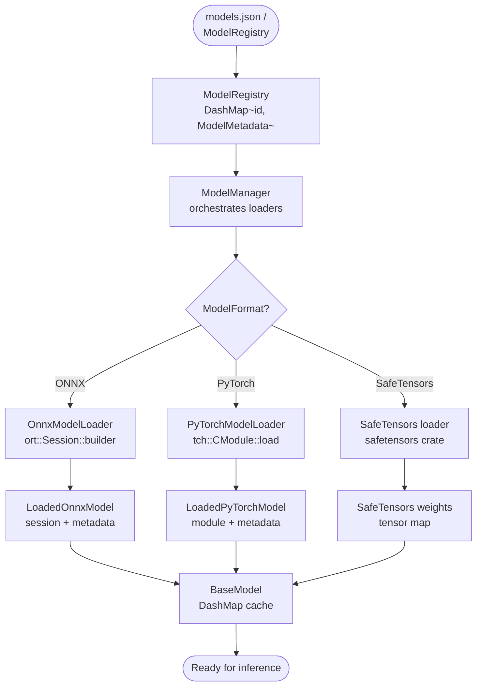
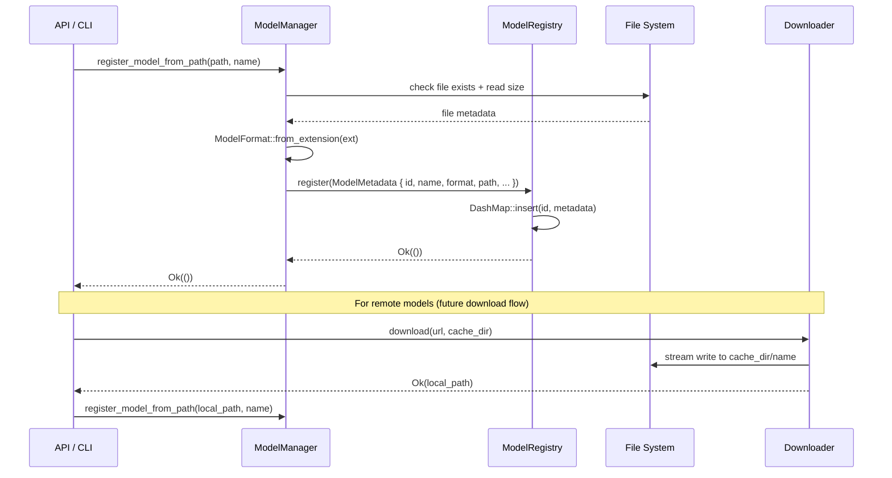
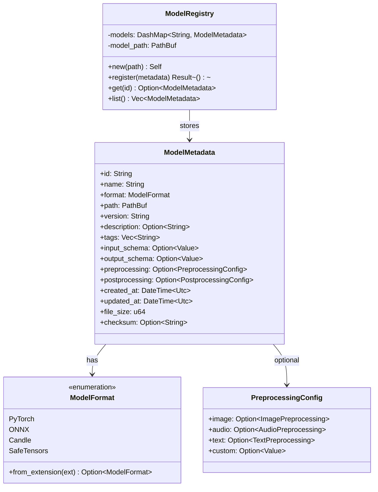
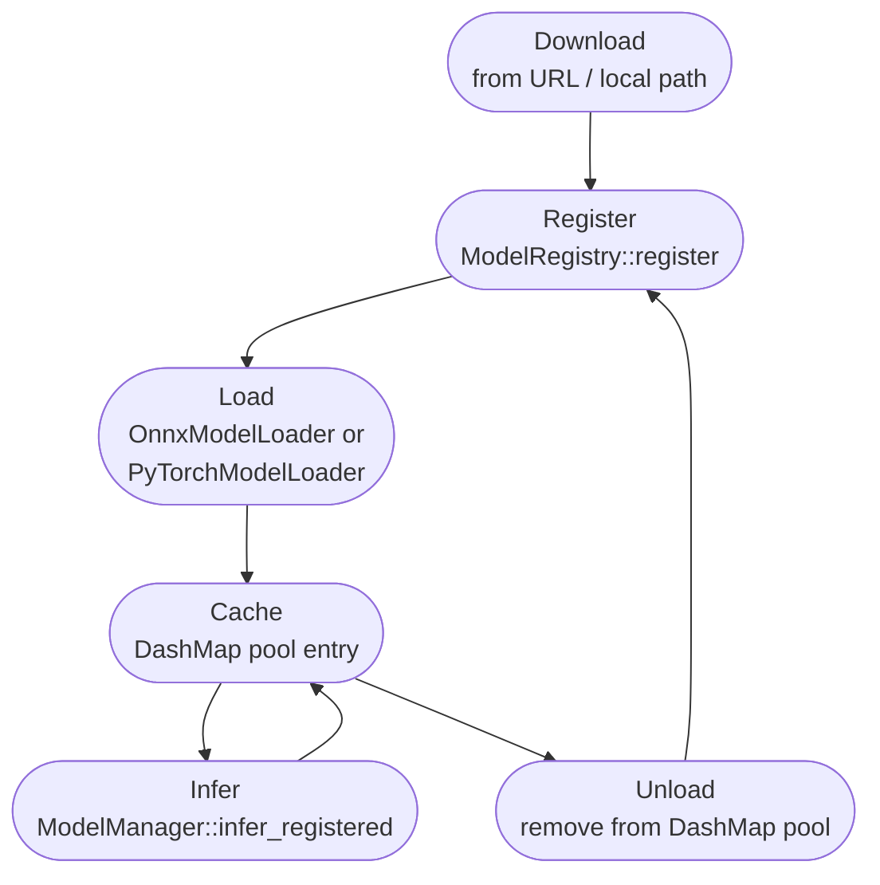

# `models` — Model Loading & Registry

`src/models/manager.rs` · `src/models/registry.rs` · `src/models/onnx_loader.rs` · `src/models/pytorch_loader.rs`

The model subsystem handles discovery, downloading, registration, loading, and inference dispatch for all file-backed models. It supports PyTorch (`.pt`/`.pth`), ONNX (`.onnx`), and SafeTensors (`.safetensors`) formats.

---

## Model Loading Pipeline



---

## Model Download & Registration Sequence



---

## Class Diagram



---

## Supported Model Formats

| Format | Extensions | Loader | Runtime |
|---|---|---|---|
| PyTorch TorchScript | `.pt`, `.pth` | `PyTorchModelLoader` | tch-rs 0.16 (libtorch 2.3.0) |
| ONNX | `.onnx` | `OnnxModelLoader` | ort 2.0 (ONNX Runtime) |
| SafeTensors | `.safetensors` | Direct tensor load | `safetensors` crate |
| Candle | *(future)* | — | `candle-core` |

`ModelFormat::from_extension` maps file extensions to variants:

```rust
match ext.to_lowercase().as_str() {
    "pt" | "pth"   => Some(ModelFormat::PyTorch),
    "onnx"         => Some(ModelFormat::ONNX),
    "safetensors"  => Some(ModelFormat::SafeTensors),
    _              => None,
}
```

---

## Model Lifecycle



| Stage | Action | Key Code Path |
|---|---|---|
| **Download** | Fetch remote artifact to `config.models.cache_dir`. | External downloader → filesystem |
| **Register** | Insert `ModelMetadata` into `ModelRegistry`. | `ModelRegistry::register` |
| **Load** | Open ONNX session or `tch::CModule`; push into pool DashMap. | `OnnxModelLoader` / `PyTorchModelLoader` |
| **Infer** | Pop session from pool, run, push back. | `ModelManager::infer_registered` |
| **Unload** | Drain pool Vec; drop sessions (memory freed). | `loaded_onnx_models.remove(name)` |

---

## Usage Example

```rust
use std::path::Path;
use crate::config::Config;
use crate::models::manager::ModelManager;

#[tokio::main]
async fn main() -> anyhow::Result<()> {
    let config = Config::load()?;
    let manager = ModelManager::new(&config, None);

    // Register an ONNX model from disk
    manager
        .register_model_from_path(
            Path::new("./models/resnet50.onnx"),
            Some("resnet50".to_string()),
        )
        .await?;

    // Run inference via the registry path
    let result = manager
        .infer_registered("resnet50", &serde_json::json!({"image": "..."}))
        .await?;

    println!("{}", result);
    Ok(())
}
```
